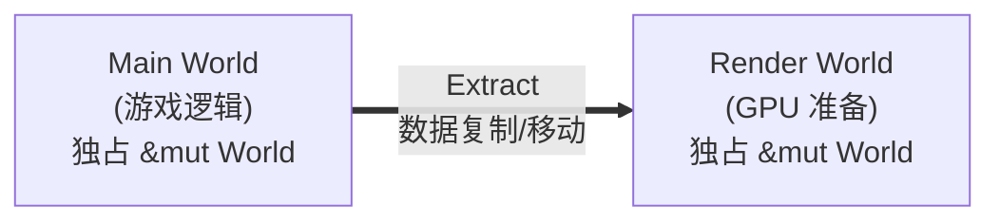

# 第 1 章：Bevy 的设计哲学

> **导读**：本章是全书的起点。我们将从四个维度理解 Bevy 引擎的核心设计理念：
> 模块化、数据驱动、零 boilerplate 和 Rust 适配性。这些理念不是口号——它们
> 深刻影响了 Bevy 的每一个架构决策，贯穿本书后续所有章节。

## 1.1 模块化：58 个 crate，按需组合

打开 Bevy 的根 `Cargo.toml`，你会看到：

```toml
// 源码: Cargo.toml:17
[workspace]
members = [
  "crates/*",
  // ...
]
```

`crates/` 目录下有 **58 个独立的 crate**。这不是偶然的代码拆分，而是刻意的架构决策：每个 crate 都可以独立编译、独立测试、独立依赖。

这些 crate 大致分为以下几层：

```
┌─────────────────────────────────────────┐
│            bevy (伞 crate)              │
├─────────────────────────────────────────┤
│  bevy_pbr  bevy_ui  bevy_sprite  ...   │  ← 功能层
├─────────────────────────────────────────┤
│  bevy_render  bevy_asset  bevy_scene   │  ← 基础设施层
├─────────────────────────────────────────┤
│  bevy_app   bevy_ecs   bevy_reflect    │  ← 核心层
├─────────────────────────────────────────┤
│  bevy_utils  bevy_math  bevy_tasks     │  ← 工具层
└─────────────────────────────────────────┘
```

*图 1-1: Bevy crate 层级结构*

用户通过 Feature Flags 选择需要的功能。Bevy 的默认 features 仅有 4 个：

```toml
// 源码: Cargo.toml:134
default = ["2d", "3d", "ui", "audio"]
```

但总共提供了 **160+ 个 feature flags**，从图片格式 (`png`, `jpeg`, `webp`) 到渲染后端 (`webgl2`, `webgpu`)，从音频编解码 (`mp3`, `flac`, `vorbis`) 到平台支持 (`x11`, `wayland`, `android-game-activity`)。

这种设计的意义在于：一个嵌入式系统可以只用 `bevy_ecs` 做数据管理；一个服务器可以用 `bevy_app` + `bevy_ecs` 做游戏逻辑而不引入任何渲染代码。模块化不是可选的美德，而是架构的基石。

如果不这样做会怎样？Unity 的单体架构就是一个反面案例——即使你只想做一个服务器端的逻辑模拟，也不得不引入渲染管线的依赖。这不仅增大了二进制体积，还导致编译时间膨胀。Bevy 将模块化推到极致的代价是 crate 之间的依赖关系变得复杂——58 个 crate 的版本必须严格同步，跨 crate 的 API 变更需要同时更新多处。但 Cargo workspace 的统一版本管理和 Bevy 的 CI 系统有效地缓解了这个问题。从第 2 章的 Plugin 体系可以看到，这种模块化如何在 App 构建阶段被组装成一个完整的引擎。

**要点**：Bevy 是 58 个可独立使用的 crate 的集合，通过 Feature Flags 精确裁剪。

## 1.2 数据驱动：ECS 作为统一范式

Bevy 选择了 ECS (Entity Component System) 作为其唯一的编程范式。这不是"ECS 可选"——引擎的每个子系统都构建在 ECS 之上：

| 子系统 | ECS 中的表现 |
|--------|-------------|
| 游戏对象 | Entity + Component 组合 |
| 全局配置 | Resource（特殊的 Component） |
| 游戏逻辑 | System（普通函数） |
| UI 元素 | Entity + Node Component |
| 光源 | Entity + PointLight/DirectionalLight Component |
| 相机 | Entity + Camera Component |
| 音频 | Entity + AudioPlayer Component |

传统引擎（如 Unity）中，GameObject 通过继承获得行为。这会导致两个经典问题：

1. **菱形继承**：FlyingEnemy 同时继承 Flying 和 Enemy，哪个 update 先执行？
2. **God Object**：基类不断膨胀，所有对象都拖着不需要的字段。

但"组合优于继承"这个教科书答案并不是 Bevy 选择 ECS 的全部理由。更深层的动机在于**数据布局对性能的决定性影响**。OOP 中对象的字段在内存中是"行式"排列的——一个 GameObject 的 Transform、Renderer、Collider、Health 紧挨着存储。当你的系统只需要遍历所有 Position 时，CPU 缓存被 Renderer 和 Collider 等无关字段"污染"了，每次 cache line 加载都浪费了大量带宽。ECS 的列式存储（SoA）将同类型组件紧密排列，遍历时的缓存命中率可以达到接近 100%。这不是理论上的微优化——在有数万实体的场景中，SoA 布局相比 AoS（行式）可以带来 5-10 倍的遍历性能差异。此外，OOP 的继承层级使得"这个对象到底拥有哪些能力"在编译期难以穷举，这让自动并行变得几乎不可能。ECS 将每个 System 的数据需求显式编码为 Query 类型签名，调度器可以在初始化时就构建完整的数据访问依赖图，从而安全地并行执行互不冲突的 System。如果 Bevy 采用 OOP 架构，就需要开发者手动标注线程安全性，或者像 Unity 的 Job System 那样要求开发者显式地声明 NativeArray 的读写权限——这正是 Bevy 试图避免的 boilerplate。

ECS 通过**组合**解决这两个问题：

```
传统 OOP:                    ECS 组合:
┌──────────────┐              Entity = Position + Velocity
│  GameObject   │                       + Health
│  ├─ Transform │              Entity = Position + Velocity
│  ├─ Renderer  │                       + AIController
│  ├─ Collider  │
│  └─ Health    │              组件随意组合，无继承层级
└──────────────┘
```

*图 1-2: OOP 继承 vs ECS 组合*

在 Bevy 中，一个实体到底"是什么"，不由继承层级决定，而由它挂载了哪些 Component 决定。官方 UI 示例里的按钮实体就是一个直接的例子：

```rust
// 源码: examples/ui/widgets/button.rs:83
(
    Button,
    Node {
        width: px(150),
        height: px(65),
        justify_content: JustifyContent::Center,
        align_items: AlignItems::Center,
        ..default()
    },
    BorderColor::all(Color::WHITE),
    BackgroundColor(Color::BLACK),
)
```

这里没有 `UIButton` 继承树，也没有"对象附带方法"的封装边界。按钮之所以是按钮，是因为它同时拥有 `Button`、`Node`、`BorderColor`、`BackgroundColor` 等组件。数据与行为彻底分离：Component 只存数据，System 只写逻辑。这种分离让 Bevy 能够自动分析 System 之间的数据依赖，实现**自动并行执行**；也让热重载、反射和编辑器集成更自然，因为 Component 是可序列化、可观察的纯数据。

**要点**：ECS 不是 Bevy 的可选功能，而是引擎的统一范式。数据（Component）与行为（System）的分离使自动并行成为可能。

## 1.3 零 boilerplate：函数即系统

Bevy 最让开发者惊叹的特性，大概就是这个：

```rust
// 源码: examples/hello_world.rs:9
fn hello_world_system() {
    println!("hello world");
}
```

这就是一个合法的 System。没有 trait 要实现，没有 struct 要定义，没有生命周期要标注。一个普通的 Rust 函数，直接就能被 Bevy 调度执行。

更实用的例子来自官方 `remote/server.rs`：

```rust
// 源码: examples/remote/server.rs:79
fn move_cube(
    mut query: Query<&mut Transform, With<Cube>>,
    time: Res<Time>,
) {
    for mut transform in &mut query {
        transform.translation.y = -cos(time.elapsed_secs()) + 1.5;
    }
}
```

函数签名本身就是**声明式的数据需求**：
- `Query<&mut Transform, With<Cube>>`：我需要所有带 `Cube` 标记的实体的 `Transform`，可变访问
- `Res<Time>`：我需要只读访问全局 `Time` 资源

Bevy 在编译期通过 trait 的泛型机制（`all_tuples!` 宏为 0~16 个参数生成实现）自动将这个函数包装成 `System`。运行时，调度器根据参数声明的读写权限判断哪些 System 可以并行。

这种设计的代价是什么？运行时几乎没有——Rust 的单态化 (monomorphization) 确保这一切在编译期完成，运行时零开销。但编译期的代价不可忽视：`all_tuples!` 宏为 0 到 16 个参数的每种排列都生成独立的 trait 实现，单态化后每种具体的参数组合都会产生独立的机器码。这是 Bevy 编译时间较长的主要原因之一。如果没有这套基于 trait 的自动转换，用户就不得不手动实现 `System` trait、声明数据依赖、管理生命周期——正如第 8 章将详细展示的，这套魔法的复杂度全被隐藏在了编译器背后。

> **Rust 设计亮点**：Bevy 利用 Rust 的 trait system 和泛型实现了函数到 System 的
> 自动转换。`SystemParam` trait 使用 GAT (Generic Associated Types) 实现参数的
> 生命周期参数化，`all_tuples!` 宏为 0~16 个参数的元组生成 blanket impl。
> 这是 Rust 类型系统在工程中最优雅的应用之一。详见第 8 章。

**要点**：Bevy 的 System 是零 boilerplate 的——普通函数即系统，函数签名即数据依赖声明。

## 1.4 Rust 适配性：所有权模型如何塑造引擎架构

Bevy 不是一个"碰巧用 Rust 写的引擎"。Rust 的所有权模型深刻地塑造了 Bevy 的架构决策。

### 双 World 架构

Bevy 的渲染系统运行在独立的 `RenderApp` 子应用中，拥有自己的 World。为什么？

在 Rust 中，`&mut World` 是独占引用。如果渲染线程和逻辑线程共享同一个 World，它们无法同时持有 `&mut World`。一个朴素的解决方案是用 `Mutex<World>` 或 `RwLock<World>` 包装——但这会让每次组件访问都带上锁的开销，而且锁的粒度太粗（整个 World 一把大锁），并行度极低。另一种做法是对 World 内部的每个 Table、每个 Column 分别加细粒度锁——但这会导致数以千计的锁对象、大量的死锁风险和不可预测的性能。Bevy 的选择是从所有权层面彻底分离：让每个 World 只属于一个执行上下文。这种设计将"如何共享数据"的问题转化为"在哪个时间点复制数据"的问题——Extract 阶段成为两个 World 之间唯一的数据交换窗口，语义清晰且性能可控。这是 Rust 所有权模型"迫使"出的架构，但事后看来，它比任何锁方案都更优雅。

Bevy 的解决方案不是 `unsafe` 绕过，而是从架构上分离：



*图 1-3: 所有权驱动的双 World 架构*

每帧的 Extract 阶段将需要渲染的数据从 Main World 复制到 Render World。两个 World 各自独占自己的 `&mut World`，天然安全。

### UnsafeWorldCell

ECS 的多 System 并行需要同时访问 World 的不同部分。Rust 的 `&mut` 独占保证在这里成为障碍。这个问题的本质是：Rust 的借用检查器以"整个 struct"为粒度判断冲突——它不理解"System A 只访问 Position 列，System B 只访问 Velocity 列"这样的语义。编译器只看到两个 `&mut World`，必须拒绝。Bevy 的解决方案是 `UnsafeWorldCell`——在编译期验证不了的情况下，将借用检查推迟到运行时：

- System 初始化时声明自己的数据需求 (`FilteredAccess`)
- 调度器验证并行运行的 System 不会访问相同的可变数据
- 验证通过后，通过 `UnsafeWorldCell` 绕过编译期借用检查

这不是"放弃安全"——而是将安全保证从编译期转移到运行时的调度器。ECS 的 Query 声明就是运行时的"借用标注"。

> **Rust 设计亮点**：Bevy 将 Rust 编译期的借用规则（`&T` 可共享，`&mut T` 必独占）
> 映射到了运行时的调度器。`FilteredAccess` 就是运行时的借用检查器。
> 这种"编译期理念 → 运行时实现"的迁移是 Bevy 最深刻的 Rust 设计决策。详见第 9 章。

### Component 的 Send + Sync 约束

所有 Component 必须满足 `Send + Sync + 'static`。这不是随意的限制——ECS 的自动并行依赖于数据可以安全地跨线程访问。不满足这个约束的类型（如 `Rc<T>`）无法成为 Component，必须用 `NonSend` 存储。

这些约束不是 Bevy 的"限制"，而是 Rust 类型系统的自然延伸。Bevy 的架构就是顺着 Rust 的所有权模型"长出来"的。

**要点**：Rust 的所有权模型不是 Bevy 的障碍，而是其架构的驱动力。双 World、UnsafeWorldCell、Send + Sync 约束——这些设计都是所有权模型的自然产物。

## 本章小结

- Bevy 不是单体引擎，而是由 `bevy_app`、`bevy_ecs`、`bevy_render` 等 crate 组合出来的模块化体系。
- ECS 不是 Bevy 的一个子系统，而是整个引擎的统一建模方式：对象、UI、光源、资源和逻辑都被压到同一套数据模型里。
- “函数即系统”不是语法糖，而是把数据访问需求编码进函数签名，让调度器能据此做依赖分析和自动并行。
- Rust 的所有权模型没有被 Bevy 绕开，反而直接塑造了双 World、`UnsafeWorldCell` 和 `Send + Sync` 这些核心架构决策。
