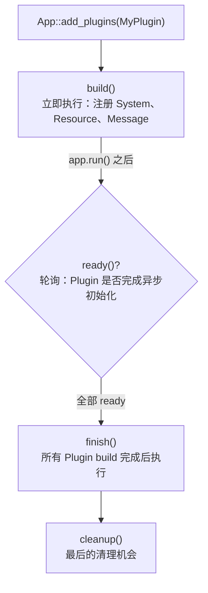
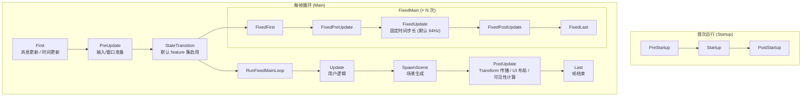

# 第 2 章：App、Plugin 与主循环

> **导读**：上一章我们了解了 Bevy 的设计哲学。本章深入 `bevy_app` crate，
> 理解 Bevy 应用的骨架：`App` 构建器如何组装引擎、`Plugin` trait 如何让
> 58 个 crate 无缝协作、`SubApp` 如何实现渲染隔离、Main Schedule 如何
> 编排每帧的执行顺序。

## 2.1 App 构建器模式

`App` 是 Bevy 应用的入口。它的 struct 定义出人意料地简洁：

```rust
// 源码: crates/bevy_app/src/app.rs:86
pub struct App {
    pub(crate) sub_apps: SubApps,
    pub(crate) runner: RunnerFn,
    fallback_error_handler: Option<ErrorHandler>,
}
```

只有三个字段：
- **`sub_apps`**：所有子应用的集合（包括 Main 和 Render 等）
- **`runner`**：应用的生命周期管理函数（由 `WinitPlugin` 或 `ScheduleRunnerPlugin` 提供）
- **`fallback_error_handler`**：全局错误兜底处理

`App` 的真正力量在于它的 Builder API——通过链式调用注册 Plugin、System、Resource：

```rust
fn main() {
    App::new()
        .add_plugins(DefaultPlugins)        // 注册默认插件组
        .add_systems(Startup, setup)         // 添加启动系统
        .add_systems(Update, game_logic)     // 添加每帧系统
        .insert_resource(Score(0))           // 插入资源
        .run();                              // 启动主循环
}
```

`App::new()` 创建一个空的 App，内含一个空的 Main SubApp。所有的引擎功能——窗口、渲染、输入、音频——都通过 Plugin 注册。这意味着一个没有任何 Plugin 的 App 就是一个空壳。

为什么 App 自身要如此"空"？这是 Bevy 模块化哲学的极致体现——App 不对"引擎应该包含什么"做任何假设。一个传统引擎通常会在核心类中硬编码窗口管理、渲染循环和资源加载的逻辑，即使你只想用它做服务器端模拟，这些无用的代码也会被链接进来。Bevy 的 App 只提供一个"骨架"——SubApps 容器和一个 runner 函数。连主循环的实现都不在 App 内部，而是由 Plugin 提供（`WinitPlugin` 提供窗口事件循环，`ScheduleRunnerPlugin` 提供无窗口循环）。这个设计的代价是初始化比较冗长——即使是一个简单的"Hello World"也需要注册 `DefaultPlugins`。但换来的是第 1 章讨论的完全可裁剪性：从纯 ECS 服务器到完整的 3D 游戏，使用的是同一个 App，只是注册的 Plugin 不同。

> **Rust 设计亮点**：`App` 使用 Builder 模式，每个方法返回 `&mut Self` 支持链式调用。
> 这在 Rust 中很常见，但 Bevy 的独特之处在于 Builder 的目标不是构建一个值，
> 而是构建一个**运行时系统**——Plugin 注册、System 调度、Resource 插入都在 build
> 阶段完成，`run()` 时已完全配置好。

**要点**：App 是一个 Builder，它本身几乎不含逻辑——所有功能通过 Plugin 注入。

## 2.2 Plugin trait：引擎的扩展基石

Plugin 是 Bevy 模块化的核心机制。它的 trait 定义简洁而完整：

```rust
// 源码: crates/bevy_app/src/plugin.rs:56
pub trait Plugin: Downcast + Any + Send + Sync {
    /// Configures the App to which this plugin is added.
    fn build(&self, app: &mut App);

    /// Has the plugin finished its setup?
    fn ready(&self, _app: &App) -> bool { true }

    /// Finish adding this plugin to the App.
    fn finish(&self, _app: &mut App) {}

    /// Runs after all plugins are built and finished.
    fn cleanup(&self, _app: &mut App) {}

    fn name(&self) -> &str { ... }
    fn is_unique(&self) -> bool { true }
}
```

四个生命周期方法形成 Plugin 的完整生命周期：



*图 2-1: Plugin 生命周期*

绝大多数 Plugin 只需实现 `build()`。例如，一个最简的 Plugin 可以是一个普通函数：

```rust
// 函数也实现了 Plugin trait
pub fn my_plugin(app: &mut App) {
    app.add_systems(Update, hello_world);
}
```

### Plugin 在引擎中的分布

如果按当前源码树搜索 `impl Plugin for`，可以看到 Plugin 实现横跨
**43 个 crate**。精确数量会随提交变化，但分布特征很稳定：渲染相关 crate
最密集，框架层和诊断/工具层也大量使用 Plugin 组织功能。

```
渲染层: bevy_render / bevy_pbr / bevy_core_pipeline / bevy_post_process
框架层: bevy_app / bevy_diagnostic / bevy_dev_tools
功能层: bevy_sprite_render / bevy_ui_widgets / ...
```

*图 2-2: Plugin 在源码树中的分布趋势*

每个 Plugin 在 `build()` 中做的事情大同小异：

1. 注册 Component 类型（通过 `app.register_type::<T>()`）
2. 插入 Resource（通过 `app.insert_resource()`）
3. 添加 System 到特定 Schedule（通过 `app.add_systems()`）
4. 添加 Message 类型（通过 `app.add_message::<T>()`）

**要点**：Plugin 是 Bevy 的组装契约——每个 crate 通过 Plugin 将自己的 System、Resource、Message 等能力注册到 App 中。

## 2.3 PluginGroup 与 DefaultPlugins

单个 Plugin 注册单个功能，PluginGroup 将多个 Plugin 打包成一组：

```rust
// 源码: crates/bevy_app/src/plugin_group.rs
pub trait PluginGroup: Sized {
    fn build(self) -> PluginGroupBuilder;
}
```

Bevy 提供两个内置的 PluginGroup：

- **`DefaultPlugins`**：包含窗口、渲染、输入、音频等全部功能
- **`MinimalPlugins`**：仅包含最小的运行时（TaskPool + Schedule Runner）

`DefaultPlugins` 的加载链大致如下：

```
DefaultPlugins
  ├── TaskPoolPlugin         ← 线程池
  ├── TypeRegistrationPlugin ← 类型注册
  ├── FrameCountPlugin       ← 帧计数
  ├── TimePlugin             ← 时间系统
  ├── TransformPlugin        ← Transform 传播
  ├── HierarchyPlugin        ← 父子关系
  ├── DiagnosticsPlugin      ← 性能诊断
  ├── InputPlugin            ← 键盘/鼠标/手柄
  ├── WindowPlugin           ← 窗口管理
  ├── AssetPlugin            ← 资源加载
  ├── ScenePlugin            ← 场景系统
  ├── RenderPlugin           ← 渲染核心
  ├── ImagePlugin            ← 图片处理
  ├── PbrPlugin              ← PBR 材质
  ├── AudioPlugin            ← 音频播放
  ├── UiPlugin               ← UI 框架
  ├── AnimationPlugin        ← 动画系统
  └── GizmoPlugin            ← 调试可视化
```

PluginGroup 支持自定义——可以禁用某些 Plugin 或替换实现：

```rust
App::new()
    .add_plugins(
        DefaultPlugins
            .set(WindowPlugin {
                primary_window: Some(Window {
                    title: "My Game".into(),
                    resolution: (800., 600.).into(),
                    ..default()
                }),
                ..default()
            })
            .disable::<AudioPlugin>()  // 禁用音频
    )
    .run();
```

**要点**：PluginGroup 是 Plugin 的分组机制，支持按需启用/禁用/替换。

## 2.4 SubApp：渲染子应用与并行 World

SubApp 是 Bevy 实现 Main World / Render World 分离的机制：

```rust
// 源码: crates/bevy_app/src/sub_app.rs:20
type ExtractFn = Box<dyn FnMut(&mut World, &mut World) + Send>;
```

每个 SubApp 拥有自己的 `World` 和 `Schedule`，通过 `ExtractFn` 与 Main World 交换数据。

Extract 的执行时机值得深入理解。在默认更新路径中，Main App 会先跑完当前轮次的默认 Schedule，然后对每个 SubApp 依次执行 `extract` 和 `update`。也就是说，Extract 发生在 Main World 完成当前帧逻辑之后、Render SubApp 开始执行自己的 Schedule 之前。在 Extract 阶段，Main World 被短暂地借给 `ExtractFn`，Render World 同时以 `&mut World` 的方式提供给同一个闭包——此时两个 World 都不在执行各自的 System，不存在并发访问。`ExtractFn` 将渲染需要的数据（如 Transform、可见性、材质参数）从 Main World 复制或移动到 Render World。默认模式下，这一过程仍属于同一轮 `update`；只有额外启用 `PipelinedRenderingPlugin` 时，渲染才会移到另一线程，与下一轮模拟形成 N / N+1 的流水线重叠。SubApp 分离的核心价值首先是把逻辑世界和渲染世界、调度阶段与数据同步边界明确拆开，然后才是在可选流水线模式下进一步提升吞吐。

```
App
├── Main SubApp (默认)
│   ├── World          ← 游戏逻辑数据
│   └── Schedules      ← First, Update, PostUpdate...
│
└── Render SubApp (由 RenderPlugin 创建)
    ├── World          ← 渲染数据 (GPU 资源)
    ├── Schedules      ← ExtractSchedule, Render
    └── ExtractFn      ← 每帧从 Main World 提取数据
```

*图 2-3: SubApp 架构*

为什么需要 SubApp？

1. **所有权隔离**：Rust 不允许两个线程同时持有 `&mut World`。分离后各自独占。
2. **Schedule 独立**：渲染有自己的执行阶段（Extract → Prepare → Queue → Render），与主循环解耦。
3. **数据清晰**：Render World 每帧清空重建，不持有持久状态——简化了资源管理。

**要点**：SubApp 通过所有权隔离实现 Main World 和 Render World 的并行，是 Rust 所有权模型在架构层面的体现。

## 2.5 Main Schedule 全景

Bevy 的主循环不是一个简单的 `loop { update(); render(); }`。它由一系列有序的 Schedule 组成：

```rust
// 源码: crates/bevy_app/src/main_schedule.rs:221
impl Default for MainScheduleOrder {
    fn default() -> Self {
        Self {
            labels: vec![
                First.intern(),
                PreUpdate.intern(),
                RunFixedMainLoop.intern(),
                Update.intern(),
                SpawnScene.intern(),
                PostUpdate.intern(),
                Last.intern(),
            ],
            startup_labels: vec![
                PreStartup.intern(),
                Startup.intern(),
                PostStartup.intern(),
            ],
        }
    }
}
```

完整的调度流程：



*图 2-4: Main Schedule 完整阶段图*

每个 Schedule 的职责：

| Schedule | 职责 | 谁在用 |
|----------|------|--------|
| **First** | 推进消息队列、更新时间 | 引擎内部, `TimePlugin` |
| **PreUpdate** | 刷新输入状态、处理窗口等前置更新 | `InputPlugin` 等 |
| **StateTransition** | 执行状态切换与 `OnEnter/OnExit` | `StatesPlugin` |
| **RunFixedMainLoop** | 按固定步长执行 FixedUpdate | 物理、网络同步 |
| **Update** | 用户游戏逻辑 | 用户 System |
| **SpawnScene** | 生成场景实体 | `ScenePlugin` |
| **PostUpdate** | Transform 传播、UI 布局、可见性 | `TransformPlugin`, `UiPlugin` |
| **Last** | 帧结束清理 | 引擎内部 |

在默认 feature 集中，`bevy_state` 会插入 `StateTransition`；如果显式裁掉该 feature，这个阶段就不存在。用户的 System 通常注册到 `Update`（每帧逻辑）或 `FixedUpdate`（固定步长逻辑）；引擎内部的 System 则分布在 `First`、`PreUpdate`、`PostUpdate` 等阶段。

为什么每个 Schedule 存在于这个特定的位置？这个顺序不是随意的，而是由数据依赖关系严格决定的。First 必须在最前面，因为 `message_update_system` 和 `time_system` 都在这里推进本轮消息与时间状态。PreUpdate 紧随其后，因为输入与窗口等前置更新必须先完成，用户的 `Res<ButtonInput>` 才能看到当前帧的值。在默认 feature 集中，StateTransition 被插在 PreUpdate 之后、RunFixedMainLoop 之前，这样状态切换既能消费刚更新好的输入/时间，又能在固定步和主逻辑运行前完成 `OnExit` / `OnEnter`。RunFixedMainLoop 随后执行，是因为物理模拟需要最新的时间信息但不应该依赖于本轮 Update 的结果。SpawnScene 位于 Update 之后，确保用户在 Update 中排队的场景生成会在 PostUpdate 的 Transform 传播和渲染提取之前落地。Last 在最后面，为引擎提供一个帧结束的清理时机。这种分层设计也与第 9 章中讨论的 Schedule 调度器紧密相关——每个 Schedule 内部的 System 可以并行执行，但 Schedule 之间的顺序是严格串行的。

### FixedUpdate 的追赶机制

`FixedUpdate` 默认以 64Hz 运行，但渲染帧率可能高于或低于这个值。Bevy 采用**追赶机制**：

- 如果渲染帧率 > 64Hz：某些帧不执行 FixedUpdate
- 如果渲染帧率 < 64Hz：单帧内可能执行多次 FixedUpdate（追赶）

这保证了物理模拟等系统的时间一致性，不受渲染帧率波动影响。

**要点**：默认 feature 集下，Main Schedule 每帧由 8 个有序阶段组成（包含 `StateTransition`），FixedUpdate 嵌套其中，用户逻辑在 Update 阶段执行。

## 2.6 Feature Flags：裁剪策略

Bevy 的 140+ Feature Flags 按层级组织：

### Profile Features（高层级）

```toml
// 源码: Cargo.toml
2d = ["2d_api", "2d_bevy_render"]
3d = ["3d_api", "3d_bevy_render"]
ui = ["ui_api", "ui_bevy_render"]
dev = ["bevy_dev_tools", "file_watcher", "embedded_watcher"]
```

### Collection Features（中层级）

```toml
default_app = ["async_executor", "bevy_asset", "bevy_state", ...]
default_platform = ["std", "bevy_winit", "x11", "wayland", ...]
common_api = ["bevy_animation", "bevy_camera", "bevy_color", ...]
```

### Individual Features（底层级）

```toml
bevy_render = ["dep:bevy_render"]
png = ["bevy_image/png"]
shader_format_glsl = ["bevy_render/shader_format_glsl"]
```

这种分层设计让用户可以在不同粒度上裁剪引擎：

```rust
// 完整的 3D 游戏
[dependencies]
bevy = { version = "0.19", features = ["default"] }

// 只用 ECS + 资源管理的服务器
[dependencies]
bevy = { version = "0.19", default-features = false, features = ["bevy_asset"] }

// 嵌入式设备上的纯 ECS
[dependencies]
bevy_ecs = "0.19"
```

**要点**：Feature Flags 分三个层级（Profile → Collection → Individual），支持从完整游戏到纯 ECS 的任意裁剪。

## 本章小结

本章我们理解了 Bevy 应用的骨架：

1. **App** 是一个 Builder，本身几乎不含逻辑
2. **Plugin** 是模块化的契约，实现广泛分布于 43 个 crate
3. **PluginGroup** 将 Plugin 打包，支持按需定制
4. **SubApp** 通过所有权隔离实现并行 World
5. **Main Schedule** 在默认 feature 集下由 8 个有序阶段 + 嵌套的 FixedUpdate 组成
6. **Feature Flags** 分三层，支持精确裁剪

下一章，我们将进入 ECS 内核的第一站：`World`——一切数据的容器。
