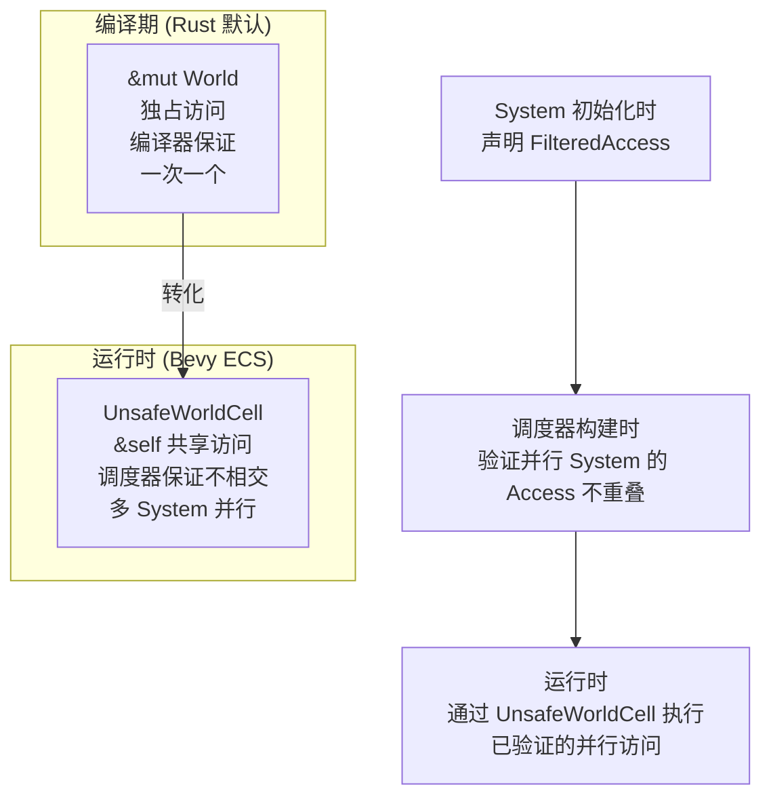

# 第 3 章：World — 一切数据的容器

> **导读**：从本章开始，我们进入 ECS 内核的深水区。World 是 Bevy ECS 的根对象——
> 所有的 Entity、Component、Resource、Archetype、Schedule 都存活在某个 World 中。
> 理解 World 的内部结构，是理解整个 ECS 的前提。

## 3.1 World 的内部结构

`World` struct 有 16 个字段，每一个都承担着明确的职责：

```rust
// 源码: crates/bevy_ecs/src/world/mod.rs:98
pub struct World {
    id: WorldId,
    pub(crate) entities: Entities,
    pub(crate) entity_allocator: EntityAllocator,
    pub(crate) components: Components,
    pub(crate) component_ids: ComponentIds,
    pub(crate) resource_entities: ResourceEntities,
    pub(crate) archetypes: Archetypes,
    pub(crate) storages: Storages,
    pub(crate) bundles: Bundles,
    pub(crate) observers: Observers,
    pub(crate) removed_components: RemovedComponentMessages,
    pub(crate) change_tick: AtomicU32,
    pub(crate) last_change_tick: Tick,
    pub(crate) last_check_tick: Tick,
    pub(crate) last_trigger_id: u32,
    pub(crate) command_queue: RawCommandQueue,
}
```

这些字段可以按职责分为五组：

```
┌─────────────────────────────────────────────────────┐
│                     World                            │
│                                                      │
│  ┌─ 身份 ──────────────────────────────────────────┐ │
│  │  id: WorldId                                    │ │
│  └─────────────────────────────────────────────────┘ │
│                                                      │
│  ┌─ 实体管理 ──────────────────────────────────────┐ │
│  │  entities: Entities        (实体元数据表)        │ │
│  │  entity_allocator          (ID 分配器)           │ │
│  └─────────────────────────────────────────────────┘ │
│                                                      │
│  ┌─ 类型注册 ──────────────────────────────────────┐ │
│  │  components: Components    (组件类型注册表)      │ │
│  │  component_ids: ComponentIds (TypeId→ComponentId) │ │
│  │  bundles: Bundles          (Bundle 元数据缓存)   │ │
│  └─────────────────────────────────────────────────┘ │
│                                                      │
│  ┌─ 数据存储 ──────────────────────────────────────┐ │
│  │  archetypes: Archetypes    (原型索引)            │ │
│  │  storages: Storages        (Tables+SparseSets)  │ │
│  │  resource_entities         (资源→实体映射)       │ │
│  └─────────────────────────────────────────────────┘ │
│                                                      │
│  ┌─ 事件与变更 ────────────────────────────────────┐ │
│  │  observers: Observers      (观察者调度)          │ │
│  │  removed_components        (移除组件消息集)      │ │
│  │  change_tick: AtomicU32    (变更时钟)            │ │
│  │  last_change_tick / last_check_tick              │ │
│  │  last_trigger_id           (触发器编号)          │ │
│  │  command_queue             (延迟命令队列)        │ │
│  └─────────────────────────────────────────────────┘ │
└──────────────────────────────────────────────────────┘
```

*图 3-1: World 内部结构分组*

逐一说明关键字段：

| 字段 | 类型 | 职责 |
|------|------|------|
| `id` | `WorldId` | 唯一标识，防止跨 World 误用 Query |
| `entities` | `Entities` | 存储所有实体的元数据（EntityLocation） |
| `entity_allocator` | `EntityAllocator` | 管理空闲 Entity ID 的分配与回收 |
| `components` | `Components` | 组件类型注册表，存储 ComponentInfo |
| `component_ids` | `ComponentIds` | TypeId → ComponentId 的快速映射 |
| `archetypes` | `Archetypes` | 所有 Archetype 的集合与迁移图 |
| `storages` | `Storages` | 三种存储后端：Tables、SparseSets、NonSends |
| `bundles` | `Bundles` | Bundle 元数据缓存，加速 spawn/insert |
| `observers` | `Observers` | Observer 调度表，分发生命周期事件 |
| `change_tick` | `AtomicU32` | 全局变更时钟，驱动 Change Detection |
| `command_queue` | `RawCommandQueue` | 延迟命令缓冲区 |

为什么 World 要把所有这些职责集中在一个 struct 中？一种替代设计是将类型注册、实体管理和数据存储分别放在独立的 Registry 对象中——例如一个 `ComponentRegistry`、一个 `EntityManager`、一个 `StorageBackend`。这种分离看似更"干净"，但在 Rust 中会导致严重的借用问题：如果这些对象各自独立存在，任何需要同时访问类型信息和存储数据的操作（比如 spawn 一个实体）都需要同时借用多个对象，要么产生冗余的引用传递，要么迫使调用方管理复杂的借用生命周期。将所有状态集中在 World 中，调用方只需一个 `&mut World` 就能完成任何操作。这也使得 `UnsafeWorldCell` 的设计成为可能——只需将一个 World 指针包装为细粒度访问，而不需要对多个独立对象分别做安全抽象。另一个好处是序列化和快照：整个游戏状态就是一个 World，保存和恢复只需操作一个对象。这种"上帝对象"在通常的软件工程实践中是反模式，但在 ECS 的上下文中，World 更像一个内存数据库——它的"大"是有意为之的。`change_tick` 字段使用 `AtomicU32` 而非普通 `u32`，是因为多个 System 可能通过 `UnsafeWorldCell` 并行读取变更时钟，原子操作保证了无锁的帧间变更检测（第 10 章将详述）。

**要点**：World 是一个"数据库"——它管理实体分配、类型注册、数据存储和事件分发。

## 3.2 UnsafeWorldCell：从编译期借用到运行时验证

ECS 需要多个 System 并行访问 World 的不同部分。但 Rust 的借用规则不允许多个 `&mut World` 同时存在。`UnsafeWorldCell` 是 Bevy 对这个问题的解答。

### 问题：`&mut World` 的独占性

```rust
// 这在 Rust 中不可能：
fn run_systems(world: &mut World) {
    let a = &mut world.query::<&mut Position>();  // &mut World
    let b = &mut world.query::<&mut Velocity>();  // &mut World ← 编译错误！
    // 即使 Position 和 Velocity 是完全不相交的数据
}
```

编译器无法知道两个 Query 访问的是 World 的不同部分。它只看到两个 `&mut World`，必须拒绝。

### 解决方案：UnsafeWorldCell

```rust
// 源码: crates/bevy_ecs/src/world/unsafe_world_cell.rs:84
pub struct UnsafeWorldCell<'w> {
    ptr: *mut World,
    #[cfg(debug_assertions)]
    allows_mutable_access: bool,
    _marker: PhantomData<(&'w World, &'w UnsafeCell<World>)>,
}
```

`UnsafeWorldCell` 将 `&mut World` 的独占保证从编译期转移到了运行时：



*图 3-2: 编译期借用 vs 运行时借用*

Bevy 没有放弃安全——它将安全保证的时机从编译期推迟到了调度器构建期。如果两个 System 声明了冲突的 Access（例如都要 `&mut Transform`），调度器会将它们排成串行执行。

> **Rust 设计亮点**：`UnsafeWorldCell` 的 `PhantomData<(&'w World, &'w UnsafeCell<World>)>`
> 精确控制了 variance。第一个 `&'w World` 使生命周期协变（可以缩短），
> 第二个 `&'w UnsafeCell<World>` 使内部可变性不变（阻止非法的生命周期扩展）。
> 这确保了 `UnsafeWorldCell` 的生命周期行为与安全引用一致。

这个 variance 技巧值得深入理解，因为它防御了一类微妙的 soundness 漏洞。如果 `UnsafeWorldCell` 只有协变的 `PhantomData<&'w World>`，那么编译器会允许将 `UnsafeWorldCell<'long>` 当作 `UnsafeWorldCell<'short>` 使用——这对于不可变引用是安全的。但 `UnsafeWorldCell` 实际上提供了内部可变性（通过 `&self` 方法修改 World 的内容），如果允许协变的生命周期缩短，就可能构造出一个已经过期的 `UnsafeWorldCell` 仍然在修改 World 的场景。加入 `&'w UnsafeCell<World>` 使得 `UnsafeWorldCell` 在 `'w` 上变为不变（invariant）——生命周期既不能延长也不能缩短。如果不做这个处理，恶意或不小心的代码可以将短生命周期的 World 引用"延长"，导致 use-after-free。这与第 8 章中 `SystemParam` 的 GAT 设计异曲同工——两者都需要精确控制生命周期的 variance 来保证 unsafe 代码的 soundness。

### 安全保证的层次

| 层次 | 谁负责 | 验证什么 |
|------|--------|---------|
| **Component trait** | 编译器 | `Send + Sync + 'static` |
| **SystemParam** | 编译器 | 参数类型合法 |
| **FilteredAccess** | 调度器 (运行时) | 并行 System 不冲突 |
| **UnsafeWorldCell** | Bevy 内部 | 不相交访问的底层执行 |

从用户视角看，这一切是透明的——你只需写普通函数，Bevy 保证安全的并行。

**要点**：UnsafeWorldCell 是 Bevy 将编译期借用检查延伸到运行时的关键机制。安全性由调度器的 FilteredAccess 验证保证。

## 3.3 DeferredWorld：受限的观察者视图

当 Observer 或 Component Hook 被触发时，World 正处于修改中间状态。此时给回调函数一个完整的 `&mut World` 是危险的——回调可能会触发新的结构变更（如 spawn 新实体），导致状态不一致。

`DeferredWorld` 是一个受限的 World 视图，它禁止结构性变更：

```rust
// 源码: crates/bevy_ecs/src/world/deferred_world.rs:23
/// A [`World`] reference that disallows structural ECS changes.
/// This includes initializing resources, registering components
/// or spawning entities.
pub struct DeferredWorld<'w> {
    world: UnsafeWorldCell<'w>,
}
```

| 操作 | `&mut World` | `DeferredWorld` |
|------|:---:|:---:|
| 读取组件/资源 | ✓ | ✓ |
| 修改组件/资源 | ✓ | ✓ |
| 生成/销毁实体 | ✓ | ✗ |
| 注册组件类型 | ✓ | ✗ |
| 初始化资源 | ✓ | ✗ |
| 发送 Commands | — | ✓ (延迟执行) |

在 DeferredWorld 中，结构性变更只能通过 Commands 提交，待当前操作完成后才执行。这保证了 Observer 和 Hook 不会破坏 World 的中间状态。

如果不提供 DeferredWorld 会怎样？假设一个 on_add hook 在组件被添加的过程中收到 `&mut World`，它可以在这个 hook 中 spawn 新实体——而 spawn 可能触发 Archetype 重新分配，导致当前正在写入的 Table 的指针失效。更严重的是，hook 中 spawn 的新实体可能触发另一个组件的 on_add hook，形成递归触发链，每一层都持有 `&mut World` 的可变引用——这在 Rust 中直接违反借用规则。DeferredWorld 通过类型系统在编译期阻止了这一切：它的 API 中根本没有 `spawn`、`despawn` 或 `insert` 等结构性变更方法。所有需要结构性变更的操作必须通过 Commands 提交到延迟队列，在当前操作完成、所有指针和引用都释放之后才被执行。这种"类型级别的能力限制"是 Rust 类型系统在安全 API 设计中的典型应用——与其在文档中写"请勿在 hook 中 spawn 实体"，不如让编译器直接拒绝。这个设计与第 7 章中 FilteredAccess 的理念一致：将安全规则编码到类型系统中，而不是依赖运行时检查或开发者自律。

**要点**：DeferredWorld 是 World 的受限视图，禁止结构性变更，用于 Observer 和 Hook 回调。

## 3.4 WorldId 与多 World 隔离

每个 World 有一个全局唯一的 `WorldId`：

```rust
// 源码: crates/bevy_ecs/src/world/identifier.rs:14
pub struct WorldId(usize);
```

WorldId 通过全局原子计数器分配，确保不同 World 的 ID 永不重复：

```rust
static MAX_WORLD_ID: AtomicUsize = AtomicUsize::new(0);
```

WorldId 的主要作用是**防止跨 World 误用**。`QueryState` 在创建时记录所属 World 的 ID，运行时会验证：

```rust
// QueryState 验证 World 匹配
fn validate_world(&self, world_id: WorldId) {
    assert!(
        world_id == self.world_id,
        "Attempted to use a QueryState from a different World"
    );
}
```

这在 Main World 和 Render World 共存时尤为重要——如果误将 Main World 的 Query 用在 Render World 上，会立即 panic 而不是产生未定义行为。

WorldId 的实际影响比它看起来要深远。`QueryState` 在初始化时缓存了 Archetype 匹配结果和 ComponentId 映射——这些缓存都是相对于特定 World 的。如果将一个 World 的 QueryState 用在另一个 World 上，即使两个 World 碰巧有相同的组件类型注册顺序，ComponentId 的分配也可能不同（取决于 Plugin 的注册顺序），导致 Query 访问到完全错误的内存位置。WorldId 检查在 debug 模式下是一个廉价的 assert，在 release 模式下可以被优化掉。这是一种"开发期安全网"的设计思路——在开发阶段尽早发现错误，在生产环境中零开销。这种模式在 Bevy 的其他地方也有体现，例如第 4 章中 Entity 的 generation 检查。

**要点**：WorldId 是跨 World 安全的最后防线，防止 Query、Resource 等在错误的 World 上执行。

## 本章小结

本章我们剖析了 World 的内部结构：

1. **World** 有 15 个字段，分为身份、实体管理、类型注册、数据存储、事件与变更五组
2. **UnsafeWorldCell** 将借用检查从编译期推迟到运行时，由调度器的 FilteredAccess 保证安全
3. **DeferredWorld** 是受限视图，防止 Observer/Hook 在回调中破坏 World 状态
4. **WorldId** 防止跨 World 误用

下一章，我们将聚焦 World 中最基础的概念：Entity——轻量级的身份标识。
