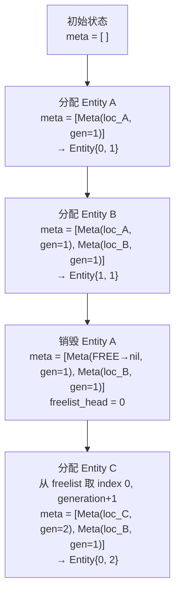
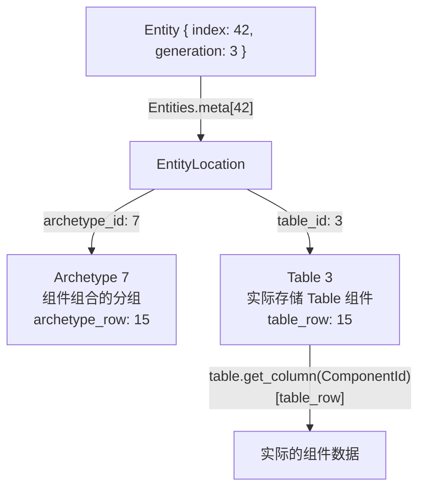
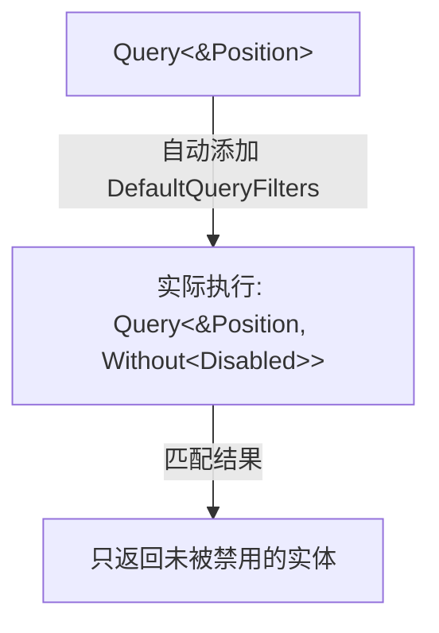

# 第 4 章：Entity — 轻量级身份标识

> **导读**：上一章我们了解了 World 的整体结构。现在我们聚焦 ECS 三要素中最简单
> 却最巧妙的一个——Entity。Entity 不是对象、不是类型、不包含任何数据。
> 它只是一个 64 位的身份标识。但就是这 64 位，包含了防止 use-after-free 的
> generation 机制、高效的 freelist 分配策略，以及精确定位到存储位置的四元组。

## 4.1 64 位编码：index + generation

Entity 的 struct 定义出人意料地底层：

```rust
// 源码: crates/bevy_ecs/src/entity/mod.rs:424
#[repr(C, align(8))]
pub struct Entity {
    #[cfg(target_endian = "little")]
    index: EntityIndex,       // u32
    generation: EntityGeneration, // u32
    #[cfg(target_endian = "big")]
    index: EntityIndex,       // u32
}
```

通过 `#[repr(C, align(8))]`，Entity 被精确布局为一个 `u64`——与机器字长匹配，比较和拷贝都是单指令操作。

为什么选择 32+32 的均分方案，而不是 48+16 或其他比例？48 位 index 可以支持约 2800 亿个并发实体——这远超任何实际需求，浪费了 index 空间。16 位 generation 只有 65536 代，一个频繁回收的 index 可能在游戏运行几小时后就耗尽 generation 空间，导致 use-after-free 保护失效。32+32 是一个经过实践检验的平衡点：32 位 index 支持约 42 亿个并发实体（远超任何游戏的实体数量），32 位 generation 支持约 42 亿次回收——即使一个 index 每帧被回收一次，也需要运行数百小时才会溢出。另一种方案是使用 64 位 index 而不要 generation——但这意味着完全放弃 use-after-free 保护，或者需要引入引用计数等更重的机制。ECS 中实体引用被大量存储在组件中（如父子关系、目标引用），引用计数的开销会显著影响性能。32+32 的 Copy 语义让 Entity 可以像整数一样自由传递，这与第 5 章中 Component 的 `'static` 约束相呼应——Entity 就是一个可以安全存储在任何组件中的轻量级句柄。

```
         Entity (64 bits / 8 bytes)
  ┌──────────────────┬──────────────────┐
  │   index (32 bit) │ generation (32b) │
  └──────────────────┴──────────────────┘
         ↓                    ↓
    在 Entities 中的      防止 use-after-free
    存储位置索引          的版本号
```

*图 4-1: Entity 64 位内存布局*

`index` 和 `generation` 的字段顺序根据字节序 (`cfg(target_endian)`) 调整，确保在任何平台上 Entity 都可以安全地与 `u64` 互转。

### generation 防止 use-after-free

generation 是 Entity 安全性的关键。考虑以下场景：

```
时刻 1: 生成 Entity { index: 5, generation: 1 }
时刻 2: 销毁该实体，index 5 回到空闲列表
时刻 3: 新实体分配到 index 5 → Entity { index: 5, generation: 2 }

此时如果有人持有旧的 Entity { index: 5, generation: 1 }，
使用它访问 World 时：
  index 5 存在 → 但 generation 1 ≠ 当前 generation 2 → 拒绝访问
```

这与操作系统的文件描述符 (fd) 回收类似，但 Bevy 通过 generation 使旧句柄自动失效，无需额外的引用计数。

> **Rust 设计亮点**：Entity 是一个 Copy 类型（8 字节，寄存器大小），可以自由复制传递。
> 但它不是智能指针——没有引用计数，没有析构函数。Generation 机制在无运行时开销的
> 前提下提供了 use-after-free 保护。

**要点**：Entity = 32 位 index + 32 位 generation，用 8 字节实现了零开销的身份标识与 use-after-free 防护。

## 4.2 Entities 分配器

所有实体的元数据存储在 `Entities` 中：

```rust
// 源码: crates/bevy_ecs/src/entity/mod.rs:827
pub struct Entities {
    meta: Vec<EntityMeta>,
}
```

`EntityMeta` 记录每个 index 对应的状态：要么是活跃实体的 `EntityLocation`，要么是空闲链表中的下一个空闲 index。

分配新实体时，优先从空闲链表中取（O(1)）；链表为空时，在 `meta` 末尾追加（摊销 O(1)）。回收实体时，将 index 插入空闲链表头部，generation 递增。



*图 4-2: 实体分配与回收流程*

为什么选择 freelist 而不是其他分配策略？一种替代方案是使用位图（bitmap）——用一个位数组标记哪些 index 空闲，分配时扫描找到第一个空闲位。位图的优势是内存紧凑（每个 index 只占 1 bit），但分配是 O(n/64) 的，在最坏情况下需要扫描整个位数组。另一种方案是始终递增不回收——这避免了 generation 的复杂性，但 index 会无限增长，meta 数组也会无限膨胀。Freelist 的 O(1) 分配和 O(1) 回收使其成为高频实体创建/销毁场景的最佳选择。游戏中"子弹"类实体的生命周期可能只有几帧——每帧创建数百个、销毁数百个是常见负载。freelist 在这种场景下几乎无开销，而位图扫描可能成为瓶颈。代价是空闲链表本身需要存储在 `EntityMeta` 中，复用了 `EntityLocation` 的空间来存储"下一个空闲 index"——这是一种经典的联合体（union）内存复用技巧。

**要点**：Entities 使用 freelist 实现 O(1) 分配与回收，generation 在回收时递增。

## 4.3 EntityLocation 四元组定位

每个活跃实体都有一个 `EntityLocation`，精确指向其数据在存储中的位置：

```rust
// 源码: crates/bevy_ecs/src/entity/mod.rs:1208
pub struct EntityLocation {
    pub archetype_id: ArchetypeId,   // 哪个原型
    pub archetype_row: ArchetypeRow, // 原型内第几行
    pub table_id: TableId,           // 哪个存储表
    pub table_row: TableRow,         // 表内第几行
}
```

为什么需要四个字段？因为 Bevy 有两层索引：



*图 4-3: EntityLocation 四元组寻址流程*

`archetype_id` 和 `table_id` 看似冗余，实际上是因为多个 Archetype 可以共享同一个 Table（当它们仅在 SparseSet 组件上不同时）。这一点将在第 6 章 Archetype 中详细讨论。

四元组设计的性能意义在于：从 Entity 到组件数据的访问路径是两次数组索引——`entities.meta[index]` 获取 EntityLocation，然后 `table.column[table_row]` 获取组件值。两次索引，两次可能的 cache miss，但没有任何哈希查找或树遍历。如果不使用四元组而是用哈希表（`HashMap<Entity, ComponentData>`），每次组件访问都需要哈希计算和可能的哈希冲突处理——在紧密循环中这个开销是不可接受的。如果不存储 `archetype_row`，就需要在 Archetype 的实体列表中线性搜索——O(n) 的开销。四个字段各 4 字节，EntityLocation 总共 16 字节，对于 10 万个实体占用约 1.6MB——这是一个合理的内存代价。

**要点**：EntityLocation 是一个四元组（archetype_id, archetype_row, table_id, table_row），两层索引实现 O(1) 数据定位。

## 4.4 EntityRef 与 EntityMut：安全的动态访问

直接使用 EntityLocation 需要 unsafe 操作。Bevy 提供了两个安全的包装类型：

- **`EntityRef<'w>`**：不可变实体引用，可以读取任意组件
- **`EntityMut<'w>`**：可变实体引用，可以读写任意组件

```rust
// 通过 World 获取安全的实体引用
let entity_ref: EntityRef = world.entity(entity);
let position: &Position = entity_ref.get::<Position>().unwrap();

// 可变引用
let mut entity_mut: EntityMut = world.entity_mut(entity);
entity_mut.insert(Velocity(Vec3::ZERO));
entity_mut.remove::<Health>();
```

`EntityRef` 和 `EntityMut` 遵循 Rust 的标准借用规则：
- 多个 `EntityRef` 可以共存（`&T` 规则）
- `EntityMut` 必须独占（`&mut T` 规则）

这些类型在 Query 中也出现——`Query<EntityRef>` 获取对所有匹配实体的动态只读访问，`Query<EntityMut>` 获取动态可变访问。它们适用于组件集合在编译期未知的场景（如编辑器、调试工具）。

**要点**：EntityRef/EntityMut 是 Entity 的安全访问接口，遵循标准的 Rust 借用规则。

## 4.5 Entity Disabling 与 DefaultQueryFilters

Bevy 支持"禁用"实体而不销毁它——通过添加 `Disabled` 组件：

```rust
// 源码: crates/bevy_ecs/src/entity_disabling.rs:128
#[derive(Component, Clone, Debug, Default)]
pub struct Disabled;
```

关键机制是 `DefaultQueryFilters`——一个全局过滤器，默认排除所有带 `Disabled` 的实体：



如果你确实需要查询被禁用的实体，可以显式覆盖：

```rust
// 只查询被禁用的实体
fn find_disabled(query: Query<Entity, With<Disabled>>) { ... }

// 查询所有实体（包括被禁用的）
fn find_all(query: Query<Entity, Allow<Disabled>>) { ... }
```

禁用的实体保留所有组件和关系，只是从默认查询中"隐身"。这比销毁-重建更高效，适用于对象池、暂停等场景。

需要注意的是，DefaultQueryFilters 会给**每个 Query** 添加额外的过滤条件，即使你的世界中没有任何 Disabled 实体。这是一个微小但持续的性能开销。

从性能角度看，Disabled 的影响主要体现在 Archetype 匹配阶段而非迭代阶段。`Without<Disabled>` 是一个 Archetypal 过滤器（`IS_ARCHETYPAL = true`），这意味着它在 Archetype 级别过滤，不需要逐行检查。包含 `Disabled` 组件的实体会被划分到单独的 Archetype 中，Query 在匹配时直接跳过这些 Archetype——不会遍历其中的任何一行。因此，Disabled 的"隐身"几乎是零开销的，前提是 Disabled 实体数量不多到产生大量额外 Archetype（每种"正常组件组合 + Disabled"都是一个新的 Archetype）。这与第 6 章讨论的 Archetype 碎片化问题有关——如果游戏中频繁地禁用和启用不同组件组合的实体，可能导致 Archetype 数量膨胀。对于对象池等场景，考虑用 SparseSet 存储的标记组件作为替代方案，避免 Archetype 迁移开销。

**要点**：Disabled 组件配合 DefaultQueryFilters 实现实体的"软隐藏"，保留数据但从默认查询中排除。

## 本章小结

本章我们深入了 Entity 的设计：

1. **Entity** 是 8 字节的值类型：32 位 index + 32 位 generation
2. **Generation** 机制在零运行时开销下防止 use-after-free
3. **Entities** 使用 freelist 实现 O(1) 分配与回收
4. **EntityLocation** 四元组实现 O(1) 数据定位
5. **EntityRef/EntityMut** 提供安全的动态组件访问
6. **Disabled** + DefaultQueryFilters 实现软隐藏

下一章，我们将深入 Entity 身上承载的核心数据——Component，以及它们的底层内存存储。
