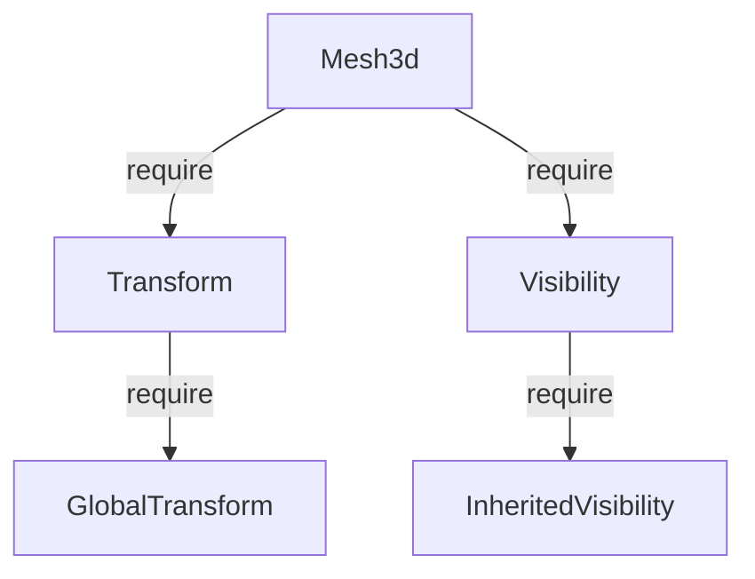

# 第 5 章：Component 与 Storage — 数据与内存

> **导读**：本章是全书技术密度最高的章节之一。我们将深入 Component trait 的约束、
> 两种存储策略（Table vs SparseSet）、底层的类型擦除内存容器（BlobArray、Column、
> ThinArrayPtr），以及 Required Components 的依赖机制。理解这一章，就理解了
> Bevy ECS 数据层的全貌。

## 5.1 Component trait

所有能挂载到 Entity 上的数据都必须实现 `Component` trait：

```rust
// 源码: crates/bevy_ecs/src/component.rs (简化)
pub trait Component: Send + Sync + 'static {
    const STORAGE_TYPE: StorageType = StorageType::Table;
    type Mutability: ComponentMutability;

    fn register_required_components(
        _components: &mut Components,
        _required_components: &mut RequiredComponents,
    ) {}
}
```

三个约束，每个都有明确的动机：

| 约束 | 动机 |
|------|------|
| `Send` | 组件数据可能被移动到其他线程（System 并行执行） |
| `Sync` | 组件引用可能被多个线程共享读取 |
| `'static` | 组件存储在 World 中，不能包含临时引用 |

这三个约束看似严格，但它们是 ECS 自动并行的基础设施成本。如果 Component 不要求 `Send`，调度器就不能将包含该组件的 System 分配到任意线程——这会极大地限制并行度。如果不要求 `Sync`，多个只读 System 就不能同时访问同一个组件列——即使它们只是读取数据。`'static` 的约束则确保组件可以被存储在 World 中任意长的时间，不依赖于任何栈上的引用。如果允许组件包含临时引用（如 `&'a str`），一旦引用的源数据被释放，World 中就会出现悬垂引用——而 World 的生命周期由引擎控制，用户无法预知组件何时被访问。对于确实需要非 Send 类型的场景（如平台相关的窗口句柄），Bevy 提供了 NonSend 存储作为逃生通道（本章 5.8 节），但代价是这些组件不参与并行调度。

实际使用中，通过 `#[derive(Component)]` 自动实现：

```rust
#[derive(Component)]
struct Position(Vec3);

#[derive(Component)]
#[component(storage = "SparseSet")]  // 指定存储策略
struct AnimationState { ... }

#[derive(Component)]
#[component(immutable)]  // 禁止运行时修改
struct EntityName(String);
```

**要点**：Component = `Send + Sync + 'static`，确保数据可以安全地跨线程访问和持久存储。

## 5.2 StorageType：Table vs SparseSet

每个 Component 类型选择一种存储策略。这个选择影响着内存布局和操作性能。

```rust
// 源码: crates/bevy_ecs/src/component.rs
pub enum StorageType {
    Table,      // 列式存储，优化迭代
    SparseSet,  // 稀疏集合，优化增删
}
```

### 两者的核心差异

```
  Table 存储 (默认)                     SparseSet 存储

  同一类型的组件连续排列:               sparse → dense 间接映射:
  ┌─────┬─────┬─────┬─────┐           sparse: [_, _, 0, _, 1, _, _, 2]
  │ C₀  │ C₁  │ C₂  │ C₃  │                       ↓        ↓           ↓
  └─────┴─────┴─────┴─────┘           dense:  [C₂]     [C₄]        [C₇]
  ← CPU 缓存行可以预取整行 →
                                       实体与数据不连续存储
  顺序遍历速度极快
```

*图 5-1: Table vs SparseSet 内存布局*

| 操作 | Table | SparseSet | 说明 |
|------|:-----:|:---------:|------|
| 遍历全部 | **O(n)** 缓存友好 | O(n) 指针跳转 | Table 快 2-5x |
| 随机访问 | O(1) | O(1) | 相当 |
| 添加组件 | **O(n)** 需 Archetype 迁移 | **O(1)** 直接插入 | SparseSet 快得多 |
| 删除组件 | **O(n)** 需 Archetype 迁移 | **O(1)** swap-remove | SparseSet 快得多 |

*图 5-2: Table vs SparseSet 性能对比*

### 选择指南

- **Table（默认）**：适合频繁遍历、很少增删的组件（Position、Velocity、Health）
- **SparseSet**：适合频繁增删、很少遍历的组件（AnimationState、BuffEffect、DebugTag）

经验法则：如果一个组件会在运行时频繁地被 `insert` 和 `remove`，考虑用 SparseSet 避免 Archetype 迁移的开销。

为什么 Table 的缓存友好度如此重要？现代 CPU 的 L1 缓存行通常是 64 字节。当你遍历一个 `Column<Position>` 时（假设 Position 是 `Vec3` = 12 字节），每次 cache line 加载可以预取约 5 个 Position 值。CPU 的硬件预取器会检测到这种线性访问模式，在你实际读取之前就将后续的 cache line 从 L2/L3 甚至主存中拉入 L1。这意味着遍历几乎不会发生 cache miss。相比之下，SparseSet 的 dense 数组虽然也是连续的，但 sparse→dense 的间接查找在随机访问时会导致不可预测的内存访问模式，硬件预取器无法有效工作。当遍历 SparseSet 的 dense 数组时，性能与 Table 相当（都是线性扫描），但当需要从 Entity 查找特定组件时，SparseSet 需要一次 sparse 数组索引 + 一次 dense 数组索引，两次内存访问可能分别 miss。Table 在纯遍历场景下快 2-5 倍的差异主要来自这种缓存行为的差异，而非算法复杂度的差异——两者的时间复杂度都是 O(n)。这种性能特征与第 7 章中 Dense 和 Archetype 两种 Query 迭代路径的选择直接相关。

**要点**：Table 优化迭代，SparseSet 优化增删。默认选 Table，频繁增删选 SparseSet。

## 5.3 Immutable Component 与 Required Components

### Immutable Component

通过 `#[component(immutable)]` 标记的组件无法在运行时修改：

```rust
#[derive(Component)]
#[component(immutable)]
struct EntityId(u64);
```

在 Query 中请求 `&mut EntityId` 会编译失败。这对于不应被修改的标识性数据很有用。

### Required Components

`#[require]` 属性定义组件间的依赖关系：

```rust
#[derive(Component)]
#[require(Transform, Visibility)]
struct Mesh3d { ... }
```

当你 spawn 一个带 `Mesh3d` 的实体时，如果缺少 `Transform` 和 `Visibility`，Bevy 会自动用它们的 `Default` 值补全。这形成一个依赖 DAG (有向无环图)：



*图 5-3: Required Components 依赖 DAG*

依赖关系在组件注册时解析，不影响运行时性能。如果手动指定了被依赖的组件，Bevy 不会用 Default 覆盖——用户提供的值优先。

**要点**：Required Components 自动补全依赖组件，形成编译期可验证的依赖 DAG。

## 5.4 Table 列式存储：Column = BlobArray + Ticks

Table 存储是 Bevy ECS 的主力存储后端。每个 Table 包含多个 Column，每个 Column 存储一种组件类型的所有实例。

### Column 结构

```rust
// 源码: crates/bevy_ecs/src/storage/table/column.rs (简化)
pub struct Column {
    data: BlobArray,                        // 组件值 (类型擦除)
    added_ticks: ThinArrayPtr<UnsafeCell<Tick>>,   // 何时添加
    changed_ticks: ThinArrayPtr<UnsafeCell<Tick>>, // 何时修改
    #[cfg(feature = "track_location")]
    changed_by: ThinArrayPtr<UnsafeCell<&'static Location<'static>>>,
}
```

四个并行数组，索引同步——Row N 在所有数组中对应同一个实体：

```
  Column (Position 类型, 3 个实体)

  data:          ┌──────┬──────┬──────┐
                 │ Pos₀ │ Pos₁ │ Pos₂ │  ← BlobArray (类型擦除的组件值)
                 └──────┴──────┴──────┘
  added_ticks:   ┌──────┬──────┬──────┐
                 │ T=10 │ T=25 │ T=30 │  ← 组件被添加时的 Tick
                 └──────┴──────┴──────┘
  changed_ticks: ┌──────┬──────┬──────┐
                 │ T=10 │ T=42 │ T=30 │  ← 组件被修改时的 Tick
                 └──────┴──────┴──────┘
  changed_by:    ┌──────┬──────┬──────┐
                 │ loc₀ │ loc₁ │ loc₂ │  ← 调试用：修改来源位置
                 └──────┴──────┴──────┘

  Row 0 → Entity₀ 的 Position + 变更信息
  Row 1 → Entity₁ 的 Position + 变更信息
  Row 2 → Entity₂ 的 Position + 变更信息
```

*图 5-4: Column 四数组并行结构*

`added_ticks` 和 `changed_ticks` 驱动了变更检测系统（第 10 章），使 `Added<T>` 和 `Changed<T>` 过滤器成为可能。

### Table 结构

一个 Table 包含多个 Column，对应同一组实体的所有 Table 存储组件：

```
  Table 0 (Archetype 1 的数据):
  ┌────────────────────────────────────────┐
  │  Column<Position>: [P₀] [P₁] [P₂]     │
  │  Column<Velocity>: [V₀] [V₁] [V₂]     │
  │  Column<Health>:   [H₀] [H₁] [H₂]     │
  │  entities:         [E₀] [E₁] [E₂]     │
  └────────────────────────────────────────┘
```

当迭代一个 `Query<(&Position, &Velocity)>` 时，CPU 对每个 Column 做线性扫描——这是最友好的缓存访问模式。

**要点**：Column 由四个并行数组组成（数据 + 两个 Tick + 调试位置），Table 包含多个 Column，列式布局实现缓存友好的遍历。

## 5.5 BlobArray：类型擦除的内存基石

Column 中的 `data` 字段不是 `Vec<T>`——因为 ECS 需要在不知道具体类型的情况下管理组件数据。`BlobArray` 是一个类型擦除的内存容器：

```rust
// 源码: crates/bevy_ecs/src/storage/blob_array.rs (简化)
pub struct BlobArray {
    item_layout: Layout,                    // 元素的 size + align
    data: NonNull<u8>,                      // 裸指针指向堆内存
    capacity: usize,                        // 已分配容量
    drop: Option<unsafe fn(OwningPtr<Aligned>)>, // 元素的 drop 函数
}
```

只有四个字段——`Layout` 记录每个元素的大小和对齐，`NonNull<u8>` 指向裸内存，`drop` 是可选的析构函数指针。

元素访问通过指针算术实现：

```
  BlobArray (element size = 12, align = 4)

  data ──→ ┌──────────┬──────────┬──────────┬ ...
           │ elem [0] │ elem [1] │ elem [2] │
           │ 12 bytes │ 12 bytes │ 12 bytes │
           └──────────┴──────────┴──────────┘

  访问 elem[i]: data.as_ptr().add(i * 12)
```

*图 5-5: BlobArray 内存布局*

为什么不用 `Vec<T>`？

1. **类型擦除**：ComponentId 是运行时值，编译期不知道具体类型
2. **统一管理**：所有 Column 用相同的 API 操作，不需要为每个类型生成代码
3. **精确控制**：swap_remove、初始化、销毁都是显式操作

BlobArray 的安全不变量（safety invariants）是理解整个存储层的关键。首先，`item_layout` 必须精确匹配实际存储元素的 `Layout`——如果 size 或 align 不对，指针算术会计算出错误的偏移量，导致读写越界。其次，`drop` 函数指针必须与实际类型的析构逻辑一致——BlobArray 不会自动 drop 其内容，调用者必须在移除元素时显式调用 `drop` 函数。对于没有析构逻辑的类型（如纯数字组件），`drop` 为 `None`，这允许 BlobArray 在清理时跳过析构调用，直接回收内存——这是一个重要的性能优化。最后，BlobArray 的 `capacity` 和实际使用的 `len`（由外部 Column 管理）之间的关系必须被严格维护：写入超过 capacity 的位置是未定义行为。这些不变量全部由 Column 和 Table 的安全 API 在内部维护，用户代码永远不会直接接触 BlobArray——这正是 Rust 的 unsafe 封装理念：unsafe 的边界越小越好，安全 API 的表面积越大越好。

> **Rust 设计亮点**：BlobArray 用 `Layout + NonNull<u8> + drop fn` 实现了完整的
> 类型擦除容器。这是 unsafe Rust 的正确用法——在内部使用 unsafe 操作裸内存，
> 对外暴露安全的 Column/Table API。用户永远不会直接接触 BlobArray。

**要点**：BlobArray 是类型擦除的内存基石，用指针算术和 Layout 在不知道类型的情况下管理组件数据。

## 5.6 SparseSet：sparse→dense 双数组结构

SparseSet 存储用于标记为 `StorageType::SparseSet` 的组件。每个组件类型一个 `ComponentSparseSet`：

```rust
// 源码: crates/bevy_ecs/src/storage/sparse_set.rs (简化)
pub struct ComponentSparseSet {
    dense: Column,                          // 稠密数组：组件数据 + ticks
    entities: Vec<Entity>,                  // 稠密数组：对应的实体
    sparse: SparseArray<EntityIndex, TableRow>, // 稀疏数组：entity → dense 位置
}
```

三个部分协同工作：

```
  ComponentSparseSet (存储 AnimationState 组件)

  假设 Entity 2, 4, 7 拥有该组件:

  sparse (按 entity index 索引):
  ┌───┬───┬───┬───┬───┬───┬───┬───┬───┐
  │ _ │ _ │ 0 │ _ │ 1 │ _ │ _ │ 2 │ _ │
  └───┴───┴─│─┴───┴─│─┴───┴───┴─│─┴───┘
            │       │           │
            ▼       ▼           ▼
  dense:  ┌──────┬──────┬──────┐
          │ AS₂  │ AS₄  │ AS₇  │  ← Column (组件数据)
          └──────┴──────┴──────┘
  entities: [E₂]   [E₄]   [E₇]

  查找: Entity(4) → sparse[4] = 1 → dense[1] = AS₄  ✓
  查找: Entity(3) → sparse[3] = None → 该实体没有此组件  ✓
```

*图 5-6: SparseSet 双数组结构与查找流程*

### swap_remove 删除操作

删除是 O(1) 的——将最后一个元素移到被删位置，更新 sparse 映射：

```
  删除 Entity 4 的组件:

  Before:                          After:
  sparse[4] = 1                    sparse[4] = None
  sparse[7] = 2                    sparse[7] = 1  ← 更新！

  dense:  [AS₂] [AS₄] [AS₇]       dense:  [AS₂] [AS₇]
  entities: [E₂] [E₄] [E₇]        entities: [E₂] [E₇]
                                            最后元素移到位置 1
```

*图 5-7: SparseSet swap-remove 操作*

SparseSet 的内存开销值得仔细分析。sparse 数组按 Entity index 索引，这意味着它的大小取决于"最大的 Entity index"，而非"实际拥有该组件的实体数量"。如果你的 World 中有 10000 个实体（index 0-9999），但只有 10 个拥有某个 SparseSet 组件，sparse 数组仍然需要分配 10000 个槽位（每个槽位通常 4 字节），而 dense 数组只有 10 个元素。这意味着在实体总量很大但组件持有率很低的情况下，SparseSet 的内存开销可能远超预期。反过来说，如果大多数实体都拥有该组件，sparse 数组的"空洞"很少，内存利用率就很高。这也是为什么 SparseSet 适合"标记型"组件（少数实体拥有）而非"通用型"组件（几乎所有实体都有）——后者用 Table 存储更节省内存且遍历更快。另外，SparseSet 的 dense 数组使用 Column 作为底层存储，这意味着它同样拥有变更检测的 tick 数组——Added 和 Changed 过滤器对 SparseSet 组件同样有效，只是查询路径不同（第 7 章）。

**要点**：SparseSet 通过 sparse→dense 间接映射实现 O(1) 查找、O(1) 增删，代价是遍历时失去缓存局部性。

## 5.7 ThinArrayPtr：极致的指针优化

Column 中的 tick 数组使用 `ThinArrayPtr` 而非标准的 `Vec<T>`：

```rust
// 源码: crates/bevy_ecs/src/storage/thin_array_ptr.rs (简化)
pub struct ThinArrayPtr<T> {
    data: NonNull<T>,
    _marker: PhantomData<Box<[T]>>,
}
```

与 `Vec<T>` 的对比：

| | `Vec<T>` | `ThinArrayPtr<T>` |
|---|---|---|
| 内存占用 | 24 字节 (ptr + len + cap) | 8 字节 (ptr) |
| 长度信息 | 自带 | 外部管理 (Column 统一) |
| 容量信息 | 自带 | 外部管理 |
| Drop | 自动 | ManuallyDrop |

Column 中的四个数组长度总是一致的，由 Column 统一管理。每个数组都用独立的 `Vec<T>` 会浪费 3 × 16 = 48 字节的冗余 len/cap 字段。`ThinArrayPtr` 只保留一个裸指针，将长度管理委托给外部。

在一个有上千个 Column 的 World 中，这节省了可观的内存。

ThinArrayPtr 的设计代价是放弃了 `Vec<T>` 提供的自动边界检查和自动 drop。Column 必须在每次操作时手动维护长度一致性，手动调用元素的析构函数——任何疏忽都会导致内存泄漏或 double-free。这是一种典型的"安全性换性能"的权衡，但 Bevy 通过将所有 unsafe 操作封装在 Column 的安全 API 内部，将这种风险限制在了很小的代码范围内。从外部看，Column 的行为与四个同步的 `Vec<T>` 完全一致——用户和上层代码永远不需要知道底层使用了 ThinArrayPtr。这种"内部 unsafe、外部 safe"的分层设计在第 3 章的 UnsafeWorldCell 和第 5.5 节的 BlobArray 中也有体现。

**要点**：ThinArrayPtr 去掉了 Vec 的长度和容量字段，将管理职责上移到 Column 级别，每个 Column 节省 48 字节。

## 5.8 NonSend 存储：线程本地数据

不满足 `Send` 约束的类型无法存储在 Table 或 SparseSet 中。Bevy 为它们提供了 `NonSend` 存储：

```rust
// 获取线程本地资源
fn use_renderer(renderer: NonSend<Renderer>) {
    renderer.draw();
}
```

NonSend 数据只能在主线程访问。典型用例包括：
- 平台相关的窗口句柄
- OpenGL 上下文（某些平台要求单线程）
- 不满足 Send 的第三方库类型

NonSend 的 System 不能与其他 System 并行——调度器会将它们限制在主线程串行执行。

**要点**：NonSend 是 `!Send` 类型的特殊存储通道，仅限主线程访问，不参与并行调度。

## 本章小结

本章我们深入了 Bevy ECS 的数据层：

1. **Component** = `Send + Sync + 'static`，通过 derive 宏自动实现
2. **Table** 列式存储优化迭代，**SparseSet** 稀疏存储优化增删
3. **Column** = BlobArray + Ticks，四数组并行驱动变更检测
4. **BlobArray** 用 `Layout + NonNull<u8> + drop fn` 实现类型擦除
5. **SparseSet** 用 sparse→dense 双数组实现 O(1) 增删查
6. **ThinArrayPtr** 去掉冗余的长度/容量字段，节省内存
7. **Required Components** 自动补全依赖，形成 DAG
8. **NonSend** 存储 `!Send` 类型，限制主线程访问

下一章，我们将看到这些存储如何被 Archetype 组织——Archetype 是连接 Entity 和 Storage 的索引层。
