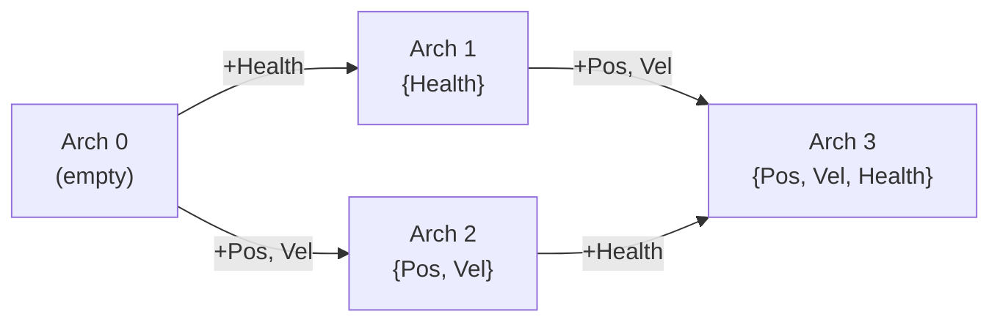
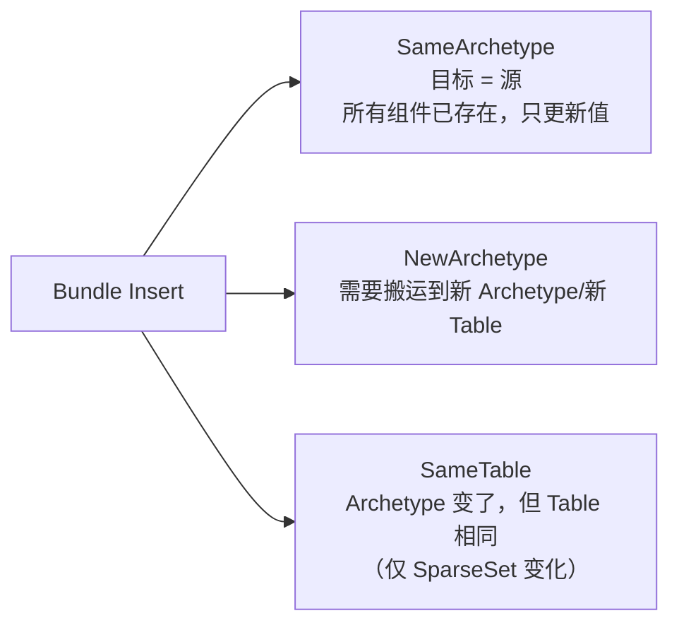

# 第 6 章：Archetype — 组合索引与实体迁移

> **导读**：上一章我们深入了 Component 的存储层——Table 和 SparseSet。
> 但数据存储只是一半，另一半是"如何找到数据"。Archetype 正是 Entity 与 Storage
> 之间的索引层：它记录了每个实体拥有哪些组件，决定了数据存储在哪张 Table 里，
> 并缓存了组件增删时的迁移路径。理解 Archetype，就理解了 Bevy ECS 的组织骨架。

## 6.1 Archetype 的概念：组件集合的唯一指纹

一个 Archetype 唯一对应一组组件的组合。World 中所有拥有完全相同组件集合的实体，
都属于同一个 Archetype。

```rust
// 源码: crates/bevy_ecs/src/archetype.rs:383
pub struct Archetype {
    id: ArchetypeId,
    table_id: TableId,
    edges: Edges,
    entities: Vec<ArchetypeEntity>,
    components: ImmutableSparseSet<ComponentId, ArchetypeComponentInfo>,
    pub(crate) flags: ArchetypeFlags,
}
```

六个字段各司其职：

| 字段 | 类型 | 职责 |
|------|------|------|
| `id` | `ArchetypeId` | 全局唯一标识，`u32` 包装 |
| `table_id` | `TableId` | 指向存储 Table 组件的 Table |
| `edges` | `Edges` | 缓存 Bundle 增删后的目标 Archetype |
| `entities` | `Vec<ArchetypeEntity>` | 属于此 Archetype 的所有实体 |
| `components` | `ImmutableSparseSet` | 组件 ID → 存储类型的映射 |
| `flags` | `ArchetypeFlags` | Hook/Observer 的位标志缓存 |

每个 World 初始化时，都会创建一个空 Archetype（`ArchetypeId::EMPTY = 0`），
它不包含任何组件。新实体在分配阶段首先进入这个空 Archetype，然后通过 Bundle
操作迁移到目标 Archetype。

```rust
// 源码: crates/bevy_ecs/src/archetype.rs:90
impl ArchetypeId {
    pub const EMPTY: ArchetypeId = ArchetypeId(0);
}
```

Archetype 的设计动机源自 ECS 面临的一个核心问题：如何快速找到"所有同时拥有 Position 和 Velocity 的实体"？朴素的做法是为每个 Query 遍历所有实体，逐个检查它是否拥有所需的组件——这是 O(N) 的，N 为总实体数。Archetype 将这个问题转化为集合匹配：Query 只需找到哪些 Archetype 的组件集合是 Query 要求的超集，然后直接遍历这些 Archetype 中的实体列表。由于 Archetype 数量远小于实体数量（通常是几十到几百个 Archetype 对应数万实体），匹配阶段的开销大幅降低。但 Archetype 也引入了一个权衡：每种独特的组件组合都产生一个新的 Archetype。如果游戏中存在大量"几乎相同但略有差异"的组件组合（比如为每种 buff 使用不同的标记组件），Archetype 数量会爆炸式增长——这就是所谓的"Archetype 碎片化"。碎片化不仅增加 Query 匹配时需要检查的 Archetype 数量，还可能导致每个 Archetype 中只有少量实体，降低 Table 遍历的效率。这就是为什么 SparseSet 组件（不影响 Archetype 划分的 Table 列）对于频繁增删的标记型组件如此重要——它们不会产生新的 Archetype。

**要点**：Archetype 是组件集合的唯一指纹，World 中每种独特的组件组合恰好对应一个 Archetype。

## 6.2 Archetype 与 Table 的 N:1 映射

Archetype 和 Table 不是一一对应的。多个 Archetype 可以共享同一张 Table，
条件是它们的 **Table 存储组件完全相同**。区别仅在于 SparseSet 组件不同。

```
  Archetype 0 (空)          → Table 0 (空)
  Archetype 1 {Pos, Vel}    → Table 1 {Pos, Vel}
  Archetype 2 {Pos, Vel, Tag} → Table 1 {Pos, Vel}  ← 共享！
                                  (Tag 是 SparseSet 存储)
  Archetype 3 {Pos, Health} → Table 2 {Pos, Health}
```

*图 6-1: Archetype 与 Table 的 N:1 映射关系*

为什么这样设计？因为 SparseSet 组件不存储在 Table 里，所以它们的增删
不需要改变 Table 结构。两个 Archetype 只有 SparseSet 组件不同时，它们的
Table 组件集是相同的，自然可以共享同一张 Table。

这带来一个重要推论：**添加或删除 SparseSet 组件时，实体的 Table Row 不变**，
只需要更新 Archetype 记录。这就是 SparseSet 组件增删代价低的另一个原因。

Archetype 的 `table_id` 在创建时确定，之后永不改变：

```rust
// 源码: crates/bevy_ecs/src/archetype.rs:469
impl Archetype {
    pub fn table_id(&self) -> TableId {
        self.table_id
    }
}
```

> **Rust 设计亮点**：Archetype 与 Table 的 N:1 设计将"组件组合的多样性"与
> "物理存储的共享"解耦。SparseSet 组件像是 Archetype 的"标签维度"，不影响
> 密集存储布局。这让频繁增删标记组件的成本降到最低。

**要点**：仅 Table 存储的组件决定 Table ID，SparseSet 组件不影响。多个 Archetype 可共享同一 Table。

## 6.3 Edges 缓存：原型迁移图

当实体的组件集合发生变化（insert/remove），它需要从一个 Archetype 迁移到另一个。
Edges 缓存了这些迁移的结果，避免重复计算：

```rust
// 源码: crates/bevy_ecs/src/archetype.rs:206
pub struct Edges {
    insert_bundle: SparseArray<BundleId, ArchetypeAfterBundleInsert>,
    remove_bundle: SparseArray<BundleId, Option<ArchetypeId>>,
    take_bundle: SparseArray<BundleId, Option<ArchetypeId>>,
}
```

三种操作各有一个缓存表：

| 缓存 | Key | Value | 语义 |
|------|-----|-------|------|
| `insert_bundle` | `BundleId` | `ArchetypeAfterBundleInsert` | 插入 Bundle 后的目标 |
| `remove_bundle` | `BundleId` | `Option<ArchetypeId>` | 移除 Bundle 后的目标 |
| `take_bundle` | `BundleId` | `Option<ArchetypeId>` | 取出 Bundle 后的目标 |

Insert 操作的缓存值比较丰富，不仅包含目标 Archetype ID，还记录了每个组件
是"新增"还是"已存在"：

```rust
// 源码: crates/bevy_ecs/src/archetype.rs:127
pub(crate) struct ArchetypeAfterBundleInsert {
    pub archetype_id: ArchetypeId,
    bundle_status: Box<[ComponentStatus]>,      // Added or Existing
    pub required_components: Box<[RequiredComponentConstructor]>,
    inserted: Box<[ComponentId]>,               // added first, then existing
    added_len: usize,
}
```

`bundle_status` 对应 Bundle 中的每个组件：如果目标实体已有该组件，标记为
`Existing`（只更新值），否则标记为 `Added`（需要触发 on_add hook）。

Archetype Graph 可以用有向图表示：



*图 6-2: Archetype Graph 迁移路径*

每条边首次遍历时计算并缓存，之后永久命中：

```rust
// 源码: crates/bevy_ecs/src/archetype.rs:219
impl Edges {
    pub fn get_archetype_after_bundle_insert(
        &self, bundle_id: BundleId
    ) -> Option<ArchetypeId> {
        self.get_archetype_after_bundle_insert_internal(bundle_id)
            .map(|bundle| bundle.archetype_id)
    }
}
```

为什么 Edges 缓存如此重要？如果没有 Edges 缓存，每次 insert 操作都需要：计算当前组件集合与新 Bundle 的并集、在 `Archetypes.by_components` 哈希表中查找这个并集是否已存在、如果不存在则创建新的 Archetype 并更新所有反向索引。这个过程涉及组件集合的哈希计算（O(k)，k 为组件数量）和哈希表查找。对于一个每帧都在大量实体上执行 insert/remove 的游戏来说，这些查找的累积开销是显著的。Edges 将这个 O(k) 的哈希查找替换为 O(1) 的 SparseArray 直接索引——BundleId 是一个整数，直接作为 SparseArray 的下标。更重要的是，`ArchetypeAfterBundleInsert` 不仅缓存了目标 Archetype ID，还预计算了每个组件是 Added 还是 Existing——这消除了迁移过程中逐组件判断状态的开销。如果不做这个缓存，每次 insert 都需要遍历 Bundle 中的每个组件，检查它是否已存在于目标 Archetype 中，才能决定是否触发 on_add hook。这种"首次计算、永久缓存"的模式在 Bevy 的多处出现——QueryState 的 Archetype 匹配缓存（第 7 章）也是同样的思路。

**要点**：Edges 以 BundleId 为 key 缓存迁移目标，首次计算后永久缓存，将 O(n) 的组件集合比较摊销为 O(1) 的查表操作。

## 6.4 实体迁移的完整流程

当调用 `entity.insert(SomeBundle)` 时，实体可能需要从当前 Archetype 迁移到新
Archetype。这个流程涉及多步操作和连锁更新。

以一个具体例子说明：实体 E2 位于 Archetype A（{Pos, Vel}），我们要 insert Health：

```
  步骤 1: 查 Edges 缓存
  ──────────────────────────────────────────
  Arch A.edges.get_insert(HealthBundle)
  → 命中: 目标 Arch B = {Pos, Vel, Health}
  → 未命中: 计算新 Archetype 并缓存

  步骤 2: 在目标 Table 中分配新行
  ──────────────────────────────────────────
  Table B 末尾分配 Row, 写入所有组件值

  步骤 3: 从源 Table 搬运旧组件 (swap-remove)
  ──────────────────────────────────────────
  Table A:                        Table A (after):
  Row 0: [P₀][V₀] ← E0          Row 0: [P₀][V₀] ← E0
  Row 1: [P₁][V₁] ← E1          Row 1: [P₃][V₃] ← E3 (moved!)
  Row 2: [P₂][V₂] ← E2 ◄ 移除   Row 2: [P₂][V₂] ← E2 (removed)
  Row 3: [P₃][V₃] ← E3

  E2 的 Pos, Vel 搬到 Table B 的新行
  E3 被 swap 到 Row 2 的位置

  步骤 4: 从源 Archetype 移除 (swap-remove)
  ──────────────────────────────────────────
  Arch A.entities:
  Before: [E0, E1, E2, E3]
  After:  [E0, E1, E3]  (E3 moved to index 2)

  步骤 5: 在目标 Archetype 中登记
  ──────────────────────────────────────────
  Arch B.entities.push(E2)

  步骤 6: 连锁 EntityLocation 更新
  ──────────────────────────────────────────
  更新 E2: archetype=B, row=new_row
  更新 E3: archetype_row=2 (被 swap 到了 E2 的旧位置)
  若 Table 中也发生了 swap: 更新被 swap 实体的 table_row
```

*图 6-3: 实体迁移完整流程 (6 步)*

关键的 `swap_remove` 方法返回被交换的实体信息：

```rust
// 源码: crates/bevy_ecs/src/archetype.rs:623
pub(crate) fn swap_remove(&mut self, row: ArchetypeRow) -> ArchetypeSwapRemoveResult {
    let is_last = row.index() == self.entities.len() - 1;
    let entity = self.entities.swap_remove(row.index());
    ArchetypeSwapRemoveResult {
        swapped_entity: if is_last { None } else {
            Some(self.entities[row.index()].entity)
        },
        table_row: entity.table_row,
    }
}
```

`swapped_entity` 就是被连锁影响的实体——它的 `EntityLocation` 需要更新。
如果被移除的恰好是最后一个元素，则不需要 swap，`swapped_entity` 为 `None`。

> **Rust 设计亮点**：swap-remove 是 O(1) 删除，但代价是打乱顺序。Bevy 通过
> `ArchetypeSwapRemoveResult` 精确报告被影响的实体，让调用者能及时更新
> `EntityLocation`。这是一个"O(1) 操作 + O(1) 修复"的经典模式。

实体迁移的性能开销值得深入分析。最昂贵的部分不是 Edges 查找（O(1)），而是 Table 级别的数据搬运。当实体从一个 Table 迁移到另一个 Table 时，它的每个 Table 存储组件都需要被逐字节复制——一个拥有 10 个组件的实体可能需要搬运数百字节的数据。此外，swap-remove 操作会影响一个"无辜"的实体（被 swap 到空位的那个），它的 EntityLocation 需要更新。如果大量实体在同一帧频繁迁移，这种连锁更新会成为性能瓶颈。这就是为什么 Bevy 推荐使用 SparseSet 存储频繁增删的标记组件——SparseSet 组件的增删只改变 Archetype（不改变 Table），`ArchetypeMoveType::SameTable` 路径跳过了整个 Table 数据搬运。实际游戏开发中，一个常见的反模式是用 Table 存储的标记组件（如 `Poisoned`、`Stunned`）来表示临时状态——每次添加/移除都触发完整的 Archetype 迁移。将这些组件改为 SparseSet 存储可以消除迁移开销，这种优化效果在有数千实体的场景中尤为明显。

**要点**：实体迁移 = 查 Edges + Table 搬运 (swap-remove) + Archetype 登记 + 连锁更新被 swap 实体的 Location。

## 6.5 Archetypes 集合与 ArchetypeGeneration

World 中所有 Archetype 由 `Archetypes` 集合管理：

```rust
// 源码: crates/bevy_ecs/src/archetype.rs:773
pub struct Archetypes {
    pub(crate) archetypes: Vec<Archetype>,
    by_components: HashMap<ArchetypeComponents, ArchetypeId>,
    pub(crate) by_component: ComponentIndex,
}
```

三个数据结构：

- `archetypes`: 按 ID 顺序的 Archetype 列表，只增不删
- `by_components`: 从组件集合到 ArchetypeId 的哈希查找
- `by_component`: 从单个 ComponentId 到包含它的所有 Archetype 的反向索引

`ArchetypeGeneration` 记录了 Archetype 列表的"版本号"——实际上就是最新的
ArchetypeId：

```rust
// 源码: crates/bevy_ecs/src/archetype.rs:747
pub struct ArchetypeGeneration(pub(crate) ArchetypeId);
```

QueryState 用它实现增量更新：只检查上次见过的 generation 之后新增的 Archetype，
而不必每帧扫描全部 Archetype。这是 Query 缓存高效的关键之一（第 7 章详述）。

```rust
// 源码: crates/bevy_ecs/src/archetype.rs:973
impl Index<RangeFrom<ArchetypeGeneration>> for Archetypes {
    type Output = [Archetype];

    fn index(&self, index: RangeFrom<ArchetypeGeneration>) -> &Self::Output {
        &self.archetypes[index.start.0.index()..]
    }
}
```

通过 `RangeFrom<ArchetypeGeneration>` 索引，可以只获取新增的 Archetype 切片。

**要点**：Archetypes 只增不删，ArchetypeGeneration 支持增量更新，避免重复扫描。

## 6.6 Bundle 操作：BundleInserter 与 BundleSpawner

Bundle 是 Bevy 中组件操作的原子单位。Bundle trait 将多个 Component 打包成一组，
供 spawn、insert、remove 使用。

### BundleInserter：向已有实体插入组件

`BundleInserter` 缓存了插入操作所需的全部上下文，避免重复查找：

```rust
// 源码: crates/bevy_ecs/src/bundle/insert.rs:24
pub(crate) struct BundleInserter<'w> {
    world: UnsafeWorldCell<'w>,
    bundle_info: ConstNonNull<BundleInfo>,
    archetype_after_insert: ConstNonNull<ArchetypeAfterBundleInsert>,
    archetype: NonNull<Archetype>,
    archetype_move_type: ArchetypeMoveType,
    change_tick: Tick,
}
```

它在创建时就确定了源 Archetype 和目标 Archetype 之间的关系。
`archetype_move_type` 区分三种情况：



*图 6-4: Bundle Insert 的三种迁移类型*

### BundleSpawner：批量生成新实体

`BundleSpawner` 专门优化 spawn 场景。因为新实体总是从空 Archetype 开始，
BundleSpawner 预先确定目标 Archetype 和 Table：

```rust
// 源码: crates/bevy_ecs/src/bundle/spawner.rs:18
pub(crate) struct BundleSpawner<'w> {
    world: UnsafeWorldCell<'w>,
    bundle_info: ConstNonNull<BundleInfo>,
    table: NonNull<Table>,
    archetype: NonNull<Archetype>,
    change_tick: Tick,
}
```

由于 spawn 不需要从旧位置搬运数据，`BundleSpawner` 比 `BundleInserter` 更轻量。

### SpawnBatch 优化

当使用 `world.spawn_batch(iter)` 批量生成大量同类实体时，Bevy 复用同一个
`BundleSpawner`。所有实体共享同一个 Archetype 查找结果——查表只做一次，
后续每个实体只需要分配 Entity ID + 写入组件数据。

```
  spawn_batch([BundleA; 1000]):

  1. 创建 BundleSpawner (查 Archetype, 查 Table) — 1 次
  2. 预分配 Table 容量 (reserve 1000 行)           — 1 次
  3. 对每个元素:                                    — 1000 次
     a. allocate Entity ID
     b. write components to Table row
     c. push to Archetype.entities
```

*图 6-5: SpawnBatch 批量优化流程*

对比逐个 `spawn`：每次都要查 Archetype（虽然 Edges 缓存命中），
SpawnBatch 彻底省去了重复的查找步骤。

### SpawnBundleStatus：简化的状态判定

spawn 操作中所有组件都是"新增的"，因此 Bevy 用一个特殊的零成本状态类型：

```rust
// 源码: crates/bevy_ecs/src/archetype.rs:181
pub(crate) struct SpawnBundleStatus;

impl BundleComponentStatus for SpawnBundleStatus {
    unsafe fn get_status(&self, _index: usize) -> ComponentStatus {
        ComponentStatus::Added  // spawn always adds
    }
}
```

> **Rust 设计亮点**：`SpawnBundleStatus` 是一个零大小类型 (ZST)，编译期完全内联。
> 与 `ArchetypeAfterBundleInsert` 的运行时 `Box<[ComponentStatus]>` 相比，
> spawn 路径不需要堆分配。这是"编译期多态消除运行时开销"的典型应用。

**要点**：BundleInserter 缓存迁移上下文，BundleSpawner 专精 spawn 路径，SpawnBatch 通过复用 Spawner 实现批量优化。

## 6.7 ArchetypeFlags：Hook 与 Observer 的快速跳过

每个 Archetype 维护一组位标志，记录其包含的组件是否注册了 Hook 或 Observer：

```rust
// 源码: crates/bevy_ecs/src/archetype.rs:358
bitflags::bitflags! {
    pub(crate) struct ArchetypeFlags: u32 {
        const ON_ADD_HOOK       = (1 << 0);
        const ON_INSERT_HOOK    = (1 << 1);
        const ON_DISCARD_HOOK   = (1 << 2);
        const ON_REMOVE_HOOK    = (1 << 3);
        const ON_DESPAWN_HOOK   = (1 << 4);
        const ON_ADD_OBSERVER   = (1 << 5);
        const ON_INSERT_OBSERVER = (1 << 6);
        // ... more flags
    }
}
```

这些标志在 Archetype 创建时根据其包含的组件计算。运行时通过位操作快速判断
是否需要触发 Hook/Observer：

```rust
// 源码: crates/bevy_ecs/src/archetype.rs:673
impl Archetype {
    pub fn has_add_hook(&self) -> bool {
        self.flags().contains(ArchetypeFlags::ON_ADD_HOOK)
    }
}
```

如果一个 Archetype 的所有组件都没有注册 on_add hook，`has_add_hook()` 返回
false，Insert 路径可以完全跳过 hook 触发逻辑。这是一个 O(1) 的快速出口。

**要点**：ArchetypeFlags 用位标志缓存 Hook/Observer 状态，实现 O(1) 的快速跳过判断。

## 6.8 ComponentIndex：反向索引

`Archetypes` 维护了一个从 ComponentId 到 Archetype 集合的反向索引：

```rust
// 源码: crates/bevy_ecs/src/archetype.rs:765
pub type ComponentIndex = HashMap<ComponentId, HashMap<ArchetypeId, ArchetypeRecord>>;
```

当 Query 需要知道"哪些 Archetype 包含组件 A"时，不需要遍历所有 Archetype，
直接查 ComponentIndex 即可。这在 Query 匹配阶段大幅减少了扫描量。

`ArchetypeRecord` 记录了组件在 Table 中的列索引（如果是 Table 存储组件）：

```rust
// 源码: crates/bevy_ecs/src/archetype.rs:782
pub struct ArchetypeRecord {
    pub(crate) column: Option<usize>,
}
```

`column = None` 表示该组件使用 SparseSet 存储。

**要点**：ComponentIndex 提供从组件到 Archetype 的反向查找，加速 Query 匹配。

## 本章小结

本章我们剖析了 Archetype 的完整结构：

1. **Archetype** 是组件集合的唯一指纹，由组件 ID 集合决定
2. **N:1 映射**：多个 Archetype 可共享 Table（区别仅在 SparseSet 组件）
3. **Edges** 缓存 Bundle 操作的迁移目标，首次计算后永久缓存
4. **实体迁移** = 查 Edges → swap-remove 搬运 → 连锁更新 EntityLocation
5. **BundleInserter/BundleSpawner** 缓存迁移上下文，SpawnBatch 批量复用
6. **ArchetypeFlags** 用位标志实现 Hook/Observer 的 O(1) 快速跳过
7. **ArchetypeGeneration** 支持增量更新，**ComponentIndex** 支持反向查找

下一章，我们将进入 Query 系统——Archetype 的匹配、缓存和迭代策略。Query 是 System 访问数据的唯一窗口，它将 Archetype 索引和 Table 存储的效能充分释放出来。
