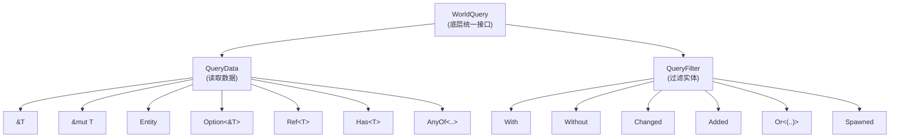

# 第 7 章：Query — 高效的数据查询引擎

> **导读**：上一章我们了解了 Archetype 如何组织实体和组件的映射关系。
> 本章进入 Query 系统——System 访问 ECS 数据的唯一窗口。我们将深入
> WorldQuery trait 体系、QueryState 的匹配缓存、Dense 与 Archetype 两种
> 迭代路径、FilteredAccess 冲突检测机制、ParamSet 互斥解法、QueryBuilder
> 运行时动态查询，以及 par_iter 并行迭代。

## 7.1 WorldQuery trait 体系

Query 的类型系统建立在三层 trait 之上：



*图 7-1: WorldQuery trait 层级*

### WorldQuery：底层统一接口

`WorldQuery` 是所有查询类型的基础 trait：

```rust
// 源码: crates/bevy_ecs/src/query/world_query.rs:44 (简化)
pub unsafe trait WorldQuery {
    type Fetch<'w>: Clone;
    type State: Send + Sync + Sized;

    const IS_DENSE: bool;

    fn shrink_fetch<'wlong: 'wshort, 'wshort>(
        fetch: Self::Fetch<'wlong>
    ) -> Self::Fetch<'wshort>;

    unsafe fn init_fetch<'w, 's>(
        world: UnsafeWorldCell<'w>,
        state: &'s Self::State,
        last_run: Tick, this_run: Tick,
    ) -> Self::Fetch<'w>;

    unsafe fn set_archetype<'w, 's>(
        fetch: &mut Self::Fetch<'w>,
        state: &'s Self::State,
        archetype: &'w Archetype,
        table: &'w Table,
    );

    unsafe fn set_table<'w, 's>(
        fetch: &mut Self::Fetch<'w>,
        state: &'s Self::State,
        table: &'w Table,
    );

    fn update_component_access(
        state: &Self::State,
        access: &mut FilteredAccess,
    );

    fn matches_component_set(
        state: &Self::State,
        set_contains_id: &dyn Fn(ComponentId) -> bool,
    ) -> bool;
}
```

关键设计点：

| 关联类型/常量 | 用途 |
|--------------|------|
| `Fetch<'w>` | 每次切换 Table/Archetype 时构造的临时状态 |
| `State` | 缓存在 QueryState 中的持久状态 |
| `IS_DENSE` | 编译期常量，决定迭代路径 |

> **Rust 设计亮点**：`Fetch<'w>` 使用了 GAT（Generic Associated Type），
> 让 Fetch 的生命周期绑定到 World 的借用周期。这避免了用 `PhantomData` 或
> unsafe 生命周期擦除——编译器直接保证 Fetch 不会比 World 的借用活得更久。

`IS_DENSE` 常量的设计体现了 Rust 零成本抽象的精髓。它是一个编译期常量，不是运行时变量——这意味着当编译器在 `QueryIter` 的迭代循环中看到 `if IS_DENSE { ... } else { ... }` 时，它可以在编译期就消除掉不走的分支，生成纯粹的 Dense 路径或纯粹的 Archetype 路径代码。运行时没有任何分支预测开销。如果将 `IS_DENSE` 改为运行时 bool，虽然功能等价，但每次迭代都需要一次分支判断——在紧密的内循环中，这个分支可能导致数个百分点的性能下降。`shrink_fetch` 方法的存在则是为了处理生命周期的协变性——它允许将一个长生命周期的 Fetch 安全地"缩短"为短生命周期，这在 Query 嵌套和 ParamSet（第 7.5 节）等场景中是必要的。

### QueryData：数据获取

`QueryData` 扩展 `WorldQuery`，增加了 `fetch` 方法用于实际读取数据：

```rust
// 源码: crates/bevy_ecs/src/query/fetch.rs:27 (概念)
pub unsafe trait QueryData: WorldQuery {
    type ReadOnly: ReadOnlyQueryData;
    type Item<'w>;

    unsafe fn fetch<'w>(
        fetch: &mut Self::Fetch<'w>,
        entity: Entity,
        table_row: TableRow,
    ) -> Self::Item<'w>;
}
```

常用的 `QueryData` 实现：

| 类型 | Item | 说明 |
|------|------|------|
| `&T` | `&T` | 不可变引用 |
| `&mut T` | `Mut<T>` | 可变引用（带变更检测） |
| `Entity` | `Entity` | 实体 ID |
| `Option<&T>` | `Option<&T>` | 可选组件 |
| `Ref<T>` | `Ref<T>` | 不可变引用 + 变更 tick |
| `Has<T>` | `bool` | 是否拥有组件 |
| `AnyOf<(A, B)>` | `(Option<A>, Option<B>)` | 至少有一个 |

### QueryFilter：过滤条件

`QueryFilter` 专注于筛选，不获取数据：

```rust
// 源码: crates/bevy_ecs/src/query/filter.rs:84 (简化)
pub unsafe trait QueryFilter: WorldQuery {
    const IS_ARCHETYPAL: bool;

    unsafe fn filter_fetch(
        state: &Self::State,
        fetch: &mut Self::Fetch<'_>,
        entity: Entity,
        table_row: TableRow,
    ) -> bool;
}
```

`IS_ARCHETYPAL` 区分两类过滤器：

| `IS_ARCHETYPAL` | 含义 | 例子 |
|:---:|------|------|
| `true` | 在 Archetype 级别过滤，无需逐行检查 | `With<T>`, `Without<T>` |
| `false` | 需要逐行检查数据 | `Changed<T>`, `Added<T>` |

Archetypal 过滤器的 `filter_fetch` 始终返回 true（因为不匹配的 Archetype
已被排除），而 `Changed<T>` 需要读取每行的 tick 来判断是否通过。

**要点**：WorldQuery = Fetch + State + IS_DENSE；QueryData 获取数据，QueryFilter 过滤实体。IS_ARCHETYPAL 决定是 Archetype 级还是逐行过滤。

## 7.2 QueryState：匹配与缓存

`QueryState<D, F>` 是 Query 的核心状态容器，缓存了匹配结果：

```rust
// 源码: crates/bevy_ecs/src/query/state.rs:79 (简化)
pub struct QueryState<D: QueryData, F: QueryFilter = ()> {
    world_id: WorldId,
    pub(crate) archetype_generation: ArchetypeGeneration,
    pub(crate) matched_tables: FixedBitSet,
    pub(crate) matched_archetypes: FixedBitSet,
    pub(crate) component_access: FilteredAccess,
    pub(super) matched_storage_ids: Vec<StorageId>,
    pub(super) is_dense: bool,
    pub(crate) fetch_state: D::State,
    pub(crate) filter_state: F::State,
}
```

关键字段解读：

```
  QueryState 缓存结构:

  ┌─────────────────────────────────────────────────┐
  │ archetype_generation: Gen(5)                    │ ← 上次扫描到的 generation
  │                                                 │
  │ matched_archetypes: [1, 0, 1, 1, 0, 1, ...]   │ ← 位集: 哪些 Archetype 匹配
  │ matched_tables:     [1, 0, 1, 0, 1, ...]       │ ← 位集: 哪些 Table 匹配
  │                                                 │
  │ matched_storage_ids: [Table(0), Table(2), ...]  │ ← Dense 路径: Table ID 列表
  │          — OR —      [Arch(1), Arch(3), ...]    │ ← Archetype 路径: Archetype ID
  │                                                 │
  │ is_dense: true/false                            │ ← 编译期确定的迭代策略
  │                                                 │
  │ component_access: FilteredAccess { ... }        │ ← 用于并行安全检测
  │ fetch_state: D::State                           │ ← QueryData 的缓存
  │ filter_state: F::State                          │ ← QueryFilter 的缓存
  └─────────────────────────────────────────────────┘
```

*图 7-2: QueryState 缓存结构*

### 增量更新机制

QueryState 不会每帧重新扫描所有 Archetype。它通过 `archetype_generation`
记录上次检查的位置，只处理新增的 Archetype：

```
  World 当前有 8 个 Archetype (Gen = 8)
  QueryState 上次扫描到 Gen = 5

  增量更新:
  archetypes[5..8]  ← 只检查这 3 个新 Archetype
  对每个新 Archetype:
    if matches_component_set(archetype):
      matched_archetypes.set(id)
      matched_tables.set(table_id)
      matched_storage_ids.push(storage_id)
  archetype_generation = 8  ← 更新到最新
```

*图 7-3: QueryState 增量更新流程*

### is_dense 的决定逻辑

`is_dense` 在 QueryState 初始化时确定，等于 `D::IS_DENSE && F::IS_DENSE`：

- `&T` 的 `IS_DENSE`：当 T 是 Table 存储时为 true
- `With<T>` 的 `IS_DENSE`：始终 true（Archetypal 过滤不依赖存储）
- `Changed<T>` 的 `IS_DENSE`：当 T 是 Table 存储时为 true
- 元组 `(A, B)` 的 `IS_DENSE`：`A::IS_DENSE && B::IS_DENSE`

只要 Query 中有任何一个元素需要 SparseSet 存储的数据，整个 Query 就退化为
Archetype 迭代路径。

```rust
// 源码: crates/bevy_ecs/src/query/state.rs:51 (概念)
// StorageId 是一个 union，根据 is_dense 解释为 TableId 或 ArchetypeId
pub(super) union StorageId {
    pub(super) table_id: TableId,
    pub(super) archetype_id: ArchetypeId,
}
```

> **Rust 设计亮点**：`StorageId` 用 `union` 而非 `enum`，省去了判别标签
> (discriminant) 的内存和分支开销。由于 `is_dense` 在编译期确定且对整个
> QueryState 统一，所有 StorageId 的类型一致，不需要逐元素判别。

**要点**：QueryState 通过 ArchetypeGeneration 增量更新，FixedBitSet 记录匹配结果，is_dense 在编译期决定迭代策略。

## 7.3 Dense vs Archetype 迭代路径

Query 迭代有两条路径，由 `is_dense` 在编译期选择：

```
  Dense 路径 (is_dense = true):           Archetype 路径 (is_dense = false):

  for table_id in matched_storage_ids:     for archetype_id in matched_storage_ids:
    table = tables[table_id]                 archetype = archetypes[archetype_id]
    set_table(fetch, table)                  table = tables[archetype.table_id]
    for row in 0..table.len():               set_archetype(fetch, archetype, table)
      item = fetch(entity, row)              for row in archetype.entities:
                                               item = fetch(entity, row)
```

*图 7-4: Dense vs Archetype 两种迭代路径*

### Dense 路径的优势

当所有查询的组件都存储在 Table 中时，Dense 路径直接遍历 Table 的行。
一张 Table 可能被多个 Archetype 共享（第 6 章），Dense 路径只需遍历
Table 一次，不需要按 Archetype 分组——直接线性扫描整个 Table。

缓存命中率高：同一 Column 中的数据在内存中连续排列。

让我们更精确地分析 Dense 路径的缓存行为。假设你查询 `Query<(&Position, &Velocity)>`，Position 为 `Vec3`（12 字节），Velocity 也为 `Vec3`（12 字节）。在一个 64 字节的 cache line 中，Position 列可以装 5 个元素，Velocity 列同样可以装 5 个。当 CPU 遍历 Table 的第一行时，加载 Position[0] 会将 Position[0..4] 拉入 L1 缓存；接着加载 Velocity[0] 会将 Velocity[0..4] 拉入缓存。后续 4 行的 Position 和 Velocity 访问全部命中 L1，零延迟。硬件预取器还会检测到这种连续的步长访问模式，提前将后续 cache line 从 L2 拉入 L1。这种访问模式下，内存带宽利用率接近理论极限。反观 Archetype 路径：当 Query 涉及 SparseSet 组件时，`set_archetype` 在每个 Archetype 切换时需要重新定位 SparseSet 的 dense 数组指针，这引入了额外的间接寻址。而且 SparseSet 的 dense 数组中的元素顺序与 Table 行顺序不一定一致——同一个 Archetype 中实体 E0 的 SparseSet 组件可能在 dense[5] 而 E1 的在 dense[2]——这破坏了线性扫描的预取优势。

### Archetype 路径

当 Query 涉及 SparseSet 组件时，必须用 Archetype 路径。因为 SparseSet
的数据不在 Table 中，需要通过 Archetype 确定每个实体的 SparseSet 查找路径。

Archetype 路径需要在每个 Archetype 切换时调用 `set_archetype`，它同时
设置 Table 指针和 SparseSet 查找结构。

### 性能差异

| 维度 | Dense 路径 | Archetype 路径 |
|------|-----------|---------------|
| 遍历粒度 | Table (coarser) | Archetype (finer) |
| 缓存友好度 | 极高 | 较高 |
| 函数调用 | `set_table` per table | `set_archetype` per archetype |
| 适用场景 | 纯 Table 组件 | 含 SparseSet 组件 |

**要点**：Dense 路径直接遍历 Table 行，缓存友好；Archetype 路径按 Archetype 分组遍历，支持 SparseSet 组件。编译期选择，零运行时分支。

## 7.4 FilteredAccess 与冲突检测

Bevy 的并行调度要求：两个 System 可以并行执行，当且仅当它们的数据访问不冲突。
`FilteredAccess` 和 `FilteredAccessSet` 是这个安全保障的核心。

### Access：读写追踪

```rust
// 源码: crates/bevy_ecs/src/query/access.rs:15 (简化)
pub struct Access {
    read_and_writes: ComponentIdSet,     // all accessed components
    writes: ComponentIdSet,               // exclusively accessed components
    read_and_writes_inverted: bool,       // true = "access all except these"
    writes_inverted: bool,
    archetypal: ComponentIdSet,           // With/Without filters
}
```

`Access` 用位集 (FixedBitSet) 追踪每个 ComponentId 的读写状态。
`inverted` 标志支持 `EntityRef`/`EntityMut` 这类"访问几乎所有组件"的查询。

### FilteredAccess：带过滤条件的访问

```rust
// 源码: crates/bevy_ecs/src/query/access.rs:720
pub struct FilteredAccess {
    pub(crate) access: Access,
    pub(crate) required: ComponentIdSet,
    pub(crate) filter_sets: Vec<AccessFilters>,  // DNF form
}
```

`filter_sets` 以析取范式 (DNF) 表示过滤条件。例如 `(With<A>, Or<(With<B>, Without<C>)>)`
展开为 `Or<((With<A>, With<B>), (With<A>, Without<C>))>`。

### 冲突检测矩阵

两个系统是否冲突，取决于它们是否可能同时访问同一组件的可变引用。

考虑以下四个系统：

```
  System A: Query<&Pos>                    — 读 Pos
  System B: Query<&mut Vel>                — 写 Vel
  System C: Query<&mut Pos, With<Enemy>>   — 写 Pos (仅 Enemy)
  System D: Query<&mut Pos, With<Player>>  — 写 Pos (仅 Player)
```

冲突矩阵：

```
         A        B        C        D
  A      -       OK ✓    冲突 ✗   冲突 ✗
  B     OK ✓     -       OK ✓    OK ✓
  C    冲突 ✗   OK ✓     -       OK ✓ *
  D    冲突 ✗   OK ✓    OK ✓ *    -
```

*图 7-5: 四系统并行安全冲突矩阵*

标注 `*` 的 C-D 对：虽然都写 Pos，但 `With<Enemy>` 和 `With<Player>` 的
过滤条件使它们的 Archetype 集合不相交。FilteredAccess 通过比较 filter_sets
检测这种"条件互斥"。

### 冲突检测算法

`FilteredAccessSet` 收集一个系统的所有 FilteredAccess，然后用
`is_compatible` 方法检查两个系统是否可以并行：

```rust
// 源码: crates/bevy_ecs/src/query/access.rs:1100
pub struct FilteredAccessSet {
    combined_access: Access,              // union of all accesses
    filtered_accesses: Vec<FilteredAccess>,
}
```

`combined_access` 是所有 FilteredAccess 的合并，用于快速检测"肯定不冲突"。
只有当 combined_access 级别发现潜在冲突时，才深入检查 filter_sets 的互斥性。

FilteredAccess 的位集（bitset）设计值得深入理解。每个 ComponentId 在位集中占一位，读写检查归结为两个位集的交集运算——这在硬件层面是一条 AND 指令加一条比较指令。64 位机器上，一次操作可以同时检查 64 个组件的冲突性。对于拥有数百个组件类型的大型游戏，位集可能扩展到多个 64 位字（FixedBitSet 内部是 `Vec<u64>`），但交集检查仍然是 O(k/64) 的，k 为组件类型总数。这比朴素的"遍历两个集合找交集"的 O(n*m) 方案快几个数量级。DNF 形式的 filter_sets 支持一种关键的优化：如果两个 System 都写 Position，但一个带 `With<Player>`、另一个带 `With<Enemy>`，它们的 filter_sets 包含互斥的 archetypal 条件——同一个 Archetype 不可能同时包含 Player 和 Enemy（假设它们是不同的标记组件）。FilteredAccess 通过比较 filter_sets 中的 `with` 和 `without` 集合来检测这种互斥性：如果 System A 的某个 filter 要求 With<X>，而 System B 的所有 filter 都要求 Without<X>，则它们不可能访问同一个 Archetype 中的实体，因此是安全的。这种精确的冲突检测使得 Bevy 的自动并行度远高于保守的"只要写同一类型就串行"的方案。

> **Rust 设计亮点**：Bevy 将 Rust 的借用规则（共享读 OR 独占写）映射到

> **Rust 设计亮点**：Bevy 将 Rust 的借用规则（共享读 OR 独占写）映射到
> 运行时的组件访问检测。编译器确保单个 Query 内部安全，FilteredAccess
> 确保跨 System 安全。两层安全网，零运行时开销（冲突在系统初始化时检测，
> 不在每帧运行时检查）。

**要点**：FilteredAccess 用位集追踪读写，DNF 过滤条件支持条件互斥检测。冲突在系统初始化时检测，运行时零开销。

## 7.5 ParamSet：互斥参数组

当两个 Query 确实会冲突时（例如同一 System 中需要 `Query<&mut Pos>` 和
`Query<&Pos, With<Enemy>>`），Bevy 提供 `ParamSet` 作为解决方案：

```rust
fn system(mut set: ParamSet<(
    Query<&mut Pos>,           // p0
    Query<&Pos, With<Enemy>>,  // p1
)>) {
    // Only one can be active at a time
    for pos in &mut set.p0() {
        // ...
    }
    // p0 dropped, now safe to use p1
    for pos in &set.p1() {
        // ...
    }
}
```

```rust
// 源码: crates/bevy_ecs/src/system/system_param.rs:552
pub struct ParamSet<'w, 's, T: SystemParam> {
    param_states: &'s mut T::State,
    world: UnsafeWorldCell<'w>,
    system_meta: SystemMeta,
    change_tick: Tick,
}
```

ParamSet 的安全保障：

1. **编译期**：`p0()` 返回的借用必须在调用 `p1()` 前结束
2. **初始化期**：ParamSet 向调度器注册所有内部参数的合并访问
3. **运行时**：每次只有一个参数被激活，不存在同时访问

**要点**：ParamSet 将互斥的 Query 打包在一起，通过 Rust 借用规则保证同一时刻只有一个 Query 被访问。

## 7.6 QueryBuilder：运行时动态查询

大多数 Query 在编译期确定，但有时需要在运行时构造查询——例如编辑器、调试工具
或数据驱动的 ECS 逻辑。`QueryBuilder` 提供这种能力：

```rust
// 源码: crates/bevy_ecs/src/query/builder.rs:38 (简化)
pub struct QueryBuilder<'w, D: QueryData = (), F: QueryFilter = ()> {
    access: FilteredAccess,
    world: &'w mut World,
    or: bool,
    first: bool,
    _marker: PhantomData<(D, F)>,
}
```

使用示例：

```rust
let mut query = QueryBuilder::<(Entity, &B)>::new(&mut world)
    .with::<A>()
    .without::<C>()
    .build();

let (entity, b) = query.single(&world).unwrap();
```

QueryBuilder 在编译期确定 QueryData 类型（`(Entity, &B)`），但过滤条件
（`with`/`without`）在运行时动态添加。最终 `build()` 生成一个标准的
`QueryState`，后续迭代与静态 Query 完全相同。

**要点**：QueryBuilder 支持运行时动态添加过滤条件，build 后生成标准 QueryState，迭代性能无损。

## 7.7 par_iter：并行迭代与批次分割

对于大量实体的迭代，`par_iter` 利用多核并行加速：

```rust
// 源码: crates/bevy_ecs/src/query/par_iter.rs:16 (简化)
pub struct QueryParIter<'w, 's, D: IterQueryData, F: QueryFilter> {
    pub(crate) world: UnsafeWorldCell<'w>,
    pub(crate) state: &'s QueryState<D, F>,
    pub(crate) last_run: Tick,
    pub(crate) this_run: Tick,
    pub(crate) batching_strategy: BatchingStrategy,
}
```

### 批次分割策略

`BatchingStrategy` 控制如何将工作分配给线程：

```
  假设 3 个匹配的 Table，分别有 100, 50, 200 个实体
  BatchingStrategy: min_batch_size = 64

  Table 0 (100 entities):
    Batch 0: rows [0..64)    → Thread A
    Batch 1: rows [64..100)  → Thread B

  Table 1 (50 entities):
    Batch 2: rows [0..50)    → Thread C  (不再分割, < 64)

  Table 2 (200 entities):
    Batch 3: rows [0..64)    → Thread A
    Batch 4: rows [64..128)  → Thread B
    Batch 5: rows [128..192) → Thread C
    Batch 6: rows [192..200) → Thread A
```

*图 7-6: par_iter 批次分割示意*

使用方式：

```rust
fn physics_system(query: Query<(&mut Pos, &Vel)>) {
    query.par_iter_mut().for_each(|(mut pos, vel)| {
        pos.0 += vel.0;
    });
}
```

`par_iter` 在 Table 内部分批，每个批次独立交给线程池。由于 Table 的列式存储
保证了同一批次内的数据连续，每个线程的缓存命中率依然很高。

### for_each_init：线程本地状态

`for_each_init` 支持每个线程维护独立的本地状态：

```rust
query.par_iter().for_each_init(
    || queue.borrow_local_mut(),
    |local_queue, item| {
        **local_queue += 1;
    },
);
```

`init` 闭包在每个任务（不是每个线程）调用，返回的状态在任务内复用。

**要点**：par_iter 按 Table 分批交给线程池，BatchingStrategy 控制批次大小，for_each_init 支持线程本地状态。

## 本章小结

本章我们深入了 Bevy 的 Query 引擎：

1. **WorldQuery** trait 体系分为 QueryData（获取数据）和 QueryFilter（过滤实体）
2. **QueryState** 通过 ArchetypeGeneration 增量缓存匹配结果，FixedBitSet 记录匹配的 Table/Archetype
3. **is_dense** 在编译期决定 Dense（直接遍历 Table）或 Archetype（按 Archetype 分组）迭代路径
4. **FilteredAccess** 用位集追踪读写，DNF 过滤条件支持条件互斥，冲突在初始化时检测
5. **ParamSet** 解决同系统内的 Query 冲突，通过 Rust 借用规则保证互斥访问
6. **QueryBuilder** 支持运行时动态构造查询，build 后与静态 Query 等效
7. **par_iter** 按 Table 分批并行迭代，BatchingStrategy 控制批次粒度

下一章，我们将揭示 Bevy 最核心的 Rust 魔法：普通函数如何自动变成 System。System trait、FunctionSystem 转换链、SystemParam 的 GAT 设计，以及 all_tuples! 宏的批量实现生成。
