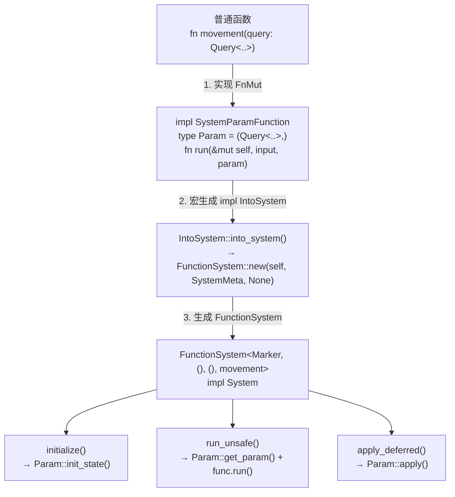
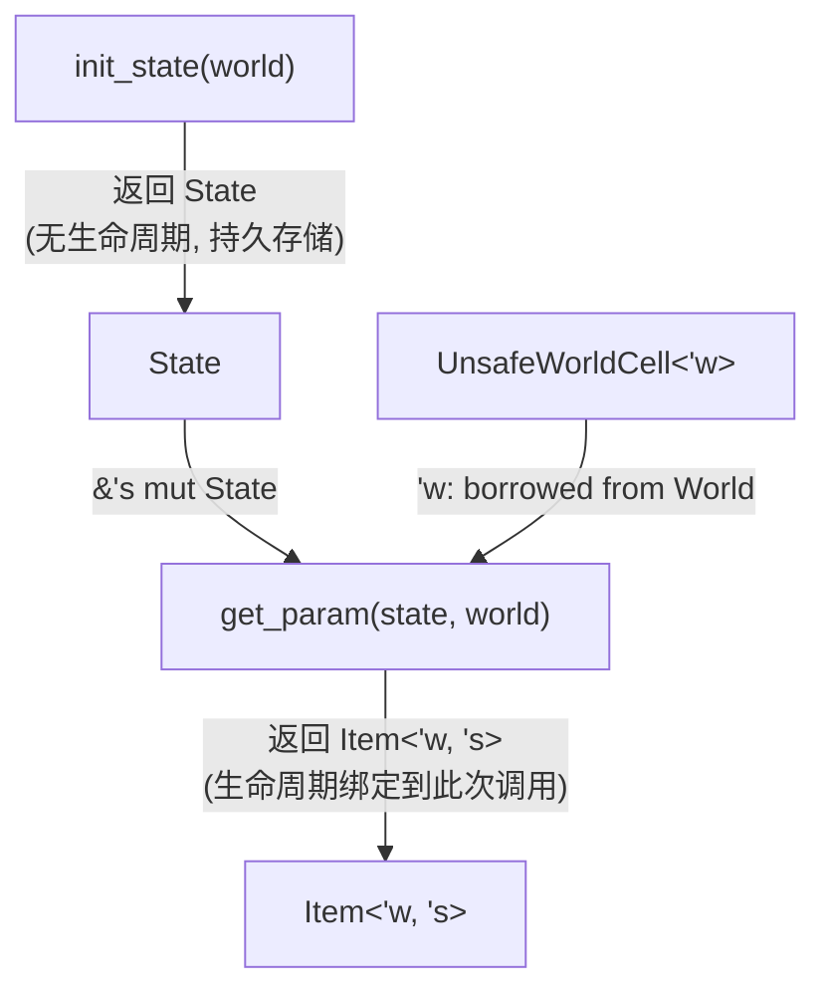
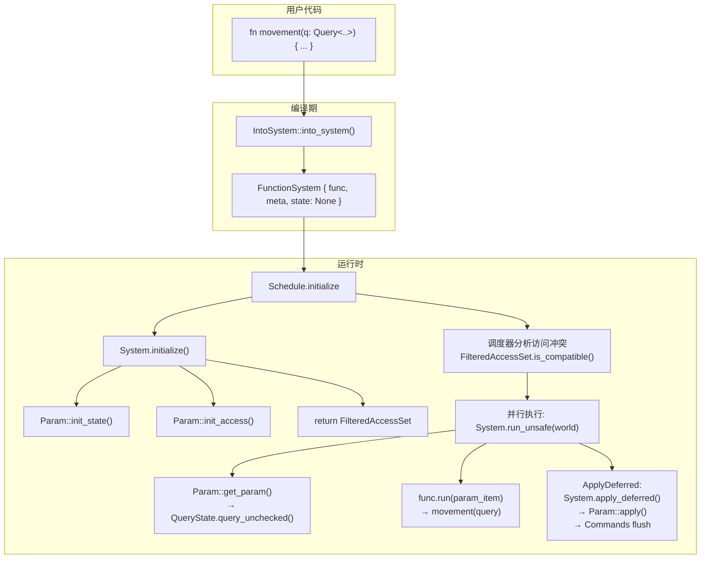

# 第 8 章：System — 函数即系统的魔法

> **导读**：前两章我们理解了数据如何存储（Table/SparseSet）和如何查询（Query）。
> 本章揭示 Bevy 最核心的 Rust 魔法：一个普通的 Rust 函数，如何自动变成
> 可被调度器识别、并行执行、访问安全检查的 System。我们将深入 System trait、
> FunctionSystem 编译期转换链、SystemParam 的 GAT 设计、all_tuples! 宏的
> 批量实现生成，以及全部 SystemParam 类型一览。

## 8.1 System trait：统一接口

所有 System 都实现了 `System` trait，它是调度器操作系统的唯一接口：

```rust
// 源码: crates/bevy_ecs/src/system/system.rs:48 (简化)
pub trait System: Send + Sync + 'static {
    type In: SystemInput;
    type Out;

    fn name(&self) -> DebugName;
    fn flags(&self) -> SystemStateFlags;

    unsafe fn run_unsafe(
        &mut self,
        input: SystemIn<'_, Self>,
        world: UnsafeWorldCell,
    ) -> Result<Self::Out, RunSystemError>;

    fn run(
        &mut self,
        input: SystemIn<'_, Self>,
        world: &mut World,
    ) -> Result<Self::Out, RunSystemError>;

    fn apply_deferred(&mut self, world: &mut World);
    fn initialize(&mut self, world: &mut World) -> FilteredAccessSet;
    fn check_change_tick(&mut self, check: CheckChangeTicks);
    fn get_last_run(&self) -> Tick;
    fn set_last_run(&mut self, last_run: Tick);
}
```

核心方法的职责：

| 方法 | 调用时机 | 职责 |
|------|---------|------|
| `initialize` | 系统首次加入 Schedule | 初始化参数状态，返回访问声明 |
| `run_unsafe` | 调度器并行执行 | 接收 UnsafeWorldCell，不应用 deferred |
| `run` | 独占执行 | 接收 &mut World，自动 apply deferred |
| `apply_deferred` | run 后或 ApplyDeferred 节点 | 刷新 Commands 等延迟操作 |
| `flags` | 调度分析 | 返回 EXCLUSIVE / NON_SEND / DEFERRED 标志 |

### SystemMeta：系统元数据

```rust
// 源码: crates/bevy_ecs/src/system/function_system.rs:33 (简化)
pub struct SystemMeta {
    pub(crate) name: DebugName,
    flags: SystemStateFlags,
    pub(crate) last_run: Tick,
    // tracing spans (feature-gated)
}
```

`SystemStateFlags` 是位标志：

```rust
// 源码: crates/bevy_ecs/src/system/system.rs:24
bitflags! {
    pub struct SystemStateFlags: u8 {
        const NON_SEND  = 1 << 0;  // cannot be sent to other threads
        const EXCLUSIVE = 1 << 1;  // requires exclusive World access
        const DEFERRED  = 1 << 2;  // has deferred buffers (Commands)
    }
}
```

`NON_SEND` 系统只能在主线程运行，`EXCLUSIVE` 系统独占 World，`DEFERRED` 系统
有延迟缓冲区需要在某个同步点刷新。

System trait 的设计体现了一个重要的架构决策：`run_unsafe` 和 `run` 的分离。`run_unsafe` 接收 `UnsafeWorldCell`，不自动 apply deferred——这是调度器并行执行时使用的路径，多个 System 同时通过各自的 `UnsafeWorldCell` 访问 World 的不同部分。`run` 接收 `&mut World`，会在执行后自动 apply deferred——这是独占执行或测试时使用的安全路径。为什么不只提供 `run`？因为并行执行时 World 被 `UnsafeWorldCell` 包装，没有人持有 `&mut World`，无法调用 `run`。为什么不只提供 `run_unsafe`？因为独占系统和测试场景需要一个安全的入口点，且 apply_deferred 的时机需要由调用者控制——在并行执行中，deferred 操作在所有并行 System 完成后统一 apply（在 `ApplyDeferred` 同步点），而非每个 System 执行后立即 apply。这种"延迟应用"的设计使得 Commands 等结构性变更不会打断并行执行的流水线。

**要点**：System trait 是调度器的统一接口，initialize 声明访问，run_unsafe 支持并行，apply_deferred 刷新延迟操作。

## 8.2 FunctionSystem：编译期转换链

Bevy 的魔法核心：一个普通函数如何变成 `System`？

```rust
fn movement(query: Query<(&mut Pos, &Vel)>) {
    for (mut pos, vel) in &query {
        pos.0 += vel.0;
    }
}

// This "just works":
app.add_systems(Update, movement);
```

转换链如下：



*图 8-1: 函数到 System 的完整转换链*

### FunctionSystem 结构

```rust
// 源码: crates/bevy_ecs/src/system/function_system.rs:503
pub struct FunctionSystem<Marker, In, Out, F>
where
    F: SystemParamFunction<Marker>,
{
    func: F,                                    // the original function
    state: Option<FunctionSystemState<F::Param>>, // initialized after first run
    system_meta: SystemMeta,
    marker: PhantomData<fn(In) -> (Marker, Out)>,
}
```

`FunctionSystemState` 包含参数的缓存状态和 World ID：

```rust
// 源码: crates/bevy_ecs/src/system/function_system.rs:519
struct FunctionSystemState<P: SystemParam> {
    param: P::State,     // cached parameter state
    world_id: WorldId,   // safety check: must match the running World
}
```

### Marker 泛型的作用

`Marker` 是一个幽灵类型参数。不同参数签名的函数生成不同的 `Marker`，
避免 trait 实现冲突。例如：

```rust
// 零参数系统
fn sys_a() {}           // Marker = fn() -> ()

// 一参数系统
fn sys_b(q: Query<&Pos>) {} // Marker = fn(Query<&Pos>) -> ()
```

`Marker = fn($($Param),*) -> Out`，每种参数签名都是不同的类型，所以
可以为同一个函数类型实现多个 `SystemParamFunction`。

```rust
// 源码: crates/bevy_ecs/src/system/function_system.rs:576
impl<Marker, In, Out, F> IntoSystem<In, Out, (IsFunctionSystem, Marker)> for F
where
    Marker: 'static,
    In: SystemInput + 'static,
    Out: 'static,
    F: SystemParamFunction<Marker, In: FromInput<In>, Out: IntoResult<Out>>,
{
    type System = FunctionSystem<Marker, In, Out, F>;
    fn into_system(func: Self) -> Self::System {
        FunctionSystem::new(func, SystemMeta::new::<F>(), None)
    }
}
```

> **Rust 设计亮点**：`Marker` 类型参数将函数签名编码到类型系统中，让
> 编译器为每种参数组合生成独立的 `IntoSystem` 实现。这是 Rust 的
> "零成本抽象"在 ECS 中的极致应用——运行时不存储任何 Marker，它只活在编译期。

Marker 泛型的设计解决了 Rust trait 系统的一个根本限制：同一个类型不能有两个相同 trait 的实现。如果没有 Marker，`impl IntoSystem for fn()` 和 `impl IntoSystem for fn(Query<..>)` 会被 Rust 视为同一个 trait 的两个 blanket impl，产生冲突。Marker 将函数签名编码为不同的类型（`fn() -> ()` vs `fn(Query<..>) -> ()`），使编译器将它们视为不同的 impl。这个技巧在 Rust 生态中被称为"marker pattern"或"tag dispatch"，但 Bevy 对它的使用深度远超一般场景——每种参数数量和类型组合都会生成一个独立的 Marker 类型，由 `all_tuples!` 宏自动完成。

**要点**：IntoSystem 通过 Marker 泛型消除歧义，将 fn(Param...) 转换为 FunctionSystem，整个过程在编译期完成。

## 8.3 SystemParam trait：GAT 的精妙运用

`SystemParam` 是 System 参数的统一 trait，每种可以出现在系统签名中的类型
都必须实现它：

```rust
// 源码: crates/bevy_ecs/src/system/system_param.rs:217 (简化)
pub unsafe trait SystemParam: Sized {
    type State: Send + Sync + 'static;
    type Item<'world, 'state>: SystemParam<State = Self::State>;

    fn init_state(world: &mut World) -> Self::State;

    fn init_access(
        state: &Self::State,
        system_meta: &mut SystemMeta,
        component_access_set: &mut FilteredAccessSet,
        world: &mut World,
    );

    fn apply(state: &mut Self::State, system_meta: &SystemMeta, world: &mut World) {}

    unsafe fn get_param<'world, 'state>(
        state: &'state mut Self::State,
        system_meta: &SystemMeta,
        world: UnsafeWorldCell<'world>,
        change_tick: Tick,
    ) -> Result<Self::Item<'world, 'state>, SystemParamValidationError>;
}
```

### GAT 的设计意图

`Item<'world, 'state>` 是 GAT (Generic Associated Type)：关联类型带有
生命周期参数。这解决了一个核心问题——参数的生命周期在获取时才确定：



*图 8-2: SystemParam 的生命周期流*

没有 GAT，`Item` 的生命周期必须在 trait 定义时固定——但它应该在
`get_param` 调用时才绑定。GAT 让 `Item<'world, 'state>` 推迟到使用点
才确定具体的生命周期。

如果没有 GAT 会怎样？在 GAT 稳定之前（Rust 1.65 之前），Bevy 不得不用一种笨拙的 workaround：将 `Item` 定义为一个不带生命周期的类型，然后在 `get_param` 内部用 `transmute` 将生命周期"擦除"后传出。这种做法依赖于开发者手动保证 transmute 的正确性——任何生命周期标注错误都会导致未定义行为，而编译器完全无法检测。另一种 pre-GAT 方案是用 HRTB（Higher-Ranked Trait Bounds）——`for<'w, 's> SystemParam<Item<'w, 's> = ...>`——但 HRTB 在当时的 rustc 中有严重的类型推断问题，会导致晦涩难解的编译错误。GAT 的稳定让 Bevy 从根本上解决了这个问题：`Item<'world, 'state>` 是一个合法的关联类型，编译器完整地追踪其生命周期，任何生命周期违规都会在编译期被捕获。这也是为什么 Bevy 的最低支持 Rust 版本始终跟随 GAT 的稳定版本——这个特性对 ECS 框架的安全性至关重要。

### 具体实现示例：Query

```rust
// 源码: crates/bevy_ecs/src/system/system_param.rs:303 (简化)
unsafe impl<D: QueryData + 'static, F: QueryFilter + 'static>
    SystemParam for Query<'_, '_, D, F>
{
    type State = QueryState<D, F>;
    type Item<'w, 's> = Query<'w, 's, D, F>;

    fn init_state(world: &mut World) -> Self::State {
        unsafe { QueryState::new_unchecked(world) }
    }

    fn init_access(
        state: &Self::State,
        system_meta: &mut SystemMeta,
        component_access_set: &mut FilteredAccessSet,
        world: &mut World,
    ) {
        state.init_access(
            Some(system_meta.name()),
            component_access_set,
            world.into(),
        );
    }

    unsafe fn get_param<'w, 's>(
        state: &'s mut Self::State,
        system_meta: &SystemMeta,
        world: UnsafeWorldCell<'w>,
        change_tick: Tick,
    ) -> Result<Self::Item<'w, 's>, SystemParamValidationError> {
        Ok(unsafe {
            state.query_unchecked_with_ticks(
                world, system_meta.last_run, change_tick
            )
        })
    }
}
```

`State = QueryState`——持久缓存，跨帧复用。
`Item<'w, 's> = Query<'w, 's, D, F>`——每次 get_param 返回一个带生命周期的 Query。

> **Rust 设计亮点**：GAT `Item<'world, 'state>` 让 SystemParam 同时拥有
> 持久状态（State，无生命周期）和临时借用（Item，带生命周期）。这是 Rust 类型
> 系统表达"初始化一次、每帧获取"模式的优雅方案。在 GAT 稳定之前，Bevy
> 不得不用 unsafe 绕过这个限制。

**要点**：SystemParam 用 GAT Item<'w, 's> 将持久 State 与临时借用 Item 分离，init_state 初始化一次，get_param 每帧获取。

## 8.4 all_tuples! 宏：0 到 16 的批量实现

一个系统可以有 0 到 16 个参数。Bevy 使用 `all_tuples!` 宏为每种参数数量
生成 trait 实现：

```rust
// 源码: crates/bevy_ecs/src/system/function_system.rs:950
all_tuples!(impl_system_function, 0, 16, F);
```

这一行展开为 17 个 impl 块（0 到 16 个参数）。以 `impl_system_function`
为例，展开过程：

```rust
// all_tuples!(impl_system_function, 0, 16, F) 展开:

// 0 params
impl<Out, Func> SystemParamFunction<fn() -> Out> for Func
where
    Func: Send + Sync + 'static,
    for<'a> &'a mut Func: FnMut() -> Out,
    Out: 'static,
{
    type In = ();
    type Out = Out;
    type Param = ();
    fn run(&mut self, _input: (), _param: ()) -> Out {
        fn call_inner<Out>(mut f: impl FnMut() -> Out) -> Out { f() }
        call_inner(&mut *self)
    }
}

// 1 param
impl<Out, Func, F0: SystemParam> SystemParamFunction<fn(F0) -> Out> for Func
where
    Func: Send + Sync + 'static,
    for<'a> &'a mut Func:
        FnMut(F0) -> Out +
        FnMut(SystemParamItem<F0>) -> Out,
    Out: 'static,
{
    type In = ();
    type Out = Out;
    type Param = (F0,);
    fn run(&mut self, _input: (), param: SystemParamItem<(F0,)>) -> Out {
        fn call_inner<Out, F0>(mut f: impl FnMut(F0) -> Out, f0: F0) -> Out {
            f(f0)
        }
        let (f0,) = param;
        call_inner(&mut *self, f0)
    }
}

// 2 params
impl<Out, Func, F0: SystemParam, F1: SystemParam>
    SystemParamFunction<fn(F0, F1) -> Out> for Func
where ...
{
    type Param = (F0, F1);
    // ...
}

// ... up to 16 params
```

*图 8-3: all_tuples! 宏展开过程 (0, 1, 2 参数)*

### call_inner 的必要性

注意展开代码中的 `call_inner` 辅助函数。这不是多余的——直接调用
`(&mut *self)(f0)` 会让 `rustc` 无法正确推断类型。`call_inner` 通过
一个独立的泛型函数边界帮助编译器完成推断。

### 16 参数限制

16 是一个实用上界。每增加一个参数，编译器需要生成的代码量翻倍
（每种参数组合都是独立的 monomorphization）。16 已经足以覆盖几乎所有
实际场景。

`all_tuples!` 宏的编译期成本值得认真对待。这个宏为 0 到 16 个参数各生成一套完整的 trait 实现，仅 `SystemParamFunction` 一个 trait 就产生 17 个 impl 块。但更大的开销来自单态化（monomorphization）：当你写一个 `fn my_system(q1: Query<..>, q2: Query<..>, res: Res<..>)` 时，编译器需要为这个特定的 3 参数组合实例化一套完整的 `FunctionSystem`、`SystemParam::get_param`、`SystemParam::init_state` 等方法。一个中等规模的 Bevy 项目可能有 200-500 个 System，每个都有不同的参数组合——这意味着编译器要生成数百份独立的系统初始化和执行代码。这是 Bevy 项目编译时间较长的主要技术原因之一。Bevy 团队曾考虑过将上限从 16 降低到 12 以减少编译时间，但实际测量表明，大部分编译时间来自用户代码的单态化而非宏展开本身——未使用的参数数量（比如你从不写 14 参数的系统）不会产生额外的编译开销，因为未被实例化的泛型不会被 codegen。因此 16 参数上限的编译成本是"按需付费"的。

当参数超过 16 时，可以用嵌套元组绕过：

```rust
// 17 params — won't compile directly
// fn sys(a: A, b: B, ..., q: Q) {}

// Solution: pack into tuple
fn sys(
    (a, b, c, d): (A, B, C, D),
    (e, f, g, h): (E, F, G, H),
    (i, j, k, l): (I, J, K, L),
    (m, n, o, p, q): (M, N, O, P, Q),
) {
    // 17 params work!
}
```

因为 `(A, B, C, D)` 本身实现了 `SystemParam`（通过 all_tuples! 为元组
生成的实现），它在 16 参数限制中只算一个参数。

**要点**：all_tuples! 为 0-16 参数批量生成 trait 实现。超过 16 参数时用嵌套元组打包。

## 8.5 SystemParam 类型一览

Bevy 提供了丰富的 SystemParam 类型，覆盖几乎所有数据访问模式：

| SystemParam | 读/写 | 说明 |
|-------------|:-----:|------|
| `Query<D, F>` | R/W | 按组件过滤和迭代实体 |
| `Single<D, F>` | R/W | 恰好匹配一个实体的 Query |
| `Populated<D, F>` | R/W | 至少匹配一个实体的 Query |
| `Res<T>` | R | 不可变资源引用 |
| `ResMut<T>` | W | 可变资源引用（带变更检测） |
| `Commands` | W (deferred) | 延迟写入命令队列 |
| `Local<T>` | R/W | 系统本地状态，每个系统实例独立 |
| `NonSend<T>` | R | 非 Send 资源（主线程only） |
| `NonSendMut<T>` | W | 非 Send 资源的可变引用 |
| `MessageReader<T>` | R | 读取消息队列 |
| `MessageWriter<T>` | W | 写入消息队列 |
| `ParamSet<(P0, P1, ..)>` | R/W | 互斥参数组 |
| `Deferred<T>` | W | 延迟应用的缓冲区 |
| `&World` | R | 只读 World 引用（独占调度） |
| `Option<Res<T>>` | R | 可选资源（不存在时跳过） |
| `Option<ResMut<T>>` | W | 可选可变资源 |
| `Entity` (in Query) | R | 实体 ID |
| `PhantomData<T>` | - | 零开销占位符 |
| `FilteredResources` | R | 运行时动态资源访问 |
| `FilteredResourcesMut` | W | 运行时动态可变资源访问 |
| `EntityAllocator` | W | 实体 ID 分配器 |

*图 8-4: SystemParam 类型一览表*

### 每个参数的生命周期

对应表格，参数签名中的生命周期标注规则：

```rust
#[derive(SystemParam)]
struct MyParams<'w, 's> {
    query: Query<'w, 's, &'static Pos>,  // 'w = World, 's = State
    res: Res<'w, GameConfig>,             // 'w = World
    local: Local<'s, u32>,                // 's = State
    commands: Commands<'w, 's>,           // both
}
```

- `'w`：从 World 借用的数据生命周期
- `'s`：从 SystemParam::State 借用的数据生命周期

**要点**：Bevy 提供 20+ 种 SystemParam，覆盖查询、资源、命令、消息、本地状态等所有数据访问模式。

## 8.6 ExclusiveSystem：独占 World 的系统

有些操作需要独占的 `&mut World` 访问——比如结构性变更、flush commands、
或访问非 Send 资源。`ExclusiveFunctionSystem` 处理这类情况：

```rust
// 源码: crates/bevy_ecs/src/system/exclusive_function_system.rs:26 (简化)
pub struct ExclusiveFunctionSystem<Marker, Out, F>
where
    F: ExclusiveSystemParamFunction<Marker>,
{
    func: F,
    param_state: Option<F::Param::State>,
    system_meta: SystemMeta,
    marker: PhantomData<fn() -> (Marker, Out)>,
}
```

ExclusiveSystem 的第一个参数是 `&mut World`，后续参数是
`ExclusiveSystemParam`：

```rust
fn exclusive_system(
    world: &mut World,
    // ExclusiveSystemParam types go here
) {
    // Full World access
    world.spawn((Pos(0.0), Vel(1.0)));
}
```

调度器将 ExclusiveSystem 安排在同步点运行——不与任何其他系统并行。
`SystemStateFlags::EXCLUSIVE` 标志告诉调度器做此安排。

> **Rust 设计亮点**：ExclusiveSystem 和 FunctionSystem 共享同一个
> `System` trait 接口，调度器不需要区分它们。差别体现在 `flags()` 的
> `EXCLUSIVE` 位——这是一个"类型信息到运行时标志"的优雅桥接。

**要点**：ExclusiveSystem 以 &mut World 为第一参数，独占执行，不与其他系统并行。

## 8.7 System Combinator：组合系统

Bevy 提供了系统组合器，将两个系统的输出合并：

```rust
// 源码: crates/bevy_ecs/src/system/combinator.rs:93 (简化)
pub trait Combine<A: System, B: System> {
    type In: SystemInput;
    type Out;

    fn combine<T>(
        input: <Self::In as SystemInput>::Inner<'_>,
        data: &mut T,
        a: impl FnOnce(SystemIn<'_, A>, &mut T) -> Result<A::Out, RunSystemError>,
        b: impl FnOnce(SystemIn<'_, B>, &mut T) -> Result<B::Out, RunSystemError>,
    ) -> Result<Self::Out, RunSystemError>;
}

pub struct CombinatorSystem<Func, A, B> {
    _marker: PhantomData<fn() -> Func>,
    a: A,
    b: B,
    name: DebugName,
}
```

### pipe：管道组合

`pipe` 将一个系统的输出作为另一个系统的输入：

```rust
app.add_systems(Update, system_a.pipe(system_b));
// system_a 的返回值成为 system_b 的 In 参数
```

### 条件组合

`CombinatorSystem` 更常用于 run conditions 的布尔组合：

```rust
// XOR combinator example
pub type Xor<A, B> = CombinatorSystem<XorMarker, A, B>;

impl<A, B> Combine<A, B> for XorMarker
where
    A: System<In = (), Out = bool>,
    B: System<In = (), Out = bool>,
{
    type In = ();
    type Out = bool;

    fn combine<T>(
        _input: (),
        data: &mut T,
        a: impl FnOnce((), &mut T) -> Result<bool, RunSystemError>,
        b: impl FnOnce((), &mut T) -> Result<bool, RunSystemError>,
    ) -> Result<bool, RunSystemError> {
        Ok(a((), data).unwrap_or(false) ^ b((), data).unwrap_or(false))
    }
}
```

`CombinatorSystem` 实现了 `System` trait，所以它可以像普通系统一样被调度。
两个子系统的访问声明合并后传给调度器，确保并行安全。

**要点**：CombinatorSystem 通过 Combine trait 组合两个系统的输入输出，pipe 是最常用的管道组合。

## 8.8 从函数到调度：完整数据流

最后，让我们用一张图串联从用户函数到调度执行的完整流程：



*图 8-5: 函数到调度的完整数据流*

**要点**：编译期将函数转为 FunctionSystem，运行时 initialize 声明访问，调度器检测冲突后并行执行 run_unsafe，最后在同步点 apply_deferred。

## 本章小结

本章我们揭示了 Bevy 将函数变成 System 的完整魔法：

1. **System trait** 是调度器的统一接口，核心方法：initialize、run_unsafe、apply_deferred
2. **FunctionSystem** 通过 IntoSystem + Marker 泛型，在编译期将普通函数转为 System
3. **SystemParam** 用 GAT `Item<'w, 's>` 分离持久 State 和临时借用 Item
4. **all_tuples!** 宏为 0-16 参数批量生成 trait 实现，超限用嵌套元组打包
5. **20+ 种 SystemParam** 覆盖查询、资源、命令、消息、本地状态等全部访问模式
6. **ExclusiveSystem** 以 &mut World 独占执行，不参与并行
7. **CombinatorSystem** 通过 Combine trait 组合系统的输入输出

至此，ECS 的核心三件套——Component/Storage、Archetype/Query、System/Param——已经完整呈现。下一章，我们将进入调度器（Schedule），看这些 System 如何被组织成有序的执行图。
