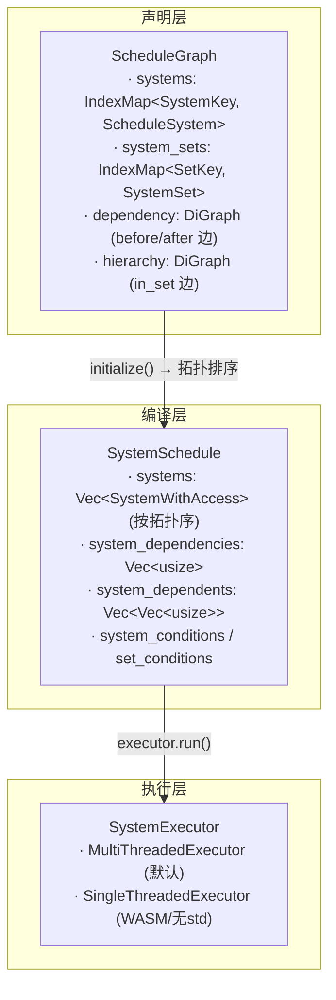
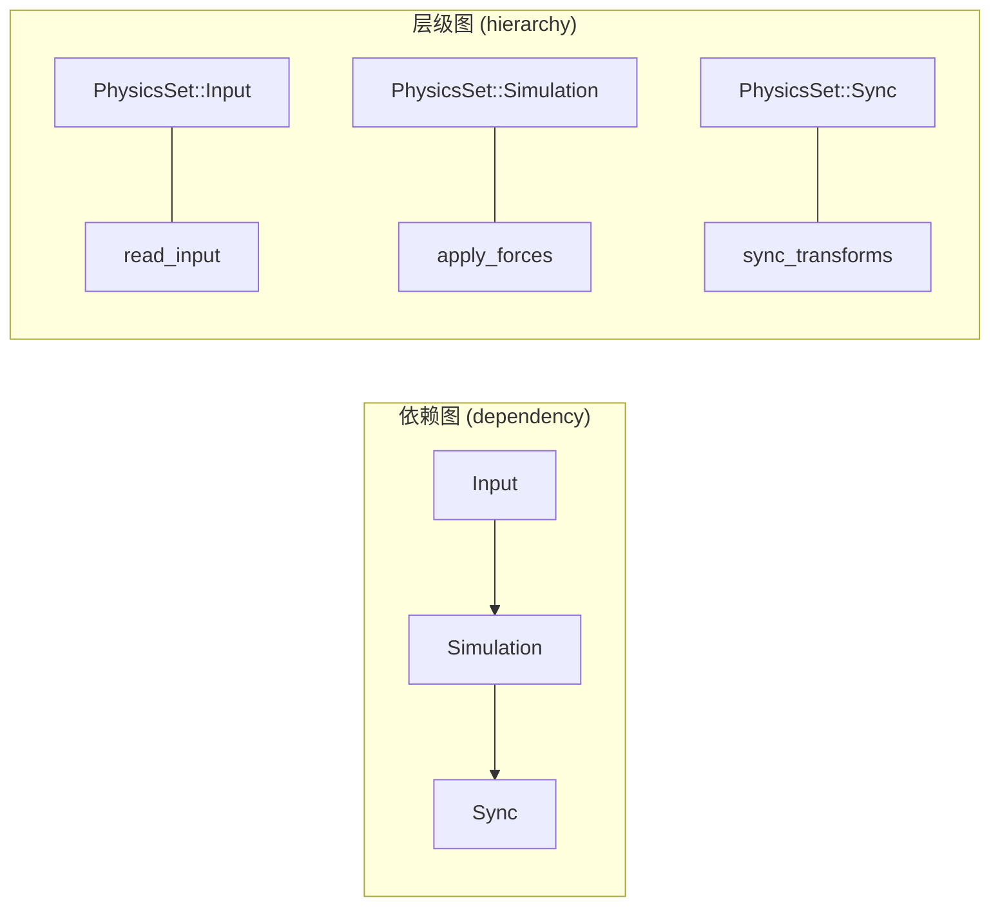
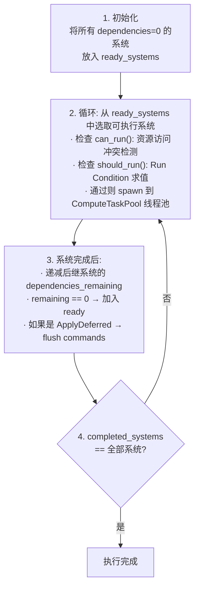
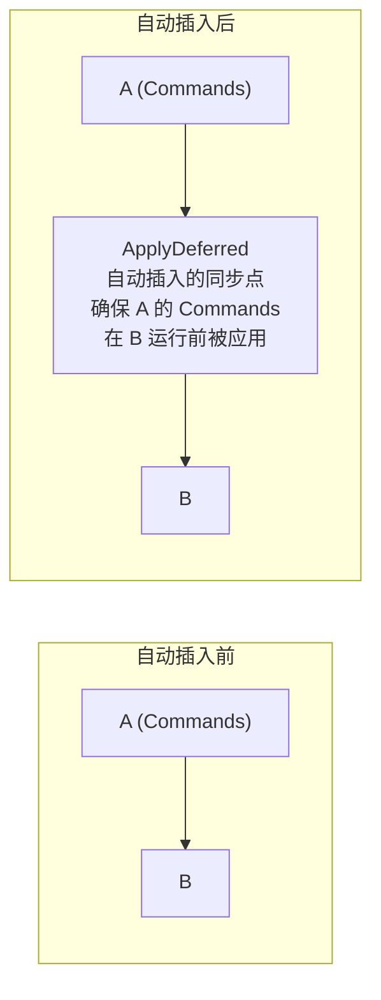
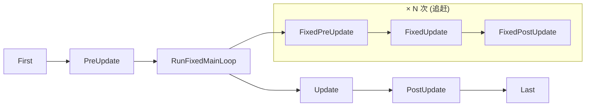

# 第 9 章：Schedule — 系统编排与自动并行

> **导读**：前两章我们看到了 System 如何从 World 中借取数据、Query 如何高效遍历。
> 但一个真实的游戏帧可能包含数百个 System——它们的执行顺序如何确定？哪些可以并行？
> 什么时候需要同步？本章将深入 Schedule 的依赖图构建、拓扑排序、运行时借用检查、
> ApplyDeferred 自动插入，以及 FixedUpdate 追赶机制和 Stepping 调试支持。

## 9.1 Schedule 的核心结构

一个 `Schedule` 由三层组成：声明层（ScheduleGraph）、编译层（SystemSchedule）和执行层（SystemExecutor）：

```rust
// 源码: crates/bevy_ecs/src/schedule/schedule.rs (简化)
pub struct Schedule {
    label: InternedScheduleLabel,
    graph: ScheduleGraph,        // declaration: systems + sets + dependencies
    executable: SystemSchedule,  // compiled: topologically sorted arrays
    executor: Box<dyn SystemExecutor>,  // runtime: single/multi-threaded
    executor_initialized: bool,
}
```

`ScheduleGraph` 存储用户声明的系统、集合和依赖关系——这是一个有向图。当 Schedule 第一次运行（或图发生变化）时，调用 `initialize()` 将图编译为 `SystemSchedule`——一组拓扑排序后的并行数组。最后 `SystemExecutor` 消费这些数组来实际执行系统。

为什么需要三层而不是一个扁平的系统列表？根本原因在于**声明与执行的关注点分离**。声明层允许用户以自然的方式表达意图——"A 在 B 之前"、"C 属于物理集合"——而不需要关心最终的执行顺序。编译层将这些松散的约束求解为一个确定的拓扑序列，同时预计算并行性所需的冲突矩阵。执行层则专注于运行时调度策略，例如单线程还是多线程。如果只有一个扁平列表，用户每次添加系统都必须手动指定在列表中的确切位置，这在系统数量达到数百个时根本不可行。三层架构让 Bevy 可以在不同层面独立演化——例如替换执行器（从单线程切换到多线程）而不影响声明层的 API，或者优化拓扑排序算法而不改变用户的声明方式。这种分层也使得增量编译成为可能：只有当声明层发生变化时才需要重新编译，而在大多数帧中，编译层的结果可以直接复用。



*图 9-1: Schedule 三层架构*

多个 Schedule 通过 `Schedules` 资源统一管理，以 `ScheduleLabel` 为键：

```rust
// 源码: crates/bevy_ecs/src/schedule/schedule.rs
#[derive(Default, Resource)]
pub struct Schedules {
    inner: HashMap<InternedScheduleLabel, Schedule>,
    pub ignored_scheduling_ambiguities: BTreeSet<ComponentId>,
    // ...
}
```

这种三层架构的代价是首次运行时的编译开销——拓扑排序和冲突矩阵计算需要 O(V+E) 的时间复杂度，其中 V 是系统数量，E 是依赖边数量。然而，由于编译结果被缓存（`executable` 字段），这个开销只在 Schedule 首次运行或图结构发生变化时才产生。对于一个拥有 500 个系统的大型游戏，初始编译可能需要几毫秒，但后续每帧的调度只是对已编译数据的消费，开销极低。如果 Bevy 采用传统的"每帧重新排序"策略，这个编译开销会在每帧重复出现，严重影响性能。

**要点**：Schedule = ScheduleGraph(声明) + SystemSchedule(编译) + SystemExecutor(执行)。声明层是有向图，编译层是拓扑排序后的并行数组，执行层负责实际的并行/串行调度。

## 9.2 依赖图：before / after / chain

用户通过 `before()`、`after()` 和 `chain()` 声明系统之间的执行顺序约束：

```rust
schedule.add_systems((
    apply_forces.after(read_input),
    read_input,
    render.after(apply_forces),
));
// equivalent to:
schedule.add_systems((
    read_input, apply_forces, render,
).chain());
```

每个约束被转化为 `Dependency` 存储在 `ScheduleGraph` 的有向图中：

```rust
// 源码: crates/bevy_ecs/src/schedule/graph/mod.rs (简化)
pub struct Dependency {
    pub kind: DependencyKind,  // Before | After
    pub set: InternedSystemSet,
}
```

`chain()` 则是对元组中相邻系统自动添加 `before → after` 约束的语法糖。它通过 `ScheduleConfigs::Configs` 的 `Chain::Chained` 模式实现，在图构建阶段展开为一系列 `Dependency` 边。

```rust
// 源码: crates/bevy_ecs/src/schedule/schedule.rs
pub enum Chain {
    #[default]
    Unchained,
    Chained(TypeIdMap<Box<dyn Any>>),
}
```

`Chained` 变体中的 `TypeIdMap` 允许 chain 携带额外配置，例如 `IgnoreDeferred` 可以指示 ApplyDeferred 不在此 chain 的边上插入同步点。

依赖图的设计选择值得深思：为什么使用显式的 `before/after` 声明，而不是根据系统参数自动推断顺序？自动推断看似方便，但会导致系统间的隐式耦合——当你修改一个系统的参数时，可能无意间改变了整个 Schedule 的执行顺序。显式声明虽然需要更多代码，但让系统间的依赖关系清晰可见、可追踪、可调试。此外，并非所有逻辑顺序都能从数据访问模式中推断出来——例如"先读取输入再应用力"是一个语义约束，而非数据冲突。`chain()` 的存在则平衡了简洁性和显式性——对于明确需要串行的系统组，它比手动标注每对 before/after 关系简洁得多。

**要点**：`before/after` 声明转化为有向图中的边，`chain()` 是相邻系统自动添加 before→after 边的语法糖。

## 9.3 SystemSet：层级分组

`SystemSet` 是系统的标签分组机制，允许对一组系统统一配置依赖和条件：

```rust
#[derive(SystemSet, Clone, Debug, PartialEq, Eq, Hash)]
enum PhysicsSet {
    Input,
    Simulation,
    Sync,
}

schedule.configure_sets((
    PhysicsSet::Input,
    PhysicsSet::Simulation.after(PhysicsSet::Input),
    PhysicsSet::Sync.after(PhysicsSet::Simulation),
));

schedule.add_systems((
    read_input.in_set(PhysicsSet::Input),
    apply_forces.in_set(PhysicsSet::Simulation),
    sync_transforms.in_set(PhysicsSet::Sync),
));
```

SystemSet 在 `ScheduleGraph` 中也是节点（`NodeId::Set`），与系统节点（`NodeId::System`）共存于同一个依赖图中。层级关系通过 `hierarchy` 有向图表达——`in_set` 创建从 Set 到 System 的层级边。



*图 9-2: 依赖图与层级图的关系*

当 Set 上配置了 `run_if` 条件时，该条件会传递给 Set 中的所有系统。如果 Set 的条件不满足，其中的所有系统都会被跳过。

> **Rust 设计亮点**：SystemSet 使用 `define_label!` 宏生成——这是 Bevy 标签系统的通用模式。
> 每个 `#[derive(SystemSet)]` 类型被 intern 为 `InternedSystemSet`（一个指向全局分配的 `&dyn SystemSet` 的指针），
> 使得集合比较只需比较指针，而非完整的值。这种 interning 模式在 ScheduleLabel 中也同样使用。

SystemSet 解决了大型项目中的可组合性问题。想象一个物理引擎 Plugin 导出了 20 个系统——没有 SystemSet，其他 Plugin 要在"整个物理引擎之后"运行，就必须逐一列出 20 个系统的 after 依赖。SystemSet 让这 20 个系统归属于一个 `PhysicsSet`，外部只需声明 `after(PhysicsSet)` 即可。这种分组也使得条件执行高效化：在 Set 上配置 `run_if(in_state(Playing))`，Set 中的所有系统共享一次条件求值，而非每个系统独立求值。代价是增加了概念层次——对于小型项目，直接使用 before/after 可能比引入 SystemSet 更直接。但随着项目规模增长，SystemSet 的价值会越来越明显，这也是为什么 Bevy 自身的内置 Plugin 大量使用 SystemSet 来组织系统。

**要点**：SystemSet 将系统分组为逻辑集合，可以统一配置依赖和条件。Set 和 System 共存于同一个有向图中。

## 9.4 Run Conditions：条件执行

Run Condition 是一个返回 `bool` 的只读系统，控制关联的系统或 Set 是否在本帧执行：

```rust
// 源码: crates/bevy_ecs/src/schedule/condition.rs
pub type BoxedCondition<In = ()> = Box<dyn ReadOnlySystem<In = In, Out = bool>>;

pub trait SystemCondition<Marker, In: SystemInput = ()>:
    IntoSystem<In, bool, Marker, System: ReadOnlySystem>
{ ... }
```

常见的内置 Run Condition 包括：

| Condition | 含义 |
|-----------|------|
| `in_state(AppState::Playing)` | 当前状态为 Playing 时执行 |
| `resource_changed::<R>` | 资源 R 发生变更时执行 |
| `on_event::<E>` | 有未处理的消息 E 时执行 |
| `run_once()` | 只执行一次 |

Run Condition 可以通过 `.and()`、`.or()`、`.not()` 组合：

```rust
schedule.add_systems(
    update_ui
        .run_if(in_state(AppState::Playing).and(resource_changed::<Score>)),
);
```

Run Condition 有一个重要的短路特性：`and()` 的第二个条件只在第一个为 true 时求值。这意味着如果第二个条件使用了变更检测或 `Local<T>`，它可能不会在每帧被求值，导致检测行为的微妙不一致。如果需要两个条件都始终求值，使用 `and_eager()` 替代。

Run Condition 的设计选择了"返回 bool 的 System"而非"独立的条件对象"，这意味着条件可以访问任何 ECS 数据——Resource、Query、Local 状态等——与普通 System 完全一致。这种统一性避免了为条件系统引入独立的 API 和学习成本。`ReadOnlySystem` 约束确保条件求值不会修改 World 状态——条件只是"观察者"，不能产生副作用。这是 Rust 类型系统在调度层面的又一次应用：编译器保证条件不会意外地触发变更，调度器可以安全地在并行系统之间求值条件而无需额外同步。如果条件可以修改 World，调度器就必须将条件求值也纳入冲突检测，显著增加调度复杂度。

**要点**：Run Condition = 返回 bool 的 ReadOnlySystem。注意 `and()` 的短路行为可能影响变更检测。

## 9.5 Executor：拓扑排序与并行执行

### 拓扑排序

当 `Schedule::initialize()` 被调用时，`ScheduleGraph` 的依赖图被拓扑排序，生成一个线性执行序列存储在 `SystemSchedule` 中：

```rust
// 源码: crates/bevy_ecs/src/schedule/executor/mod.rs (简化)
pub struct SystemSchedule {
    pub(super) system_ids: Vec<SystemKey>,
    pub(super) systems: Vec<SystemWithAccess>,
    pub(super) system_dependencies: Vec<usize>,    // predecessor count
    pub(super) system_dependents: Vec<Vec<usize>>, // successor list
    pub(super) system_conditions: Vec<Vec<ConditionWithAccess>>,
    pub(super) set_conditions: Vec<Vec<ConditionWithAccess>>,
    // ...
}
```

`system_dependencies[i]` 存储系统 i 的前驱依赖数量，`system_dependents[i]` 存储依赖系统 i 的后继系统列表。这是经典的 Kahn 算法所需的数据结构。

为什么选择拓扑排序而非其他调度策略？拓扑排序是有向无环图（DAG）的天然排序方式，它保证了一个关键不变量：如果 A 依赖 B，则 B 在排序结果中总是出现在 A 之前。相比之下，优先级调度（priority scheduling）需要用户手动指定优先级数值，在系统数量增长时极易冲突；时间片轮转（round-robin）则完全忽略了系统间的数据依赖关系。拓扑排序的另一个优势是它天然支持并行——拓扑序中没有前驱的系统可以同时执行，这正是 MultiThreadedExecutor 利用的性质。Kahn 算法的前驱计数数组可以在运行时被直接复用为"剩余依赖计数"，当系统完成时递减后继的计数——计数归零的系统立即变为可执行。这种数据结构上的一致性使得编译期和运行期的代码可以自然地衔接，无需额外的转换步骤。

### MultiThreadedExecutor

默认的 `MultiThreadedExecutor` 在运行时使用依赖计数 + 冲突检测来实现最大并行：

```rust
// 源码: crates/bevy_ecs/src/schedule/executor/multi_threaded.rs (简化)
pub struct MultiThreadedExecutor {
    state: Mutex<ExecutorState>,
    system_completion: ConcurrentQueue<SystemResult>,
    apply_final_deferred: bool,
    // ...
}

pub struct ExecutorState {
    system_task_metadata: Vec<SystemTaskMetadata>,
    num_dependencies_remaining: Vec<usize>,  // decremented at runtime
    ready_systems: FixedBitSet,              // dependencies satisfied
    running_systems: FixedBitSet,            // currently executing
    completed_systems: FixedBitSet,          // finished
    unapplied_systems: FixedBitSet,          // run but deferred not applied
    // ...
}
```

执行流程如下：



*图 9-3: MultiThreadedExecutor 执行流程*

### 运行时借用检查（冲突检测）

`can_run()` 方法是调度器的核心安全保障。它在运行时检查待执行系统与当前正在执行的系统之间是否存在资源访问冲突：

```rust
// 源码: crates/bevy_ecs/src/schedule/executor/multi_threaded.rs (简化)
fn can_run(&mut self, system_index: usize, conditions: &mut Conditions) -> bool {
    let system_meta = &self.system_task_metadata[system_index];
    // exclusive system: must be the only running system
    if system_meta.is_exclusive && self.num_running_systems > 0 {
        return false;
    }
    // non-Send system: only one can run at a time (on main thread)
    if !system_meta.is_send && self.local_thread_running {
        return false;
    }
    // check component access conflicts with running systems
    if !system_meta.conflicting_systems.is_disjoint(&self.running_systems) {
        return false;
    }
    true
}
```

在 `init()` 阶段，执行器预计算每对系统之间的冲突关系（`conflicting_systems` 位集），基于它们的 `FilteredAccessSet`：

```rust
// 源码: crates/bevy_ecs/src/schedule/executor/multi_threaded.rs
// pre-compute conflict matrix during init
for index1 in 0..sys_count {
    for index2 in 0..index1 {
        if !schedule.systems[index2].access
            .is_compatible(&schedule.systems[index1].access) {
            state.system_task_metadata[index1].conflicting_systems.insert(index2);
            state.system_task_metadata[index2].conflicting_systems.insert(index1);
        }
    }
}
```

冲突规则遵循 Rust 的借用规则：

| 系统 A 访问 | 系统 B 访问 | 是否冲突 | 说明 |
|:---:|:---:|:---:|------|
| `&T` | `&T` | 无 | 多个不可变引用可共存 |
| `&T` | `&mut T` | **冲突** | 读写互斥 |
| `&mut T` | `&mut T` | **冲突** | 多个可变引用不允许 |
| `Res<A>` | `Res<B>` | 无 | 不同资源，不冲突 |
| `Res<A>` | `ResMut<A>` | **冲突** | 同一资源，读写互斥 |

> **Rust 设计亮点**：Bevy 的并行调度器本质上是一个运行时借用检查器。编译期的借用规则
> 保证了单系统内部的安全性，而调度器将这一保证扩展到了系统间。通过
> `FilteredAccessSet::is_compatible()` 在初始化阶段预计算冲突矩阵（`FixedBitSet`），
> 运行时只需做一次位集 `is_disjoint` 检查——O(n/64) 的操作——就能决定系统是否可以并行。

冲突矩阵的预计算开销是 O(n²)，其中 n 是系统数量。对于 500 个系统的 Schedule，这意味着约 125,000 次兼容性检查。这看起来不少，但每次检查本质上是两个 `FilteredAccessSet` 的集合操作，在现代 CPU 上只需纳秒级时间，且只在初始化时执行一次。运行时的收益则是巨大的：判断一个系统能否与当前所有正在运行的系统并行，只需一次 `FixedBitSet::is_disjoint` 操作——对于 500 个系统，这是约 8 个 u64 的位运算，几乎不可见。如果没有这个预计算矩阵，运行时就需要对每个候选系统与所有正在运行的系统逐一做 FilteredAccessSet 兼容性检查，这会将调度决策从亚微秒级推到微秒级，在每帧执行数百次时成为可观的开销。

值得注意的是，冲突检测是**保守**的——它可能会将两个实际不冲突的系统标记为冲突（例如两个系统查询不同的 Archetype），但绝不会将冲突的系统标记为安全。这种保守策略保证了正确性，代价是某些并行机会被错过。Bevy 通过 `FilteredAccess` 中的 with/without 过滤信息来减少误报，但无法完全消除。如果用户需要更精确的控制，可以通过 `ambiguity_detection` 工具发现这些"假冲突"并手动排序。

**要点**：执行器预计算系统间的冲突矩阵，运行时通过位集操作实现 O(n/64) 的并行安全检查。读读并行，读写和写写串行。

## 9.6 ApplyDeferred 自动插入

Commands（第 11 章详述）产生的结构性变更需要在同步点被应用。`AutoInsertApplyDeferredPass` 是一个 `ScheduleBuildPass`，在图构建阶段自动在需要的依赖边上插入 `ApplyDeferred` 同步节点：

```rust
// 源码: crates/bevy_ecs/src/schedule/auto_insert_apply_deferred.rs (简化)
pub struct AutoInsertApplyDeferredPass {
    no_sync_edges: BTreeSet<(NodeId, NodeId)>,    // edges to skip
    auto_sync_node_ids: HashMap<u32, SystemKey>,  // distance → sync node
}
```

插入逻辑基于"距离"（distance）计算。从图的起点开始，沿拓扑序遍历，维护每个节点距离上一个同步点的"距离"。当一个 `has_deferred()` 为 true 的系统被发现，并且它的某个后继有直接依赖关系时，就在该边上插入一个 `ApplyDeferred` 节点：



*图 9-4: ApplyDeferred 自动插入示意*

可以通过 `IgnoreDeferred` 配置选项跳过特定边的同步点插入：

```rust
// skip sync point on this specific chain
schedule.add_systems(
    (system_a, system_b).chain().chain_ignore_deferred(),
);
```

也可以全局关闭自动插入：

```rust
schedule.set_build_settings(ScheduleBuildSettings {
    auto_insert_apply_deferred: false,
    ..default()
});
```

自动插入同步点的设计体现了 Bevy 在"正确性优先"与"性能优化"之间的平衡。自动插入保证了正确性——如果系统 A 用 Commands 创建了一个实体，系统 B 依赖 A 并想查询这个新实体，同步点确保 B 运行时新实体已经存在。但同步点有性能代价：它是一个全局屏障（barrier），所有系统必须等待同步完成后才能继续。在一个高度并行的 Schedule 中，过多的同步点会严重限制并行度。这就是 `IgnoreDeferred` 和 `chain_ignore_deferred()` 存在的原因——当用户明确知道 B 不需要 A 的 Commands 结果时，可以手动跳过同步点，恢复并行执行。如果 Bevy 不提供自动插入，用户就必须手动分析每对依赖系统之间是否需要同步点——这在系统数量增长时极易出错。自动插入 + 手动跳过的策略让"默认安全，按需优化"成为可能。

**要点**：`AutoInsertApplyDeferredPass` 在构建阶段自动在 `has_deferred` 系统的依赖边上插入同步点，确保 Commands 的结构性变更在被依赖系统运行前完成应用。

## 9.7 FixedUpdate 追赶机制

物理模拟等需要固定时间步长的系统使用 `FixedUpdate` Schedule。它嵌入在 Main Schedule 中，以固定间隔运行，并具有追赶 (catch-up) 机制。

当一帧的实际耗时超过了固定步长时间，`FixedUpdate` 会连续运行多次以"追赶"模拟时间。例如，如果固定步长为 16ms 而上一帧耗时 48ms，`FixedUpdate` 会在本帧执行 3 次。

这种机制确保物理模拟的确定性：无论帧率如何波动，模拟的时间步长始终一致。



N = floor(accumulated_time / fixed_timestep)
accumulated_time -= N * fixed_timestep
如果 N = 0, FixedUpdate 不运行 (帧太快)
如果 N > 1, FixedUpdate 多次运行 (帧太慢)

*图 9-5: FixedUpdate 嵌入 Main Schedule 的追赶机制*

为什么选择追赶（catch-up）而非跳过（skip）或插值（interpolation）？跳过策略会丢失模拟步骤，导致物理穿透等问题——想象一个子弹以每步 1 米的速度飞行，如果跳过 3 步，子弹会瞬间跳过 3 米，可能穿过薄墙。追赶策略确保每一步都被完整模拟，碰撞检测不会遗漏。插值策略可以产生更平滑的视觉效果，但增加了一帧的延迟——显示的是上一步和当前步之间的插值，而非最新状态。Bevy 选择追赶作为默认策略，同时在视觉层面（渲染）支持用户自行实现插值。

追赶机制的潜在风险是"死亡螺旋"（death spiral）：如果一帧耗时过长导致需要追赶很多步，这些额外步骤本身又会延长帧时间，形成恶性循环。Bevy 通过 `Time<Fixed>` 资源的 `max_delta` 参数限制单帧最大追赶次数来防止这种情况。在实际项目中，如果 FixedUpdate 中的系统过于昂贵，考虑使用更大的时间步长或将部分计算移到 Update 中。FixedUpdate 与第 10 章的变更检测深度关联——在 FixedUpdate 中运行的系统仍然可以使用 `Changed<T>` 和 `Added<T>`，但由于单帧内可能执行多次，变更检测的行为需要特别注意：第一次执行可以检测到 Update 阶段的变更，但后续的追赶执行只能检测到前一次 FixedUpdate 步骤中的变更。

**要点**：FixedUpdate 以固定时间步长运行，通过追赶机制保证模拟确定性。一帧中可能执行 0 到多次。

## 9.8 Stepping：调试支持

`Stepping` 资源（需启用 `bevy_debug_stepping` feature）提供了系统级的单步调试能力：

```rust
// 源码: crates/bevy_ecs/src/schedule/stepping.rs (简化)
#[derive(Resource, Default)]
pub struct Stepping {
    schedule_states: HashMap<InternedScheduleLabel, ScheduleState>,
    schedule_order: Vec<InternedScheduleLabel>,
    // ...
}
```

Stepping 支持四种动作模式：

| 模式 | 行为 |
|------|------|
| `RunAll` | Stepping 未启用，正常运行所有系统 |
| `Waiting` | Stepping 已启用，只运行标记为 `AlwaysRun` 的系统 |
| `Step` | 执行下一个系统，然后回到 `Waiting` |
| `Continue` | 连续执行直到遇到 `Break` 标记的系统或帧结束 |

每个系统可以独立配置为以下行为之一：

| 行为 | Waiting 时 | Step 时 | Continue 时 |
|------|:---:|:---:|:---:|
| `AlwaysRun` | 运行 | 运行 | 运行 |
| `NeverRun` | 跳过 | 跳过 | 跳过 |
| `Break` | 跳过 | 单步 | 在此处停下 |
| `Continue` | 跳过 | 单步 | 运行 |

Stepping 通过在 `Schedule::run()` 中传入 `skip_systems` 位集来实现——执行器会跳过被标记的系统：

```rust
// 源码: crates/bevy_ecs/src/schedule/schedule.rs
pub fn run(&mut self, world: &mut World) {
    // ...
    #[cfg(feature = "bevy_debug_stepping")]
    {
        let skip_systems = match world.get_resource_mut::<Stepping>() {
            None => None,
            Some(mut stepping) => stepping.skipped_systems(self),
        };
        self.executor.run(
            &mut self.executable, world,
            skip_systems.as_ref(), error_handler,
        );
    }
}
```

> **Rust 设计亮点**：Stepping 通过 `cfg(feature)` 条件编译实现零成本抽象——在 release 构建中
> 完全不存在 Stepping 相关代码。调试功能作为可选 feature，不会给生产构建增加任何开销。
> 实现上仅传入一个 `Option<&FixedBitSet>` 给执行器，对执行器的核心逻辑侵入最小。

**要点**：Stepping 提供系统级的单步执行和断点支持，通过控制 `skip_systems` 位集实现，不侵入执行器逻辑。

## 本章小结

本章我们深入了 Bevy 的系统调度机制：

1. **Schedule 三层架构**：声明层（ScheduleGraph）→ 编译层（SystemSchedule）→ 执行层（SystemExecutor）
2. **依赖图**：`before/after/chain` 转化为有向图的边，拓扑排序生成线性执行序列
3. **SystemSet**：层级分组机制，统一配置依赖和条件
4. **Run Conditions**：返回 bool 的只读系统，控制执行与否，注意短路行为
5. **MultiThreadedExecutor**：预计算冲突矩阵，运行时位集检查实现 O(n/64) 并行安全
6. **运行时借用检查**：读读并行、读写串行——将 Rust 编译期的借用规则扩展到系统间
7. **ApplyDeferred**：自动在有 deferred 参数的依赖边上插入同步点
8. **FixedUpdate**：固定时间步长 + 追赶机制，保证模拟确定性
9. **Stepping**：调试用的单步执行和断点机制

下一章，我们将深入变更检测机制——Schedule 在每帧推进全局 Tick，而变更检测正是基于这个 Tick 来判断数据是否发生了变化。
