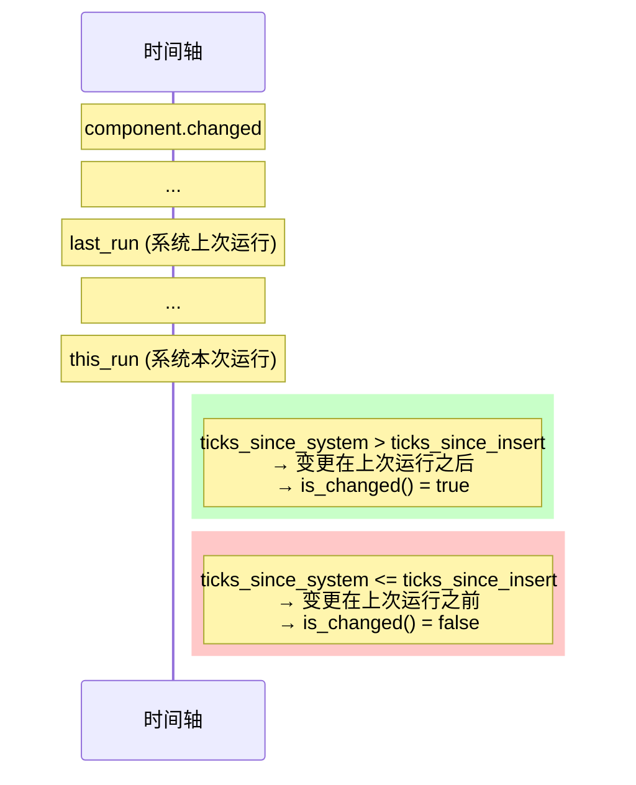

# 第 10 章：变更检测 — 零成本追踪

> **导读**：上一章我们看到 Schedule 在每帧推进全局 Tick。本章将深入这个 Tick 机制：
> 它如何驱动变更检测，使 `Added<T>` 和 `Changed<T>` 过滤器成为可能；`Mut<T>` 的
> `DerefMut` 如何自动标记变更；以及 Tick 溢出保护如何确保长时间运行的应用不会产生
> 误报。最后，我们将看到变更检测如何被 Transform、UI、Render 等子系统广泛使用，
> 成为"只在变化时工作"哲学的基石。

## 10.1 Tick：单调递增的变更时钟

Bevy 的变更检测基于一个全局单调递增的 `Tick` 计数器：

```rust
// 源码: crates/bevy_ecs/src/change_detection/tick.rs (简化)
#[derive(Copy, Clone, Default, Debug)]
pub struct Tick {
    tick: u32,
}
```

World 维护一个 `AtomicU32` 类型的全局 change tick，每次 Schedule 运行时递增：

```rust
// 源码: crates/bevy_ecs/src/world/mod.rs (简化)
pub struct World {
    pub(crate) change_tick: AtomicU32,
    pub(crate) last_change_tick: Tick,
    pub(crate) last_check_tick: Tick,
    // ...
}
```

每个组件实例携带两个 Tick：

```rust
// 源码: crates/bevy_ecs/src/change_detection/tick.rs
pub struct ComponentTicks {
    pub added: Tick,    // tick when the component was added
    pub changed: Tick,  // tick when the component was last changed
}
```

判定逻辑的核心在 `Tick::is_newer_than()`：

```rust
// 源码: crates/bevy_ecs/src/change_detection/tick.rs
impl Tick {
    pub fn is_newer_than(self, last_run: Tick, this_run: Tick) -> bool {
        let ticks_since_insert = this_run.relative_to(self).tick.min(MAX_CHANGE_AGE);
        let ticks_since_system = this_run.relative_to(last_run).tick.min(MAX_CHANGE_AGE);
        ticks_since_system > ticks_since_insert
    }
}
```

整个判定逻辑可以用时间线来理解：



*图 10-1: Tick 判定时序图*

为什么使用 u32 计数器而非时间戳？时间戳（如 `Instant`）虽然提供了精确的时间信息，但有几个关键缺陷。首先，获取系统时间需要系统调用，在 WASM 等平台上可能不可用或代价高昂。其次，时间戳比较需要考虑时钟精度和单调性问题——不同平台的时钟分辨率不同，甚至可能回退。最重要的是，变更检测不关心"变更发生在何时"，只关心"变更是否发生在我上次运行之后"——这是一个纯粹的**顺序关系**，不是时间关系。u32 计数器完美地表达了这种顺序语义，每次递增只需一次原子操作，比较只需整数减法。每个组件实例只占用 8 字节（两个 u32 Tick），在百万实体的场景中，这个存储开销相比时间戳的 16 字节（两个 u64/Instant）节省了显著的内存和缓存行。

使用 `AtomicU32` 存储全局 change tick 是因为多个系统可能并行递增它——每个系统在开始运行时读取当前 tick 作为 `this_run`，Schedule 在运行前递增全局 tick。原子操作保证了多线程环境下 tick 值的一致性，而无需使用更重的锁机制。

**要点**：变更检测基于 u32 Tick 的相对差值判定：如果组件变更发生在系统上次运行之后，则视为"已变更"。

## 10.2 ComponentTicks：added + changed 双追踪

每个组件实例在 Column 中存储两个并行的 Tick 数组（第 5 章已介绍）：

```
  Column (Position 类型)

  data:          [Pos₀]  [Pos₁]  [Pos₂]    ← component values
  added_ticks:   [T=10]  [T=25]  [T=30]    ← when added
  changed_ticks: [T=10]  [T=42]  [T=30]    ← when last changed
```

- `added_ticks`：组件被首次插入实体时设置，之后不再变化
- `changed_ticks`：每次组件被可变访问时更新为当前 Tick

`ComponentTicks` 提供两个判定方法：

```rust
// 源码: crates/bevy_ecs/src/change_detection/tick.rs
impl ComponentTicks {
    pub fn is_added(&self, last_run: Tick, this_run: Tick) -> bool {
        self.added.is_newer_than(last_run, this_run)
    }

    pub fn is_changed(&self, last_run: Tick, this_run: Tick) -> bool {
        self.changed.is_newer_than(last_run, this_run)
    }
}
```

这两个判定驱动了 Query 过滤器 `Added<T>` 和 `Changed<T>`：

- `Added<T>`：只匹配在上次系统运行后 **新添加** 的组件
- `Changed<T>`：匹配在上次系统运行后 **被修改或新添加** 的组件

双 Tick 设计的取舍值得关注。将 added 和 changed 分开存储意味着每个组件实例多占 4 字节。对于拥有 100 万个实体、每个实体 10 个组件的大型场景，这额外增加了约 40MB 内存。Bevy 认为这个代价是值得的，因为 `Added<T>` 过滤器在实际开发中极为常用——初始化系统经常需要在组件首次出现时执行设置逻辑，如果没有 `Added<T>`，用户就需要自行维护一个 "已初始化" 标志组件，反而增加了更多内存和复杂度。`Changed<T>` 包含了 `Added<T>` 的情况——新添加的组件同时被视为"已变更"——这简化了许多系统的逻辑，避免了 `Or<(Added<T>, Changed<T>)>` 这样的冗余写法。

**要点**：每个组件实例携带 added + changed 两个 Tick，分别驱动 `Added<T>` 和 `Changed<T>` 过滤器。

## 10.3 Ref\<T\> 与 Mut\<T\>：变更检测包装器

### Ref\<T\>：只读访问 + 变更查询

`Ref<T>` 是不可变引用的变更检测包装器：

```rust
// 源码: crates/bevy_ecs/src/change_detection/params.rs
pub struct Ref<'w, T: ?Sized> {
    pub(crate) value: &'w T,
    pub(crate) ticks: ComponentTicksRef<'w>,
}
```

它实现了 `DetectChanges` trait，允许查询变更信息而不触发变更标记：

```rust
fn system(query: Query<Ref<Transform>>) {
    for transform_ref in &query {
        if transform_ref.is_changed() {
            // transform was modified since last system run
        }
        if transform_ref.is_added() {
            // transform was just added
        }
    }
}
```

### Mut\<T\>：可变访问 + 自动标记

`Mut<T>` 是 Bevy 变更检测的核心——它在 `DerefMut` 中自动更新 `changed` tick：

```rust
// 源码: crates/bevy_ecs/src/change_detection/params.rs
pub struct Mut<'w, T: ?Sized> {
    pub(crate) value: &'w mut T,
    pub(crate) ticks: ComponentTicksMut<'w>,
}
```

关键在于 `DerefMut` 的实现：

```rust
// 源码: crates/bevy_ecs/src/change_detection/params.rs (通过 macro 生成)
impl<'w, T: ?Sized> DerefMut for Mut<'w, T> {
    fn deref_mut(&mut self) -> &mut Self::Target {
        self.set_changed();  // automatically mark as changed!
        self.value
    }
}
```

```
  Mut<T> 的 DerefMut 自动标记流程

  ┌──────────────────┐     ┌──────────────────────────┐
  │ fn system(        │     │ Mut<T>::deref_mut()       │
  │   mut q: Query<   │ ──→ │  1. set_changed()        │
  │     &mut Transform│     │     changed_tick = now    │
  │   >)              │     │  2. return &mut T         │
  │ {                 │     └──────────────────────────┘
  │   for mut t in &q │
  │   {               │     只要对 Mut<T> 调用 *t = ...
  │     t.translation │     就会触发 DerefMut，
  │       .x += 1.0;  │     自动标记 changed
  │   }               │
  │ }                 │
  └──────────────────┘
```

*图 10-2: Mut\<T\> 的 DerefMut 自动标记流程*

如果你只需要读取值而不想触发变更标记，可以通过 `Deref`（`&*mut_ref`）只读访问底层数据。如果你确实需要修改数据但不想标记变更（例如避免无限递归的同步），可以使用 `bypass_change_detection()`：

```rust
fn system(mut query: Query<&mut Transform>) {
    for mut transform in &mut query {
        // read without triggering change: use Deref
        let current = transform.translation;
        // write without triggering change: bypass
        transform.bypass_change_detection().translation = current;
    }
}
```

> **Rust 设计亮点**：Bevy 巧妙地利用了 Rust 的 `Deref`/`DerefMut` trait 分层。
> 只读访问走 `Deref`，不修改 tick；可变访问走 `DerefMut`，自动标记变更。
> 用户无需手动调用任何"标脏"函数——语言层面的可变性语义自动驱动变更检测。
> 这是 Rust 类型系统与 ECS 变更追踪的完美结合。

这种自动标记机制存在一个重要的注意事项：**假阳性（false positive）**。当系统获取了 `&mut T` 但实际上没有修改值时（例如读取值后决定不更改），`DerefMut` 仍然会标记变更。这意味着下游依赖 `Changed<T>` 的系统会被不必要地触发。在性能敏感的场景中，这可能导致级联的冗余计算——例如 Transform 传播系统会重新计算一个实际没有移动的实体的 GlobalTransform。解决方案是在可能不修改的情况下先通过 `Deref`（只读解引用）检查值，确认需要修改后再触发 `DerefMut`。另一方面，Bevy 的变更检测**不存在假阴性（false negative）**——如果值确实被修改了，它一定会被检测到，因为 `DerefMut` 是获取可变引用的唯一途径。这种"宁可多报，不可漏报"的策略保证了依赖变更检测的系统的正确性，虽然可能带来一些不必要的工作。

**要点**：`Mut<T>` 在 `DerefMut` 中自动设置 `changed_tick`，用户的可变访问自动触发变更标记，无需手动操作。

## 10.4 Tick 溢出保护

`Tick` 使用 `u32` 存储，理论上会在约 42 亿次递增后溢出。Bevy 通过两个常量和定期扫描来防止溢出导致的误报：

```rust
// 源码: crates/bevy_ecs/src/change_detection/mod.rs
// ~1 hour at 1000 ticks/frame × 144 fps
pub const CHECK_TICK_THRESHOLD: u32 = 518_400_000;

// maximum age before change detection stops working
pub const MAX_CHANGE_AGE: u32 = u32::MAX - (2 * CHECK_TICK_THRESHOLD - 1);
```

`CHECK_TICK_THRESHOLD` 约等于 144fps 运行 1 小时的 tick 数。World 在每次 `Schedule::run()` 时检查是否需要扫描：

```rust
// 源码: crates/bevy_ecs/src/world/mod.rs (简化)
pub fn check_change_ticks(&mut self) -> Option<CheckChangeTicks> {
    let change_tick = self.read_change_tick();
    if change_tick.relative_to(self.last_check_tick).get() < CHECK_TICK_THRESHOLD {
        return None;  // not enough ticks since last scan
    }
    self.last_check_tick = change_tick;
    // clamp all component ticks older than MAX_CHANGE_AGE
    // ...
}
```

当扫描触发时，所有超过 `MAX_CHANGE_AGE` 的组件 tick 被钳位到 `MAX_CHANGE_AGE`：

```rust
// 源码: crates/bevy_ecs/src/change_detection/tick.rs
pub fn check_tick(&mut self, check: CheckChangeTicks) -> bool {
    let age = check.present_tick().relative_to(*self);
    if age.get() > Self::MAX.get() {
        *self = check.present_tick().relative_to(Self::MAX);
        true  // tick was clamped
    } else {
        false
    }
}
```

`is_newer_than()` 中也对差值做了 `min(MAX_CHANGE_AGE)` 钳位，确保即使在两次扫描之间发生溢出，判定结果也是确定性的：

```
  溢出保护机制

  正常情况: 组件变更在 MAX_CHANGE_AGE 以内
  ┌────────────────────────────────────────┐
  │ changed_tick ──── ... ──── this_run    │
  │      diff < MAX_CHANGE_AGE → 正常判定 │
  └────────────────────────────────────────┘

  超时情况: 组件变更超过 MAX_CHANGE_AGE
  ┌────────────────────────────────────────┐
  │ changed_tick ── ... (太久) ── this_run │
  │      diff > MAX_CHANGE_AGE             │
  │      → 被 min() 钳位到 MAX_CHANGE_AGE │
  │      → is_changed() 返回 false         │
  │      → 变更"过期"，不再被检测到        │
  └────────────────────────────────────────┘

  定期扫描: 将过旧的 tick 钳位
  ┌────────────────────────────────────────┐
  │ 每 CHECK_TICK_THRESHOLD 次递增后扫描   │
  │ 钳位所有 > MAX_CHANGE_AGE 的 tick     │
  │ → 防止 u32 wrapping 导致误判          │
  └────────────────────────────────────────┘
```

*图 10-3: Tick 溢出保护机制*

> **Rust 设计亮点**：Bevy 使用 `wrapping_sub` 进行 Tick 差值计算，使得 u32 环绕不会导致错误。
> 关键洞察是：World 的 change_tick 始终是"最新的"，只要组件 tick 和系统 tick 不比
> change_tick 老超过 `u32::MAX`（通过定期扫描保证），wrapping 差值就始终是正确的。
> `CheckChangeTicks` 事件还允许用户的自定义数据结构参与扫描周期。

溢出保护是 u32 Tick 设计的直接后果。Bevy 没有通过更宽的整数类型来回避环绕，而是通过 `CHECK_TICK_THRESHOLD` 和 `MAX_CHANGE_AGE` 控制何时触发检查，以及旧 Tick 最多能保留到什么范围。达到阈值后，World 会遍历组件的 change ticks，把过旧的值钳位到安全区间。这样做的取舍很明确：把常态成本留在紧凑的每组件 Tick 存储上，只在阈值达到后支付一次全局检查成本。这种设计体现了 Bevy 在内存效率与偶发维护开销之间的权衡。

**要点**：Tick 溢出保护通过定期扫描 + 钳位实现。超过 MAX_CHANGE_AGE 的变更不再被检测到，但不会产生误报。

## 10.5 变更检测在子系统中的应用

变更检测贯穿 Bevy 引擎的几乎所有子系统，是"只在变化时工作"设计哲学的核心。以下是几个关键的应用场景：

### Transform 传播

`Transform` → `GlobalTransform` 的传播只在 `Transform` 发生变更时重新计算：

```rust
// transform propagation only runs for Changed<Transform>
fn propagate_transforms(
    query: Query<(&Transform, &mut GlobalTransform, &Children), Changed<Transform>>,
) { ... }
```

在一个有 10 万个实体的场景中，如果只有 100 个发生了移动，传播系统只需处理 100 个而非 10 万个。

### UI 布局

UI 布局计算（Taffy/Flexbox）会在节点的布局属性变更时重新计算。当前这些属性直接存放在 `Node` 组件上：

```rust
// UI layout only recalculates when node layout data changes
fn ui_layout_system(
    changed_nodes: Query<(Entity, &Node), Changed<Node>>,
) { ... }
```

### 渲染提取

渲染系统通过 `Changed<T>` 只提取发生变化的材质、网格和光照数据，避免每帧完整重传 GPU 资源：

```rust
// only extract materials that changed
fn extract_materials(
    materials: Query<(&Handle<Material>, &MeshMaterial), Changed<MeshMaterial>>,
) { ... }
```

### PBR 光照

PBR 管线中，只有变更的光源才需要重新计算阴影贴图和光源参数。

| 子系统 | 使用的过滤器 | 优化效果 |
|--------|-------------|----------|
| Transform 传播 | `Changed<Transform>` | 只传播移动的实体 |
| UI 布局 | `Changed<Node>` | 只重算布局属性变化的节点 |
| 渲染提取 | `Changed<Material>` | 只重传变化的资源 |
| PBR 光照 | `Changed<Light>` | 只更新变化的光源 |
| Visibility | `Changed<Visibility>` | 只重算变化的可见性 |

变更检测的规模效应尤为显著。如果一个大场景中每帧只有少量实体的 Transform 发生变化，`Changed<Transform>` 会让传播系统把工作集中在真正发生变化的那部分实体上，而不是无差别扫描所有匹配项。然而，`Changed<T>` 过滤器本身也有开销：它需要检查每个匹配 Archetype 中实体的 `changed_tick`。当变更比例接近 100% 时（例如所有实体每帧都在移动），使用 `Changed<T>` 反而可能不如直接处理整批数据划算，因为多了一层 Tick 比较。因此，变更检测最适合"稀疏变更"场景——大量静态实体中少量发生变化。对于每帧必然变更的数据（如帧计数器），使用变更检测过滤器反而是一种浪费。这种性能特征与第 15 章的 Transform 传播系统直接相关：静态场景中的大量不变实体是变更检测最大的受益者。

**要点**：变更检测是 Bevy "只在变化时工作"设计哲学的基石，广泛应用于 Transform、UI、Render、PBR 等子系统，实现了"无变化零成本"的性能特性。

## 本章小结

本章我们深入了 Bevy 的变更检测机制：

1. **Tick** 是 u32 单调递增计数器，World 每帧递增，通过 `AtomicU32` 保证多线程安全
2. **ComponentTicks** 包含 added + changed 两个 Tick，驱动 `Added<T>` 和 `Changed<T>` 过滤器
3. **Ref\<T\>** 提供只读访问 + 变更查询，不触发变更标记
4. **Mut\<T\>** 通过 `DerefMut` 自动标记变更——语言层面的可变性语义驱动变更追踪
5. **溢出保护** 通过 `CHECK_TICK_THRESHOLD` 定期扫描和 `MAX_CHANGE_AGE` 钳位实现
6. **子系统应用** 覆盖 Transform、UI、Render、PBR——"无变化零成本"

下一章，我们将看到 Commands 延迟执行模型——为什么系统在运行时不能直接修改 World，以及 Commands 如何与 ApplyDeferred 同步点配合工作。
