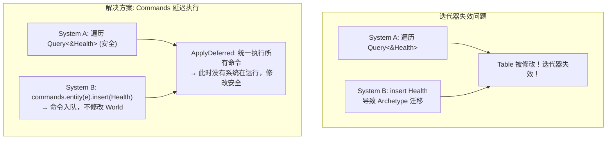
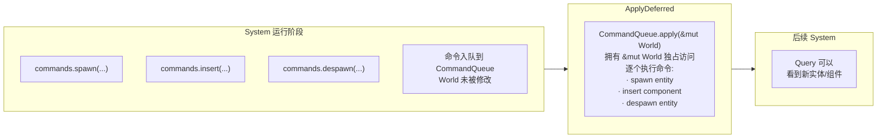

# 第 11 章：Commands — 延迟执行

> **导读**：上一章我们看到变更检测如何追踪组件的修改。但有些操作——比如 spawn/despawn
> 实体、insert/remove 组件——会改变 Archetype 的结构，导致迭代器失效。这些操作不能
> 在系统并行执行时直接进行。Commands 正是解决这一问题的延迟执行机制：系统收集命令，
> 在 ApplyDeferred 同步点统一执行。本章将深入 CommandQueue 的实现、内置与自定义
> Command，以及同步点的工作方式。

## 11.1 为什么需要延迟执行？

考虑以下场景：系统 A 正在遍历所有拥有 `Health` 组件的实体，同时系统 B 想要为某个实体添加 `Health` 组件。如果 B 直接修改 World：

1. 添加 `Health` 会导致该实体从一个 Archetype 迁移到另一个
2. Archetype 中的 Table 会被重新分配（swap_remove + push）
3. 系统 A 正在遍历的 Table 被修改——**迭代器失效**

这与 Rust 中 `Vec` 遍历时不能插入/删除元素是同一类问题。Rust 的借用规则通过编译器阻止了这种情况，但在 ECS 中，系统 A 和 B 可能并行运行在不同线程上。



*图 11-1: 迭代器失效问题与 Commands 延迟方案*

让我们具体走过一个迭代器失效的场景。假设系统 A 正在遍历 Archetype [Position, Velocity] 的 Table，当前正在访问第 3 行（索引 2）。此时系统 B 为索引 5 的实体添加了 Health 组件——该实体需要从 Archetype [Position, Velocity] 迁移到 [Position, Velocity, Health]。迁移的过程是：从旧 Table 的索引 5 处 swap_remove 该实体的数据（用最后一行填补空缺），然后将数据 push 到新 Table。如果旧 Table 有 8 行，swap_remove 后变为 7 行——但系统 A 可能仍然认为 Table 有 8 行，会尝试访问已被移走的数据，导致未定义行为。更糟糕的是，如果系统 A 恰好在遍历到索引 5 时发生 swap_remove，它会跳过被交换过来的那个实体（原来在末尾的实体），导致逻辑遗漏。这与 Rust 标准库中 `Vec::iter()` 期间调用 `Vec::push()` 导致迭代器失效是完全相同的问题，只是发生在不同线程、不同系统之间。

这种延迟执行的代价是**可见性延迟**——系统 A 用 Commands 创建的实体，在同一帧内的系统 B 中还不可见（除非 A 和 B 之间有 ApplyDeferred 同步点）。这是一个有意识的设计取舍：用可见性延迟换取并行安全性。与第 9 章的 ApplyDeferred 自动插入机制配合，Bevy 尽可能在需要的位置插入同步点，但在不需要的位置保持最大并行度。

**要点**：结构性变更（spawn/despawn/insert/remove）会导致 Archetype 迁移和 Table 重分配，不能在系统并行执行时进行。Commands 将这些操作延迟到同步点执行。

## 11.2 CommandQueue：异构命令的密集存储

`CommandQueue` 是一个类型擦除的异构命令缓冲区，底层使用 `Vec<MaybeUninit<u8>>` 而非 `Vec<Box<dyn Command>>` 来最大化性能：

```rust
// 源码: crates/bevy_ecs/src/world/command_queue.rs (简化)
pub struct CommandQueue {
    pub(crate) bytes: Vec<MaybeUninit<u8>>,  // dense command storage
    pub(crate) cursor: usize,               // read position
    pub(crate) panic_recovery: Vec<MaybeUninit<u8>>,
    pub(crate) caller: MaybeLocation,
}
```

每个命令在缓冲区中以 `CommandMeta` + 命令数据 的方式紧密排列：

```rust
// 源码: crates/bevy_ecs/src/world/command_queue.rs
struct CommandMeta {
    // function pointer: consume the command, optionally apply to world
    consume_command_and_get_size:
        unsafe fn(value: OwningPtr<Unaligned>, world: Option<NonNull<World>>, cursor: &mut usize),
}
```

```
  CommandQueue 内存布局

  bytes: ┌──────────┬──────────┬──────────┬──────────┬──────────┬──────────┐
         │ Meta₀    │ Spawn(..)│ Meta₁    │Insert(..)│ Meta₂    │Despawn(..)│
         │ fn ptr   │ cmd data │ fn ptr   │ cmd data │ fn ptr   │ cmd data │
         └──────────┴──────────┴──────────┴──────────┴──────────┴──────────┘
         ← dense, no heap allocation per command →

  cursor: ─────→ 指向下一个要执行的命令

  对比 Vec<Box<dyn Command>>:
  ┌───┬───┬───┐
  │ → │ → │ → │   每个 Box 都是一次堆分配
  └─│─┴─│─┴─│─┘   指针间接访问，缓存不友好
    ↓   ↓   ↓
   [S] [I] [D]    分散在堆上的命令数据
```

*图 11-2: CommandQueue 密集存储 vs Box\<dyn Command\> 的对比*

为什么选择 `Vec<MaybeUninit<u8>>` 而非 `Vec<Box<dyn Command>>`？

1. **零分配**：命令数据直接写入缓冲区，不需要为每个命令做堆分配
2. **缓存友好**：命令数据连续排列，顺序执行时有良好的缓存局部性
3. **批量执行**：`apply()` 方法顺序扫描缓冲区，逐个执行命令

`RawCommandQueue` 是 `CommandQueue` 的裸指针版本，用于避免嵌套可变借用问题（当 World 的命令队列在执行时递归入队新命令）：

```rust
// 源码: crates/bevy_ecs/src/world/command_queue.rs
pub(crate) struct RawCommandQueue {
    pub(crate) bytes: NonNull<Vec<MaybeUninit<u8>>>,
    pub(crate) cursor: NonNull<usize>,
    pub(crate) panic_recovery: NonNull<Vec<MaybeUninit<u8>>>,
}
```

> **Rust 设计亮点**：CommandQueue 是一个精心设计的类型擦除容器。每个命令通过 `CommandMeta`
> 中的函数指针实现多态调用——这是"手动 vtable"模式。相比 `Box<dyn Command>`，
> 它消除了逐个命令的堆分配，在频繁使用 Commands 的场景（如批量 spawn）中性能差异显著。
> `panic_recovery` 字段则确保即使某个命令 panic，后续命令仍能被正确 drop。

这种内存布局设计直接影响了批量 spawn 的性能。考虑一个初始化系统需要创建 10,000 个实体——使用 `Vec<Box<dyn Command>>` 方案需要 10,000 次独立的堆分配（每次 `Box::new`），这些分配分散在堆的各个位置，执行时会产生大量缓存未命中。而 `Vec<MaybeUninit<u8>>` 方案将所有命令顺序写入同一个连续缓冲区，执行时 CPU 的预取器可以更稳定地预加载后续命令。因此，这种密集存储更适合批量 spawn 一类吞吐敏感场景。代价是实现复杂度更高——需要手动管理类型擦除、对齐和 drop 语义，这也是为什么 `CommandQueue` 内部充满了 `unsafe` 代码。

`RawCommandQueue` 的存在则解决了一个微妙的借用问题。当 CommandQueue 的 `apply()` 方法正在逐个执行命令时，某个命令可能需要向同一个 World 的命令队列中推入新命令（递归入队）。如果使用普通的 `&mut CommandQueue`，这会产生嵌套可变借用——违反 Rust 的借用规则。`RawCommandQueue` 通过裸指针绕过了这个限制，用 `unsafe` 的方式实现了安全的递归入队。这体现了 Bevy 在"安全的 API 表面"和"高效的内部实现"之间的取舍：对外暴露安全的 `Commands` 接口，内部使用精心审计的 `unsafe` 代码实现最佳性能。

**要点**：CommandQueue 使用 `Vec<MaybeUninit<u8>>` + 函数指针实现零分配的异构命令存储，每个命令紧密排列在同一个缓冲区中。

## 11.3 Command trait 与内置命令

### Command trait

所有命令必须实现 `Command` trait：

```rust
// 源码: crates/bevy_ecs/src/system/commands/command.rs
pub trait Command: Send + 'static {
    type Out: CommandOutput;
    fn apply(self, world: &mut World) -> Self::Out;
}
```

`Send + 'static` 约束确保命令可以跨线程传递，`apply` 方法接收 `&mut World` 拥有完整的 World 修改权限。

闭包自动实现了 `Command`：

```rust
// closures implement Command automatically
commands.queue(|world: &mut World| {
    world.spawn(SomeBundle::default());
});
```

### Commands 系统参数

`Commands` 是一个系统参数（SystemParam），它持有一个 `RawCommandQueue` 的引用和实体分配器：

```rust
// 源码: crates/bevy_ecs/src/system/commands/mod.rs (简化)
pub struct Commands<'w, 's> {
    queue: Deferred<'s, CommandQueue>,
    entities: &'w Entities,
    // ...
}
```

### 内置命令

Bevy 提供了丰富的内置命令方法：

| 方法 | 操作 | 说明 |
|------|------|------|
| `commands.spawn(bundle)` | 创建新实体 | 预分配 Entity ID，延迟执行 |
| `commands.entity(e).despawn()` | 销毁实体 | 移除所有组件并回收 ID |
| `commands.entity(e).insert(comp)` | 添加组件 | 可能触发 Archetype 迁移 |
| `commands.entity(e).remove::<T>()` | 移除组件 | 可能触发 Archetype 迁移 |
| `commands.insert_resource(res)` | 插入资源 | 全局唯一资源 |
| `commands.trigger(event)` | 触发事件 | 延迟触发 Observer |
| `commands.run_system(id)` | 运行系统 | 延迟执行注册系统 |

`spawn` 方法特别值得注意：它通过 `EntityAllocator` 预分配 Entity ID，使得后续代码可以立即引用这个 ID（例如设置父子关系），而实际的 spawn 操作被延迟到 ApplyDeferred：

```rust
fn setup(mut commands: Commands) {
    let parent = commands.spawn(Transform::default()).id(); // ID immediately available
    commands.spawn((Transform::default(), ChildOf(parent))); // can use parent ID
    // actual spawning happens at next ApplyDeferred
}
```

`Send + 'static` 约束的背后是 Bevy 的并行调度模型。由于系统可能在不同线程上执行，它们产生的 Commands 必须能够安全地跨线程传递到主线程的 ApplyDeferred 同步点。`'static` 约束排除了借用临时数据的命令——这看似限制，但实际上是合理的，因为命令的执行时机是不确定的（可能在当前帧的任意后续同步点），借用的数据在那时可能已经失效。

`spawn` 的预分配 ID 机制与第 3 章的 Entity 分配器（`Entities`）深度关联。`Commands` 持有 `&Entities` 引用，通过 `reserve_entity()` 原子地分配 Entity ID，而不需要 `&mut World`。这使得多个系统可以并行地分配 Entity ID 而不冲突。预分配的 ID 立即可用，但对应的实体在 World 中还不存在——尝试通过 Query 访问这个 ID 会得到空结果。只有在 ApplyDeferred 执行后，实体才真正"诞生"在 World 中。

**要点**：Command trait = `Send + 'static` + `apply(&mut World)`。内置命令覆盖 spawn/despawn/insert/remove 等结构性操作，`spawn` 预分配 ID 使得命令间可以互相引用。

## 11.4 自定义 Command

用户可以定义自己的 Command 来封装复杂的 World 操作：

```rust
// 源码: crates/bevy_ecs/src/system/commands/command.rs (doc example)
#[derive(Resource, Default)]
struct Counter(u64);

struct AddToCounter(u64);

impl Command for AddToCounter {
    type Out = ();

    fn apply(self, world: &mut World) {
        let mut counter = world.get_resource_or_insert_with(Counter::default);
        counter.0 += self.0;
    }
}

fn some_system(mut commands: Commands) {
    commands.queue(AddToCounter(42));
}
```

### 错误处理

Command 可以返回 `Result`，错误会被传递给错误处理器：

```rust
struct MyCommand;

impl Command for MyCommand {
    type Out = Result<()>;

    fn apply(self, world: &mut World) -> Result<()> {
        let entity = world.get_entity(Entity::PLACEHOLDER)?;
        // ... do something
        Ok(())
    }
}
```

默认的错误处理器会 panic，但可以通过 `FallbackErrorHandler` 资源配置为 warn、忽略等策略。也可以对特定命令指定处理器：

```rust
commands.queue_handled(MyCommand, |error, context| {
    warn!("Command failed: {error}");
});
```

自定义 Command 的主要价值在于**封装原子性操作**。考虑一个"重生"操作需要：移除 Dead 组件、重置 Health 到 100、将位置设为重生点、播放粒子效果。如果在系统中逐一调用 `commands.entity(e).remove::<Dead>()`、`commands.entity(e).insert(Health(100))` 等，这些命令在不同的 ApplyDeferred 同步点之间可能被其他系统的命令打断。将这些操作封装为一个自定义 Command，它们在 `apply` 方法中作为一个整体执行——拥有 `&mut World` 的独占访问权保证了操作的原子性。这也使得代码的可测试性更好——自定义 Command 可以在独立的 World 上单独测试，无需搭建完整的 Schedule 环境。

**要点**：自定义 Command 通过实现 `Command` trait 封装复杂的 World 操作，支持 `Result` 返回值和灵活的错误处理。

## 11.5 ApplyDeferred 同步点

Commands 被收集后，需要在 **ApplyDeferred** 同步点被执行。如第 9 章所述，`AutoInsertApplyDeferredPass` 会自动在需要的位置插入同步点。

命令的完整生命周期如下：



*图 11-3: Commands 生命周期：收集 → 同步 → 执行*

命令执行的顺序与入队顺序一致。如果一个命令 panic，Bevy 会将未执行的命令移动到 `panic_recovery` 缓冲区，在 Drop 时安全清理它们。

### 手动同步点

除了自动插入的同步点，你也可以手动添加 `ApplyDeferred` 系统：

```rust
schedule.add_systems((
    system_a,
    ApplyDeferred,
    system_b,
).chain());
```

这在需要精确控制命令可见性的场景中很有用。

### 最终同步

默认情况下，Schedule 在所有系统运行完毕后会执行一次最终的 ApplyDeferred，确保最后一个系统的命令也被应用。这个行为可以通过 `set_apply_final_deferred(false)` 关闭。

ApplyDeferred 同步点的独占 `&mut World` 访问是整个延迟执行模型的关键保障。在系统并行执行期间，World 被多个系统以只读或部分可变的方式共享访问——调度器通过冲突矩阵（第 9 章）确保不会有两个系统同时可变访问同一数据。但在同步点，所有并行系统都已完成，World 进入"独占"状态——此时可以安全地执行任何结构性变更，包括 Archetype 迁移、Table 重分配等。这种"并行执行 → 独占同步 → 并行执行"的交替模式是 Bevy 调度模型的核心节奏，它在最大化并行度的同时保证了结构性变更的安全性。

命令按入队顺序执行的保证对于正确性至关重要。考虑以下场景：系统 A 先 spawn 一个实体得到 ID `e1`，然后为 `e1` 插入组件。如果命令不按序执行，insert 可能在 spawn 之前执行——操作一个不存在的实体。Bevy 的 CommandQueue 的 FIFO 语义确保了这种隐式的因果依赖。然而，不同系统的命令之间没有顺序保证——系统 A 和系统 B 的命令在同一个同步点被执行时，它们的相对顺序取决于系统的拓扑序，而非系统注册顺序。

**要点**：Commands 在 ApplyDeferred 同步点被执行，拥有 `&mut World` 独占访问。命令按入队顺序执行，支持 panic 恢复。

## 11.6 EntityCommands：实体级命令

`Commands::entity(id)` 返回 `EntityCommands`，提供针对特定实体的命令接口：

```rust
fn system(mut commands: Commands, query: Query<Entity, With<Dead>>) {
    for entity in &query {
        commands.entity(entity)
            .remove::<Dead>()
            .insert(Respawning { timer: 3.0 })
            .with_children(|builder| {
                builder.spawn(ParticleEffect::new());
            });
    }
}
```

`EntityCommands` 上的方法实际上都转化为 `EntityCommand` trait 的实现：

```rust
// 源码: crates/bevy_ecs/src/system/commands/entity_command.rs (简化)
pub trait EntityCommand: Send + 'static {
    fn apply(self, entity: EntityWorldMut);
}
```

与 `Command` 类似，闭包也自动实现了 `EntityCommand`。

EntityCommands 的链式调用 API（builder pattern）是用户体验上的重要设计。通过 `commands.entity(e).remove::<Dead>().insert(Health(100)).with_children(...)` 的链式调用，多个针对同一实体的操作可以在一个表达式中完成，既简洁又确保了所有操作都作用于正确的实体。底层的 `EntityCommand` trait 接收 `EntityWorldMut`——这是一个已经定位到特定实体的可变引用，避免了在每个命令中重复查找实体的开销。这种设计与第 4 章的 `EntityWorldMut` 直接对应——EntityCommand 本质上是延迟版的 EntityWorldMut 操作。

**要点**：EntityCommands 是面向单个实体的命令接口，底层转化为 EntityCommand trait 调用。

## 本章小结

本章我们深入了 Bevy 的 Commands 延迟执行机制：

1. **延迟动机**：结构性变更会导致迭代器失效，不能在并行系统中直接执行
2. **CommandQueue**：使用 `Vec<MaybeUninit<u8>>` + 函数指针实现零分配的异构命令存储
3. **Command trait**：`Send + 'static + apply(&mut World)`，闭包自动实现
4. **内置命令**：spawn/despawn/insert/remove 等，`spawn` 预分配 Entity ID
5. **自定义 Command**：封装复杂 World 操作，支持 `Result` 错误处理
6. **ApplyDeferred**：同步点，命令按入队顺序执行，拥有 `&mut World` 独占访问
7. **EntityCommands**：面向单个实体的命令接口

下一章，我们将深入 Bevy 的三种通信模型——Event、Message 和 Observer——它们各自适合什么场景，以及底层实现的关键差异。
