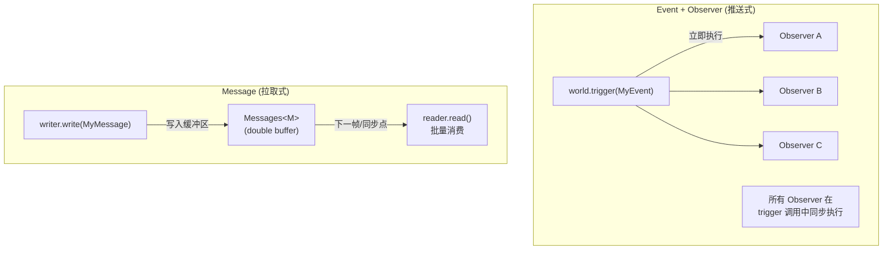
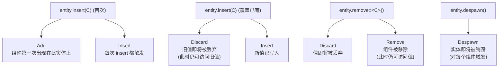

# 第 12 章：Event、Message 与 Observer — 三种通信模型

> **导读**：前一章我们看到 Commands 如何延迟执行结构性变更。但系统间的通信不仅仅是
> 修改 World——它们还需要传递信号、广播状态变化、响应生命周期事件。Bevy 提供了三种
> 通信模型：Event（Observer 推送式即时触发）、Message（拉取式批量处理）和 Observer
>（分布式事件监听）。本章将深入它们的实现机制、5 种生命周期事件、Observer 的三维
> 监听模型，以及选型指南。

## 12.1 三种模型概览

Bevy 的三种通信模型满足不同的设计需求：



*图 12-1: Push 模型 (Event+Observer) vs Pull 模型 (Message)*

| 特性 | Event + Observer | Message |
|------|:---:|:---:|
| 触发方式 | `world.trigger()` | `writer.write()` |
| 执行时机 | 立即（同步） | 延迟（下次 `reader.read()`） |
| 消费方式 | 每个 Observer 独立运行 | `MessageReader` 批量消费 |
| 多消费者 | 每个 Observer 都会执行 | 每个 Reader 独立追踪进度 |
| 适用场景 | 即时响应、生命周期钩子 | 高吞吐量批量处理 |
| 数据生命期 | 触发期间有效 | 2 帧（双缓冲） |
| 开销 | 每次触发遍历 Observer 列表 | 写入 O(1)，读取 O(n) |

为什么 Bevy 需要三种通信机制，而非统一为一种？这是历史演化与设计需求共同作用的结果。最早的 Bevy 只有 Event（现在的 Message），它是一个简单的双缓冲队列。但随着引擎的成熟，开发者发现许多场景需要**即时响应**——例如组件被添加时立刻执行初始化逻辑，而非等到下一帧才处理。Event 的拉取模型天然无法满足这种需求，因此引入了 Observer 的推送模型。而原来的 Event 被重命名为 Message，专注于高吞吐量的批量场景。三种机制分别优化了不同的性能特征：Observer 优化了延迟（立即触发），Message 优化了吞吐量（批量处理），Event trait 则提供了底层的类型抽象。如果强行统一为一种机制，要么在吞吐量场景付出即时触发的开销，要么在即时响应场景引入不必要的缓冲延迟。

## 12.2 Event trait 与 Trigger

### Event trait

`Event` 是所有事件类型的基础 trait：

```rust
// 源码: crates/bevy_ecs/src/event/mod.rs
pub trait Event: Send + Sync + Sized + 'static {
    type Trigger<'a>: Trigger<Self>;
}
```

默认情况下，`#[derive(Event)]` 使用 `GlobalTrigger` 作为 Trigger 实现，这意味着事件会触发所有全局 Observer：

```rust
#[derive(Event)]
struct GameOver {
    score: u32,
}

// trigger the event
world.trigger(GameOver { score: 100 });
```

### EntityEvent trait

`EntityEvent` 是针对特定实体的事件，它额外包含一个目标实体：

```rust
// 源码: crates/bevy_ecs/src/event/mod.rs
pub trait EntityEvent: Event {
    fn event_target(&self) -> Entity;
}

#[derive(EntityEvent)]
struct Damage {
    entity: Entity,  // automatically used as event_target
    amount: f32,
}
```

EntityEvent 的 Trigger 默认为 `EntityTrigger`，它会触发针对特定实体注册的 Observer。如果启用了传播（propagation），事件会沿 `Traversal` 路径向上冒泡。

### Trigger 机制

`Trigger` trait 定义了事件如何被分发给 Observer：

```rust
// 源码: crates/bevy_ecs/src/event/trigger.rs (简化)
pub unsafe trait Trigger<E: Event> {
    unsafe fn trigger(
        &mut self,
        world: DeferredWorld,
        observers: &CachedObservers,
        trigger_context: &TriggerContext,
        event: &mut E,
    );
}
```

Bevy 提供了四种内置 Trigger 实现：

| Trigger | 用途 | 默认使用 |
|---------|------|----------|
| `GlobalTrigger` | 触发所有全局 Observer | `#[derive(Event)]` |
| `EntityTrigger` | 触发特定实体的 Observer | `#[derive(EntityEvent)]` |
| `PropagateEntityTrigger` | 沿 Traversal 路径传播 | `EntityEvent` + 传播 |
| `EntityComponentsTrigger` | 触发组件级 Observer | 生命周期事件 |

Trigger 机制的分层设计体现了 Bevy 的精确控制哲学。全局事件（`GlobalTrigger`）类似于传统的"广播"模式，所有监听者都会收到通知；实体级事件（`EntityTrigger`）则实现了"点对点"通信，只有注册在目标实体上的 Observer 会被触发。传播式事件（`PropagateEntityTrigger`）借鉴了 DOM 的事件冒泡模型，沿 Relationship 链向上传播。这种分层让开发者可以根据场景选择最精确的分发范围——越精确的范围意味着越少的 Observer 被遍历，性能越好。例如，在一个有 10,000 个实体的场景中，一个 EntityEvent 只需查找注册在目标实体上的少数几个 Observer，而全局 Event 需要遍历所有相关的 Observer 列表。

**要点**：Event 通过 Trigger 机制分发给 Observer，不同的 Trigger 决定了分发范围：全局、实体级、传播、或组件级。

## 12.3 五种生命周期事件

Bevy 定义了 5 种组件生命周期事件，它们在组件的不同生命周期阶段自动触发：

```rust
// 源码: crates/bevy_ecs/src/lifecycle.rs
pub struct Add     { pub entity: Entity }  // first insert (new component)
pub struct Insert  { pub entity: Entity }  // every insert (new or replace)
pub struct Discard { pub entity: Entity }  // before value is discarded (replace or remove)
pub struct Remove  { pub entity: Entity }  // when component is removed
pub struct Despawn { pub entity: Entity }  // when entity is despawned
```

它们的触发时机如下：



*图 12-2: 组件生命周期事件触发时机*

这 5 种事件在 `Observers` 的中心化存储中有专门的缓存字段，避免了 HashMap 查找的开销：

```rust
// 源码: crates/bevy_ecs/src/observer/centralized_storage.rs
pub struct Observers {
    // cached lifecycle observers for high-traffic built-in events
    add: CachedObservers,
    insert: CachedObservers,
    discard: CachedObservers,
    remove: CachedObservers,
    despawn: CachedObservers,
    // all other events go through a HashMap lookup
    cache: HashMap<EventKey, CachedObservers>,
}
```

使用生命周期事件的典型场景：

```rust
// respond when a Health component is added to any entity
world.add_observer(|event: On<Add, Health>, query: Query<&Health>| {
    let health = query.get(event.entity).unwrap();
    println!("Entity {:?} now has {} HP", event.entity, health.0);
});

// respond when a component is removed
world.add_observer(|event: On<Remove, Weapon>| {
    println!("Entity {:?} lost their weapon!", event.entity);
});
```

> **Rust 设计亮点**：生命周期事件的 `EventKey` 使用编译期常量 `ComponentId`（从 0 到 4），
> 这使得 `Observers::get_observers_mut()` 可以通过 match 直接返回对应的缓存引用，
> 完全避免了 HashMap 查找。对于这些高频事件（每次 spawn/insert/remove 都会触发），
> 消除 hash 计算的开销至关重要。

5 种生命周期事件的区分看似冗余，但每种都有不可替代的用途。`Add` 和 `Insert` 的分离使得"首次初始化"（只在第一次添加时执行）和"每次更新"（包括值覆盖）可以分别处理——例如，一个"装备系统"可能在 `Add` 时播放装备动画，但在 `Insert`（覆盖已有装备）时只更新属性面板。`Discard` 在值即将被丢弃时触发，此时旧值仍可访问——这对于清理与旧值关联的资源（如释放旧材质的 GPU 缓冲区）至关重要。`Remove` 和 `Despawn` 的分离则区分了"组件被移除但实体仍存在"和"整个实体被销毁"两种场景。这种细粒度的生命周期控制是传统 ECS 框架中常见的痛点——许多框架只提供 add/remove 两种回调，迫使用户在 remove 回调中自行区分是"组件被移除"还是"实体被销毁"。

**要点**：5 种生命周期事件覆盖了组件从添加到销毁的完整生命周期。它们有专用的缓存路径，性能比普通事件更高。

## 12.4 Observer：推送式即时响应

### Observer 组件

Observer 是一个特殊的 Component，它包含一个系统和一个描述符：

```rust
// 源码: crates/bevy_ecs/src/observer/distributed_storage.rs (简化)
pub struct Observer {
    pub(crate) system: Box<dyn AnyNamedSystem>,
    pub(crate) descriptor: ObserverDescriptor,
    pub(crate) runner: ObserverRunner,
    pub(crate) last_trigger_id: u32,
    // ...
}
```

### ObserverDescriptor：三维监听

`ObserverDescriptor` 定义了 Observer 监听的三个维度：

```rust
// 源码: crates/bevy_ecs/src/observer/distributed_storage.rs
pub struct ObserverDescriptor {
    pub(super) event_keys: Vec<EventKey>,      // which events
    pub(super) components: Vec<ComponentId>,    // which components
    pub(super) entities: Vec<Entity>,           // which entities
}
```

这三个维度组合出不同的监听范围：

```
  ObserverDescriptor 三维监听空间

                        entities
                       ╱
                      ╱
                     ╱
  events ───────────╳──────────── components
                   ╱│
                  ╱ │
                 ╱  │

  维度组合:
  ┌─────────┬────────────┬──────────┬───────────────────────────┐
  │ events  │ components │ entities │ 含义                       │
  ├─────────┼────────────┼──────────┼───────────────────────────┤
  │ [Add]   │ []         │ []       │ 任何组件被添加到任何实体    │
  │ [Add]   │ [Health]   │ []       │ Health 被添加到任何实体     │
  │ [Add]   │ [Health]   │ [e1]    │ Health 被添加到 e1          │
  │ [MyEvt] │ []         │ []       │ MyEvt 被触发               │
  │ [MyEvt] │ []         │ [e1]    │ MyEvt 针对 e1 被触发        │
  └─────────┴────────────┴──────────┴───────────────────────────┘
```

*图 12-3: ObserverDescriptor 三维监听空间*

### 中心化存储与 ArchetypeCache

Observer 的查找通过 `CachedObservers` 实现，它按照监听范围组织为多层 HashMap：

```rust
// 源码: crates/bevy_ecs/src/observer/centralized_storage.rs (简化)
pub struct CachedObservers {
    // observers watching all entities, all components
    pub(crate) global_observers: EntityHashMap<ObserverRunner>,
    // observers watching specific components (any entity)
    pub(crate) component_observers: HashMap<ComponentId, CachedComponentObservers>,
    // observers watching specific entities (no component filter)
    pub(crate) entity_observers: EntityHashMap<EntityHashMap<ObserverRunner>>,
}

pub struct CachedComponentObservers {
    // observers for this component on any entity
    pub(crate) global_observers: EntityHashMap<ObserverRunner>,
    // observers for this component on specific entities
    pub(crate) entity_component_observers: EntityHashMap<EntityHashMap<ObserverRunner>>,
}
```

当 Observer 被注册时，它同时更新 Archetype 上的标志位（`ArchetypeFlags`），这样在触发生命周期事件时可以快速跳过没有 Observer 的 Archetype：

```rust
// 源码: crates/bevy_ecs/src/observer/centralized_storage.rs
pub(crate) fn is_archetype_cached(event_key: EventKey) -> Option<ArchetypeFlags> {
    match event_key {
        ADD => Some(ArchetypeFlags::ON_ADD_OBSERVER),
        INSERT => Some(ArchetypeFlags::ON_INSERT_OBSERVER),
        // ...
    }
}
```

### 分布式存储

每个 Observer 实体还携带一个 `Observer` 组件，而被观察的实体携带 `ObservedBy` 组件，存储指向 Observer 实体的反向引用。这种分布式存储使得：

1. Observer 可以被 Query 查询和操作
2. 被观察实体的 despawn 可以自动清理 Observer 注册
3. Observer 自身的 despawn 可以自动注销

Observer 的推送式执行模型有一个重要的性能考量：每次 `trigger()` 调用都会同步地执行所有匹配的 Observer。这意味着如果一个高频事件（如碰撞检测每帧触发数千次）注册了多个 Observer，每次触发都会产生函数调用和系统执行的开销。与第 9 章的 Schedule 并行调度不同，Observer 在触发时是串行执行的——它们运行在 `DeferredWorld` 上，无法利用多线程。因此，对于高频批量事件，Message 的拉取模式通常更高效——写入只是 O(1) 的 push 操作，消费是 O(n) 的批量遍历。Observer 的优势在于低频但需要即时响应的场景，以及需要精确定位到特定实体/组件的场景。

**要点**：Observer 通过 `ObserverDescriptor` 的三维空间（事件 × 组件 × 实体）进行精确匹配。中心化缓存优化查找性能，ArchetypeFlags 实现快速跳过。

## 12.5 Message：拉取式批量处理

Message 是传统的双缓冲事件队列模型，适合高吞吐量的批量处理场景：

```rust
// 源码: crates/bevy_ecs/src/message/mod.rs
pub trait Message: Send + Sync + 'static {}
```

### Messages\<M\> 双缓冲

`Messages<M>` 资源使用双缓冲策略存储消息：

```rust
// 源码: crates/bevy_ecs/src/message/messages.rs (简化)
pub struct Messages<M: Message> {
    pub(crate) messages_a: MessageSequence<M>,  // older buffer
    pub(crate) messages_b: MessageSequence<M>,  // newer buffer
}
```

每次 `update()` 调用时交换缓冲区并清空旧缓冲区：

```
  Messages<M> 双缓冲

  帧 N:
  messages_a: [m1, m2, m3]  ← 上一帧的消息 (即将被清空)
  messages_b: [m4, m5]      ← 本帧写入的消息

  帧 N+1 (调用 update() 后):
  messages_a: [m4, m5]      ← 上一帧的消息 (从 b 交换过来)
  messages_b: []             ← 新缓冲区 (等待新消息)
  messages_a 旧内容 [m1, m2, m3] 已被清空

  MessageReader 可以读取 messages_a + messages_b
  → 消息在写入后存活最多 2 帧
```

*图 12-4: Messages 双缓冲交换机制*

### MessageWriter 与 MessageReader

写入和读取分别通过 `MessageWriter` 和 `MessageReader` 系统参数完成：

```rust
// write messages
fn produce(mut writer: MessageWriter<Collision>) {
    writer.write(Collision { a: entity_a, b: entity_b });
}

// read messages (with per-system cursor)
fn consume(mut reader: MessageReader<Collision>) {
    for collision in reader.read() {
        println!("Collision between {:?} and {:?}", collision.a, collision.b);
    }
}
```

`MessageReader` 使用 `MessageCursor` 追踪每个系统独立的读取进度。这意味着同一条消息可以被多个系统消费，每个系统独立维护自己的消费位置。

双缓冲的 2 帧存活设计是一个精心计算的权衡。如果消息只存活 1 帧（即当前帧写入、当前帧消费），那么在同一帧中 Writer 之后执行的 Reader 可以读到消息，但 Writer 之前执行的 Reader 会错过。2 帧缓冲确保即使 Reader 在 Writer 之前执行，它也能在下一帧读到上一帧的消息。代价是内存使用量翻倍（两个 Vec 而非一个），以及消息的"保质期"增加——如果某个 Reader 在 2 帧内都没有运行（例如被 run_if 条件跳过），消息就会丢失。这种设计假设大多数消费系统每帧都会运行，如果需要更长的消息保留，应使用 Resource 或 Component 而非 Message。

`MessageCursor` 的独立追踪意味着同一条消息可以被任意数量的 Reader 独立消费——这是"扇出"（fan-out）模式的高效实现。与 Observer 的"每个触发都调用所有 Observer"不同，Message 的每个 Reader 在自己的系统调度时机自主消费，完全融入 Schedule 的并行执行框架。这使得 Message 更适合与第 9 章的 SystemSet 配合使用——不同阶段的系统可以在各自的时机消费同一批消息。

**要点**：Message 使用双缓冲 + 独立 Cursor 实现高效的拉取式批量消费。消息存活 2 帧，每个 Reader 独立追踪进度。

## 12.6 选型指南

三种模型各有最佳适用场景：

### 使用 Event + Observer 当你需要：

- **即时响应**：触发时 Observer 立即执行（在同一帧的 `trigger` 调用中）
- **生命周期钩子**：响应组件的 Add/Insert/Remove/Despawn
- **精确目标**：只响应特定实体或特定组件上的事件
- **命令式触发**：在确定的代码位置触发事件

```rust
// good: immediate response to damage
world.add_observer(|event: On<Damage>, mut query: Query<&mut Health>| {
    if let Ok(mut health) = query.get_mut(event.entity) {
        health.0 -= event.amount;
    }
});
```

### 使用 Message 当你需要：

- **高吞吐量**：大量消息需要批量处理（如碰撞检测结果）
- **多消费者**：同一消息需要被多个系统独立消费
- **解耦生产消费**：生产者和消费者在不同的 Schedule 阶段
- **帧间缓冲**：消息需要跨帧存活（最多 2 帧）

```rust
// good: batch processing of collision events
fn detect_collisions(mut writer: MessageWriter<Collision>) {
    // ... write thousands of collision messages
}

fn resolve_physics(mut reader: MessageReader<Collision>) {
    for collision in reader.read() {
        // batch process all collisions
    }
}

fn play_sounds(mut reader: MessageReader<Collision>) {
    for collision in reader.read() {
        // another system independently reads the same messages
    }
}
```

### 对比总结

| 场景 | 推荐 | 原因 |
|------|------|------|
| 组件添加/移除响应 | Observer | 生命周期事件，即时执行 |
| 低频游戏事件 | Observer | 即时响应，清晰的因果关系 |
| 高频批量数据 | Message | 批量处理更高效 |
| 多系统消费同一数据 | Message | 独立 Cursor，无需广播 |
| 实体间交互 | Observer | EntityEvent 精确定位 |
| 跨帧数据传递 | Message | 双缓冲保证 2 帧存活 |

在实际项目中，选型的最大陷阱是将高频事件错误地用 Observer 处理。例如，一个物理引擎每帧产生数千个碰撞事件——如果用 Observer，每个碰撞都会同步触发所有注册的 Observer 系统，总开销与"碰撞数 × Observer 数"成正比。改用 Message，碰撞系统一次性写入所有碰撞事件，各消费系统在后续阶段批量处理，总开销仅与"碰撞数 + 消费系统数"成正比。反过来，将低频的生命周期事件用 Message 处理也不理想——你会失去即时响应能力，初始化逻辑会延迟到下一帧才执行。经验法则是：如果你需要"某事发生时立即做某事"，用 Observer；如果你需要"收集所有发生的事再统一处理"，用 Message。

**要点**：Event+Observer 适合即时响应和精确定位，Message 适合高吞吐量批量处理。选择依据是：触发频率、消费模式和时序要求。

## 本章小结

本章我们深入了 Bevy 的三种通信模型：

1. **Event trait**：`Send + Sync + 'static`，通过 `Trigger` 机制分发给 Observer
2. **5 种生命周期事件**：Add、Insert、Discard、Remove、Despawn，覆盖组件完整生命周期
3. **Observer**：推送式即时触发，`ObserverDescriptor` 三维监听（事件 × 组件 × 实体）
4. **CachedObservers**：中心化缓存优化查找，ArchetypeFlags 实现快速跳过
5. **Message**：拉取式批量处理，`Messages<M>` 双缓冲，`MessageCursor` 独立进度追踪
6. **选型指南**：即时响应用 Observer，高吞吐量用 Message

下一章，我们将深入 Relationship 和 Hierarchy——实体间的结构性纽带，以及 ChildOf/Children 父子关系的双向自动维护机制。
