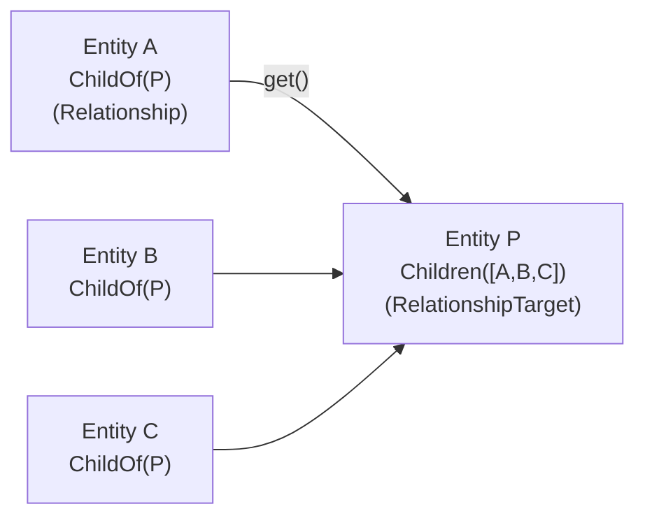
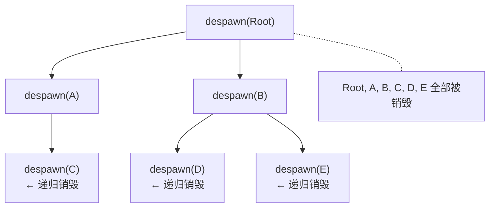

# 第 13 章：Relationship 与 Hierarchy — 实体间的纽带

> **导读**：前一章我们看到 Observer 如何响应组件的生命周期事件。本章将展示这些生命周期
> 钩子的一个重要应用：Relationship。Bevy 的 Relationship 系统通过 Component Hooks
> 自动维护实体间的双向链接，使得插入一个 `ChildOf(parent)` 就能自动在 parent 上
> 维护 `Children` 列表。我们将深入 Relationship trait 的设计、双向维护机制、
> ChildOf/Children 父子关系、自定义 Relationship、linked_spawn 级联销毁，以及
> Traversal 遍历。

## 13.1 Relationship trait：单向声明，双向维护

`Relationship` 是一个 Component，它存储在"源"实体上，指向一个"目标"实体，创建两者之间的关系：

```rust
// 源码: crates/bevy_ecs/src/relationship/mod.rs (简化)
pub trait Relationship: Component + Sized {
    type RelationshipTarget: RelationshipTarget<Relationship = Self>;

    const ALLOW_SELF_REFERENTIAL: bool = false;

    fn get(&self) -> Entity;           // get the target entity
    fn from(entity: Entity) -> Self;   // create from target entity
    fn set_risky(&mut self, entity: Entity); // change target (internal)

    fn on_insert(world: DeferredWorld, ctx: HookContext) { ... }
    fn on_discard(world: DeferredWorld, ctx: HookContext) { ... }
}
```

每个 `Relationship` 都有一个配对的 `RelationshipTarget`——它存在于"目标"实体上，包含所有指向该目标的"源"实体列表：

```rust
// 源码: crates/bevy_ecs/src/relationship/mod.rs (简化)
pub trait RelationshipTarget: Component<Mutability = Mutable> + Sized {
    const LINKED_SPAWN: bool;
    type Relationship: Relationship<RelationshipTarget = Self>;
    type Collection: RelationshipSourceCollection;

    fn collection(&self) -> &Self::Collection;
    fn collection_mut_risky(&mut self) -> &mut Self::Collection;

    fn on_discard(world: DeferredWorld, ctx: HookContext) { ... }
    fn on_despawn(world: DeferredWorld, ctx: HookContext) { ... }
}
```



Relationship = source of truth (源实体的组件)
RelationshipTarget = reflection (目标实体的自动维护列表)

*图 13-1: Relationship 双向链接模型*

在传统 ECS 中，实体间的关系通常通过"在组件中存储 Entity ID"来表达——例如 `struct Parent(Entity)`。但这种朴素方案有两个严重问题：首先，当被引用的实体被销毁时，持有的 Entity ID 变成了悬空引用（dangling reference），类似于 C 语言的悬空指针。其次，反向查询极其低效——"找出所有以 Entity P 为 Parent 的实体"需要遍历整个 World。Bevy 的 Relationship trait 通过 Component Hooks 自动维护反向索引（RelationshipTarget），使得反向查询变为 O(1) 的组件访问。通过 `on_discard` Hook 自动清理关系，悬空引用的问题也被根本解决。

这种设计与 Unity 和 Godot 的内置层级系统有本质区别。Unity/Godot 的父子关系是引擎内核的一部分，与 Transform 系统深度耦合——你无法定义一个"不参与 Transform 传播"的父子关系。Bevy 的 Relationship 是一个通用机制，ChildOf/Children 只是它的一个具体实例。你可以定义 EquippedBy/Equipment、FollowedBy/Followers 等任意关系，它们都享受同样的自动双向维护、级联销毁和 Query 友好性。这种将"关系"从引擎内核中解耦出来、变为可组合的 ECS 原语的设计，是 Bevy 在 ECS 建模灵活性上的重要创新。

**要点**：Relationship 存储在源实体上，是"真相源"。RelationshipTarget 存储在目标实体上，是自动维护的反向引用集合。

## 13.2 双向维护机制：Component Hooks

Relationship 的双向一致性通过 Component Hooks（`on_insert` 和 `on_discard`）自动维护。这些 hooks 在组件被插入或移除时立即执行。

### 插入时（on_insert）

当 `ChildOf(parent)` 被插入到实体 `child` 上时：

```rust
// 源码: crates/bevy_ecs/src/relationship/mod.rs (简化)
fn on_insert(mut world: DeferredWorld, ctx: HookContext) {
    let entity = ctx.entity;
    let target_entity = world.entity(entity).get::<Self>().unwrap().get();

    // 1. reject self-referential if not allowed
    if !Self::ALLOW_SELF_REFERENTIAL && target_entity == entity {
        warn!("Self-referential relationship detected, removing...");
        world.commands().entity(entity).remove::<Self>();
        return;
    }

    // 2. add source entity to target's RelationshipTarget
    if let Ok(mut entity_commands) = world.commands().get_entity(target_entity) {
        entity_commands
            .entry::<Self::RelationshipTarget>()
            .and_modify(move |mut target| {
                target.collection_mut_risky().add(entity);
            })
            .or_insert_with(move || {
                let mut target = Self::RelationshipTarget::with_capacity(1);
                target.collection_mut_risky().add(entity);
                target
            });
    } else {
        // target entity doesn't exist, remove invalid relationship
        world.commands().entity(entity).remove::<Self>();
    }
}
```

### 移除时（on_discard）

当 `ChildOf(parent)` 从实体 `child` 上被移除时：

```rust
// 源码: crates/bevy_ecs/src/relationship/mod.rs (简化)
fn on_discard(mut world: DeferredWorld, ctx: HookContext) {
    let target_entity = world.entity(ctx.entity).get::<Self>().unwrap().get();

    if let Ok(mut target_mut) = world.get_entity_mut(target_entity) {
        if let Some(mut relationship_target) = target_mut.get_mut::<Self::RelationshipTarget>() {
            relationship_target.collection_mut_risky().remove(ctx.entity);
            if relationship_target.len() == 0 {
                // queue removal of empty RelationshipTarget
                world.commands().queue_silenced(/* remove empty target */);
            }
        }
    }
}
```

完整的双向维护流程：

```mermaid
graph TD
    subgraph 插入["entity.insert(ChildOf(parent))"]
        I1["1. ChildOf(parent) 被插入到 entity"]
        I2["2. on_insert hook 触发"]
        I3["a. 检查 parent != entity (非自引用)"]
        I4["b. 检查 parent 实体存在"]
        I5{"parent 有 Children?"}
        I6["添加 entity 到列表"]
        I7["创建 Children([entity])"]
        I1 --> I2 --> I3 --> I4 --> I5
        I5 -->|"是"| I6
        I5 -->|"否"| I7
    end

    subgraph 移除["entity.remove::&lt;ChildOf&gt;()"]
        R1["1. on_discard hook 触发<br/>(旧值仍可访问)"]
        R2["a. 获取旧 parent entity"]
        R3["b. 从 parent 的 Children 中移除 entity"]
        R4{"Children 变空?"}
        R5["移除 Children 组件"]
        R6["2. ChildOf 组件被移除"]
        R1 --> R2 --> R3 --> R4
        R4 -->|"是"| R5 --> R6
        R4 -->|"否"| R6
    end

    subgraph 替换["entity.insert(ChildOf(new_parent)) 替换"]
        P1["1. on_discard: 从 old_parent 的 Children 中移除 entity"]
        P2["2. 新 ChildOf(new_parent) 写入"]
        P3["3. on_insert: 在 new_parent 的 Children 中添加 entity"]
        P1 --> P2 --> P3
    end
```



*图 13-2: Relationship 双向维护流程*

> **Rust 设计亮点**：Relationship 的双向维护完全通过 Component Hooks 实现——用户只需操作
> 源端的 `ChildOf` 组件，目标端的 `Children` 会自动保持同步。这种"单写入点，自动同步"
> 的设计避免了手动维护双向链接时常见的一致性 bug。Hooks 在 `DeferredWorld` 上操作，
> 部分更新通过 Commands 延迟执行（如清理空的 `RelationshipTarget`），兼顾了即时性和安全性。

双向维护的代价是每次关系变更都会触发 Hook 执行，包括访问目标实体的组件并修改其 RelationshipTarget 集合。在批量创建大量关系时（例如一次性 spawn 10,000 个子实体），这些 Hook 调用会成为可观的开销。Bevy 通过 Commands 的延迟执行来缓解这个问题——部分清理操作（如移除空的 RelationshipTarget）被 queue 到 Commands 中异步执行，而非在 Hook 中同步完成。此外，`on_insert` 使用 `entry` API 避免了"先检查是否存在再插入"的两次查找开销。然而，如果你的应用场景涉及频繁的关系变更（每帧数千次 reparenting），可能需要考虑批量操作的优化策略，或者评估是否真的需要自动维护的双向关系。

**要点**：`on_insert` 在目标实体的 RelationshipTarget 中添加源实体，`on_discard` 移除。替换操作先 discard 旧值再 insert 新值，自动保持双向一致。

## 13.3 ChildOf 与 Children：内置父子关系

Bevy 提供了内置的父子关系，由 `ChildOf`（Relationship）和 `Children`（RelationshipTarget）组成：

```rust
// 源码: crates/bevy_ecs/src/hierarchy.rs (简化)
#[derive(Component)]
#[relationship(relationship_target = Children)]
pub struct ChildOf(pub Entity);

#[derive(Component, Default)]
#[relationship_target(relationship = ChildOf, linked_spawn)]
pub struct Children(Vec<Entity>);
```

### 创建父子关系

```rust
// method 1: direct insert
let parent = world.spawn_empty().id();
let child = world.spawn(ChildOf(parent)).id();

// method 2: builder pattern
let parent = world.spawn_empty().with_children(|p| {
    let child1 = p.spawn_empty().id();
    let child2 = p.spawn_empty().id();
}).id();

// method 3: via Commands
commands.spawn_empty().with_children(|p| {
    p.spawn((Sprite::default(), Transform::default()));
    p.spawn(Text::new("child"));
});
```

### Children 的 Deref 访问

`Children` 实现了 `Deref<Target = [Entity]>`，可以直接当作切片使用：

```rust
fn system(query: Query<&Children>) {
    for children in &query {
        // Children derefs to &[Entity]
        for &child in children.iter() {
            // access each child entity
        }
        println!("has {} children", children.len());
    }
}
```

### linked_spawn 级联销毁

`Children` 标记了 `linked_spawn`，这意味着当父实体被 despawn 时，所有子实体（及其后代）也会被自动 despawn：

```rust
// 源码: crates/bevy_ecs/src/relationship/mod.rs
fn on_despawn(mut world: DeferredWorld, ctx: HookContext) {
    let relationship_target = world.entity(ctx.entity)
        .get::<Self>().unwrap();
    for source_entity in relationship_target.iter() {
        world.commands().entity(source_entity).try_despawn();
    }
}
```



如果不想级联销毁, 先 remove ChildOf:
```rust
entity.remove::<ChildOf>();  // detach from parent
parent.despawn();            // only parent is despawned
```

*图 13-3: linked_spawn 级联销毁递归过程*

Bevy 的 ChildOf/Children 设计与 Unity/Godot 的 Transform 层级有一个关键区别：ChildOf 是一个纯粹的**拓扑关系**，与 Transform 传播逻辑完全解耦。在 Unity 中，设置 parent 会自动影响子对象的世界坐标；在 Bevy 中，ChildOf 仅建立实体间的从属关系，Transform 传播是由独立的系统（第 15 章）根据 ChildOf 关系执行的。这意味着你可以创建不参与 Transform 传播的父子关系——例如一个 UI 面板"拥有"一组逻辑对象，但它们在空间上没有从属关系。这种解耦增加了灵活性，但也意味着用户需要理解"拥有 ChildOf 不等于自动继承 Transform"——如果忘记给子实体添加 Transform 组件，它不会跟随父实体移动。

`linked_spawn` 的级联销毁是递归的——销毁一个有 1000 个后代的根实体会产生 1000 次 despawn 调用，每次都会触发 Component Hooks 来清理关系。这在深层嵌套的 UI 层级中可能产生可观的开销。如果需要一次性销毁大量实体，考虑先收集所有后代实体 ID，再批量 despawn，避免递归 Hook 的开销。

**要点**：ChildOf/Children 是内置的父子关系。`linked_spawn` 属性使得 despawn 父实体时自动级联销毁所有后代。

## 13.4 自定义 Relationship

用户可以通过 derive 宏定义自己的 Relationship：

```rust
// custom "EquippedBy" relationship
#[derive(Component)]
#[relationship(relationship_target = Equipment)]
pub struct EquippedBy(pub Entity);

#[derive(Component)]
#[relationship_target(relationship = EquippedBy)]
pub struct Equipment(Vec<Entity>);
```

### 带额外字段的 Relationship

Relationship 可以包含额外字段，但必须用 `#[relationship]` 标记关系字段：

```rust
#[derive(Component)]
#[relationship(relationship_target = Followers)]
pub struct FollowedBy {
    #[relationship]
    pub leader: Entity,
    pub distance: f32,  // must impl Default
}

#[derive(Component)]
#[relationship_target(relationship = FollowedBy)]
pub struct Followers(Vec<Entity>);
```

### allow_self_referential

默认情况下，Relationship 不允许实体指向自身。如果需要自引用（如"喜欢自己"），使用 `allow_self_referential` 属性：

```rust
#[derive(Component)]
#[relationship(relationship_target = PeopleILike, allow_self_referential)]
pub struct LikedBy(pub Entity);

#[derive(Component)]
#[relationship_target(relationship = LikedBy)]
pub struct PeopleILike(Vec<Entity>);
```

注意：启用自引用后，使用 `iter_ancestors` 等递归遍历方法时可能导致无限循环。

### RelationshipSourceCollection

`RelationshipTarget` 的内部集合类型通过 `RelationshipSourceCollection` trait 抽象：

```rust
// 源码: crates/bevy_ecs/src/relationship/relationship_source_collection.rs
pub trait RelationshipSourceCollection {
    type SourceIter<'a>: Iterator<Item = Entity> where Self: 'a;

    fn add(&mut self, entity: Entity);
    fn remove(&mut self, entity: Entity);
    fn iter(&self) -> Self::SourceIter<'_>;
    fn len(&self) -> usize;
    fn with_capacity(capacity: usize) -> Self;
    // ...
}
```

`Vec<Entity>` 是最常用的实现，支持一对多关系。对于一对一关系，可以使用单元素的集合类型。

自定义 Relationship 的能力使得 Bevy 的关系模型远超传统 ECS 框架。在大多数 ECS 中，实体间的关系只能通过"存储 Entity ID 的组件"来间接表达——没有自动的反向索引、没有级联销毁、没有一致性保证。Bevy 的 derive 宏将所有这些基础设施打包为一行注解——`#[relationship(relationship_target = Equipment)]` 就能生成完整的双向维护 Hooks。`RelationshipSourceCollection` 的抽象进一步增加了灵活性：`Vec<Entity>` 适合一对多的有序关系（如父子），`HashSet<Entity>` 适合一对多的无序关系（如标签），甚至可以实现一对一的单元素集合来限制关系的基数。

带额外字段的 Relationship（如 `FollowedBy { leader, distance }`）展示了关系不仅仅是拓扑连接——它可以携带描述这段关系的元数据。这在游戏开发中极为常见：一个"装备在"关系可能需要记录装备的插槽位置，一个"跟随"关系可能需要记录跟随距离。如果没有这种能力，用户就需要创建额外的 Component 来存储关系元数据，并手动与 Relationship 保持同步——正是 Bevy 试图通过自动化来消除的那种一致性维护负担。

**要点**：自定义 Relationship 通过 derive 宏定义，支持额外字段和自引用。RelationshipSourceCollection 抽象允许不同的集合类型。

## 13.5 Traversal：层级遍历

`Traversal` trait 定义了沿 Relationship 链路遍历实体的能力：

```rust
// 源码: crates/bevy_ecs/src/traversal.rs (简化)
pub trait Traversal<D: ?Sized>:
    ReadOnlyQueryData + ReleaseStateQueryData + SingleEntityQueryData
{
    fn traverse(item: Self::Item<'_, '_>, data: &D) -> Option<Entity>;
}
```

`ChildOf` 实现了 `Traversal`，使得事件可以沿父子链向上传播：

```rust
// EntityEvent with propagation via ChildOf traversal
#[derive(EntityEvent)]
#[entity_event(traversal = &'static ChildOf, auto_propagate)]
struct Click {
    entity: Entity,
}
```

当 `Click` 事件在子实体上触发时，它会自动沿 `ChildOf` 链向上传播到父实体、祖父实体，直到根节点或被某个 Observer 停止传播。

Bevy 的 hierarchy 模块提供了便利的遍历方法：

```rust
// iterate ancestors (parent, grandparent, ...)
fn system(query: Query<&ChildOf>) {
    for ancestor in query.iter_ancestors(child_entity) {
        // visit each ancestor
    }
}

// get root ancestor
fn system(query: Query<&ChildOf>) {
    let root = query.root_ancestor(child_entity);
}

// iterate descendants (breadth-first via Children)
fn system(children_query: Query<&Children>) {
    for descendant in children_query.iter_descendants(parent_entity) {
        // visit each descendant
    }
}
```

> **Rust 设计亮点**：Traversal trait 将"如何沿关系链移动"与"对每个节点做什么"解耦。
> 这使得事件传播可以复用任何 Relationship 的链路——不仅限于 ChildOf/Children。
> 你可以定义一个自定义 Relationship（如 `SocketOf`），让事件沿你的自定义层级传播。
> Traversal 本身是 ReadOnlyQueryData，保证遍历过程不会修改 World。

Traversal 的设计将"如何沿关系链移动"与事件传播系统（第 12 章）优雅地连接起来。在 Web 开发中，DOM 事件冒泡只能沿预定义的 parent 链传播。Bevy 的 Traversal 泛型化了这个概念——任何 Relationship 都可以成为传播路径。例如，你可以定义一个 `SocketOf` Relationship 表示物品插槽关系，然后让 EntityEvent 沿 SocketOf 链传播——当一个宝石被攻击时，事件冒泡到镶嵌它的武器，再冒泡到持有武器的角色。这种组合性是 ECS 架构的核心优势：每个独立的机制（Relationship、Traversal、Observer）本身功能有限，但组合起来可以表达极其丰富的行为。

**要点**：Traversal trait 允许沿 Relationship 链路遍历实体，支持事件传播。ChildOf 的 Traversal 实现使得事件可以沿父子链向上冒泡。

## 13.6 RelationshipTarget 的 Clone 行为

当使用 `EntityCloner` 克隆实体时，`RelationshipTarget` 需要特殊处理。直接复制 `Children` 列表会导致重复引用——原始子实体同时被两个父实体引用。

Bevy 通过 `clone_relationship_target` 函数处理这种情况：

```rust
// 源码: crates/bevy_ecs/src/relationship/mod.rs (简化)
pub fn clone_relationship_target<T: RelationshipTarget>(
    component: &T, cloned: &mut T, context: &mut ComponentCloneCtx,
) {
    if context.linked_cloning() && T::LINKED_SPAWN {
        // linked clone: recursively clone all children
        for entity in component.iter() {
            cloned.collection_mut_risky().add(entity);
            context.queue_entity_clone(entity);
        }
    } else if context.moving() {
        // move: update relationship targets to point to new entity
        for entity in component.iter() {
            cloned.collection_mut_risky().add(entity);
            context.queue_deferred(/* update source entity's Relationship */);
        }
    }
}
```

当 `linked_cloning` 启用（且 `LINKED_SPAWN` 为 true）时，克隆父实体会递归克隆所有子实体——整个子树被深度复制。

**要点**：RelationshipTarget 的 clone 行为根据 linked_spawn 和 clone 模式（linked vs move）分别处理，确保关系一致性。

## 本章小结

本章我们深入了 Bevy 的 Relationship 和 Hierarchy 系统：

1. **Relationship trait**：源实体的组件，指向目标实体，是双向关系的"真相源"
2. **RelationshipTarget trait**：目标实体的自动维护列表，通过 Component Hooks 同步
3. **双向维护**：`on_insert` 添加反向引用，`on_discard` 清理反向引用，替换操作先 discard 后 insert
4. **ChildOf/Children**：内置父子关系，`linked_spawn` 实现级联销毁
5. **自定义 Relationship**：支持额外字段、自引用（`allow_self_referential`）、不同集合类型
6. **Traversal**：沿 Relationship 链遍历实体，支持事件传播（冒泡）
7. **Clone 行为**：linked_cloning 递归克隆子树，保证关系一致性

至此，我们完成了 ECS 通信层的全部内容：Commands 延迟执行结构性变更（第 11 章），Event/Message/Observer 实现系统间通信（第 12 章），Relationship/Hierarchy 建立实体间的结构性纽带（本章）。下一部分，我们将进入引擎子系统层——看 ECS 的这些核心机制如何渗透到渲染、物理、UI 等具体领域。
