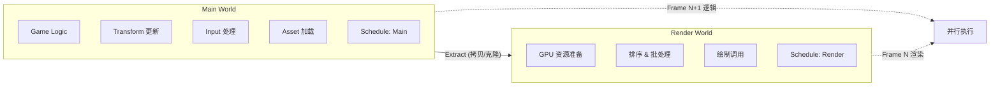
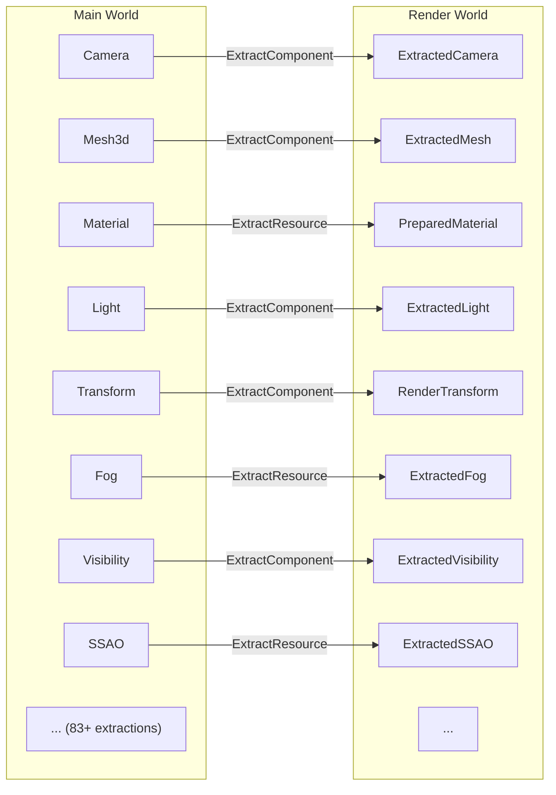
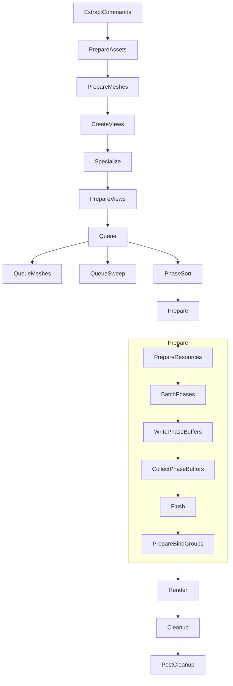

# 第 14 章：渲染架构 — 双 World 与 Extract 模式

> **导读**：前面 13 章我们深入探索了 ECS 内核：World、Entity、Component、
> Archetype、Query、System、Schedule、变更检测、Commands、Event、Message、Observer、
> Relationship。从本章开始，我们将看到这些 ECS 机制如何渗透到 Bevy 引擎的
> 各个子系统中。渲染架构是最能体现 Rust 所有权模型与 ECS 设计哲学融合的子系统。

## 14.1 为什么需要双 World？

Bevy 的渲染运行在一个独立的 `SubApp` 中，拥有自己的 World 和 Schedule。这不是偶然的设计选择，而是 Rust 所有权模型的自然推论。

核心矛盾：渲染需要读取游戏数据（Mesh、Material、Transform），而游戏逻辑需要修改这些数据。在 Rust 中，`&T` 和 `&mut T` 不能同时存在。如果渲染和游戏逻辑共享同一个 World，要么串行执行（浪费 CPU），要么引入 unsafe（破坏安全性）。



*图 14-1: 双 World 架构与 pipelined rendering 并行示意*

解决方案：Main World 拥有数据的 `&mut` 权限，Render World 拥有自己的副本。两者通过 Extract 阶段做一次**单向拷贝**，之后各自独立运行。在默认更新路径中，Main Schedule 先执行，随后才进行 Extract 和 RenderApp 更新；如果额外启用 `PipelinedRenderingPlugin`，渲染还能与后续帧的模拟并行重叠。

```rust
// 源码: crates/bevy_render/src/lib.rs
/// A label for the rendering sub-app.
#[derive(Debug, Clone, Copy, Hash, PartialEq, Eq, AppLabel)]
pub struct RenderApp;
```

`RenderApp` 是一个 `SubApp`，拥有独立的 World、独立的 Schedule、独立的 Resource。当启用 `PipelinedRenderingPlugin` 时，Main World 和 Render World 甚至可以在不同线程上并行执行。

> **Rust 设计亮点**：双 World 是所有权驱动的架构决策。Rust 的借用规则
> 使得 "共享可变" 成为编译错误，Bevy 不是绕过这个限制，而是顺应它——
> 通过数据拷贝换取安全的并行执行。这比传统引擎的锁机制更高效、更安全。

双 World 架构的时序值得仔细理解。在默认模式下，Bevy 会先运行 Main App 的默认 Schedule，然后对每个 SubApp 执行 `extract`，再运行 SubApp 自己的 Schedule。也就是说，Main World 在本帧 `PostUpdate` 中产生的结果，会在同一轮更新中被提取到 Render World。只有在额外启用 `PipelinedRenderingPlugin` 时，渲染才会移到不同线程，与第 N+1 帧模拟重叠执行；这时读者可以把它理解为"渲染相对模拟存在约一帧流水线延迟"。因此，"总是落后一帧"不是双 World 本身的普遍结论，而是 pipelined rendering 的时序特征。

如果不使用双 World，Bevy 有哪些替代方案？一种是"加锁"——用 RwLock 保护共享数据，渲染线程读取、游戏线程写入。但锁的竞争会导致两个线程相互等待，实际并行度很低。另一种是 "copy-on-write"——只在数据被修改时才拷贝，节省不变数据的拷贝开销。Bevy 的 ExtractResource 实际上使用了 `is_changed()` 检测来实现类似的优化——只有变化的数据才会被重新拷贝。完整的 copy-on-write 语义需要更复杂的引用计数或版本号机制，目前 Bevy 选择了更简单直接的"每帧全量拷贝 + 变更检测优化"策略。

**要点**：Render World 是独立的 SubApp，拥有自己的 World 和 Schedule。双 World 架构是 Rust 所有权模型的自然推论，通过数据拷贝换取安全并行。

## 14.2 Extract 模式：跨 World 数据同步

Extract 是双 World 之间的桥梁——在每帧开始时，将 Main World 中渲染所需的数据**拷贝**到 Render World。这个过程由 `ExtractSchedule` 驱动：

```rust
// 源码: crates/bevy_render/src/extract_plugin.rs
/// Schedule in which data from the main world is 'extracted' into the render world.
#[derive(ScheduleLabel, PartialEq, Eq, Debug, Clone, Hash, Default)]
pub struct ExtractSchedule;
```

`ExtractSchedule` 有一个特殊配置：`auto_insert_apply_deferred` 被禁用，Commands 的应用被推迟到 Render Schedule 的 `ExtractCommands` 阶段。这允许 Extract 阶段快速完成（最小化阻塞 Main World 的时间），而 Commands 在渲染线程上异步执行。

Bevy 提供三种提取方式：

### ExtractComponent

将 Main World 中的 Component 提取到 Render World 对应实体上：

```rust
// 源码: crates/bevy_render/src/extract_component.rs (简化)
pub trait ExtractComponent<F = ()>: SyncComponent<F> {
    type QueryData: ReadOnlyQueryData;
    type QueryFilter: QueryFilter;
    type Out: Bundle<Effect: NoBundleEffect>;

    fn extract_component(item: QueryItem<'_, '_, Self::QueryData>) -> Option<Self::Out>;
}
```

通过 `extract_component` 方法，开发者可以在提取时做数据变换——不是简单的 Clone，而是可以裁剪、转换、合并。返回 `None` 会从 Render World 中移除对应组件。

### ExtractResource

将 Main World 中的 Resource 提取到 Render World：

```rust
// 源码: crates/bevy_render/src/extract_resource.rs (简化)
pub trait ExtractResource<F = ()>: Resource {
    type Source: Resource;
    fn extract_resource(source: &Self::Source) -> Self;
}

pub fn extract_resource<R: ExtractResource<F>, F>(
    mut commands: Commands,
    main_resource: Extract<Option<Res<R::Source>>>,
    target_resource: Option<ResMut<R>>,
) {
    if let Some(main_resource) = main_resource.as_ref() {
        if let Some(mut target_resource) = target_resource {
            if main_resource.is_changed() {  // Changed 检测!
                *target_resource = R::extract_resource(main_resource);
            }
        } else {
            commands.insert_resource(R::extract_resource(main_resource));
        }
    }
}
```

注意内部的 `is_changed()` 检查——只有 Resource 发生变化时才执行实际拷贝，这是变更检测（第 10 章）在渲染管线中的直接应用。

### ExtractInstance

比 ExtractComponent 更高性能的批量提取，避免 ECS 开销：

```rust
// 源码: crates/bevy_render/src/extract_instances.rs (简化)
pub trait ExtractInstance: Send + Sync + Sized + 'static {
    type QueryData: ReadOnlyQueryData;
    type QueryFilter: QueryFilter;
    fn extract(item: QueryItem<'_, '_, Self::QueryData>) -> Option<Self>;
}

/// Stores all extracted instances in a HashMap Resource, not per-entity Components.
#[derive(Resource, Deref, DerefMut)]
pub struct ExtractedInstances<EI>(MainEntityHashMap<EI>);
```

ExtractInstance 将提取结果存储在一个 `HashMap` Resource 中，而不是写入每个实体的 Component——减少了实体同步的开销。

### 提取规模

Bevy 引擎内部有 **83+ 次 Extract 操作**，覆盖了渲染所需的几乎所有数据：



*图 14-2: Extract 数据流示意*

Extract 的拷贝开销是双 World 架构的主要性能代价。83+ 次 Extract 操作意味着每帧都有大量的数据复制。在一个拥有 10 万个渲染实体的场景中，仅 Transform 的提取就需要复制 10 万个矩阵（每个 48 字节 `Affine3A`），总计约 4.8MB 的数据搬运。ExtractResource 的 `is_changed()` 优化缓解了 Resource 级别的冗余拷贝，但 ExtractComponent 通常每帧都会遍历所有匹配实体。这就是 ExtractInstance 存在的原因——它将结果存储在 `HashMap` Resource 中而非逐实体写入 Component，避免了在 Render World 中维护实体对应关系的开销。具体成本会随着提取的数据量、平台和启用的渲染特性显著变化，源码本身并没有给出统一的帧时间占比。对于对帧时间极度敏感的应用，可以考虑自定义 Extract 系统，只提取真正变化的数据，利用第 10 章的 `Changed<T>` 过滤器进一步减少拷贝量。

**要点**：三种提取方式（Component、Resource、Instance）覆盖不同场景。ExtractResource 利用 Changed 检测避免冗余拷贝。全引擎 83+ 次 Extract 形成完整的数据同步管线。

## 14.3 RenderSystems：20 个核心阶段的渲染管线

Render World 的主 Schedule 是 `Render`，其中通过 `RenderSystems` 枚举定义了顶层阶段和嵌套子阶段，共 **20 个** SystemSet：

```rust
// 源码: crates/bevy_render/src/lib.rs (简化)
#[derive(Debug, Hash, PartialEq, Eq, Clone, SystemSet)]
pub enum RenderSystems {
    ExtractCommands,          // Apply extract commands
    PrepareAssets,            // Prepare GPU resources
    PrepareMeshes,            // Prepare mesh data
    CreateViews,              // Create shadow map views etc.
    Specialize,               // Specialize materials/meshes
    PrepareViews,             // Prepare view data
    Queue,                    // Queue drawable entities
      // QueueMeshes,          //   - Queue mesh entities
      // QueueSweep,           //   - Sweep invisible items
    PhaseSort,                // Sort render phases
    Prepare,                  // Prepare GPU data
      // PrepareResources,     //   - Init buffers/textures
      // PrepareResourcesBatchPhases,
      // PrepareResourcesWritePhaseBuffers,
      // PrepareResourcesCollectPhaseBuffers,
      // PrepareResourcesFlush,
      // PrepareBindGroups,    //   - Build bind groups
    Render,                   // Actual GPU rendering
    Cleanup,                  // Cleanup
    PostCleanup,              // Despawn temporary entities
}
```

这些阶段通过 `chain()` 串联，形成严格的顺序依赖：



*图 14-3: RenderSystems 阶段执行顺序*

每个阶段都是一个 `SystemSet`，开发者可以将自定义渲染 System 插入到任意阶段。这种设计复用了 Schedule 的系统编排能力（第 9 章），让渲染管线的扩展与游戏逻辑的扩展使用完全相同的机制。

`Render::base_schedule()` 负责构建整个渲染 Schedule 的拓扑结构：

```rust
// 源码: crates/bevy_render/src/lib.rs
impl Render {
    pub fn base_schedule() -> Schedule {
        let mut schedule = Schedule::new(Self);
        schedule.configure_sets(
            (ExtractCommands, PrepareMeshes, CreateViews, Specialize,
             PrepareViews, Queue, PhaseSort, Prepare,
             Render, Cleanup, PostCleanup).chain(),
        );
        // Nested sets within Prepare
        schedule.configure_sets(
            (PrepareResources, PrepareResourcesBatchPhases,
             PrepareResourcesWritePhaseBuffers,
             PrepareResourcesCollectPhaseBuffers,
             PrepareResourcesFlush, PrepareBindGroups)
                .chain().in_set(Prepare),
        );
        schedule
    }
}
```

渲染管线之所以需要如此多的有序阶段，是因为 GPU 编程有严格的数据准备顺序。Mesh 数据必须在 Draw Call 之前上传到 GPU 缓冲区；材质必须在绑定 Bind Group 之前被特化（Specialize）；排序必须在 Queue 之后、Render 之前完成。这些约束是硬件驱动的，不可重排。通过将每个阶段建模为 SystemSet（第 9 章），Bevy 让自定义渲染代码可以自然地"插入"到管线的任意位置——例如后处理效果在 `Render` 阶段添加系统，自定义材质在 `Specialize` 阶段注册。这种统一性是 ECS 架构的巨大优势：游戏开发者不需要学习一套完全不同的渲染管线 API，只需理解 System、SystemSet 和 Schedule 这些已经熟悉的 ECS 概念。

**要点**：RenderSystems 定义了 20 个有序阶段，使用 SystemSet + chain() 建立依赖关系。渲染管线的扩展机制与游戏逻辑完全一致——都是向 Schedule 添加 System。

## 14.4 实体同步：SyncToRenderWorld

Main World 和 Render World 中的实体不是同一个——它们有不同的 Entity ID。Bevy 通过 `SyncToRenderWorld` 标记和 `RenderEntity`/`MainEntity` 映射来维护对应关系：

```rust
// 源码: crates/bevy_render/src/sync_world.rs (概念)
#[derive(Component)]
pub struct SyncToRenderWorld;   // Main World entity marker

#[derive(Component)]
pub struct MainEntity(Entity);  // On Render World entity: points to Main

#[derive(Component)]
pub struct RenderEntity(Entity); // On Main World entity: points to Render
```

当 Main World 中一个带有 `SyncToRenderWorld` 的实体被创建时，`entity_sync_system` 会在 Render World 中创建一个对应实体，并建立双向映射。这确保了 Extract 阶段能正确地将数据从 Main World 实体传输到 Render World 对应实体。

临时渲染实体（`TemporaryRenderEntity`）在每帧的 `PostCleanup` 阶段被销毁，避免资源泄漏。

实体同步的设计揭示了双 World 架构的一个根本复杂性：两个 World 各自独立分配 Entity ID，因此同一个逻辑对象在两个 World 中有不同的 ID。`RenderEntity` 和 `MainEntity` 的双向映射需要在每次实体创建/销毁时维护，增加了一层间接寻址的开销。如果 Bevy 只使用单 World，这个复杂性完全不存在。这是双 World 安全并行的另一个代价——不仅是数据拷贝，还包括实体映射的维护。`TemporaryRenderEntity` 的帧末销毁则防止了渲染专用实体（如临时粒子效果）在 Render World 中无限积累，确保内存使用保持稳定。

**要点**：SyncToRenderWorld 标记建立 Main 到 Render 实体映射，Extract 系统通过 RenderEntity/MainEntity 组件维护跨 World 的实体对应关系。

## 14.5 RenderScheduleOrder 与恢复机制

Render World 的调度顺序由 `RenderScheduleOrder` Resource 管理：

```rust
// 源码: crates/bevy_render/src/lib.rs
#[derive(Resource, Debug)]
pub struct RenderScheduleOrder {
    pub labels: Vec<InternedScheduleLabel>,
}

impl RenderScheduleOrder {
    pub fn insert_after(&mut self, after: impl ScheduleLabel, schedule: impl ScheduleLabel) { ... }
    pub fn insert_before(&mut self, before: impl ScheduleLabel, schedule: impl ScheduleLabel) { ... }
}
```

这是 Resource 驱动调度的典型案例——Schedule 的执行顺序本身就是存储在 World 中的数据，可以在运行时动态修改。Plugin 可以通过 `insert_after` / `insert_before` 在渲染管线中插入自定义 Schedule。

此外，Bevy 提供了 `RenderStartup` Schedule 和 `RenderState` Resource。当渲染设备丢失（如窗口最小化后恢复）时，`RenderStartup` 会重新执行，重新创建所有 GPU 资源——这是一个 Resource + Schedule 协同实现的**优雅恢复机制**。

`RenderScheduleOrder` 将 Schedule 的执行顺序从"硬编码在代码中"提升为"存储在 World 中的数据"，这是 ECS 数据驱动哲学的又一体现。传统引擎的渲染管线扩展通常需要修改引擎源码或通过回调注册——前者侵入性强，后者缺乏顺序控制。Bevy 让 Plugin 在初始化阶段通过 `insert_after/insert_before` 精确地将自定义 Schedule 插入到管线的任意位置，整个过程只是修改一个 Resource 的数据。这种设计也使得渲染管线的调试更容易——你可以在运行时查询 `Res<RenderScheduleOrder>` 来查看完整的管线结构。

RenderStartup 和 RenderState 的恢复机制展示了 ECS 在处理外部硬件事件时的能力。GPU 设备丢失是一个真实的运行时事件——窗口最小化、系统休眠、GPU 驱动崩溃都可能导致。传统方法是注册一个全局的"设备丢失回调"，手动重建所有 GPU 资源。Bevy 将"是否需要重建"存储为 RenderState Resource，将"重建逻辑"组织为 RenderStartup Schedule 中的系统——设备恢复变成了"重新运行一个 Schedule"，而非散落在各处的特殊代码。

**要点**：RenderScheduleOrder 用 Resource 驱动 Schedule 顺序，支持运行时动态插入。RenderStartup 配合 RenderState 实现 GPU 资源的丢失恢复。

## 本章小结

本章我们从 ECS 视角剖析了 Bevy 的渲染架构：

1. **双 World** 是 Rust 所有权模型的自然推论——拷贝数据换取安全并行
2. **Extract 模式** 通过三种 trait（Component、Resource、Instance）实现 83+ 次跨 World 数据同步
3. **ExtractResource** 内部利用 `is_changed()` 避免冗余拷贝
4. **RenderSystems** 定义 20 个有序阶段，复用 Schedule 的系统编排能力
5. **SyncToRenderWorld** 建立跨 World 的实体映射
6. **RenderScheduleOrder** 用 Resource 驱动调度顺序

渲染架构是 ECS 设计最极致的体现：连 "如何渲染" 这件事，都被分解为 World、Entity、Component、Resource、System、Schedule 这些 ECS 原语的组合。

下一章，我们将看到渲染中最基础的数据——Transform——如何利用 Hierarchy 和 Changed 检测实现高效的坐标传播。
