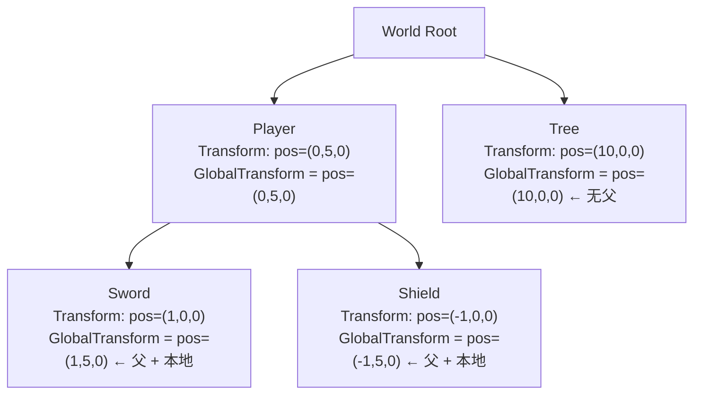
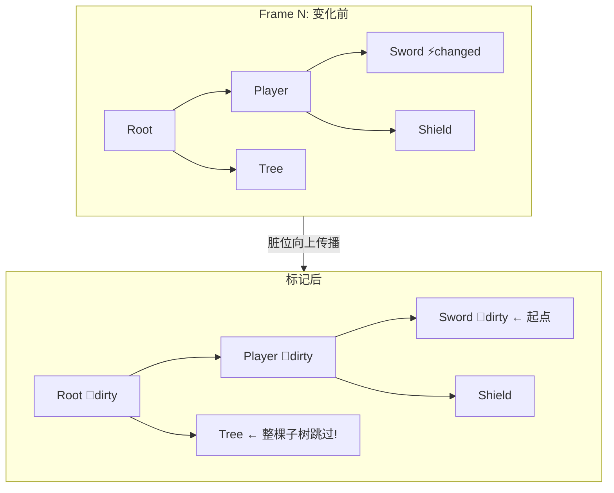
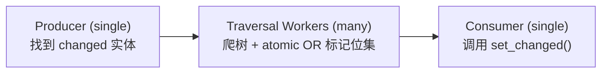

# 第 15 章：Transform 系统

> **导读**：Transform 是几乎所有游戏实体都拥有的组件——位置、旋转、缩放。
> 但在有父子层级的场景中，一个子实体的世界坐标取决于它所有祖先的 Transform。
> 本章探索 Bevy 如何用 Hierarchy（第 13 章）和 Changed 检测（第 10 章）
> 实现高效的坐标传播，以及静态场景优化如何跳过不变的子树。

## 15.1 Transform vs GlobalTransform

Bevy 将变换分为两个组件：

```rust
// 源码: crates/bevy_transform/src/components/transform.rs (简化)
#[derive(Component)]
#[require(GlobalTransform, TransformTreeChanged)]
pub struct Transform {
    pub translation: Vec3,
    pub rotation: Quat,
    pub scale: Vec3,
}

// 源码: crates/bevy_transform/src/components/global_transform.rs (简化)
#[derive(Component)]
pub struct GlobalTransform(Affine3A);
```

| | Transform | GlobalTransform |
|---|---|---|
| 语义 | 相对于父实体的**局部**变换 | 相对于世界原点的**全局**变换 |
| 谁写 | 用户/游戏逻辑 | 引擎传播系统（**只读**） |
| 存储 | Vec3 + Quat + Vec3 (TRS) | Affine3A (3x4 仿射矩阵) |
| Required | 自动附带 GlobalTransform | - |

用户只需修改 `Transform`，Bevy 的传播系统会自动计算 `GlobalTransform`：



*图 15-1: Transform 传播树*

注意 `Transform` 通过 `#[require(GlobalTransform, TransformTreeChanged)]` 声明了 Required Components（第 5 章）——spawn 一个带 `Transform` 的实体时，`GlobalTransform` 和 `TransformTreeChanged` 会自动附加。

> **Rust 设计亮点**：GlobalTransform 内部使用 `Affine3A`（3x4 仿射矩阵）而非 TRS 分量。
> 这是因为矩阵乘法可以高效地链式组合变换，而 TRS 分量的组合需要先转矩阵再乘再拆——
> 存储已经组合好的矩阵避免了重复转换的开销。`Affine3A` 使用 SIMD 对齐（128 位），
> 在批量运算时充分利用硬件加速。

为什么将变换分为两个组件而非合并为一个？这看似增加了复杂度，但解决了一个根本问题：在有层级关系的场景中，修改父实体的 Transform 应该自动影响所有后代的世界坐标。如果只有一个"世界坐标"组件，用户修改父实体时必须手动更新所有后代——这在有深层嵌套的 UI 或骨骼动画中几乎不可行。分离为局部（Transform）和全局（GlobalTransform）后，用户只需修改局部坐标，引擎自动计算全局坐标。这种设计在几乎所有现代游戏引擎中都有体现——Unity 的 localPosition/position、Godot 的 position/global_position——Bevy 将其映射到 ECS 的组件模型中。

分离设计的代价是存储开销和一致性延迟。每个实体额外存储一个 `Affine3A`（48 字节），在 10 万个实体的场景中约占 4.8MB。更重要的是，GlobalTransform 只在 PostUpdate 阶段被更新（见 15.4），如果你在 Update 中修改了 Transform 然后立即读取 GlobalTransform，读到的是上一帧的值。这种一帧延迟在大多数场景中不可感知，但在需要精确物理交互的场景中可能导致微妙的位置偏差。`propagate_transforms_for` 函数提供了按需提前传播的能力来解决特殊场景。

**要点**：Transform 是局部坐标（用户写），GlobalTransform 是世界坐标（引擎算）。Required Components 确保两者总是成对出现。

## 15.2 传播系统：Hierarchy × Changed 检测

Transform 传播发生在 `PostUpdate` 阶段，由两个核心系统组成：

### sync_simple_transforms

处理**没有父子关系**的实体——它们的 GlobalTransform 直接等于 Transform：

```rust
// 源码: crates/bevy_transform/src/systems.rs (简化)
pub fn sync_simple_transforms(
    mut query: ParamSet<(
        Query<
            (&Transform, &mut GlobalTransform),
            (
                Or<(Changed<Transform>, Added<GlobalTransform>)>,
                Without<ChildOf>,
                Without<Children>,
            ),
        >,
        // ... orphaned entities handling
    )>,
    mut orphaned: RemovedComponents<ChildOf>,
) {
    query.p0().par_iter_mut()
        .for_each(|(transform, mut global_transform)| {
            *global_transform = GlobalTransform::from(*transform);
        });
}
```

关键过滤条件：`Changed<Transform>` 或 `Added<GlobalTransform>`，同时 `Without<ChildOf>` 且 `Without<Children>`。这意味着：
- 只处理变化的实体（Changed 检测）
- 只处理没有层级关系的实体（交给专门的传播系统处理有层级的）
- 使用 `par_iter_mut` 并行执行

### propagate_parent_transforms

处理**有父子关系**的实体——需要从根到叶递归传播：

```
  传播算法

  对每个根实体 (Without<ChildOf>):
    global = Transform → GlobalTransform
    
    对每个子实体 (递归):
      global = parent.global * child.transform
```

传播系统利用 `ChildOf` Relationship（第 13 章）遍历层级树，利用 `Changed<Transform>` 检测跳过未变化的子树。

`ParamSet` 的使用值得关注——它解决了 Query 之间的别名冲突问题（第 7 章），让同一个系统可以安全地在不同过滤条件下访问相同组件。

两个系统的分工是性能优化的直接体现。在大多数游戏中，大部分实体是"独立"的——它们没有父子关系。对于这些实体，GlobalTransform 就是 Transform 的直接转换，不需要矩阵乘法。`sync_simple_transforms` 利用 `Without<ChildOf>` 和 `Without<Children>` 过滤器精确命中这些实体，并使用 `par_iter_mut` 进行并行处理——在 10 万个独立实体中，如果只有 1000 个发生了移动，`Changed<Transform>` 过滤器将工作量缩减到 1%，再由多核并行执行，效率极高。

层级传播的成本则显著更高。`propagate_parent_transforms` 必须从根到叶递归遍历层级树，对每个有父子关系的实体执行矩阵乘法：`child.global = parent.global * child.transform`。这个过程是天然串行的——子实体的 GlobalTransform 依赖父实体的 GlobalTransform，无法完全并行化。在一棵有 10 层深度的 UI 层级树中，每一层都必须等待上一层计算完成。这就是为什么第 15.3 节的 StaticTransformOptimizations 如此重要——通过脏位向上传播，可以跳过整棵不变的子树，将 O(所有层级实体) 降低到 O(变化子树的实体)。

**要点**：两个系统分工明确——simple 处理无层级实体，propagate 处理有层级实体。Changed 检测避免每帧重新计算所有 GlobalTransform。

## 15.3 StaticTransformOptimizations：脏位传播

在大型静态场景中（如建筑、地形），绝大多数实体的 Transform 每帧都不变。传播系统仍然需要遍历整棵层级树来检查 Changed——这在上万个静态实体时会成为性能瓶颈。

`StaticTransformOptimizations` 通过**脏位 (dirty bit) 向上传播**解决这个问题：

```rust
// 源码: crates/bevy_transform/src/systems.rs
#[derive(Resource, Debug, Default, PartialEq, Eq)]
pub enum StaticTransformOptimizations {
    #[default]
    Enabled,
    Disabled,
}
```

核心机制由 `mark_dirty_trees` 系统实现：

```rust
// 源码: crates/bevy_transform/src/systems.rs (简化)
pub fn mark_dirty_trees(
    changed: Query<Entity, Or<(Changed<Transform>, Changed<ChildOf>, Added<GlobalTransform>)>>,
    mut transforms: Query<&mut TransformTreeChanged>,
    parents: Query<&ChildOf>,
    static_optimizations: Res<StaticTransformOptimizations>,
) {
    // For each changed entity, walk UP the tree marking ancestors as dirty
    for entity in changed.iter() {
        let mut next = entity;
        while let Ok(mut tree) = transforms.get_mut(next) {
            if tree.is_changed() && !tree.is_added() {
                break; // Already marked, stop climbing
            }
            tree.set_changed();
            if let Ok(parent) = parents.get(next).map(ChildOf::parent) {
                next = parent;
            } else {
                break;
            }
        }
    }
}
```

工作流程：



*图 15-2: 脏位向上传播优化静态场景*

在 `std` 环境下，`mark_dirty_trees` 使用并行实现——通过 `AtomicU64` 位集和多线程 channel 协同标记脏位，确保在大场景中依然高效：



*图 15-3: 并行脏位标记流水线*

这种三阶段流水线设计（producer-traversal-consumer）利用了 `ComputeTaskPool`（第 23 章），实现了标记过程的完全并行化。

脏位策略的核心洞察是：在一个典型的大场景中，绝大多数实体每帧都不变。一个有 10 万个实体的城市场景中，也许每帧只有 50 个角色在移动。如果没有脏位优化，传播系统需要遍历全部 10 万个实体来检查 `Changed<Transform>`——即使 99.95% 的实体没有变化。脏位向上传播将问题转化为：只从变化的叶节点开始，向上标记到根节点。传播系统在遍历时检查根节点是否被标记——如果没有，整棵子树直接跳过。

为什么脏位需要"向上"传播而非"向下"？因为传播系统是从根到叶遍历的——它首先需要知道"根节点的某个后代是否发生了变化"，才能决定是否进入这棵子树。如果脏位向下传播，传播系统仍然需要从根开始检查每个节点，无法实现子树级别的跳过。向上传播让根节点成为"哨兵"——一个干净的根意味着整棵子树都是干净的。

`AtomicU64` 位集的使用反映了脏位标记在大场景中的规模挑战。当数百个实体同时发生变化时，它们可能在不同线程上并行地标记各自的祖先链。如果使用普通的 `set_changed()` 调用，多个线程同时修改同一个祖先的 `TransformTreeChanged` 组件会导致数据竞争。原子位集允许多个线程无锁地并行标记，然后由单一消费者线程将位集转换为实际的组件变更标记。这种三阶段流水线（producer-traversal-consumer）的设计直接借鉴了并行图算法中的常见模式。

**要点**：StaticTransformOptimizations 通过脏位向上传播，让传播系统跳过整棵不变子树。大场景下使用 atomic 位集 + 多线程流水线并行标记。默认启用。

## 15.4 TransformSystems 与执行时机

Transform 传播在 `PostUpdate` 阶段执行，由 `TransformSystems` SystemSet 组织：

```rust
// 源码: crates/bevy_transform/src/plugins.rs (概念)
#[derive(SystemSet)]
pub enum TransformSystems {
    MarkDirtyTrees,  // Step 1: mark dirty trees
    Propagate,       // Step 2: propagate transforms
}
```

执行顺序：`MarkDirtyTrees → Propagate`。

这意味着如果你在 `PostUpdate` 或之后修改 Transform，GlobalTransform 的更新会延迟一帧。这是有意为之的设计——所有游戏逻辑（`Update`）完成后，统一传播一次，避免在同一帧内多次重复计算。

`propagate_transforms_for<F>` 是一个泛型辅助系统，允许对特定过滤条件的实体提前传播——例如在同一帧内移动并渲染相机：

```rust
// 源码: crates/bevy_transform/src/systems.rs
pub fn propagate_transforms_for<F: QueryFilter + 'static>(
    tf_helper: TransformHelper,
    mut query: Query<(Entity, &mut GlobalTransform), F>,
) {
    for (entity, mut gtf) in query.iter_mut() {
        if let Ok(computed) = tf_helper.compute_global_transform(entity) {
            *gtf = computed;
        }
    }
}
```

"PostUpdate 统一传播"的设计体现了批处理优化的哲学。如果允许 Transform 变更在任意时刻立即传播 GlobalTransform，那么一个实体在同一帧内被移动三次就会触发三次传播——前两次是浪费。通过推迟到 PostUpdate，无论 Transform 被修改了多少次，传播只执行一次，使用最终值。这与第 10 章的变更检测配合得很好——`Changed<Transform>` 不关心"变了几次"，只关心"是否变了"。这种设计假设游戏逻辑在 Update 阶段完成所有 Transform 修改，渲染在 PostUpdate 之后读取 GlobalTransform。如果某个系统需要在 Update 中读取最新的 GlobalTransform（例如将相机对准刚移动的目标），可以使用 `TransformHelper::compute_global_transform()` 按需计算，或者使用 `propagate_transforms_for` 提前传播特定实体。

**要点**：Transform 传播在 PostUpdate 统一执行，游戏逻辑应在 Update 中修改 Transform。propagate_transforms_for 提供按需提前传播的能力。

## 本章小结

本章我们探索了 Bevy Transform 系统的 ECS 设计：

1. **Transform** 是局部坐标（用户写），**GlobalTransform** 是世界坐标（引擎算），通过 Required Components 自动配对
2. **两个系统分工**：sync_simple_transforms 处理无层级实体，propagate_parent_transforms 处理有层级实体
3. **Changed 检测**避免每帧重算所有 GlobalTransform
4. **StaticTransformOptimizations** 通过脏位向上传播，跳过整棵不变子树
5. **并行脏位标记**使用 atomic 位集 + 三阶段流水线
6. 传播在 **PostUpdate** 统一执行，确保一帧内只算一次

Transform 系统是 ECS 各机制协同工作的典范：Component（Transform/GlobalTransform）、Relationship（ChildOf 层级）、Changed 检测、ParamSet、并行迭代、SystemSet 排序——全部无缝配合。

下一章，我们将看到另一个核心子系统——Asset 系统如何用 Handle<T> 和 AssetServer 管理游戏资源。
