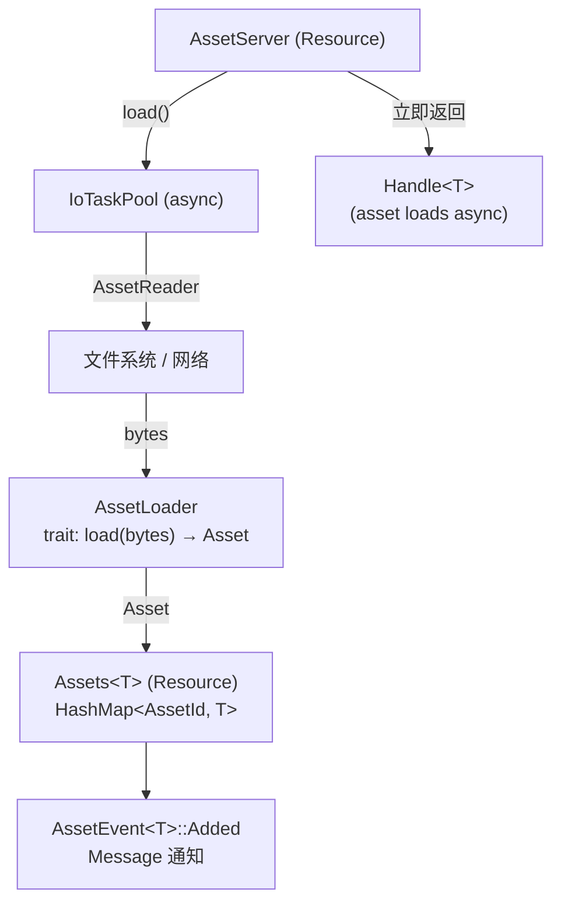
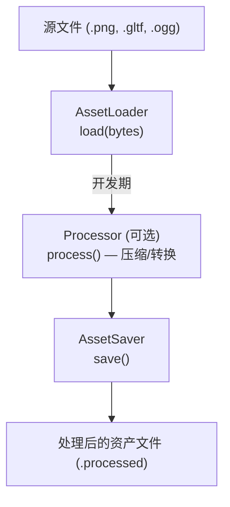
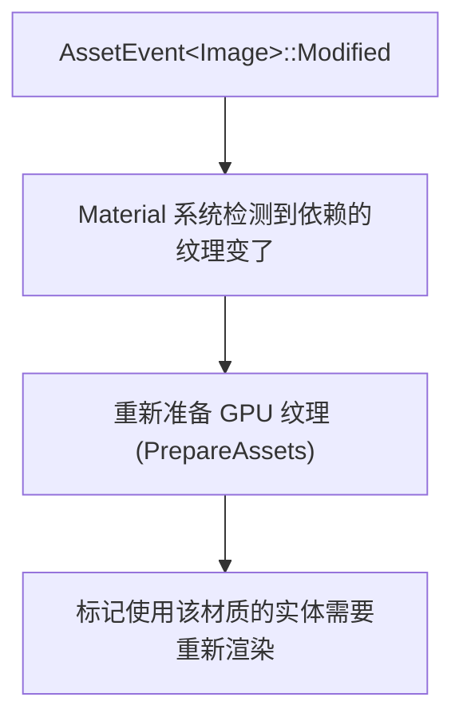

# 第 16 章：Asset 系统

> **导读**：游戏引擎需要管理大量外部资源——纹理、模型、音频、字体。Bevy 的
> Asset 系统将这些资源建模为 ECS 原语：AssetServer 是 Resource，Handle<T>
> 用 PhantomData 实现编译期类型安全，Asset 事件驱动响应链，
> AssetLoader/Processor/Saver 构成完整的资产管线。

## 16.1 Handle<T>：PhantomData 的强类型设计

`Handle<T>` 是 Asset 系统的核心类型——它是一个对特定类型 Asset 的引用：

```rust
// 源码: crates/bevy_asset/src/handle.rs (简化)
#[derive(Reflect)]
pub enum Handle<A: Asset> {
    /// Strong reference: keeps the asset alive until all handles are dropped.
    Strong(Arc<StrongHandle>),
    /// Uuid reference: does not keep the asset alive.
    Uuid(Uuid, PhantomData<fn() -> A>),
}
```

`StrongHandle` 内部没有类型参数，它存储 `TypeId` 和 `AssetIndex`：

```rust
// 源码: crates/bevy_asset/src/handle.rs
pub struct StrongHandle {
    pub(crate) index: AssetIndex,
    pub(crate) type_id: TypeId,        // Runtime type identifier
    pub(crate) asset_server_managed: bool,
    pub(crate) path: Option<AssetPath<'static>>,
    pub(crate) meta_transform: Option<MetaTransform>,
    pub(crate) drop_sender: Sender<DropEvent>,  // Drop notification
}
```

类型安全完全由 `Handle<A>` 的 `PhantomData<fn() -> A>` 保证——在 `Uuid` 变体中，`PhantomData` 让编译器区分 `Handle<Image>` 和 `Handle<Mesh>`，但不占用运行时内存。

```
  Handle<T> 类型安全

  Handle<Image>  ──→ AssetId<Image>  ──→ Assets<Image>  ✓
  Handle<Mesh>   ──→ AssetId<Mesh>   ──→ Assets<Mesh>   ✓
  Handle<Image>  ──→ AssetId<Image>  ──→ Assets<Mesh>   ✗ 编译错误!

  PhantomData<fn() -> A> 在编译期阻止类型混用
```

*图 16-1: Handle<T> 的编译期类型安全*

> **Rust 设计亮点**：Handle 在 Strong 变体中使用 `Arc<StrongHandle>` 实现引用计数，
> 在 Uuid 变体中使用 `PhantomData<fn() -> A>>`——注意是 `fn() -> A` 而非 `A`。
> 使用函数指针类型作为 PhantomData 参数，使 Handle 对 A 既不拥有 (own) 也不借用
> (borrow)，避免了不必要的 Drop、Send/Sync 约束传播。这是 Rust 中 PhantomData
> 的最佳实践用法。

### 引用计数与自动卸载

`StrongHandle` 实现了 `Drop`——当最后一个 Strong Handle 被丢弃时，它通过 `drop_sender` 通知 AssetServer，触发资产卸载：

```rust
// 源码: crates/bevy_asset/src/handle.rs
impl Drop for StrongHandle {
    fn drop(&mut self) {
        let _ = self.drop_sender.send(DropEvent {
            index: ErasedAssetIndex::new(self.index, self.type_id),
            asset_server_managed: self.asset_server_managed,
        });
    }
}
```

这是 RAII 模式的直接应用——资源的生命周期由 Handle 的所有权决定，无需手动管理。

Handle 的引用计数策略是一个深思熟虑的设计选择。使用 `Arc`（原子引用计数）而非 `Rc`（非原子引用计数）是因为 Handle 需要在多线程环境中安全传递——系统可能在不同线程上运行，共享同一个 Handle。原子操作的开销在每次 clone/drop 时约为几纳秒，对于 Handle 的使用频率而言完全可以接受。与之对比，如果使用垃圾回收（GC）来管理 Asset 生命周期，虽然可以避免引用计数的开销，但会引入不确定的 GC 停顿——这在需要稳定帧时间的游戏中是不可接受的。

Strong Handle 的 `drop_sender` 通道设计值得注意：当最后一个 Handle 被 drop 时，它不是直接释放 Asset，而是发送一个 `DropEvent` 通知 AssetServer。这种间接释放有两个原因：首先，Handle 的 drop 可能发生在任意线程、任意时刻，直接释放 Asset 可能导致正在使用该 Asset 的渲染线程出现数据竞争；其次，AssetServer 可以在统一的时间点（如帧末）批量处理释放请求，避免频繁的碎片化释放。这种"通知式卸载"模式与 Rust 的所有权系统完美契合——Handle 拥有对 Asset 的"逻辑所有权"，但"物理释放"由 AssetServer 统一管理。

**要点**：Handle<T> 用 PhantomData 实现零成本的编译期类型安全，用 Arc + Drop 实现引用计数和自动卸载。

## 16.2 AssetServer：Resource 驱动的异步加载

`AssetServer` 是一个全局 Resource，负责协调资产的加载、跟踪和卸载：

```rust
// 源码: crates/bevy_asset/src/server/mod.rs (概念)
// AssetServer is backed by an Arc, so clones share state.
// It can be freely used in parallel.
```

典型的加载流程：



*图 16-2: Asset 加载生命周期*

关键设计点：

1. **立即返回 Handle**：`load()` 立即返回一个 Handle，资产在后台异步加载。System 可以检查加载状态
2. **IoTaskPool 异步执行**：磁盘/网络 I/O 不阻塞 ECS 主循环
3. **Assets<T> Resource**：每种 Asset 类型有独立的 `Assets<T>` Resource，本质是 `HashMap<AssetId, T>`

AssetServer 作为 Resource 存储在 World 中，这意味着它完全融入 ECS 的访问控制框架。系统通过 `Res<AssetServer>` 只读访问它来发起加载请求，通过 `ResMut<Assets<T>>` 可变访问来手动创建或修改 Asset。调度器（第 9 章）确保对 `Assets<Image>` 的可变访问不会与对同一 Resource 的只读访问并行——这比传统引擎中用锁保护 AssetManager 更安全，因为冲突在调度层面被阻止，而非在运行时通过锁等待。立即返回 Handle 的设计也与 Rust 的异步模型一致——Handle 类似于一个 "Future"，它代表了一个尚未完成的加载操作，但可以被存储、传递和引用。

## 16.3 AssetLoader / Processor / Saver 管线

Asset 管线由三个 trait 组成：

```rust
// 源码: crates/bevy_asset/src/loader.rs (简化)
pub trait AssetLoader: TypePath + Send + Sync + 'static {
    type Asset: Asset;
    type Settings: Settings + Default + Serialize + Deserialize;
    type Error: Into<BevyError>;

    fn load(
        &self,
        reader: &mut dyn Reader,
        settings: &Self::Settings,
        load_context: &mut LoadContext,
    ) -> impl ConditionalSendFuture<Output = Result<Self::Asset, Self::Error>>;

    fn extensions(&self) -> &[&str] { &[] }
}

// 源码: crates/bevy_asset/src/saver.rs (简化)
pub trait AssetSaver: TypePath + Send + Sync + 'static {
    type Asset: Asset;
    type Settings: Settings;
    type OutputLoader: AssetLoader;  // Loader for the saved format
    type Error: Into<BevyError>;
    // ...
}
```



*图 16-3: AssetLoader / Processor / Saver 三阶段管线*

Processor 和 Saver 主要用于开发期的**资产预处理**——将源文件转换为运行时优化的格式。运行时只使用 AssetLoader。

## 16.4 Asset 事件与 Changed 检测链

Asset 系统通过 `AssetEvent<T>` Message 通知其他系统资产状态变化：

```rust
// 源码: crates/bevy_asset/src/event.rs
#[derive(Message, Reflect)]
pub enum AssetEvent<A: Asset> {
    Added { id: AssetId<A> },
    Modified { id: AssetId<A> },
    Removed { id: AssetId<A> },
    Unused { id: AssetId<A> },
    LoadedWithDependencies { id: AssetId<A> },
}
```

这些事件驱动了一条**响应链**：



`AssetChanged<T>` Query 过滤器进一步简化了响应链的编写——它让 System 直接查询 "哪些实体的 Asset Handle 指向的资产发生了变化"：

```rust
// Usage in a system
fn react_to_material_changes(
    query: Query<&MeshMaterial3d<StandardMaterial>, AssetChanged<StandardMaterial>>,
) {
    for material_handle in &query {
        // This entity's material asset was modified
    }
}
```

### 热重载 (Hot Reload)

热重载建立在 Asset 事件之上：

1. `AssetSource` 监听文件系统变更（`AssetSourceEvent`）
2. 文件变更触发重新加载（通过 AssetLoader）
3. 重新加载完成后发出 `AssetEvent::Modified`
4. 依赖该资产的系统自动响应

整个链路不需要特殊的热重载代码——已有的事件响应机制自然支持热重载。

热重载的边缘情况值得深入讨论。最常见的问题是"部分加载"——当文件系统事件通知文件已更改时，文件可能还在被编辑器写入，此时读取会得到不完整的数据。Bevy 的 AssetSource 通过可配置的"去抖动"（debounce）延迟来缓解这个问题——等待文件变更事件停止一段时间后才触发重新加载。另一个边缘情况是"依赖链重载"——当一个 GLTF 模型引用的纹理被修改时，GLTF 本身没有变化，但渲染结果应该更新。Bevy 通过 `LoadedWithDependencies` 事件和 AssetLoader 的依赖追踪机制来处理这种情况：AssetLoader 在加载时声明依赖的子资产，当子资产变更时，父资产也会收到重新加载通知。

`AssetChanged<T>` 过滤器是变更检测（第 10 章）在 Asset 领域的创造性扩展。普通的 `Changed<Handle<T>>` 只能检测 Handle 本身是否被替换——例如将实体的材质从 A 换为 B。但 `AssetChanged<T>` 还能检测 Handle 指向的 Asset 内容是否被修改——例如材质 A 的颜色属性被热重载改变了。这种深层变更检测需要跨越 Handle → AssetId → Assets<T> → AssetEvent 的间接引用链，是 ECS 的 Query 过滤器与 Asset 事件系统协同工作的典型案例。

**要点**：AssetEvent 驱动完整的变更响应链。AssetChanged<T> 过滤器简化了 Query 中的资产变更检测。热重载自然建立在已有的事件机制之上。

## 16.5 Assets<T> 的 ECS 存储模式

每种 Asset 类型都有独立的 `Assets<T>` Resource：

```rust
// 源码: crates/bevy_asset/src/assets.rs (概念)
#[derive(Resource)]
pub struct Assets<A: Asset> {
    // Internal storage: dense array indexed by AssetIndex
    // ...
    handle_provider: AssetHandleProvider,
}
```

`Assets<T>` 作为 Resource 存储在 World 中，System 通过 `Res<Assets<Image>>`、`ResMut<Assets<Mesh>>` 等方式访问。这意味着对 `Assets<Image>` 和 `Assets<Mesh>` 的访问互不冲突——调度器可以将访问不同 Asset 类型的 System 并行执行。

> **Rust 设计亮点**：`Assets<T>` 利用泛型实现了按类型分片的存储。每个 `T` 生成
> 独立的 Resource 类型（单态化），使得 ECS 调度器可以精确判断 System 之间是否存在
> 数据竞争。这比 "一个大 AssetManager" 的设计更细粒度，带来更好的并行性。

这种按类型分片的存储模式与第 5 章 Component 的列式存储（Column）设计思路一脉相承——不同类型的数据存储在不同的容器中，使得对不同类型的访问互不干扰。在规模上，一个典型的大型游戏可能有数十种 Asset 类型、数千个 Asset 实例。按类型分片意味着一个系统处理 Image 资产时，不会阻塞另一个系统处理 AudioSource 资产。如果使用传统的"一个 AssetManager 管理所有类型"的设计，对任意 Asset 的访问都会相互排斥，并行度大幅降低。代价是每种 Asset 类型都需要注册独立的 Resource，增加了 World 中的 Resource 数量，但这种注册通常由 Plugin 自动完成，对用户透明。

**要点**：每种 Asset 类型有独立的 Assets<T> Resource，利用 Rust 泛型单态化实现按类型分片，最大化 System 并行度。

## 本章小结

本章我们从 ECS 视角探索了 Bevy 的 Asset 系统：

1. **Handle<T>** 用 `PhantomData<fn() -> A>` 实现零成本编译期类型安全
2. **Strong Handle** 通过 `Arc + Drop` 实现 RAII 式自动卸载
3. **AssetServer** 作为 Resource 驱动异步加载，立即返回 Handle
4. **AssetLoader/Processor/Saver** 构成三阶段管线
5. **AssetEvent** 驱动变更响应链，热重载自然建立在事件机制之上
6. **Assets<T>** 按类型分片存储，最大化 System 并行度

Asset 系统展示了 ECS 的另一个维度：Resource 不仅存储状态，还驱动异步工作流。Handle 的 PhantomData 设计是 Rust 类型系统在游戏引擎中的精妙应用。

下一章，我们将看到 Input 系统如何在 Resource 和 Entity+Component 两种模式之间选择最合适的 ECS 建模方式。
