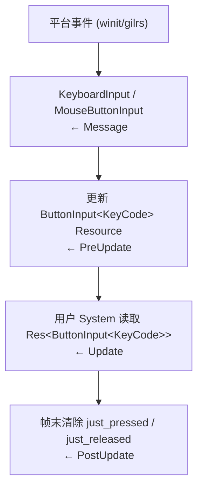
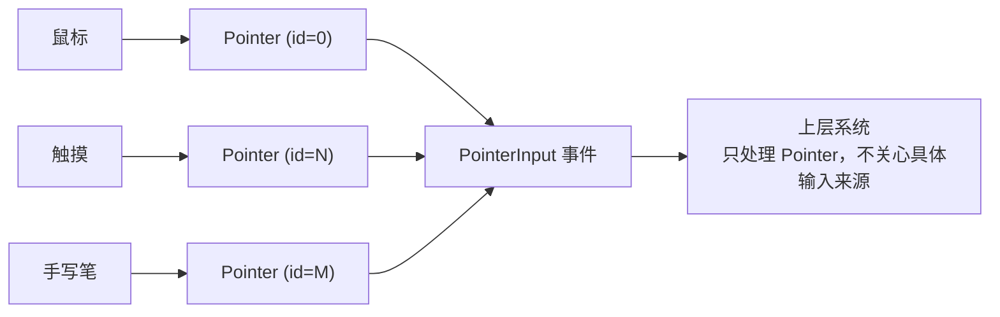
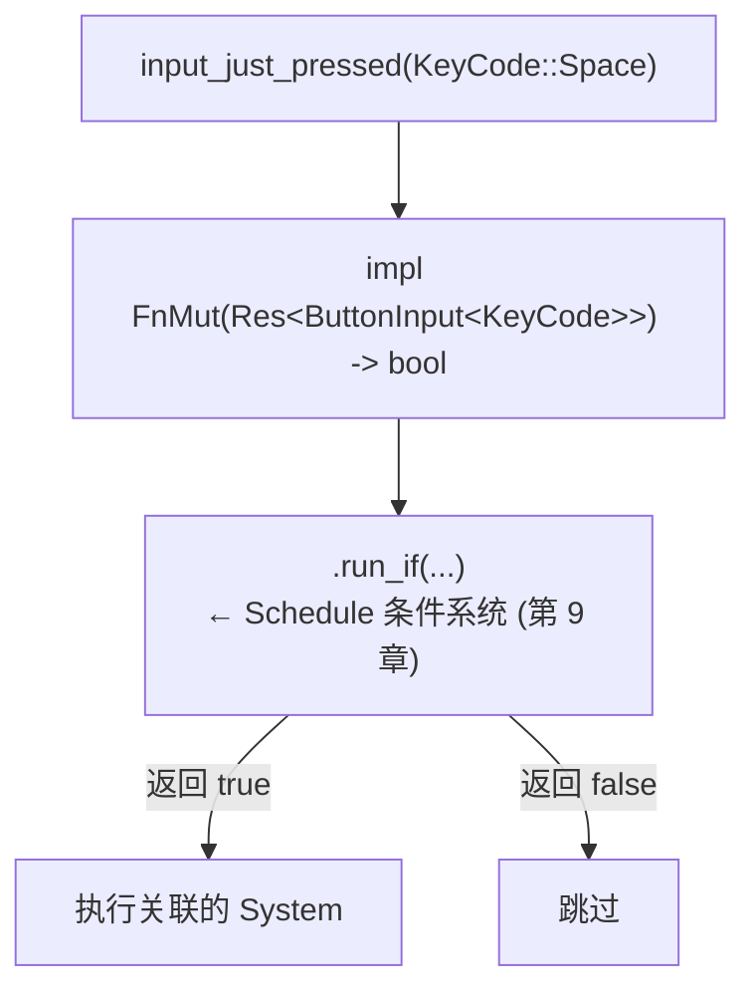

# 第 17 章：Input 系统

> **导读**：输入系统是游戏引擎中最直接面向用户的子系统。Bevy 的 Input 系统
> 展示了 ECS 建模的两种典型策略：键盘/鼠标用 Resource（全局唯一），
> 手柄用 Entity + Component（多设备多实例）。此外，Pointer 抽象统一了
> 鼠标和触摸输入，common_conditions 则展示了如何将输入状态转化为系统条件。

## 17.1 ButtonInput<T>：泛型 Resource 模式

键盘和鼠标按键的状态存储在全局 Resource 中：

```rust
// 源码: crates/bevy_input/src/button_input.rs (简化)
#[derive(Resource)]
pub struct ButtonInput<T: Clone + Eq + Hash + Send + Sync + 'static> {
    pressed: HashSet<T>,
    just_pressed: HashSet<T>,
    just_released: HashSet<T>,
}
```

三个 `HashSet` 分别记录当前帧的状态：

| 方法 | 含义 | 持续时间 |
|------|------|----------|
| `pressed(key)` | 按键被按住 | 从按下到释放 |
| `just_pressed(key)` | 按键刚被按下 | 仅一帧 |
| `just_released(key)` | 按键刚被释放 | 仅一帧 |

通过泛型参数 `T`，同一个数据结构同时服务于键盘和鼠标：

```
  ButtonInput 的泛型实例化

  ButtonInput<KeyCode>     ← Res<ButtonInput<KeyCode>>     键盘
  ButtonInput<MouseButton> ← Res<ButtonInput<MouseButton>> 鼠标
  ButtonInput<GamepadButton> ← 由 Gamepad Entity 持有       手柄 (见 17.2)
```

*图 17-1: ButtonInput<T> 泛型实例化*

为什么选择 Resource？键盘和鼠标都是全局唯一设备——整个系统只有一个键盘状态、一个鼠标状态。Resource 是 ECS 中表达 "全局唯一数据" 的正确方式。

每帧的更新流程：



*图 17-2: 输入事件处理流水线*

> **Rust 设计亮点**：`ButtonInput<T>` 的泛型约束 `T: Clone + Eq + Hash + Send + Sync + 'static`
> 精确表达了 "可以用作 HashSet 键" 且 "可以跨线程安全访问" 的需求。这比面向对象
> 的继承层级更精确——不需要 `T` 是某个 "Input" 基类的子类，只需满足数学上的约束。

为什么键盘使用 Resource 而手柄使用 Entity？这个选择背后是 ECS 建模的一个核心原则：**实例数量决定存储方式**。一台电脑只有一个键盘状态——即使连接了多个物理键盘，操作系统也将它们合并为一个逻辑设备。Resource 是 ECS 中"全局唯一数据"的正确抽象——它不需要 Entity ID，不参与 Archetype 组织，不会出现在 Query 中。如果将键盘状态建模为 Entity + Component，会引入不必要的复杂性：需要分配 Entity ID、需要用 Query 查找（但永远只有一个结果）、需要处理键盘实体被意外销毁的情况。Resource 的直接访问（`Res<ButtonInput<KeyCode>>`）比 Query 的间接访问（`Query<&ButtonInput<KeyCode>, With<Keyboard>>`）在语义和性能上都更优。

三个 HashSet 的设计也值得讨论。`just_pressed` 和 `just_released` 只在一帧内有效——它们在帧末被清空。这种"边沿触发"（edge-triggered）语义与"电平触发"（level-triggered）的 `pressed` 互补：游戏中的跳跃通常只需在按下瞬间触发一次（`just_pressed`），而移动需要在按住期间持续生效（`pressed`）。如果没有 `just_pressed`，用户就需要自行维护上一帧的按键状态来检测边沿，这是一个常见的错误来源。HashSet 的选择而非位数组（BitSet）是因为 KeyCode 枚举的值域较大且稀疏——大多数帧中只有少数几个键被按下，HashSet 的空间效率优于位数组。

**要点**：ButtonInput<T> 用泛型 Resource 统一键盘和鼠标输入。三个 HashSet 分别记录 pressed/just_pressed/just_released。Resource 适合全局唯一设备。

## 17.2 Gamepad：Entity + Component 模式

手柄与键盘鼠标不同——一台电脑可以连接多个手柄。Bevy 将每个手柄建模为一个 Entity：

```rust
// 源码: crates/bevy_input/src/gamepad.rs (概念)
// Each connected gamepad is an Entity with these components:
// - Name component: "Xbox Controller"
// - GamepadSettings component: deadzone, threshold
// - ButtonInput<GamepadButton> component (per-gamepad)
// - Axis<GamepadInput> component (per-gamepad)
```

```
  Gamepad 的 Entity + Component 建模

  Entity A (Gamepad 1):              Entity B (Gamepad 2):
  ┌────────────────────────────┐    ┌────────────────────────────┐
  │ Name("Player 1 Pad")       │    │ Name("Player 2 Pad")       │
  │ GamepadSettings            │    │ GamepadSettings            │
  │ ButtonInput<GamepadButton> │    │ ButtonInput<GamepadButton> │
  │ Axis<GamepadInput>         │    │ Axis<GamepadInput>         │
  └────────────────────────────┘    └────────────────────────────┘

  每个手柄是独立 Entity，拥有自己的输入状态
```

*图 17-3: Gamepad 的 Entity + Component 建模*

这种设计的优势：

- **多设备支持**：每个手柄有独立的状态和配置
- **Query 友好**：`Query<(&Name, &ButtonInput<GamepadButton>)>` 直接遍历所有手柄
- **灵活配置**：每个手柄可以有不同的死区设置

手柄事件系统处理连接/断开和输入更新：

```rust
// 源码: crates/bevy_input/src/gamepad.rs (概念)
pub struct GamepadConnectionEvent {
    pub gamepad: Entity,           // The gamepad entity
    pub connection: GamepadConnection,
}

pub enum GamepadConnection {
    Connected(GamepadInfo),
    Disconnected,
}
```

连接时创建 Entity，断开时销毁——实体的生命周期直接映射到物理设备的生命周期。

Gamepad 的 Entity 建模展示了 ECS 在处理动态数量对象时的优雅。在传统面向对象设计中，你可能需要一个 `Vec<Gamepad>` 或 `HashMap<GamepadId, Gamepad>` 来管理多个手柄。但在 ECS 中，每个手柄就是一个 Entity，它的状态和配置是 Components——所有已有的 ECS 基础设施（Query 遍历、Changed 检测、Commands 创建/销毁、Observer 生命周期事件）自动适用。当手柄断开时，despawn 对应实体即可，所有引用它的系统在下一帧自然不再查询到它。这比手动维护容器和清理引用要安全得多——不存在悬空引用的风险，因为 Entity 的生命周期由 World 统一管理。

这种建模也使得多玩家本地游戏的实现变得自然——每个手柄 Entity 可以与一个玩家 Entity 建立 Relationship（第 13 章），系统通过 Query 同时处理所有玩家的输入，无需特殊的多玩家分发逻辑。如果手柄是 Resource，就需要为每个手柄分配一个独立的 Resource 类型或使用索引——这在手柄数量不确定时非常笨拙。

**要点**：Gamepad 用 Entity + Component 建模多设备。每个手柄是独立 Entity，拥有自己的输入状态和配置。实体生命周期映射到设备生命周期。

## 17.3 Pointer 抽象：统一鼠标与触摸

`bevy_picking` 模块提供了 `Pointer` 抽象，统一了鼠标和触摸输入：



*图 17-4: Pointer 统一抽象层*

Pointer 也被建模为 Entity——每个指针（鼠标光标或触摸点）是一个独立实体。这使得多指触控自然地映射到多个 Entity，与单一鼠标指针使用完全相同的 Query 模式。

这种抽象在 UI 系统（第 19 章）中发挥重要作用——UI 的 Picking 后端只需处理 Pointer Entity，不需要分别处理鼠标和触摸。

Pointer 抽象的设计哲学是"输入归一化"——将物理上不同的输入设备映射到统一的逻辑模型中。这个概念在 Web 平台上已经被 PointerEvent API 验证过（统一了 mouse、touch、pen），Bevy 将其移植到了 ECS 的 Entity 模型中。与 Web 的区别在于，Bevy 的每个 Pointer 都是一个可查询的 Entity——你可以为 Pointer 附加自定义 Component（例如 `PointerStyle` 改变光标样式），通过 Query 同时处理所有 Pointer，甚至用 Observer（第 12 章）监听 Pointer Entity 的创建和销毁。这种 Entity 化的抽象比传统的"输入事件回调"更灵活——Pointer 有持续的状态（位置、压力等），可以被其他系统随时查询，而非仅在事件发生时才可访问。

**要点**：Pointer 将鼠标、触摸、手写笔统一为 Entity，上层系统无需关心具体输入来源。多指触控自然映射为多个 Entity。

## 17.4 common_conditions：输入状态转系统条件

`bevy_input` 提供了一组**系统条件** (System Condition)，将输入状态转化为 `run_if` 条件：

```rust
// 源码: crates/bevy_input/src/common_conditions.rs (简化)
pub fn input_toggle_active<T>(
    default: bool,
    input: T,
) -> impl FnMut(Res<ButtonInput<T>>) -> bool + Clone
where
    T: Clone + Eq + Hash + Send + Sync + 'static,
{
    let mut active = default;
    move |inputs: Res<ButtonInput<T>>| {
        active ^= inputs.just_pressed(input.clone());
        active
    }
}

pub fn input_just_pressed<T>(
    input: T,
) -> impl FnMut(Res<ButtonInput<T>>) -> bool + Clone
where
    T: Clone + Eq + Hash + Send + Sync + 'static,
{
    move |inputs: Res<ButtonInput<T>>| inputs.just_pressed(input.clone())
}
```

使用示例：

```rust
app.add_systems(Update,
    pause_menu.run_if(input_toggle_active(false, KeyCode::Escape))
);
```

这些条件是**有状态的闭包**——`input_toggle_active` 内部用 `mut active` 维护切换状态。这是 Bevy System 条件机制（第 9 章）的实际应用：条件本身也是 System，可以拥有 Local 状态。



*图 17-5: common_conditions 工作流程*

common_conditions 展示了 ECS 系统条件机制（第 9 章）的实际威力。在传统的游戏循环中，暂停功能通常需要在每个相关系统中添加 `if !paused { ... }` 检查。使用 `run_if(input_toggle_active(false, KeyCode::Escape))`，暂停逻辑被提取到 Schedule 层面——系统本身不知道也不关心暂停的存在，条件求值在系统执行之前完成。这种关注点分离使得暂停功能可以从一个中心位置配置，而非分散在数十个系统中。

`input_toggle_active` 中的 `mut active` 状态是通过闭包捕获实现的——每个使用此条件的系统都有自己独立的状态副本。这与 System 的 `Local<T>` 参数（第 8 章）在概念上等价：每个系统实例拥有自己的本地状态，不同系统间互不影响。条件本身也是一个 System（`ReadOnlySystem`），它参与 Schedule 的调度——Bevy 的调度器会确保条件系统对 `Res<ButtonInput<KeyCode>>` 的读取不与其他系统的写入冲突。

**要点**：common_conditions 将输入状态转化为 run_if 条件，是有状态闭包与 System 条件机制的结合。input_toggle_active 展示了条件系统可以维护跨帧状态。

## 17.5 输入系统的 ECS 建模选择

回顾整个 Input 系统的 ECS 建模，可以提炼出一个通用的选择准则：

| 场景 | ECS 建模 | 原因 |
|------|---------|------|
| 全局唯一 (键盘、鼠标) | **Resource** | 只有一个实例，无需 Entity |
| 多实例 (手柄、Pointer) | **Entity + Component** | 每个设备独立，Query 友好 |
| 事件流 (按键事件) | **Message** | 瞬时事件，帧内消费 |
| 条件过滤 | **System Condition** | 决定 System 是否执行 |

这种选择准则不仅适用于 Input，也适用于引擎的其他子系统。

这个选择准则可以扩展为一个更通用的 ECS 建模决策树。当你面对一个新的数据或概念需要在 ECS 中表达时，首先问："它有几个实例？"如果全局唯一，用 Resource；如果有多个实例且需要独立状态，用 Entity + Component。然后问："它是持续存在还是瞬时的？"持续状态用 Resource 或 Component，瞬时事件用 Message 或 Observer。最后问："它需要驱动系统执行还是仅被系统消费？"如果需要控制系统是否执行，用 System Condition。Input 系统完美地展示了这个决策树的每个分支：键盘（全局唯一→Resource）、手柄（多实例→Entity+Component）、按键事件（瞬时→Message）、暂停切换（控制执行→Condition）。掌握这个决策树是在 Bevy 中进行高效 ECS 建模的关键技能。

**要点**：全局唯一用 Resource，多实例用 Entity + Component，瞬时数据用 Message，条件过滤用 System Condition。

## 本章小结

本章我们从 ECS 视角分析了 Bevy 的 Input 系统：

1. **ButtonInput<T>** 用泛型 Resource 统一键盘和鼠标，三个 HashSet 追踪按键状态
2. **Gamepad** 用 Entity + Component 建模多设备，实体生命周期映射到设备连接状态
3. **Pointer** 统一鼠标、触摸、手写笔为 Entity，上层无需关心输入来源
4. **common_conditions** 将输入状态转化为 run_if 条件，支持有状态的条件闭包
5. ECS 建模选择遵循 **"唯一性决定存储方式"** 原则

Input 系统虽然简单，但清晰地展示了 ECS 不同原语（Resource vs Entity+Component vs Message）的适用场景。

下一章，我们将看到 State 系统如何用 ECS 实现有限状态机，以及 OnEnter/OnExit 如何成为独立 Schedule。
