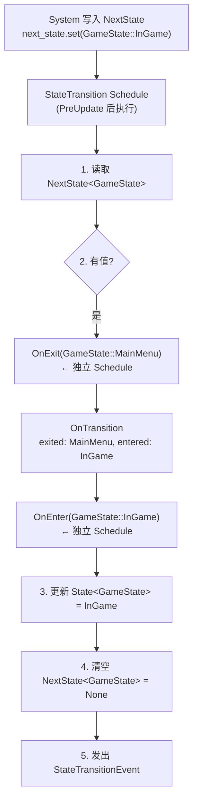
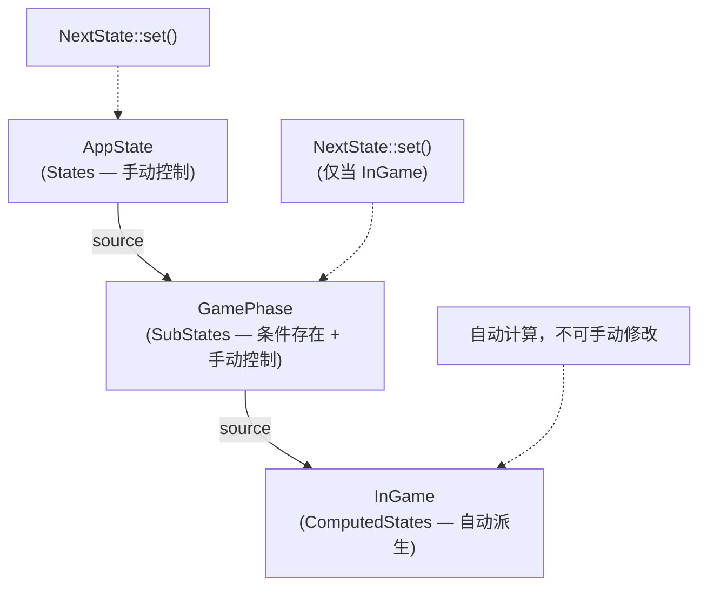
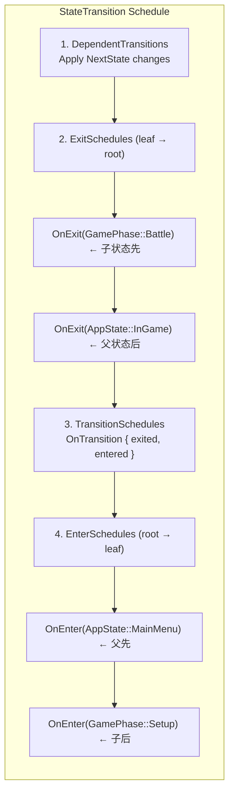
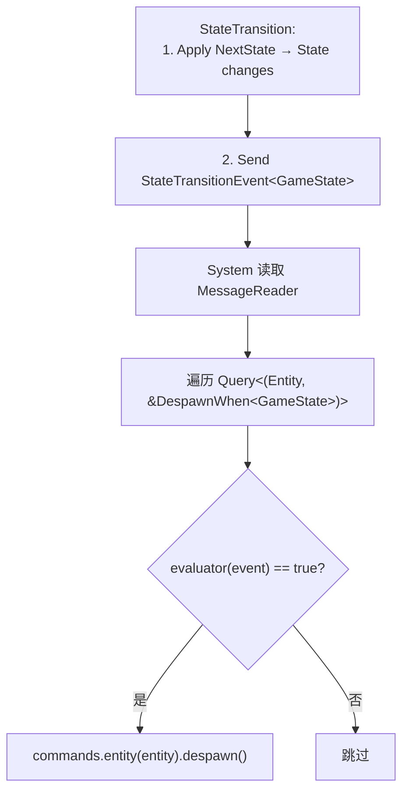

# 第 18 章：State 系统

> **导读**：几乎所有游戏都需要状态机——主菜单、游戏中、暂停、结算。Bevy 的
> State 系统将有限状态机完全建立在 ECS 之上：状态值是 Resource，状态转换
> 触发独立的 Schedule（OnEnter/OnExit），DespawnWhen 利用状态转换 Message 自动
> 清理实体，run_if(in_state(...)) 让系统只在特定状态下运行。

## 18.1 States trait：有限状态机的基石

`States` trait 定义了什么可以作为状态：

```rust
// 源码: crates/bevy_state/src/state/states.rs
pub trait States: 'static + Send + Sync + Clone + PartialEq + Eq + Hash + Debug {
    const DEPENDENCY_DEPTH: usize = 1;
}
```

约束很简洁：`Clone + PartialEq + Eq + Hash + Debug + Send + Sync + 'static`——本质上就是 "可以比较、可以哈希、可以跨线程、可以持久存储" 的值类型。

为什么 Bevy 选择将状态建模为 Schedule 驱动的系统，而非简单的布尔标志或枚举检查？在 Unity 中，状态管理通常依赖于 `MonoBehaviour` 中的 `if (state == X)` 条件判断，这导致状态逻辑分散在无数个组件中，难以追踪状态转换的完整链路。Godot 的状态机虽然更结构化，但仍然是面向对象的——状态节点持有自身的进入/退出回调，与场景树紧密耦合。Bevy 的设计哲学截然不同：状态值只是一个 Resource，状态转换触发独立的 Schedule 执行。这意味着状态系统完全复用 ECS 已有的原语（Resource、Schedule、Observer、run_if），而非引入新的运行时机制。这种设计的代价是概念密度较高——初学者需要理解 Schedule 才能理解 State——但收益是状态系统与 ECS 的其他部分完全正交，不存在任何特殊路径。

使用 derive 宏定义状态：

```rust
#[derive(Clone, Copy, PartialEq, Eq, Hash, Debug, Default, States)]
enum GameState {
    #[default]
    MainMenu,
    InGame,
    Paused,
    GameOver,
}
```

状态值存储在两个 Resource 中：

```rust
// 源码: crates/bevy_state/src/state/resources.rs (概念)
#[derive(Resource)]
pub struct State<S: States>(S);          // Current state

#[derive(Resource)]
pub struct NextState<S: States>(Option<S>); // Queued next state
```

状态转换流程：



*图 18-1: 状态转换流程*

这种双 Resource 设计（State + NextState）暗含了一个重要的时序保证：在同一帧中，多个 System 可以各自调用 `next_state.set()`，但只有最后一次写入生效，且状态转换推迟到 StateTransition Schedule 统一执行。这避免了帧中间状态不一致的问题——如果状态转换是即时的，一个 System 刚切换状态，后续 System 可能还在读取旧状态的数据，导致逻辑错误。延迟执行还意味着 OnEnter/OnExit 中 spawn 的实体不会在同一帧被其他 Update 系统意外访问到，消除了一类难以调试的时序 bug。

**要点**：States trait 约束简洁明确。状态值存储在 State<S> 和 NextState<S> 两个 Resource 中。转换由 StateTransition Schedule 驱动。

## 18.2 三种状态类型

Bevy 提供三种状态类型，覆盖从简单到复杂的需求：

### States (基础状态)

用户直接控制，通过 `NextState::set()` 手动触发转换：

```rust
fn handle_input(mut next_state: ResMut<NextState<GameState>>) {
    if escape_pressed {
        next_state.set(GameState::Paused);
    }
}
```

### SubStates (子状态)

只在父状态满足特定条件时才存在：

```rust
// 源码: crates/bevy_state/src/state/sub_states.rs (概念)
#[derive(SubStates, Clone, PartialEq, Eq, Hash, Debug, Default)]
#[source(AppState = AppState::InGame)]  // Only exists when InGame
enum GamePhase {
    #[default]
    Setup,
    Battle,
    Conclusion,
}
```

当 `AppState` 不是 `InGame` 时，`State<GamePhase>` Resource 不存在。

### ComputedStates (计算状态)

从一个或多个源状态**自动派生**，不能手动修改：

```rust
// 源码: crates/bevy_state/src/state/computed_states.rs (概念)
pub trait ComputedStates: 'static + Send + Sync + Clone + PartialEq + Eq + Hash + Debug {
    type SourceStates: StateSet;
    fn compute(sources: Self::SourceStates) -> Option<Self>;
}

// Example
#[derive(Clone, PartialEq, Eq, Hash, Debug)]
struct InGame;

impl ComputedStates for InGame {
    type SourceStates = AppState;
    fn compute(sources: AppState) -> Option<Self> {
        match sources {
            AppState::InGame { .. } => Some(InGame),
            _ => None, // State resource removed
        }
    }
}
```



*图 18-2: 三种状态类型的层级关系*

ComputedStates 的设计哲学值得深思。在传统游戏引擎中，派生状态通常通过事件监听或回调实现——当源状态变化时，手动更新派生状态。这种命令式方式容易出错：忘记注册回调、回调执行顺序不确定、多个源状态变化时的组合爆炸。ComputedStates 借鉴了响应式编程的理念——`compute` 函数是一个纯函数，从源状态到派生状态的映射是声明式的。框架保证每次源状态变化后自动重新计算，开发者只需要描述"派生状态应该是什么"，而非"何时更新派生状态"。这种设计的代价是每次源状态变化都会重新计算所有依赖的 ComputedStates，但由于状态转换频率极低（通常每秒不到一次），这个开销完全可以忽略。

> **Rust 设计亮点**：ComputedStates 的 `compute` 函数返回 `Option<Self>`——
> 返回 `None` 表示该状态**不应存在**，对应的 `State<S>` Resource 会被移除。
> 这优雅地利用了 Rust 的 Option 类型来表达 "状态可能不存在" 的语义，
> 而不是引入额外的 "Invalid" 状态值。

**要点**：States 手动控制，SubStates 条件存在 + 手动控制，ComputedStates 自动派生。三者通过 SourceStates 形成依赖链。

## 18.3 OnEnter/OnExit：独立 Schedule

OnEnter 和 OnExit 不是普通的系统集合——它们是**独立的 Schedule**：

```rust
// 源码: crates/bevy_state/src/state/transitions.rs
#[derive(ScheduleLabel, Clone, Debug, PartialEq, Eq, Hash, Default)]
pub struct OnEnter<S: States>(pub S);

#[derive(ScheduleLabel, Clone, Debug, PartialEq, Eq, Hash, Default)]
pub struct OnExit<S: States>(pub S);

#[derive(ScheduleLabel, Clone, Debug, PartialEq, Eq, Hash, Default)]
pub struct OnTransition<S: States> {
    pub exited: S,
    pub entered: S,
}
```

每个状态值对应一个独立的 Schedule 实例——`OnEnter(GameState::InGame)` 和 `OnEnter(GameState::Paused)` 是两个完全不同的 Schedule。

状态转换的执行顺序由 `StateTransitionSystems` 控制：

```rust
// 源码: crates/bevy_state/src/state/transitions.rs
#[derive(SystemSet)]
pub enum StateTransitionSystems {
    DependentTransitions,  // Apply state changes
    ExitSchedules,         // Run OnExit (leaf → root order)
    TransitionSchedules,   // Run OnTransition
    EnterSchedules,        // Run OnEnter (root → leaf order)
}
```



*图 18-3: 状态转换调度顺序*

Exit 从叶到根、Enter 从根到叶——这保证了子状态的清理在父状态之前，子状态的初始化在父状态之后。

将 OnEnter/OnExit 设计为独立 Schedule 而非普通 System 集合，有深远的架构含义。独立 Schedule 意味着状态转换时的初始化/清理逻辑与正常帧更新的 System 完全隔离——它们不参与 Update Schedule 的拓扑排序，不受 before/after 约束影响，也不会与游戏逻辑系统产生数据访问冲突。这使得状态转换成为一个"原子"操作——要么完整执行，要么不执行。如果 OnEnter 是普通 System，它会被插入 Update 的并行调度中，可能与读取旧状态数据的系统同时运行，产生不一致性。独立 Schedule 的代价是多了一次调度开销，但状态转换每秒最多发生几次，这个代价微不足道。

**要点**：OnEnter/OnExit 是独立 Schedule，每个状态值一个。Exit 从叶到根，Enter 从根到叶。这保证了层级状态的正确初始化/清理顺序。

## 18.4 DespawnWhen：StateTransition Message 驱动的实体清理

状态转换时通常需要清理上一个状态的实体（如从 InGame 退出时销毁所有游戏实体）。Bevy 提供了 `DespawnWhen` 组件：

```rust
// 源码: crates/bevy_state/src/state_scoped.rs (简化)
#[derive(Component)]
pub struct DespawnWhen<S: States> {
    pub state_transition_evaluator:
        Box<dyn Fn(&StateTransitionEvent<S>) -> bool + Sync + Send + 'static>,
}
```

以及便捷的 `DespawnOnExit` 和 `DespawnOnEnter`：

```rust
// Usage
commands.spawn((
    DespawnOnExit(GameState::InGame),
    Player,
    Transform::default(),
));
// When GameState exits InGame, this entity is automatically despawned.
```

实现原理：`DespawnWhen` 并不依赖 Observer。状态系统会写入 `StateTransitionEvent<S>` Message，`despawn_entities_when_state` 系统随后通过 `MessageReader<StateTransitionEvent<S>>` 读取最新的状态转换，再遍历所有带有 `DespawnWhen` 组件的实体，执行评估函数，匹配则销毁。`DespawnOnExit` 和 `DespawnOnEnter` 也是同一模式的特化版本。



*图 18-4: DespawnWhen 基于状态转换 Message 的实体清理*

这不是 Observer 模式（第 12 章）的直接复用，而是 Message + 普通 System 的声明式封装——无需在 OnExit Schedule 中手动编写清理 System，只需在 spawn 时声明 "何时销毁"。

如果没有 DespawnWhen，开发者需要在每个 OnExit Schedule 中手动编写清理逻辑：查询所有属于当前状态的实体，逐一销毁。这种命令式清理容易遗漏——新增一种实体类型时忘记更新清理系统是常见错误，导致"幽灵实体"在状态转换后残留。DespawnWhen 将清理意图内聚到实体的 spawn 点——创建实体时就声明它的生命周期边界。这种"声明式生命周期"模式在 ECS 中特别有价值：实体的创建和销毁逻辑共同定位，审查代码时不需要在 spawn 和 despawn 系统之间来回跳转。

**要点**：DespawnWhen/DespawnOnExit 通过 `StateTransitionEvent` Message + Reader 系统自动清理状态关联实体。声明式而非命令式。

## 18.5 run_if(in_state(...))：条件系统

`in_state` 是最常用的状态条件，让 System 只在特定状态下运行：

```rust
// 源码: crates/bevy_state/src/condition.rs (简化)
pub fn in_state<S: States>(state: S) -> impl FnMut(Option<Res<State<S>>>) -> bool + Clone {
    move |current_state: Option<Res<State<S>>>| {
        matches!(current_state, Some(s) if *s == State(state.clone()))
    }
}
```

使用示例：

```rust
app.add_systems(Update, (
    player_movement.run_if(in_state(GameState::InGame)),
    menu_navigation.run_if(in_state(GameState::MainMenu)),
    // These systems never conflict — they run in different states
));
```

还有其他状态条件：

```rust
// State exists?
my_system.run_if(state_exists::<GameState>)

// State just changed?
cleanup_system.run_if(state_changed::<GameState>)
```

这些条件本质上是读取 `Res<State<S>>` Resource 的普通 System——它们完全建立在 ECS 的 Resource 和 System 条件机制之上。

`in_state` 的设计揭示了一个重要的性能特征：被 `run_if(in_state(...))` 守卫的系统在条件不满足时完全不执行——连参数获取（Query 遍历、Resource 读取）都不会发生。这意味着在 MainMenu 状态下，所有标记为 `in_state(GameState::InGame)` 的系统的开销为零，而非"执行但立即返回"。对于拥有数百个系统的大型游戏，这种差异很重要：条件检查只需要读取一个 Resource 的值并做一次比较，而跳过的系统可能原本需要遍历数千个实体。与第 9 章的 System Condition 机制（run_if）结合，状态系统实现了高效的"系统级别的条件编译"——运行时版本。

**要点**：in_state 将 State<S> Resource 转化为 run_if 条件。多个状态互斥的系统自然不会冲突。

## 本章小结

本章我们从 ECS 视角分析了 Bevy 的 State 系统：

1. **States** = `Clone + Eq + Hash + Debug + Send + Sync + 'static` 的值类型，存储为 Resource
2. **三种状态类型**：States（手动）、SubStates（条件存在）、ComputedStates（自动派生）
3. **OnEnter/OnExit** 是独立 Schedule，Exit 叶→根，Enter 根→叶
4. **DespawnWhen** 利用状态转换 Message 自动清理状态关联实体
5. **in_state** 将 Resource 转化为 System 条件

State 系统的优雅之处在于它完全由已有的 ECS 原语组合而成——Resource（状态值）、Schedule（OnEnter/OnExit）、Message（StateTransitionEvent）、System Condition（in_state）以及普通清理系统。没有引入任何新的运行时机制。

下一章，我们将看到 UI 系统如何将每个 UI 元素建模为 Entity + Component，实现全 ECS 的用户界面。
