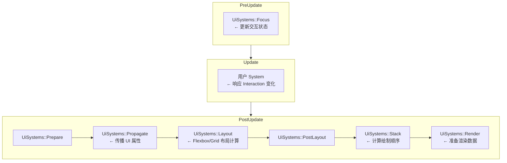
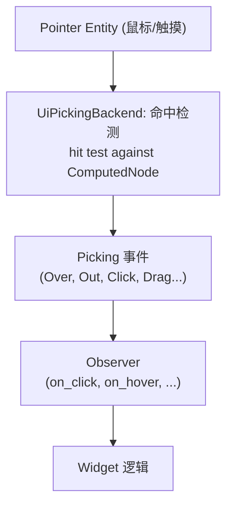
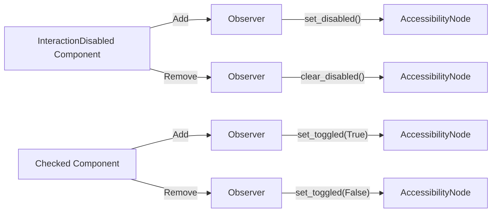

# 第 19 章：UI 系统

> **导读**：很多游戏引擎的 UI 系统是一个独立的子框架，有自己的数据模型和
> 事件机制。Bevy 不同——它的 UI 完全构建在 ECS 之上：每个 UI 元素是 Entity，
> 布局属性是 Component，布局计算在 PostUpdate 运行，交互通过 Picking +
> Observer 实现，Widget 是 Component 的组合。

## 19.1 Node Entity：全 ECS 的 UI 模型

Bevy UI 中，每个 UI 元素都是一个普通的 ECS Entity，通过 Component 组合描述外观和行为：

```rust
// A simple button in Bevy UI
commands.spawn((
    Node {
        width: Val::Px(200.0),
        height: Val::Px(50.0),
        justify_content: JustifyContent::Center,
        align_items: AlignItems::Center,
        ..default()
    },
    BackgroundColor(Color::srgb(0.2, 0.2, 0.8)),
    Button,           // Marker component
    Interaction::None, // Tracks hover/press state
));
```

`Node` 是 UI 实体的核心 Component，包含所有布局属性（CSS Flexbox/Grid 的子集）。其他外观和行为通过额外的 Component 叠加：

```
  UI Entity 的 Component 组合

  Entity (Button)
  ┌──────────────────────────────────┐
  │ Node          ← 布局属性        │
  │ ComputedNode  ← 计算后的尺寸/位置│
  │ BackgroundColor ← 背景色        │
  │ BorderColor   ← 边框色          │
  │ Button        ← 标记：这是按钮   │
  │ Interaction   ← 交互状态        │
  │ UiGlobalTransform ← UI 变换     │
  │ Visibility    ← 可见性          │
  │ children![]   ← 子 Entity (文本等) │
  └──────────────────────────────────┘
```

*图 19-1: UI Entity 的 Component 组合*

这种 "全 ECS" 模型的直接好处：

- **Query 即查询**：`Query<&Interaction, With<Button>>` 直接获取所有按钮的交互状态
- **System 即逻辑**：UI 逻辑与游戏逻辑使用完全相同的 System 编写方式
- **Component 即扩展**：添加自定义 Component 即可扩展 UI 功能
- **Hierarchy 即布局**：父子关系直接决定布局嵌套

为什么 Bevy 选择全 ECS UI 而非 egui 这样的即时模式 UI？即时模式 UI（immediate mode）的优势是简洁直观——调用 `ui.button("Click")` 立刻返回是否被点击。但即时模式的根本问题是它与 ECS 的数据模型不兼容：即时模式 UI 没有持久化的实体，无法被 Query 查询，无法参与 Change Detection，无法被 Observer 监听。如果 Bevy 采用即时模式 UI，开发者就需要在两套完全不同的编程模型之间来回切换——写游戏逻辑用 System/Component，写 UI 用回调/闭包。全 ECS UI 消除了这种割裂：一个按钮就是一个 Entity，它的点击状态就是一个 Component，检测点击就是一个 Query。当然，全 ECS UI 的代价是更多的样板代码——创建一个按钮需要组合多个 Component，而非一行函数调用。但这种代价换来的是 UI 与游戏逻辑的完全统一，以及 ECS 带来的自动并行和 Change Detection 优化。

> **Rust 设计亮点**：Bevy 的全 ECS UI 模型意味着 UI 不需要独立的事件系统、
> 布局引擎接口或组件层次。Query、Observer、Component 组合、Hierarchy——
> 这些 ECS 原语同时服务于游戏逻辑和 UI 逻辑。这消除了传统引擎中
> "游戏代码" 和 "UI 代码" 之间的 impedance mismatch。

**要点**：UI 元素 = Entity + Component 组合。不存在独立的 "UI 框架"——UI 完全是 ECS 数据。

## 19.2 布局系统：PostUpdate 的 Flexbox/Grid

UI 布局由 `ui_layout_system` 驱动，运行在 `PostUpdate` 阶段：



*图 19-2: UI 系统在 Schedule 中的执行阶段*

布局引擎使用 `taffy`（一个纯 Rust 的 CSS 布局库），支持 Flexbox 和 CSS Grid。`Node` Component 中的属性直接映射到 taffy 的布局属性：

```rust
// Node component (simplified from crates/bevy_ui/src/ui_node.rs)
pub struct Node {
    pub display: Display,           // Flex, Grid, Block, None
    pub position_type: PositionType, // Relative, Absolute
    pub width: Val,
    pub height: Val,
    pub flex_direction: FlexDirection,
    pub justify_content: JustifyContent,
    pub align_items: AlignItems,
    // ... CSS-like properties
}
```

布局计算的结果写入 `ComputedNode` Component：

```rust
// 源码: crates/bevy_ui/src/ui_node.rs (简化)
#[derive(Component)]
pub struct ComputedNode {
    pub stack_index: u32,     // Drawing order
    pub size: Vec2,           // Computed size in physical pixels
    pub content_size: Vec2,   // Content area size
    pub border: BorderRect,   // Resolved border
    pub border_radius: ResolvedBorderRadius,
    pub padding: BorderRect,  // Resolved padding
    // ...
}
```

`Node` → `ComputedNode` 的过程就是 "声明式布局属性" → "计算后的绝对值"。这是 ECS 中 Input Component → Computed Component 模式的典型应用。

布局计算为什么放在 PostUpdate 而非 Update？这是一个深思熟虑的时序决策。Update 阶段是用户 System 修改 UI 属性的时机——改变按钮文本、切换面板可见性、调整列表项。如果布局计算也在 Update 中运行，就必须保证布局系统在所有 UI 修改系统之后执行，这需要繁琐的 ordering 约束。将布局推迟到 PostUpdate 确保了所有 Update 中的 UI 修改都已完成，布局只需计算一次就能得到最终结果。这种"先收集所有修改，再统一计算"的模式还有性能好处：如果一帧中多个 System 修改了同一个 Node 的不同属性，布局只计算一次而非多次。在默认渲染路径中，这些 PostUpdate 里的结果会在同一轮更新后被提取并渲染；只有在启用 pipelined rendering 等额外流水线机制时，读者才可能观察到额外的帧级延迟。

**要点**：布局在 PostUpdate 执行，用 taffy 引擎计算 Flexbox/Grid。Node 声明布局属性，ComputedNode 存储计算结果。

## 19.3 Interaction 与 Picking

UI 交互由 `Interaction` Component 追踪：

```rust
// 源码: crates/bevy_ui/src/focus.rs (简化)
#[derive(Component, Copy, Clone, Eq, PartialEq)]
pub enum Interaction {
    Pressed,
    Hovered,
    None,
}
```

传统的交互检测由 `ui_focus_system` 在 `PreUpdate` 阶段完成。但 Bevy 同时提供了更强大的 Picking 集成：

```rust
// 源码: crates/bevy_ui/src/picking_backend.rs (概念)
pub struct UiPickingPlugin;
// This plugin runs hit tests on UI nodes using Pointer entities (Ch17)
```

UI Picking 后端利用了第 17 章的 Pointer 抽象——它对 UI 节点树做射线检测，根据 `ComputedNode` 的位置和大小判断哪些节点被 Pointer 命中。命中结果通过 Picking 事件系统传播，触发 Observer。



*图 19-3: UI 交互链*

Picking 在 UI 中的集成展示了 Bevy 架构的一个核心优势：子系统间的复用。第 17 章介绍的 Pointer Entity 和 Picking 后端是为 3D 场景设计的，但它们的抽象足够通用，可以直接用于 UI 命中检测。UI Picking 后端只需将 ComputedNode 的矩形区域注册为 Pickable 目标，其余的事件分发、冒泡、Observer 触发全部由 Picking 框架处理。这避免了 UI 系统重新发明一套事件系统，也意味着 3D 世界中的点击和 UI 按钮的点击使用完全相同的事件管线。对于需要混合 3D 和 2D UI 交互的场景（如 3D 场景中的可点击物体），这种统一性尤其有价值。

**要点**：Interaction Component 追踪基本交互状态。Picking 后端提供更精确的命中检测，结果通过 Observer 传播。

## 19.4 Observer 在 Widget 中的应用

Bevy 的 UI Widget（`bevy_ui_widgets` crate）大量使用 Observer 模式。在以下 **7 个 Widget 文件**中都使用了 `On<>` Observer：

| Widget 文件 | Observer 用途 |
|-------------|--------------|
| `button.rs` | 点击事件处理 |
| `checkbox.rs` | 选中/取消选中状态切换 |
| `radio.rs` | 单选组互斥选择 |
| `slider.rs` | 拖动值变更 |
| `scrollbar.rs` | 滚动位置更新 |
| `editable_text.rs` | 文本输入处理 |
| `menu.rs` | 菜单展开/收起 |

`interaction_states.rs` 中的 Observer 展示了 Component 生命周期钩子在 UI 中的应用：

```rust
// 源码: crates/bevy_ui/src/interaction_states.rs (简化)
pub(crate) fn on_add_disabled(add: On<Add, InteractionDisabled>, mut world: DeferredWorld) {
    let mut entity = world.entity_mut(add.entity());
    if let Some(mut accessibility) = entity.get_mut::<AccessibilityNode>() {
        accessibility.set_disabled();
    }
}

pub(crate) fn on_remove_disabled(remove: On<Remove, InteractionDisabled>, mut world: DeferredWorld) {
    let mut entity = world.entity_mut(remove.entity());
    if let Some(mut accessibility) = entity.get_mut::<AccessibilityNode>() {
        accessibility.clear_disabled();
    }
}
```

当 `InteractionDisabled` Component 被添加或移除时，Observer 自动更新对应的无障碍属性。这是 **响应式 UI** 的 ECS 实现——状态变化自动触发副作用，无需轮询。

Observer 在 UI Widget 中的大量使用揭示了一个重要的设计权衡。传统的轮询式 UI（每帧检查 `if interaction == Pressed`）虽然简单，但随着 Widget 数量增长，每帧需要检查的条件呈线性增长。Observer 模式将开销从"每帧 O(n)"降低到"事件发生时 O(1)"——只有当交互真正发生时才执行逻辑。对于一个包含数百个 UI 元素的复杂界面，大部分元素在大部分帧中都没有交互，Observer 的优势就非常明显。此外，Observer 的声明式风格让 Widget 的行为定义更加内聚——交互逻辑与 Widget 定义紧密绑定，而非分散在独立的 System 中。这与第 12 章介绍的 Observer 设计哲学一脉相承：将因果关系编码在数据附近，而非分散在全局系统中。

更多交互状态 Component 也通过 Observer 维护一致性：

```rust
// 源码: crates/bevy_ui/src/interaction_states.rs
#[derive(Component)] pub struct Pressed;     // Button held down
#[derive(Component)] pub struct Checkable;   // Can be checked
#[derive(Component)] pub struct Checked;     // Is checked

// Observers ensure a11y attributes stay in sync with component state
```

**要点**：7 个 Widget 文件使用 Observer 处理交互事件。Component Add/Remove 钩子实现响应式 UI——状态变化自动触发副作用。

## 19.5 Focus 与 Accessibility

Focus 系统管理键盘焦点：

```rust
// 源码: crates/bevy_ui/src/focus.rs (概念)
#[derive(Component)]
pub enum FocusPolicy {
    Block,  // Blocks focus from passing through
    Pass,   // Allows focus to pass through
}
```

`UiStack` Resource 维护了所有 UI 节点的绘制顺序（z-order），Focus 系统使用它来确定哪个节点应该接收键盘焦点。

无障碍 (Accessibility) 通过 `AccessibilityNode` Component 和 `bevy_a11y` crate 实现。Observer 确保 UI 状态变化（Disabled、Checked 等）自动同步到无障碍树，使屏幕阅读器等辅助工具获得正确的语义信息。



*图 19-4: Accessibility 同步链*

**要点**：FocusPolicy 控制焦点传播。Observer 自动同步 UI 状态到无障碍树，确保辅助工具获得正确语义。

## 本章小结

本章我们从 ECS 视角分析了 Bevy 的 UI 系统：

1. **全 ECS 模型**：每个 UI 元素是 Entity + Component 组合，不存在独立 UI 框架
2. **布局系统**在 PostUpdate 用 taffy 计算 Flexbox/Grid，结果写入 ComputedNode
3. **Interaction + Picking** 提供两层交互检测，Picking 复用 Pointer Entity 抽象
4. **7 个 Widget** 使用 Observer 处理交互，Component 生命周期钩子实现响应式 UI
5. **Accessibility** 通过 Observer 自动同步 UI 状态到无障碍树

UI 系统是 "ECS 即 UI 框架" 理念的最佳证明——布局是 Component，交互是 Observer，Widget 是 Component 组合，焦点是 Resource。传统 UI 框架的概念在 ECS 中都找到了自然的映射。

下一章，我们将看到 PBR 渲染如何利用 Change Detection 驱动 Shader 编译，以及如何用 Plugin 链组织复杂的渲染功能。
