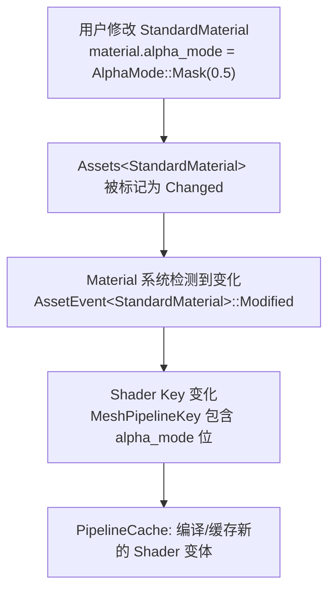

# 第 20 章：PBR 渲染

> **导读**：PBR (Physically Based Rendering) 是现代 3D 游戏的视觉基础。
> 本章不深入图形学数学，而是从 ECS 视角分析 Bevy PBR 的架构：
> StandardMaterial 如何利用 Change Detection 驱动 Shader 编译，
> Light Clustering 如何作为 per-view Component 工作，22 个 Plugin
> 如何组织，以及 ExtendedMaterial 如何用 trait 组合实现材质扩展。

## 20.1 StandardMaterial：Change Detection 驱动 Shader

`StandardMaterial` 是 Bevy 内置的 PBR 材质，实现了 `Material` trait：

```rust
// 源码: crates/bevy_pbr/src/pbr_material.rs (概念)
#[derive(Asset, AsBindGroup, Reflect, Debug, Clone)]
pub struct StandardMaterial {
    pub base_color: Color,
    pub base_color_texture: Option<Handle<Image>>,
    pub metallic: f32,
    pub perceptual_roughness: f32,
    pub normal_map_texture: Option<Handle<Image>>,
    pub emissive: LinearRgba,
    pub alpha_mode: AlphaMode,
    // ... 20+ fields
}
```

StandardMaterial 是一个 `Asset`（存储在 `Assets<StandardMaterial>` Resource 中），通过 `Handle<StandardMaterial>` 被实体引用。当材质属性变化时，需要重新编译对应的 Shader 变体——这个过程由 Change Detection 驱动。



*图 20-1: Material Change Detection 到 Shader 编译的链路*

Bevy 使用 **Shader Specialization** 模式——不同的材质配置（Alpha 模式、纹理开关、法线贴图等）生成不同的 Shader 变体。`MeshPipelineKey` 是一个 bitflag，编码了影响 Shader 的所有配置：

```rust
// 概念 (crates/bevy_pbr/src/render/)
bitflags! {
    pub struct MeshPipelineKey: u64 {
        const ALPHA_MASK      = 1 << 0;
        const BLEND_ALPHA     = 1 << 1;
        const NORMAL_MAP      = 1 << 2;
        const EMISSIVE        = 1 << 3;
        // ... many more flags
    }
}
```

只有当 PipelineKey 变化时才需要编译新的 Shader——大多数帧中，材质不变，Shader 直接从缓存读取。这是 Change Detection 在渲染管线中的精确应用。

如果没有 Change Detection 驱动的 Shader Specialization，替代方案是什么？最朴素的做法是为所有可能的材质配置组合预编译 Shader 变体——但 MeshPipelineKey 是一个 64 位 bitflag，理论上有数十亿种组合，预编译显然不可行。另一种做法是每帧都重新判断需要哪些 Shader 变体，但这意味着即使没有任何材质变化也要做大量冗余工作。Change Detection 提供了第三条路：只在材质属性真正变化时才触发 PipelineKey 的重新计算和 Shader 编译。在典型的运行时场景中，绝大多数帧的材质属性不变，Shader 编译开销为零。只有在编辑器中动态调整材质属性或加载新场景时，才会触发编译。这种"惰性编译 + 缓存"策略让 Bevy 在保持灵活性的同时避免了运行时的编译风暴。

**要点**：StandardMaterial 变化通过 AssetEvent 传播。MeshPipelineKey 编码材质配置，只在 Key 变化时触发 Shader 重编译。

## 20.2 Light Clustering：per-view Component

在一个有数十个点光源的场景中，每个片元都需要判断哪些光源影响它。Bevy 使用 **Light Clustering** 将视锥体划分为 3D 网格，每个网格单元记录影响它的光源列表：

```
  Light Clustering

  视锥体被划分为 3D 网格 (Cluster Grid):
  ┌───┬───┬───┬───┐
  │ 0 │ 1 │ 2 │ 3 │  ← 每个 Cluster 记录
  ├───┼───┼───┼───┤     影响它的光源列表
  │ 4 │ 5 │ 6 │ 7 │
  ├───┼───┼───┼───┤  Camera A 和 Camera B
  │ 8 │ 9 │10 │11 │  各有独立的 Clustering
  └───┴───┴───┴───┘
       (一层，实际有多层深度)
```

*图 20-2: Light Clustering 3D 网格*

Clustering 是 **per-view** 的——每个 Camera 有自己的 Cluster 数据。在 ECS 中，这自然地建模为 Camera Entity 上的 Component：

```rust
// 概念: Light Clustering as per-view Component
// Camera entity:
//   - Camera
//   - Transform
//   - GlobalClusterSettings  ← Clustering configuration
//   - ClusterConfig          ← Cluster grid dimensions
```

`GlobalClusterSettings` 允许全局配置 Cluster 参数（网格大小、最大光源数等），但实际的 Cluster 数据是**每个视图独立计算**的。

多摄像机场景（如分屏多人游戏、小地图渲染）中，每个 Camera Entity 独立维护自己的 Cluster 数据——这是 ECS per-entity 数据模型的自然结果。

将 Clustering 建模为 per-view Component 而非全局 Resource 的设计选择反映了 ECS 思维的核心：数据应该存储在最自然的位置。全局 Resource 意味着所有 Camera 共享同一个 Cluster 配置和数据，多摄像机场景需要特殊处理。而 per-view Component 让多摄像机支持变成了"免费"功能——每个 Camera Entity 独立计算，互不干扰。这与第 7 章介绍的 Query 模型完美契合：渲染系统只需 `Query<(&Camera, &ClusterData)>` 就能遍历所有视图并各自处理。这种建模方式的缺点是可能存在重复计算——如果两个 Camera 看到完全相同的场景，它们的 Cluster 数据会被独立计算两次。但在实践中，不同 Camera 几乎总是有不同的视角和参数，独立计算是正确的默认行为。

**要点**：Light Clustering 数据作为 per-view Component 存储在 Camera Entity 上。多摄像机自然支持独立 Clustering。

## 20.3 22 个 Plugin 的注册链

`PbrPlugin` 是 Bevy PBR 渲染的入口，它注册了大量子 Plugin 形成完整的 PBR 功能栈：

```rust
// 源码: crates/bevy_pbr/src/lib.rs (简化)
impl Plugin for PbrPlugin {
    fn build(&self, app: &mut App) {
        app.add_plugins((
            MeshRenderPlugin { ... },
            MaterialsPlugin { ... },
            MaterialPlugin::<StandardMaterial> { ... },
            ScreenSpaceAmbientOcclusionPlugin,
            FogPlugin,
            ExtractResourcePlugin::<DefaultOpaqueRendererMethod>::default(),
            SyncComponentPlugin::<ShadowFilteringMethod, Self>::default(),
            LightmapPlugin,
            LightProbePlugin,
            GpuMeshPreprocessPlugin { ... },
            VolumetricFogPlugin,
            ScreenSpaceReflectionsPlugin,
            ScreenSpaceTransmissionPlugin,
            ClusteredDecalPlugin,
            ContactShadowsPlugin,
        ))
        .add_plugins((
            decal::ForwardDecalPlugin,
            SyncComponentPlugin::<DirectionalLight, Self>::default(),
            SyncComponentPlugin::<PointLight, Self>::default(),
            SyncComponentPlugin::<SpotLight, Self>::default(),
            SyncComponentPlugin::<RectLight, Self>::default(),
            SyncComponentPlugin::<AmbientLight, Self>::default(),
        ))
        .add_plugins((
            ScatteringMediumPlugin,
            AtmospherePlugin,
            GpuClusteringPlugin,
        ));
    }
}
```



```mermaid
graph TD
    PBR["PbrPlugin"]
    PBR --> MRP["MeshRenderPlugin<br/>网格渲染"]
    PBR --> MTP["MaterialsPlugin<br/>材质管理"]
    PBR --> MSP["MaterialPlugin&lt;StdMat&gt;<br/>StandardMaterial"]
    PBR --> SSAO["SSAOPlugin<br/>屏幕空间环境光遮蔽"]
    PBR --> FOG["FogPlugin<br/>距离雾"]
    PBR --> LM["LightmapPlugin<br/>光照贴图"]
    PBR --> LP["LightProbePlugin<br/>光探针"]
    PBR --> GPU["GpuMeshPreprocessPlugin<br/>GPU 网格预处理"]
    PBR --> VF["VolumetricFogPlugin<br/>体积雾"]
    PBR --> SSR["SSRPlugin<br/>屏幕空间反射"]
    PBR --> TR["TransmissionPlugin<br/>透射"]
    PBR --> CD["ClusteredDecalPlugin<br/>簇贴花"]
    PBR --> CS["ContactShadowsPlugin<br/>接触阴影"]
    PBR --> FD["ForwardDecalPlugin<br/>前向贴花"]
    PBR --> SC["SyncComponent x5<br/>光源同步"]
    PBR --> SM["ScatteringMediumPlugin<br/>散射介质"]
    PBR --> AT["AtmospherePlugin<br/>大气效果"]
    PBR --> GC["GpuClusteringPlugin<br/>GPU Clustering"]
```

*图 20-3: PbrPlugin 的子 Plugin 注册链*

注意 `SyncComponentPlugin` 出现了 5 次——为每种光源类型注册 Main World → Render World 的组件同步（第 14 章 Extract 模式）。每个 Plugin 负责一个独立的渲染功能，通过 ECS 的 System/Resource/Component 与其他 Plugin 协作。

这种 Plugin 链设计体现了一个重要的架构哲学：渲染管线的每个功能应该是可独立开关的。传统的单体渲染器（如 Unity 的内置渲染管线）将所有渲染功能编译在一起，用户只能通过参数调整行为，不能移除不需要的功能。Bevy 的 Plugin 链让开发者可以精确控制渲染功能集——不需要体积雾？不注册 VolumetricFogPlugin。不需要屏幕空间反射？移除 SSRPlugin。这不仅减少了二进制大小，更重要的是消除了不需要的 System 的调度开销。每个 Plugin 只注册自己的 System 和 Resource，通过 ECS Schedule 的 ordering 约束声明与其他 Plugin 的执行顺序关系。这种设计的挑战在于 Plugin 之间的依赖管理——某些 Plugin 依赖其他 Plugin 的 Resource 存在，如果用户禁用了被依赖的 Plugin，可能导致运行时错误。Bevy 通过 Plugin 的 `ready` 方法和可选的 Resource 查询来缓解这个问题。

> **Rust 设计亮点**：Plugin 链体现了 Rust 的 **组合优于继承** 原则。
> PbrPlugin 不是一个巨大的单体渲染器，而是 20+ 个独立 Plugin 的组合。
> 每个 Plugin 只注册自己需要的 System 和 Resource，通过 ECS 的 Schedule
> 排序机制与其他 Plugin 协调执行顺序。用户可以选择性地禁用任何 Plugin。

**要点**：PbrPlugin 由 22+ 个子 Plugin 组合而成。每个 Plugin 独立注册 System/Resource。SyncComponentPlugin 为 5 种光源注册 Extract 同步。

## 20.4 ExtendedMaterial：trait 组合扩展材质

当 StandardMaterial 不够用时（如需要自定义 Shader 效果），Bevy 提供 `ExtendedMaterial<B, E>` 的 trait 组合模式：

```rust
// 源码: crates/bevy_pbr/src/extended_material.rs (简化)
pub trait MaterialExtension: Asset + AsBindGroup + Clone + Sized {
    fn vertex_shader() -> ShaderRef { ShaderRef::Default }
    fn fragment_shader() -> ShaderRef { ShaderRef::Default }
    fn alpha_mode() -> Option<AlphaMode> { None }
    fn enable_prepass() -> bool { true }
    fn enable_shadows() -> bool { true }
    // ...
}

// ExtendedMaterial<StandardMaterial, MyExtension>
// combines base material with extension
```

使用示例：

```rust
#[derive(Asset, AsBindGroup, Reflect, Clone)]
struct MyEffect {
    #[uniform(100)]
    color_shift: LinearRgba,
}

impl MaterialExtension for MyEffect {
    fn fragment_shader() -> ShaderRef {
        "shaders/my_effect.wgsl".into()
    }
}

// Register as Material:
app.add_plugins(MaterialPlugin::<ExtendedMaterial<StandardMaterial, MyEffect>>::default());
```

```
  ExtendedMaterial 组合

  ┌────────────────────────────────────┐
  │ ExtendedMaterial<B, E>             │
  │                                    │
  │  Base Material (B = StandardMat):  │
  │    - base_color, metallic, ...     │
  │    - PBR shader                    │
  │                                    │
  │  Extension (E = MyEffect):        │
  │    - color_shift                   │
  │    - custom fragment shader        │
  │                                    │
  │  Combined: base bindings + ext bindings │
  │  Shader: base functions + ext overrides │
  └────────────────────────────────────┘
```

*图 20-4: ExtendedMaterial trait 组合*

`MaterialExtension` 的方法都有默认实现——返回 `ShaderRef::Default` 表示使用基础材质的 Shader。只需覆盖想要自定义的部分。这是 **开放-封闭原则** 在 Rust trait 中的体现。

ExtendedMaterial 的设计解决了一个游戏开发中的经典难题：如何在不修改引擎源码的情况下扩展渲染效果？传统引擎的解决方案是材质继承（如 Unreal 的 Material Instance），但继承层级过深会导致维护困难和性能问题。Bevy 的 trait 组合方案更加扁平——Extension 直接叠加在 Base 之上，没有多层继承的复杂性。更重要的是，Extension 的 Shader binding 起始索引（如 `#[uniform(100)]`）与 Base 的 binding 不冲突，这是通过约定（而非编译器强制）实现的分离。这种设计让开发者可以为 StandardMaterial 添加自定义效果（如溶解、轮廓、全息）而不影响 PBR 的核心 Shader 逻辑。

> **Rust 设计亮点**：ExtendedMaterial 利用 Rust 的泛型组合 `ExtendedMaterial<B, E>`
> 而非继承来扩展材质。`B` 是基础材质（通常是 StandardMaterial），`E` 是扩展。
> 由于 Rust 没有继承，这种 trait 组合是唯一的方式——但它比继承更灵活：
> 同一个 Extension 可以与不同的 Base 组合，同一个 Base 可以有多种 Extension。

**要点**：ExtendedMaterial<B, E> 用泛型组合（非继承）扩展材质。MaterialExtension trait 的默认实现实现按需覆盖。

## 本章小结

本章我们从 ECS 视角分析了 Bevy 的 PBR 渲染：

1. **StandardMaterial** 变化通过 AssetEvent 传播，MeshPipelineKey 编码配置，Change Detection 驱动 Shader 重编译
2. **Light Clustering** 数据作为 per-view Component 存储在 Camera Entity 上
3. **PbrPlugin** 由 22+ 个子 Plugin 组合，体现组合优于继承
4. **ExtendedMaterial<B, E>** 用 trait 组合扩展材质，比继承更灵活

PBR 渲染展示了 ECS 架构在复杂渲染管线中的可扩展性——每个渲染功能是一个独立 Plugin，通过共享的 ECS 数据和 Schedule 排序协同工作。

下一章，我们将看到三个较小但同样精彩的子系统：动画图、BSN 场景宏、文本管线。
