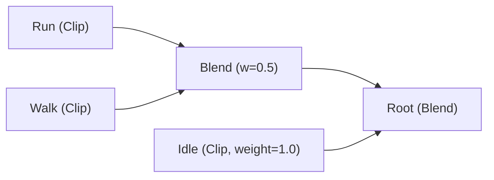
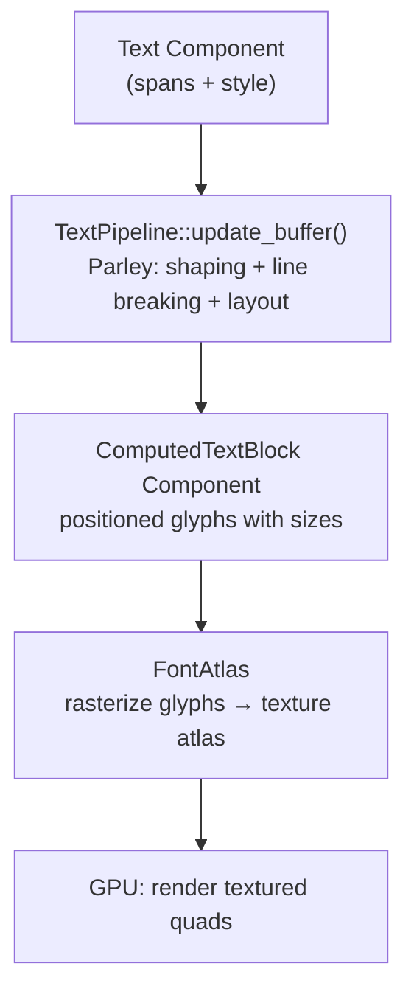

# 第 21 章：动画、场景与文本

> **导读**：本章涵盖三个子系统，它们各自独立但都展示了 ECS 的精妙应用：
> AnimationGraph 用 Resource + Component 混合模式实现动画混合，
> BSN 宏用 proc macro 构建声明式场景 DSL，Text Pipeline 集成
> Parley 排版引擎与 Font Atlas 字形图集。每个子系统约 800-1000 字。

---

## 21.1 AnimationGraph：Resource + Component 混合模式

### 动画图的结构

Bevy 的动画系统以 **AnimationGraph** 为核心——一个有向无环图 (DAG)，描述多个动画剪辑如何混合：

```rust
// 源码: crates/bevy_animation/src/graph.rs (简化)
#[derive(Asset, Reflect)]
pub struct AnimationGraph {
    graph: DiGraph<AnimationGraphNode, ()>,  // petgraph DAG
    root: NodeIndex,
    // mask groups, parameters, etc.
}

pub enum AnimationNodeType {
    Blend,    // Blend children by weight
    Add,      // Additive blending
    Clip(Handle<AnimationClip>),  // Leaf node: play a clip
}
```



*图 21-1: AnimationGraph DAG 结构 — Run+Walk 以 0.5 权重混合后，再与 Idle 混合*

### Resource + Component 混合

AnimationGraph 是一个 `Asset`——它可以从文件加载，存储在 `Assets<AnimationGraph>` Resource 中。但使用它的是 `AnimationPlayer` Component，挂载在需要动画的实体上：

```rust
// 源码: crates/bevy_animation/src/lib.rs (简化)
#[derive(Component, Reflect)]
pub struct AnimationPlayer {
    // Active animations with weights and timing
    // ...
}

// 源码: crates/bevy_animation/src/graph.rs
#[derive(Component, Reflect)]
pub struct AnimationGraphHandle(pub Handle<AnimationGraph>);
```

```
  Resource + Component 混合模式

  Assets<AnimationGraph> (Resource):
  ┌──────────────────────────────────┐
  │ Graph A: Idle/Walk/Run blend     │  ← 多个实体共享
  │ Graph B: Attack combo            │  ← Asset, 可热重载
  └──────────────────────────────────┘
       │ Handle
       ▼
  Entity (Character):
  ┌──────────────────────────────────┐
  │ AnimationGraphHandle(Handle<A>)  │  ← Component: 引用哪个图
  │ AnimationPlayer { ... }          │  ← Component: 播放状态
  │ Transform                        │  ← 被动画驱动
  └──────────────────────────────────┘
```

*图 21-2: AnimationGraph 的 Resource + Component 混合存储*

AnimationGraph 作为有向无环图的设计选择并非偶然。早期的动画系统通常使用简单的状态机——每个状态播放一个动画，状态间通过条件触发转换。状态机的问题在于扩展性：当需要混合多个动画层（如上半身攻击 + 下半身行走）时，状态数量会组合爆炸。DAG 结构将动画混合建模为数据流图——每个节点可以是剪辑播放、混合、叠加等操作，数据从叶节点流向根节点。这种建模方式天然支持多层混合和权重控制，无需为每种组合定义状态。Bevy 选择 petgraph 库实现 DAG 而非自研数据结构，体现了 Rust 生态复用的理念——petgraph 提供了经过充分测试的图算法实现，让 Bevy 可以专注于动画语义而非图数据结构的细节。

这种模式的好处：

- **共享**：多个实体可以引用同一个 AnimationGraph Asset
- **独立状态**：每个实体的 AnimationPlayer 维护独立的播放进度和权重
- **热重载**：修改 Graph Asset 文件会通过 AssetEvent 自动更新所有引用实体

动画系统在 `PostUpdate` 的 `AnimationSystems` 中执行，在 Transform 传播**之前**——确保动画修改的 Transform 值能在同一帧被传播。这种时序安排是 Resource + Component 混合模式的直接延伸：AnimationGraph（Asset/Resource）定义了动画的结构和混合规则，AnimationPlayer（Component）在每帧更新播放进度并写入 Transform。将动画执行放在 PostUpdate 而非 Update 可以确保所有游戏逻辑（如角色速度变化影响行走/跑步混合权重）已经完成，动画系统读取到的是本帧最终的游戏状态。这与 UI 布局放在 PostUpdate 的设计理念一致——"先完成所有修改，再统一计算结果"。

### Mask 与 Transition

AnimationGraph 支持 **Mask**——一个位域，控制哪些动画目标（骨骼）受节点影响。典型用例是让角色握住物品时，屏蔽手部的动画。

`AnimationTransition` 实现了动画之间的平滑过渡：

```rust
// 源码: crates/bevy_animation/src/transition.rs (概念)
// Transitions smoothly blend from old animation to new over a duration
```

**要点**：AnimationGraph 是 Asset (Resource 共享)，AnimationPlayer 是 Component (per-entity 状态)。这种混合模式平衡了数据共享和独立状态的需求。

---

## 21.2 BSN 宏：proc macro 构建声明式场景

### Scene trait

Bevy 的场景系统基于 `Scene` trait——一个描述 "Entity 应该长什么样" 的抽象：

```rust
// 源码: crates/bevy_scene/src/scene.rs (简化)
pub trait Scene: Send + Sync + 'static {
    fn resolve(
        &self,
        context: &mut ResolveContext,
        scene: &mut ResolvedScene,
    ) -> Result<(), ResolveSceneError>;

    fn register_dependencies(&self, _dependencies: &mut SceneDependencies) {}
}
```

`Scene` 是**组合式**的——多个 Scene 可以叠加到同一个 `ResolvedScene`。一个 Scene 可以：
- 添加 Component（Template）
- 添加子实体（通过 Relationship）
- 继承另一个 Scene（通过 `.bsn` 文件）
- 修改（Patch）已有的属性

### bsn! 宏

`bsn!` 是一个 proc macro，提供声明式的场景描述 DSL：

```rust
// 使用示例
world.spawn_scene(bsn! {
    #Player                    // Entity name
    Score(0)                   // Component with value
    Children [                 // Child entities (Relationship)
        Sword,                 // Child 1: just a component
        Shield,                // Child 2: just a component
    ]
});

// 带继承的场景
world.queue_spawn_scene(bsn! {
    :"player.bsn"             // Inherit from asset file
    #Player
    Score(0)
    Children [
        Sword,
        Shield,
    ]
});
```

`bsn!` 宏在编译期将这段 DSL 转换为实现了 `Scene` trait 的类型。

为什么 Bevy 需要一个专用的场景 DSL？在 bsn! 之前，创建复杂的实体层级需要大量的 `commands.spawn().with_child().with_child()` 链式调用，代码冗长且层级关系不直观。JSON 或 YAML 等通用数据格式可以描述层级结构，但它们是运行时解析的，无法在编译期检测类型错误——比如拼错了 Component 名称或传入了错误类型的值。bsn! 的设计目标是两全其美：像声明式数据格式一样清晰直观地描述实体层级，同时像 Rust 代码一样在编译期进行完整的类型检查。这种设计还有一个重要的性能特征：bsn! 在编译期就确定了需要哪些 Component，生成的代码可以直接调用类型化的 insert 方法，避免了运行时反序列化和类型查找的开销。代价是 proc macro 增加了编译时间，且 DSL 语法与标准 Rust 不同，需要额外的学习成本。

> **Rust 设计亮点**：`bsn!` 利用 proc macro 实现了一个领域特定语言 (DSL)，
> 在编译期验证语法正确性。它不是运行时解释的脚本——而是编译为 Rust 代码，
> 享受 Rust 的类型检查和零成本抽象。这是 Rust 宏系统在游戏引擎中的精妙应用：
> 用户写声明式的场景描述，编译器生成高效的 Entity spawn 代码。

### Template 与实体克隆

场景系统内部使用 `Template` 机制——每个 Component 类型可以实现 `FromTemplate` trait，定义如何从模板值创建实际组件：

```rust
// 源码概念: crates/bevy_ecs/src/template.rs
pub trait Template: Send + Sync + 'static {
    // Define how to contribute to an entity
}

pub trait FromTemplate: Component {
    // Create component from template value
}
```

当场景被 spawn 时，Template 被解析为实际的 Component 值，然后 insert 到 Entity 上。场景继承通过**覆盖合并**实现——子场景的属性覆盖父场景的同名属性。

Template 机制的设计动机来自游戏开发中的一个常见需求：预制体（Prefab）的变体。一个"基础士兵"场景定义了通用属性（模型、动画、碰撞体），而"弓箭手"和"骑兵"场景继承基础士兵并覆盖特定属性（武器、移动速度）。传统引擎用类继承实现这种关系，但 ECS 没有类继承。Template 的覆盖合并是 ECS 中实现"预制体变体"的惯用方式——它在数据层面实现了组合式继承，每个 Component 可以独立定义自己的合并策略。

`ResolvedScene` 内部可以包含多个相关实体（通过 Relationship），spawn 时会一起创建并建立关系。

### spawn_scene 与 queue_spawn_scene

```rust
// 源码: crates/bevy_scene/src/spawn.rs (概念)
pub trait WorldSceneExt {
    // Spawn immediately (dependencies must be loaded)
    fn spawn_scene<S: Scene>(&mut self, scene: S) -> Result<EntityWorldMut<'_>, SpawnSceneError>;

    // Queue for spawning (waits for dependencies to load)
    fn queue_spawn_scene<S: Scene>(&mut self, scene: S) -> EntityWorldMut<'_>;
}
```

`queue_spawn_scene` 处理有外部依赖的场景（如继承自 `.bsn` 文件）——它会等待所有依赖加载完成后再 spawn，利用了 Asset 系统（第 16 章）的异步加载能力。

**要点**：bsn! 宏在编译期将声明式 DSL 转换为 Scene trait 实现。Template 机制支持场景继承和属性覆盖。queue_spawn_scene 集成 Asset 异步加载。

---

## 21.3 Text Pipeline：Parley + Font Atlas

### 文本排版：Parley 集成

Bevy 的文本排版由 `Parley` 库驱动——一个现代的纯 Rust 排版引擎：

```rust
// 源码: crates/bevy_text/src/pipeline.rs (简化)
#[derive(Resource, Default)]
pub struct TextPipeline {
    sections_buffer: Vec<TextSectionView<'static>>,
    text_buffer: String,
}

impl TextPipeline {
    pub fn update_buffer(
        &mut self,
        fonts: &Assets<Font>,
        text_spans: impl Iterator<Item = (Entity, usize, &str, &TextFont, Color, ...)>,
        linebreak: LineBreak,
        justify: Justify,
        bounds: TextBounds,
        scale_factor: f32,
        computed: &mut ComputedTextBlock,
        font_system: &mut FontCx,
        layout_cx: &mut LayoutCx,
        // ...
    ) -> Result<(), TextError> { ... }
}
```

`TextPipeline` 是一个 Resource，维护排版过程中的缓存。文本渲染的流程：



*图 21-3: Text 渲染管线*

### Font Atlas：字形图集

每个字形只需光栅化一次——结果被缓存到 `FontAtlas`：

```rust
// 源码: crates/bevy_text/src/font_atlas.rs (简化)
pub struct FontAtlas {
    pub dynamic_texture_atlas_builder: DynamicTextureAtlasBuilder,
    pub glyph_to_atlas_index: HashMap<GlyphCacheKey, GlyphAtlasLocation>,
    pub texture_atlas: TextureAtlasLayout,
    pub texture: Handle<Image>,
}
```

```
  FontAtlas 字形图集

  ┌─────────────────────────────────┐
  │  ┌───┐ ┌───┐ ┌───┐ ┌───┐      │
  │  │ A │ │ B │ │ C │ │ D │      │
  │  └───┘ └───┘ └───┘ └───┘      │
  │  ┌───┐ ┌───┐ ┌───────┐        │
  │  │ a │ │ b │ │ W     │        │
  │  └───┘ └───┘ └───────┘        │
  │  ┌───┐                         │
  │  │ . │   (空闲空间)             │
  │  └───┘                         │
  └─────────────────────────────────┘
       ↑ GPU Texture (Rgba8Unorm)

  GlyphCacheKey → GlyphAtlasLocation (rect in atlas)
```

*图 21-4: FontAtlas 字形图集布局*

`FontAtlasSet` 为每个 (字体, 字号) 组合维护一个 `FontAtlas`。当遇到新字形时：

1. 用 `swash` 库光栅化字形
2. 通过 `DynamicTextureAtlasBuilder` 打包到图集纹理
3. 记录 `GlyphCacheKey → GlyphAtlasLocation` 映射
4. 如果当前图集满了，创建新的图集纹理

`FontAtlas` 中的 `texture` 是一个 `Handle<Image>`——字形图集本身也是 Asset，自然参与 Bevy 的资源管理和 GPU 上传流程。

### ECS 中的文本组件

文本在 ECS 中的建模：

```rust
// 概念性展示
// Root text entity:
//   - Text component (root content)
//   - TextLayout component (justify, linebreak)
//   - TextBounds component (max width/height)
//   - ComputedTextBlock component (layout cache)
//   - TextLayoutInfo component (glyph positions)
//   - TextFont / TextColor components (root style)
//
// Child span entities (optional):
//   - TextSpan component (appended content)
//   - TextFont / TextColor components (per-span style)
```

`ComputedTextBlock` 是 Parley 排版结果的缓存。根 `Text` / `Text2d` 的变化会触发重建，而 `TextFont`、`TextLayout`、`LineHeight`、`LetterSpacing`、`Children` 等变化也会把它标记为需要重新排版或重渲染。这又是 Changed 检测（第 10 章）在子系统中的应用。

选择 Parley 而非自研排版引擎是一个重要的架构决策。文本排版是一个看似简单实则极其复杂的领域：Unicode 双向文本、复杂脚本的字形连接（如阿拉伯文）、行折断算法、字距调整。Parley 作为纯 Rust 实现的排版引擎，处理了这些复杂性，让 Bevy 可以专注于文本与 ECS 的集成而非排版算法本身。Font Atlas 的设计同样值得关注——它将字形缓存建模为 Asset（Handle&lt;Image&gt;），这意味着字形图集自动参与 Bevy 的 GPU 资源管理和热重载流程。当字体文件被修改时，Font Atlas 会被重建，所有引用该字体的文本实体自动更新显示。这种设计的代价是字形图集占用额外的 GPU 内存，但对于游戏中常见的有限字符集，图集大小通常在几 MB 以内。

```
  文本变更检测

  Text/TextFont Changed?
       │
  Yes ─┤─→ TextPipeline::update_buffer() → ComputedTextBlock
       │
  No ──┤─→ 跳过排版，使用缓存的 ComputedTextBlock
```

**要点**：TextPipeline 集成 Parley 排版引擎，FontAtlas 缓存光栅化字形。ComputedTextBlock 利用 Changed 检测避免重复排版。Font Atlas 本身也是 Asset。

---

## 本章小结

本章我们从 ECS 视角分析了三个子系统：

### 动画
1. **AnimationGraph** 是 Asset（共享），**AnimationPlayer** 是 Component（独立状态）
2. 动画图是 DAG，支持混合、叠加、Mask
3. 动画在 PostUpdate 执行，在 Transform 传播之前

### 场景
4. **bsn! 宏** 在编译期将声明式 DSL 转换为 Scene trait 实现
5. **Template** 机制支持场景继承和属性覆盖
6. **queue_spawn_scene** 集成 Asset 异步加载

### 文本
7. **TextPipeline** 集成 Parley 排版，Changed 检测避免重复排版
8. **FontAtlas** 缓存光栅化字形到 GPU 纹理图集
9. 字形图集本身是 Asset，参与引擎资源管理

三个子系统虽然功能各异，但都遵循相同的 ECS 模式：数据是 Component/Resource，逻辑是 System，变更驱动更新，Asset 管理资源生命周期。这再次印证了 ECS 架构的统一性——理解了 ECS 原语，就理解了引擎的每个子系统。
