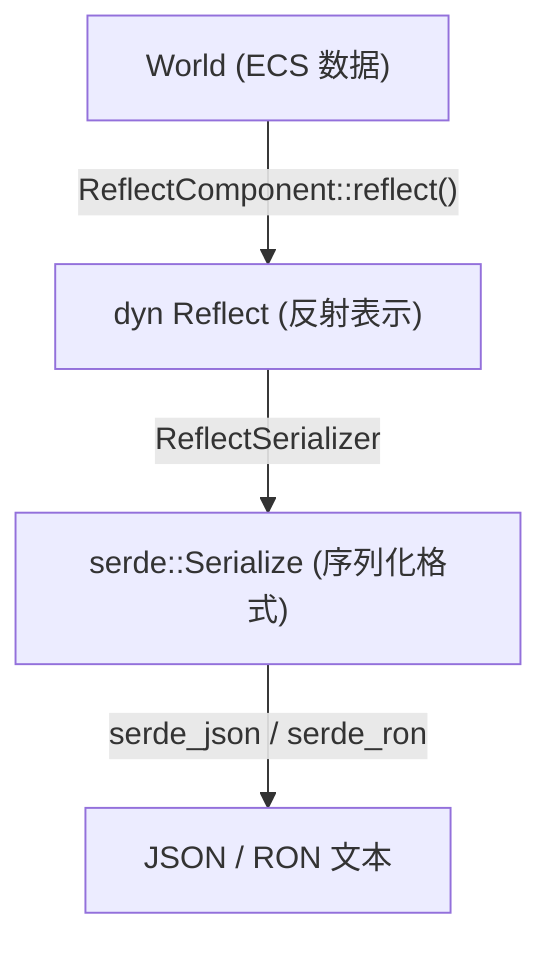

# 第 22 章：Reflect — ECS 的运行时镜像

> **导读**：Rust 语言没有内置反射 (Reflection)，但 Bevy 通过 derive 宏和
> TypeRegistry 构建了一套完整的运行时类型内省系统。本章从 TypeRegistry
> 注册机制出发，讲解 reflect_path 运行时字段访问、World→Reflect→serde
> 序列化链路、Reflect Functions 动态函数调用，以及 bevy_remote 调试协议。
> 理解反射系统，是理解场景保存、编辑器工具和远程调试的基础。

## 22.1 Rust 的反射困境与 Bevy 的方案

Rust 是一门强调零成本抽象和编译期确定性的语言。与 Java 或 C# 不同，Rust 编译器不会在二进制中保留类型的字段名、方法签名等元数据。这意味着在运行时，你无法"询问"一个值它有哪些字段。

Bevy 的解决方案是通过 `#[derive(Reflect)]` 宏在编译期生成反射元数据代码：

```rust
// 源码: crates/bevy_reflect/src/lib.rs (用法示例)
#[derive(Reflect)]
struct Player {
    name: String,
    health: f32,
    position: Vec3,
}
```

derive 宏为 `Player` 生成以下 trait 实现：
- `PartialReflect` — 动态内省的基础 trait
- `Reflect` — 完整反射，支持 downcast 到具体类型
- `Struct` / `TupleStruct` / `Enum` — 按类型结构分类的子 trait
- `Typed` — 提供编译期 `TypeInfo`
- `GetTypeRegistration` — 注册到 TypeRegistry
- `FromReflect` — 从动态值重构具体类型

> **Rust 设计亮点**：derive 宏在编译期生成反射元数据代码，而非依赖运行时
> 自省。这意味着只有标注了 `#[derive(Reflect)]` 的类型才参与反射，没有
> 全局运行时开销。这是"opt-in reflection"——你选择加入，编译器为你生成
> 代码。这种方式完美契合 Rust 的零成本抽象哲学。

为什么 Rust 不像 Java 或 C# 那样提供内置反射？根本原因在于 Rust 的设计哲学：只为你使用的功能付出代价（零成本抽象）。Java 的反射要求 JVM 在运行时保留所有类的元数据——字段名、方法签名、注解——即使这些信息从未被使用。C# 的反射同样依赖 CLR 的元数据表。这些运行时元数据不仅增加了二进制大小，还阻碍了编译器的优化——因为编译器不知道哪些字段会被反射访问，无法安全地移除"未使用"的代码。Rust 编译为原生二进制，没有虚拟机，编译后的代码中不保留类型名和字段名。Bevy 的 derive 宏方案是对这个限制的精妙回应：只有标注了 `#[derive(Reflect)]` 的类型才生成反射代码，未标注的类型没有任何开销。这是"opt-in"设计——开发者显式选择哪些类型需要反射能力，编译器为这些类型生成等价于手写的内省代码。

**要点**：Bevy Reflect 通过 derive 宏在编译期生成反射代码，弥补 Rust 语言缺乏内置反射的不足。

## 22.2 PartialReflect 与 Reflect：双层 trait 设计

反射系统的核心是两个 trait 层次：

```rust
// 源码: crates/bevy_reflect/src/reflect.rs (简化)
pub trait PartialReflect: DynamicTypePath + Send + Sync {
    fn reflect_ref(&self) -> ReflectRef;
    fn reflect_mut(&mut self) -> ReflectMut;
    fn try_apply(&mut self, value: &dyn PartialReflect) -> Result<(), ApplyError>;
    fn try_as_reflect(&self) -> Option<&dyn Reflect>;
    fn reflect_clone(&self) -> Result<Box<dyn PartialReflect>, ReflectCloneError>;
    // ...
}

pub trait Reflect: PartialReflect {
    fn into_any(self: Box<Self>) -> Box<dyn Any>;
    fn as_any(&self) -> &dyn Any;
    fn as_any_mut(&mut self) -> &mut dyn Any;
    fn into_reflect(self: Box<Self>) -> Box<dyn Reflect>;
    fn as_reflect(&self) -> &dyn Reflect;
    fn as_reflect_mut(&mut self) -> &mut dyn Reflect;
    fn set(&mut self, value: Box<dyn Reflect>) -> Result<(), Box<dyn Reflect>>;
}
```

为什么需要两层？

| trait | 角色 | downcast | 典型使用 |
|-------|------|----------|---------|
| `PartialReflect` | 动态数据模型 | 不能直接 downcast | `DynamicStruct`、序列化中间值 |
| `Reflect` | 完整反射 | 可以 downcast 到 `T` | 具体类型的运行时操作 |

`DynamicStruct` 实现了 `PartialReflect` 但不实现 `Reflect`，因为它是"动态构建的结构体"，不对应任何具体的 Rust 类型。通过 `FromReflect::from_reflect`，可以将一个 `dyn PartialReflect` 转换为具体类型。

双层 trait 设计的深层动机在于反序列化流程中的类型安全问题。当从 JSON 反序列化一个结构体时，解析器首先构建一个 `DynamicStruct`——一个键值对的集合。这个 DynamicStruct 实现了 `PartialReflect`（可以按字段名访问数据），但它不实现 `Reflect`，因为它不是任何具体 Rust 类型的实例。只有通过 `FromReflect::from_reflect` 将 DynamicStruct 转换为具体类型（如 Player）后，才获得 Reflect 能力。这种分层设计防止了一类常见错误：在类型不确定时就尝试 downcast。如果只有单一的 Reflect trait，DynamicStruct 也需要实现它，downcast 到具体类型时只能在运行时失败。双层设计将这个约束提升到了编译期——持有 `dyn PartialReflect` 的代码在类型层面就被阻止了 downcast 操作。

**要点**：`PartialReflect` 是动态数据操作的基础，`Reflect` 在此之上提供具体类型的 downcast 能力。

## 22.3 TypeRegistry：运行时类型元数据库

`TypeRegistry` 是反射系统的中枢数据库，存储所有已注册类型的元数据：

```rust
// 源码: crates/bevy_reflect/src/type_registry.rs
pub struct TypeRegistry {
    registrations: TypeIdMap<TypeRegistration>,   // TypeId → 注册信息
    short_path_to_id: HashMap<&'static str, TypeId>, // 短路径查找
    type_path_to_id: HashMap<&'static str, TypeId>,  // 完整路径查找
    ambiguous_names: HashSet<&'static str>,           // 名称冲突记录
}
```

每个 `TypeRegistration` 包含一个类型的所有反射元数据：

```
  TypeRegistry
  ┌──────────────────────────────────────────────┐
  │  TypeId(Player) → TypeRegistration {         │
  │    type_info: StructInfo {                   │
  │      fields: ["name", "health", "position"]  │
  │    }                                         │
  │    type_data: {                              │
  │      ReflectComponent → (insert/reflect fn)  │
  │      ReflectDefault → (default fn)           │
  │      ReflectSerialize → (serialize fn)       │
  │    }                                         │
  │  }                                           │
  │                                              │
  │  TypeId(Vec3) → TypeRegistration { ... }     │
  │  TypeId(String) → TypeRegistration { ... }   │
  └──────────────────────────────────────────────┘
```

*图 22-1: TypeRegistry 结构*

### TypeRegistry 与 ECS Component 的集成

Bevy 的 `App::register_type::<T>()` 将类型注册到 `AppTypeRegistry` 资源中（一个 `TypeRegistryArc`）。当类型同时实现 `Component` 和 `Reflect` 时，`ReflectComponent` 类型数据会被自动注入：

```rust
// 注册后，可以通过 TypeRegistry 动态操作 Component
let registry = world.resource::<AppTypeRegistry>().read();
let registration = registry.get(TypeId::of::<Player>()).unwrap();
let reflect_component = registration.data::<ReflectComponent>().unwrap();

// 动态读取实体上的 Player 组件
let reflected: &dyn Reflect = reflect_component.reflect(world, entity).unwrap();
```

`ReflectComponent` 提供了 `insert`、`reflect`、`reflect_mut`、`remove` 等方法，使得编辑器工具可以在不知道具体类型的情况下操作组件数据。类似的类型数据还有 `ReflectResource`、`ReflectDefault`、`ReflectSerialize` 等。

TypeRegistry 的设计哲学是将类型元数据集中管理而非分散存储。替代方案是让每个 Component 类型自身持有反射能力（如通过 vtable），但这会导致反射功能与组件类型紧耦合——每添加一种新的运行时操作（如序列化、编辑器显示、远程调试），都需要修改 Component 的 trait 要求。TypeRegistry 的 TypeData 机制将这些"附加能力"外挂到注册信息上，而非嵌入类型本身。这意味着 ReflectComponent、ReflectSerialize、ReflectDefault 可以独立添加和移除，不同的工具（编辑器、调试器、场景保存器）只查询自己需要的 TypeData。这种解耦对引擎的可扩展性至关重要：第三方 Plugin 可以注册新的 TypeData 种类，无需修改 Bevy 核心代码。

**要点**：TypeRegistry 通过 TypeData 机制将反射与 ECS 集成——`ReflectComponent` 让工具可以动态操作任意已注册的组件类型。

## 22.4 ReflectPath：运行时字段访问

`GetPath` trait 支持用字符串路径访问嵌套字段：

```rust
// 源码: crates/bevy_reflect/src/path/mod.rs (简化)
pub trait ReflectPath<'a>: Sized {
    fn reflect_element(self, root: &dyn PartialReflect)
        -> Result<&dyn PartialReflect, ReflectPathError<'a>>;
    fn reflect_element_mut(self, root: &mut dyn PartialReflect)
        -> Result<&mut dyn PartialReflect, ReflectPathError<'a>>;
}
```

路径语法支持三种访问方式：

| 语法 | 含义 | 示例 |
|------|------|------|
| `.field` | 命名字段 | `".position"` |
| `[index]` | 索引访问 | `"[0]"` |
| `#variant` | 枚举变体 | `"#Some"` |

这些可以组合使用：

```rust
// 路径示例
player.reflect_path(".position.x")  // 访问 Player.position.x
list.reflect_path("[2].name")       // 访问 list[2].name
option.reflect_path("#Some.0")      // 访问 Option::Some 的第一个字段
```

路径解析器将字符串解析为 `Access` 序列，逐级导航到目标字段。这在编辑器属性面板和序列化路径中非常有用——你可以用字符串引用任意深度的字段。

**要点**：`reflect_path` 支持用字符串路径（`.field`、`[index]`、`#variant`）在运行时访问任意深度的嵌套字段。

## 22.5 序列化链路：World → Reflect → serde

Bevy 的场景序列化遵循三层转换链路：



*图 22-2: World → Reflect → serde 序列化链路*

### 序列化

```rust
// 源码: crates/bevy_reflect/src/serde/ (简化)
// ReflectSerializer 将 dyn PartialReflect 转换为 serde Serialize
pub struct ReflectSerializer<'a> {
    value: &'a dyn PartialReflect,
    registry: &'a TypeRegistry,
}
```

`ReflectSerializer` 需要 `TypeRegistry` 来查找类型的路径名（作为 JSON/RON 中的类型标识符）。序列化时，结构体被展开为字段名→值的映射，枚举被编码为变体名→数据的格式。

### 反序列化

```rust
// TypedReflectDeserializer 已知目标类型，直接反序列化
pub struct TypedReflectDeserializer<'a> {
    registration: &'a TypeRegistration,
    registry: &'a TypeRegistry,
}
```

反序列化产生 `Box<dyn PartialReflect>`（通常是 `DynamicStruct`），然后通过 `FromReflect::from_reflect` 转换为具体类型，最后通过 `ReflectComponent::insert` 写回 World。

这条序列化链路揭示了 Bevy 反射系统与 serde 生态整合的核心挑战。serde 的设计假设序列化/反序列化的类型在编译期已知——`#[derive(Serialize)]` 生成的代码直接操作具体类型的字段。但场景序列化需要在运行时处理任意类型的组件，编译期不知道场景文件中包含哪些组件类型。ReflectSerializer 通过在 JSON/RON 输出中嵌入类型路径（如 `"bevy_transform::Transform"`）来解决这个问题——反序列化时，先解析类型路径，在 TypeRegistry 中查找对应的 TypeRegistration，获取反序列化所需的元数据。这种"类型路径 + Registry 查找"的模式是静态类型语言实现动态序列化的标准做法，但它引入了一个脆弱点：如果类型被重命名或模块路径发生变化，旧的序列化文件将无法加载。Bevy 通过 `#[reflect(type_path = "...")]` 属性提供了路径迁移机制。

完整的场景保存/加载流程：

```
  保存: World → 遍历实体 → ReflectComponent::reflect()
        → ReflectSerializer → RON/JSON 文件

  加载: RON/JSON 文件 → TypedReflectDeserializer → DynamicStruct
        → FromReflect::from_reflect → ReflectComponent::insert → World
```

**要点**：场景序列化是 World→Reflect→serde 的三层链路，TypeRegistry 贯穿始终，提供类型标识和反序列化所需的元数据。

## 22.6 Reflect Functions：动态函数调用

`bevy_reflect` 的 `func` 模块支持将 Rust 函数转换为可动态调用的形式：

```rust
// 源码: crates/bevy_reflect/src/func/mod.rs (用法示例)
use bevy_reflect::func::{DynamicFunction, IntoFunction, ArgList};

fn add(a: i32, b: i32) -> i32 { a + b }

// 将普通函数转换为 DynamicFunction
let func: DynamicFunction = add.into_function();

// 用 ArgList 传入参数并调用
let args = ArgList::default().with_owned(25_i32).with_owned(75_i32);
let result = func.call(args).unwrap();
assert_eq!(result.unwrap_owned().try_downcast_ref::<i32>(), Some(&100));
```

核心类型：

| 类型 | 说明 |
|------|------|
| `DynamicFunction` | 不可变函数/闭包的动态表示 |
| `DynamicFunctionMut` | 可变闭包的动态表示 |
| `IntoFunction` | 将 `Fn` 转为 `DynamicFunction` 的 trait |
| `IntoFunctionMut` | 将 `FnMut` 转为 `DynamicFunctionMut` 的 trait |
| `ArgList` | 动态参数列表 |
| `Return` | 动态返回值 |

支持的函数签名包括：
- `(...) -> R` — 普通函数
- `for<'a> (&'a arg, ...) -> &'a R` — 返回引用的函数
- `for<'a> (&'a mut arg, ...) -> &'a mut R` — 返回可变引用的函数

函数也可以注册到 `FunctionRegistry` 中，供远程调试协议按名称调用。

**要点**：Reflect Functions 通过 `IntoFunction` trait 将 Rust 函数转为动态可调用对象，支持运行时参数传递和返回值提取。

## 22.7 bevy_remote：基于反射的调试协议

`bevy_remote` crate 基于 JSON-RPC 2.0 协议，通过 HTTP 暴露 World 的反射接口：

```
  外部工具 (编辑器/调试器)          Bevy 应用
  ┌────────────────────┐          ┌────────────────────┐
  │  JSON-RPC Client   │◀── HTTP ──▶│  RemotePlugin      │
  │                    │          │    ├─ BrpRequest     │
  │  world.query       │          │    ├─ TypeRegistry   │
  │  world.get_components         │    └─ World          │
  │  world.insert_components      │                      │
  └────────────────────┘          └────────────────────┘
```

*图 22-3: bevy_remote 架构*

### 内置方法

```rust
// 源码: crates/bevy_remote/src/builtin_methods.rs
pub const BRP_GET_COMPONENTS_METHOD: &str = "world.get_components";
pub const BRP_QUERY_METHOD: &str = "world.query";
pub const BRP_SPAWN_ENTITY_METHOD: &str = "world.spawn_entity";
pub const BRP_INSERT_COMPONENTS_METHOD: &str = "world.insert_components";
pub const BRP_REMOVE_COMPONENTS_METHOD: &str = "world.remove_components";
pub const BRP_DESPAWN_COMPONENTS_METHOD: &str = "world.despawn_entity";
pub const BRP_REPARENT_ENTITIES_METHOD: &str = "world.reparent_entities";
```

一个典型的请求-响应示例：

```json
// 请求：获取实体 4294967298 的 Transform 组件
{
    "method": "world.get_components",
    "id": 0,
    "params": {
        "entity": 4294967298,
        "components": ["bevy_transform::components::transform::Transform"]
    }
}

// 响应：组件数据以反射序列化的 JSON 返回
{
    "jsonrpc": "2.0",
    "id": 0,
    "result": {
        "bevy_transform::components::transform::Transform": {
            "translation": { "x": 0.0, "y": 0.5, "z": 0.0 },
            "rotation": { "x": 0.0, "y": 0.0, "z": 0.0, "w": 1.0 },
            "scale": { "x": 1.0, "y": 1.0, "z": 1.0 }
        }
    }
}
```

这个协议的核心依赖是反射系统——组件通过 `ReflectComponent` 读取，通过 `ReflectSerializer` 序列化为 JSON。没有反射，就不可能实现这种通用的远程查询能力。

**要点**：bevy_remote 通过 JSON-RPC 2.0 协议暴露 World 的反射接口，是编辑器和调试工具的基础通信协议。

## 本章小结

本章我们深入了 Bevy 的反射系统：

1. **derive 宏** 在编译期为类型生成反射代码，弥补 Rust 无内置反射的限制
2. **PartialReflect / Reflect** 双层 trait 设计分离了动态数据模型和具体类型 downcast
3. **TypeRegistry** 是反射元数据的中枢，通过 TypeData（如 `ReflectComponent`）与 ECS 集成
4. **reflect_path** 支持字符串路径访问嵌套字段
5. **序列化链路** 是 World → Reflect → serde 的三层转换
6. **Reflect Functions** 支持动态函数调用
7. **bevy_remote** 基于反射实现 JSON-RPC 2.0 调试协议

下一章，我们将深入 Bevy 的并发模型——TaskPool 三池架构和调度器的并行决策算法。
