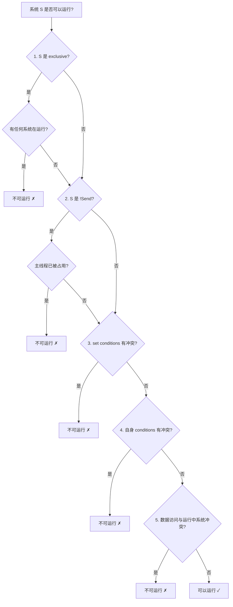

# 第 23 章：并发模型

> **导读**：Bevy 引擎的高性能很大程度上来自其并发设计。本章从 TaskPool 三池
> 架构出发，讲解调度器的并行决策算法、par_iter 数据并行、单线程与多线程
> 模式的差异，以及 Send/Sync 约束在 ECS 中的角色。本章与第 9 章 (Schedule)
> 关系密切——第 9 章讲的是"如何编排系统"，本章讲的是"如何并行执行系统"。

## 23.1 TaskPool 三池架构

Bevy 将异步任务分为三个独立的线程池，每个池针对不同类型的工作负载优化：

```rust
// 源码: crates/bevy_tasks/src/usages.rs
taskpool! { (COMPUTE_TASK_POOL, ComputeTaskPool) }
taskpool! { (ASYNC_COMPUTE_TASK_POOL, AsyncComputeTaskPool) }
taskpool! { (IO_TASK_POOL, IoTaskPool) }
```

三个池通过 `OnceLock` 全局单例管理，在 App 启动时初始化：

```
  ┌──────────────────────────────────────────────────────┐
  │                  Bevy 任务池架构                       │
  │                                                      │
  │  ┌─────────────────┐  必须在当前帧完成                  │
  │  │ ComputeTaskPool │  线程数 = CPU 核心数               │
  │  │  (同步计算)      │  用途: System 并行执行             │
  │  └─────────────────┘                                  │
  │                                                      │
  │  ┌──────────────────┐  可跨帧完成                      │
  │  │AsyncComputeTaskPool│  线程数 = CPU 核心数             │
  │  │  (异步计算)        │  用途: 寻路、AI 决策             │
  │  └──────────────────┘                                  │
  │                                                      │
  │  ┌─────────────────┐  I/O 密集                        │
  │  │   IoTaskPool    │  线程数 = CPU 核心数               │
  │  │   (异步 I/O)     │  用途: 文件加载、网络请求           │
  │  └─────────────────┘                                  │
  └──────────────────────────────────────────────────────┘
```

*图 23-1: TaskPool 三池架构*

| 线程池 | 典型用途 | 任务特征 |
|--------|---------|---------|
| `ComputeTaskPool` | System 并行执行、par_iter | 必须在当前帧完成 |
| `AsyncComputeTaskPool` | 寻路、程序生成、AI 决策 | 可跨帧执行 |
| `IoTaskPool` | Asset 加载、网络请求 | I/O 等待为主，CPU 使用少 |

### TaskPool 内部结构

每个 `TaskPool` 是对底层执行器的封装：

```rust
// 源码: crates/bevy_tasks/src/task_pool.rs (简化)
pub struct TaskPoolBuilder {
    num_threads: Option<usize>,  // 默认 = 逻辑核心数
    stack_size: Option<usize>,
    thread_name: Option<String>,
    on_thread_spawn: Option<Arc<dyn Fn() + Send + Sync + 'static>>,
    on_thread_destroy: Option<Arc<dyn Fn() + Send + Sync + 'static>>,
}
```

`TaskPool::scope` 方法是并行执行的核心入口——它创建一个作用域，在其中可以 spawn 多个任务，所有任务在 scope 结束时保证完成：

```rust
compute_pool.scope(|scope| {
    for chunk in work.chunks(BATCH_SIZE) {
        scope.spawn(async move {
            process(chunk);
        });
    }
});
// 到这里，所有 spawn 的任务都已完成
```

### 主线程 tick

每帧主线程会 tick 三个池的 local executor，处理需要在主线程执行的任务：

```rust
// 源码: crates/bevy_tasks/src/usages.rs
pub fn tick_global_task_pools_on_main_thread() {
    // 每个池的 local_executor 处理最多 100 个任务
    COMPUTE_TASK_POOL.get().unwrap().with_local_executor(|exec| {
        for _ in 0..100 { exec.try_tick(); }
    });
    // AsyncCompute 和 IO 同理
}
```

为什么是三个池而非一个统一的线程池？这个设计源于游戏引擎工作负载的独特特征。游戏帧循环有严格的时间预算（16.6ms @60fps），帧内的计算任务（System 执行、物理模拟）必须在这个预算内完成——它们是"阻塞式"的，主线程会等待它们全部完成才进入下一帧。如果将这些帧内任务与 I/O 任务（资源加载、网络请求）放在同一个池中，I/O 任务的线程可能阻塞在磁盘读取上，占用了本应执行帧内计算的线程。将 ComputeTaskPool 与 IoTaskPool 分离确保了帧内计算不会被 I/O 阻塞"挤占"。AsyncComputeTaskPool 则处于中间地带——寻路或 AI 决策等任务可能需要多帧才能完成，它们不应阻塞主帧循环，但也不是 I/O 密集型。三池架构让每种工作负载在自己的线程池中运行，互不干扰。代价是总线程数更多（每个池默认使用 CPU 核心数个线程），但现代 CPU 的核心数通常充裕，线程上下文切换的开销在操作系统层面得到了良好管理。

**要点**：三个 TaskPool 分别优化同步计算、异步计算和 I/O 工作负载。ComputeTaskPool 负责 System 的并行执行，AsyncComputeTaskPool 处理可跨帧的长任务。

## 23.2 多线程调度器：并行决策算法

第 9 章我们了解了 Schedule 如何对系统进行拓扑排序。本节深入 `MultiThreadedExecutor`——它决定哪些系统可以在同一时刻并行运行。

### 核心数据结构

```rust
// 源码: crates/bevy_ecs/src/schedule/executor/multi_threaded.rs (简化)
struct SystemTaskMetadata {
    conflicting_systems: FixedBitSet,           // 数据访问冲突的系统集合
    condition_conflicting_systems: FixedBitSet,  // 条件评估冲突的系统
    dependents: Vec<usize>,                      // 依赖于本系统的下游系统
    is_send: bool,                               // 是否可以在非主线程运行
    is_exclusive: bool,                          // 是否需要独占 World
}
```

`conflicting_systems` 基于第 7 章和第 9 章介绍的 `FilteredAccessSet` 计算——如果两个系统的组件访问存在读写冲突且不能通过 Archetype 过滤证明不相交，它们就是冲突的。

### can_run 决策流程

调度器在每次尝试启动一个系统时，都会执行以下决策流程：



*图 23-2: can_run 并行决策流程*

对应源码：

```rust
// 源码: crates/bevy_ecs/src/schedule/executor/multi_threaded.rs
fn can_run(&mut self, system_index: usize, conditions: &mut Conditions) -> bool {
    let system_meta = &self.system_task_metadata[system_index];

    // 1. Exclusive 系统需要独占
    if system_meta.is_exclusive && self.num_running_systems > 0 {
        return false;
    }

    // 2. !Send 系统只能在主线程
    if !system_meta.is_send && self.local_thread_running {
        return false;
    }

    // 3-4. Condition 冲突检查 (用 FixedBitSet::is_disjoint)
    for set_idx in conditions.sets_with_conditions_of_systems[system_index]
        .difference(&self.evaluated_sets)
    {
        if !self.set_condition_conflicting_systems[set_idx]
            .is_disjoint(&self.running_systems) {
            return false;
        }
    }

    // 5. 数据访问冲突检查
    if !system_meta.conflicting_systems.is_disjoint(&self.running_systems) {
        return false;
    }

    true
}
```

`FixedBitSet::is_disjoint` 是一个 O(n/64) 的位运算操作——对于 100 个系统，只需比较约 2 个 u64 就能判断是否冲突。

多线程调度器的并行决策算法本质上是在运行时模拟一个简化版的借用检查器。它面临一个 NP 难的调度优化问题：给定一组系统和它们之间的冲突关系，找到最大化并行度的执行方案。Bevy 没有追求最优解，而是采用贪心策略——按拓扑排序的顺序依次尝试启动系统，只要 can_run 检查通过就立刻启动。这种贪心策略可能不是全局最优的（某些情况下推迟启动一个系统可能让更多系统并行），但它的决策开销极低——每个系统的 can_run 检查只需几次位运算。在实践中，ECS 系统的冲突图通常是稀疏的（大多数系统访问不同的组件），贪心策略已经能达到接近最优的并行度。更重要的是，调度决策发生在每帧的关键路径上，任何算法复杂度的增加都会直接影响帧时间。

### 执行循环

调度器的主循环逻辑：

1. 将所有依赖已满足的系统加入 `ready_systems` 队列
2. 按优先级遍历 ready_systems
3. 对每个系统调用 `can_run` 检查
4. 通过检查的系统 spawn 到 ComputeTaskPool
5. 系统完成后，通知 dependents 减少依赖计数
6. 重复直到所有系统完成

> **Rust 设计亮点**：`FixedBitSet` 用位运算高效表示系统间的冲突关系。
> 判断两个系统是否可以并行，只需要一次 bitwise AND + 判零操作。
> 这比 HashMap 查找或遍历列表快得多，让调度决策开销可以忽略不计。

**要点**：多线程调度器通过 FixedBitSet 冲突矩阵和 5 步 can_run 决策流程，在微秒级别判断系统是否可以并行运行。

## 23.3 FilteredAccess：编译期借用到运行时调度

这是连接 Rust 借用检查和 ECS 并行调度的关键抽象（在第 7 章和第 9 章首次出现）：

```rust
// 源码: crates/bevy_ecs/src/query/access.rs
pub struct FilteredAccess {
    pub(crate) access: Access,            // 读写了哪些 ComponentId
    pub(crate) required: ComponentIdSet,  // 必须存在的组件
    pub(crate) filter_sets: Vec<AccessFilters>, // With/Without 过滤条件
}
```

每个 System 在注册时通过 `SystemParam::init_access` 声明自己的数据访问模式。调度器在 build 阶段计算所有系统对的冲突关系：

```
  System A: Query<&mut Position, With<Player>>
    → access: { write: [Position] }
    → filter: { with: [Player] }

  System B: Query<&Position, With<Enemy>>
    → access: { read: [Position] }
    → filter: { with: [Enemy] }

  冲突判断:
    A write Position ∩ B read Position = 冲突？
    → 检查 filter: With<Player> ∩ With<Enemy> 是否可能重叠
    → Player 和 Enemy 互斥 → 不冲突 → 可以并行 ✓
```

这就是 Bevy 将 Rust 的编译期借用规则（`&T` vs `&mut T` 不共存）转换到运行时并行调度的方式。编译器无法在系统级别做这个推断，所以 Bevy 在运行时（但仅在构建阶段，不在每帧）用 FilteredAccess 做等效的检查。

FilteredAccess 中的 filter_sets 扮演着至关重要的角色——它让调度器能够识别"虽然访问同一组件，但操作不同实体集合"的系统对。没有 filter_sets，两个分别查询 `Query<&mut Position, With<Player>>` 和 `Query<&mut Position, With<Enemy>>` 的系统会被判定为冲突（因为都写 Position），无法并行。filter_sets 让调度器看到 With&lt;Player&gt; 和 With&lt;Enemy&gt; 是互斥过滤条件，从而判定两个系统操作不同的实体子集，可以安全并行。这种基于 Archetype 过滤的冲突消解是 Bevy 并行性能的关键优化之一——它将 ECS 的列式存储和 Archetype 分组信息融入调度决策，最大化了并行度。

**要点**：FilteredAccess 将编译期借用规则提升到运行时，让调度器能安全地判断系统间的数据访问是否冲突。

## 23.4 par_iter：数据并行

除了系统级并行，Bevy 还支持单个系统内部的数据并行——通过 `par_iter` 将 Query 的遍历分散到多个线程：

```rust
// 使用示例
fn movement_system(mut query: Query<(&mut Position, &Velocity)>) {
    query.par_iter_mut().for_each(|(mut pos, vel)| {
        pos.0 += vel.0 * DELTA_TIME;
    });
}
```

`par_iter` 的工作原理：

```
  Query 匹配了 1000 个实体 (分布在 3 个 Table 中)

  Table 0 (400 entities)    Table 1 (350 entities)    Table 2 (250 entities)
  ┌──────┬──────┬──────┐    ┌──────┬──────┐           ┌──────┬──────┐
  │Batch1│Batch2│Batch3│    │Batch4│Batch5│           │Batch6│Batch7│
  │ 128  │ 128  │ 144  │    │ 175  │ 175  │           │ 125  │ 125  │
  └──┬───┴──┬───┴──┬───┘    └──┬───┴──┬───┘           └──┬───┴──┬───┘
     │      │      │           │      │                   │      │
     ▼      ▼      ▼           ▼      ▼                   ▼      ▼
  Thread1 Thread2 Thread3  Thread1 Thread2            Thread3 Thread1
  (ComputeTaskPool)
```

*图 23-3: par_iter 数据并行分批*

批次大小由 `BatchingStrategy` 控制：

```rust
// 源码: crates/bevy_ecs/src/batching.rs (概念)
pub struct BatchingStrategy {
    pub batch_size_limits: Range<usize>, // 默认 1..=usize::MAX
    pub batches_per_thread: usize,       // 默认 1
}
```

par_iter 内部使用 `ComputeTaskPool::scope` 来分发批次任务。每个批次内的实体仍然是顺序处理的（保持缓存局部性），只是不同批次在不同线程上并行。

par_iter 的批次划分策略值得深入理解。每个批次内的实体是连续存储在同一个 Table 中的，这意味着批次内的遍历享有极好的缓存局部性——CPU 缓存行预取的数据正好是下一个要处理的实体。如果批次太小，线程创建和同步的开销会超过并行收益；如果批次太大，负载不均衡——某些线程很快完成，另一些还在忙碌。Bevy 的 ComputeTaskPool 内部使用 work-stealing 机制来缓解负载不均衡：空闲的线程会从其他线程的任务队列中"偷"任务。这意味着即使批次大小不完美，work-stealing 也能在运行时动态平衡负载。但 work-stealing 本身有开销（需要原子操作和可能的缓存失效），所以合理的初始批次划分仍然重要。

**注意**：par_iter 不适合所有场景。如果每个实体的处理逻辑非常轻量（如简单加法），线程调度的开销可能超过并行带来的收益。一般当实体数超过 1000 且处理逻辑中等复杂度时，par_iter 才有明显优势。

**要点**：par_iter 将 Query 遍历按批次分发到 ComputeTaskPool，实现系统内部的数据并行。

## 23.5 单线程模式

Bevy 支持在不启用 `multi_threaded` feature 的情况下以单线程模式运行。这在 WASM 环境中尤为重要：

```rust
// 源码: crates/bevy_tasks/src/lib.rs
cfg::conditional_send! {
    if {
        // WASM 平台: Send 约束被移除
        pub trait ConditionalSend {}
        impl<T> ConditionalSend for T {}
    } else {
        // 原生平台: 保留 Send 约束
        pub trait ConditionalSend: Send {}
        impl<T: Send> ConditionalSend for T {}
    }
}
```

单线程模式下的关键差异：

| 特性 | 多线程模式 | 单线程模式 |
|------|-----------|-----------|
| System 执行 | 并行 (MultiThreadedExecutor) | 顺序 (SimpleExecutor) |
| TaskPool | 真正的线程池 | 单线程模拟 (`SingleThreadedTaskPool`) |
| Future | 必须 `Send` | 不要求 `Send` |
| par_iter | 多线程分批 | 退化为普通 iter |
| NonSend | 限制主线程 | 无限制（一切都在主线程） |

```rust
// 源码: crates/bevy_tasks/src/single_threaded_task_pool.rs (简化)
// 单线程 TaskPool 在调用 scope 时直接顺序执行所有任务
pub struct TaskPool {}

impl TaskPool {
    pub fn scope<'env, F, T>(&self, f: F) -> Vec<T>
    where
        F: for<'scope> FnOnce(&'scope Scope<'scope, 'env, T>),
    {
        // 直接在当前线程执行，无线程切换
    }
}
```

**要点**：单线程模式通过 `ConditionalSend` trait 放松 Send 约束，所有任务在主线程顺序执行，适用于 WASM 等不支持多线程的平台。

## 23.6 Send/Sync 在 ECS 中的角色

Bevy ECS 的并行能力建立在 Rust 的类型系统之上——`Send` 和 `Sync` 是关键约束：

```
  Component: Send + Sync + 'static
  Resource:  Send + Sync + 'static
  System fn: Send + Sync + 'static (每个参数也必须满足)

  ─────────────────────────────────────────────────
  Send  → 数据可以从一个线程移动到另一个线程
  Sync  → 数据的引用可以被多个线程共享
  ─────────────────────────────────────────────────

  结果:
  → 多个系统读同一组件 (&T where T: Sync) → 安全 ✓
  → 一个系统写组件 (&mut T) → 调度器保证独占 → 安全 ✓
  → 组件在线程间移动 (T: Send) → 安全 ✓
```

### NonSend：逃生舱口

有些平台 API（如窗口句柄、OpenGL 上下文）不满足 `Send`。Bevy 通过 `NonSend<T>` 和 `NonSendMut<T>` 提供逃生舱口：

```rust
// NonSend 系统只能在主线程运行
fn platform_system(window: NonSend<PlatformWindow>) {
    window.set_title("Bevy");
}
```

调度器中的处理：

```rust
// 源码: crates/bevy_ecs/src/schedule/executor/multi_threaded.rs
// SystemTaskMetadata.is_send 标记
if !system_meta.is_send && self.local_thread_running {
    return false;  // 主线程已被占用，NonSend 系统必须等待
}
```

NonSend 系统被调度到 `ThreadExecutor`（主线程执行器），不会被 spawn 到 ComputeTaskPool 的工作线程上。

> **Rust 设计亮点**：Bevy 将 Rust 的 Send/Sync trait 约束从编译期
> 类型检查延伸到运行时调度策略。`!Send` 类型自动被限制在主线程——
> 不是通过文档约定，而是通过类型系统强制执行。

**要点**：Send + Sync 是 ECS 并行执行的基石。NonSend 提供了 `!Send` 类型的安全逃生舱口，自动被限制在主线程执行。

## 本章小结

本章我们深入了 Bevy 的并发模型：

1. **TaskPool 三池架构**：Compute（帧内同步计算）、AsyncCompute（跨帧异步计算）、IO（I/O 密集）
2. **多线程调度器**：通过 FixedBitSet 冲突矩阵和 5 步 can_run 决策，在微秒级判断并行安全性
3. **FilteredAccess**：将编译期借用规则提升到运行时，驱动并行调度
4. **par_iter**：系统内部的数据并行，按批次分发到 ComputeTaskPool
5. **单线程模式**：通过 ConditionalSend 放松约束，适配 WASM 平台
6. **Send/Sync**：ECS 并行的类型系统基石，NonSend 是 `!Send` 类型的安全通道

下一章，我们将看看 Bevy 提供的诊断和调试工具——DiagnosticsStore、Gizmos 和 Stepping。
