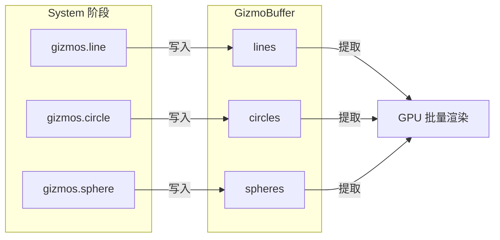
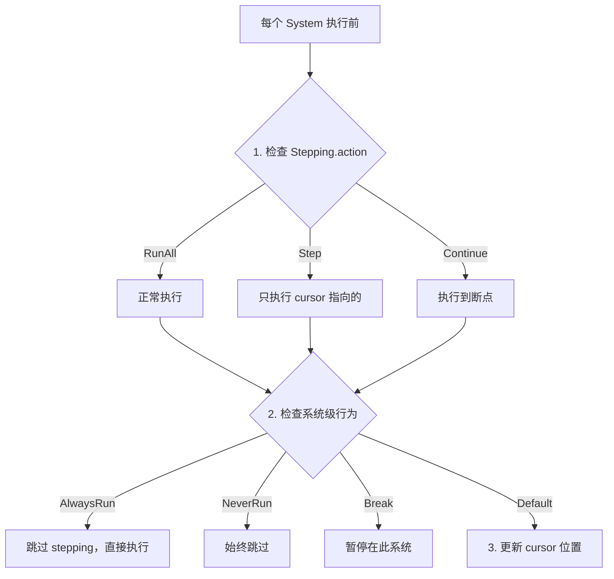
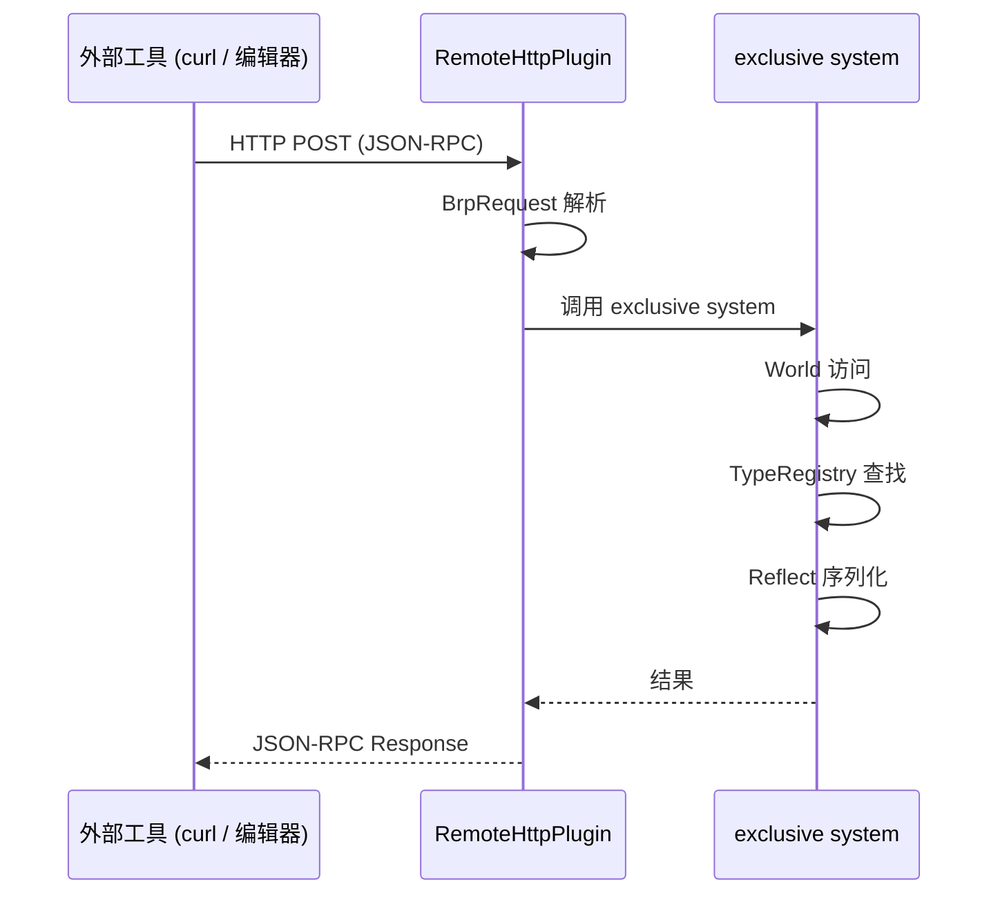

# 第 24 章：诊断与调试

> **导读**：一个复杂的 ECS 引擎需要强大的诊断工具。本章介绍四套互补的
> 调试机制：DiagnosticsStore 性能指标体系、Gizmos 调试可视化、Schedule
> Stepping 系统级单步调试，以及 bevy_remote 的远程 World 查询（与第 22 章
> 反射系统衔接）。

## 24.1 DiagnosticsStore：性能指标体系

`bevy_diagnostic` crate 提供了一套轻量级的性能指标收集框架：

### DiagnosticPath 与 Diagnostic

```rust
// 源码: crates/bevy_diagnostic/src/diagnostic.rs
pub struct DiagnosticPath {
    path: Cow<'static, str>,  // 如 "fps" 或 "frame_time/cpu"
    hash: u64,                // FNV-1a 哈希，快速查找
}

pub struct Diagnostic {
    path: DiagnosticPath,
    suffix: Cow<'static, str>,                // 单位后缀，如 "ms"
    history: VecDeque<DiagnosticMeasurement>, // 测量历史
    sum: f64,                                 // 累加值 (用于平均)
    ema: f64,                                 // 指数移动平均
    ema_smoothing_factor: f64,                // EMA 平滑因子
    max_history_length: usize,                // 最大历史长度
    is_enabled: bool,
}
```

`Diagnostic` 维护一个 `VecDeque` 历史队列，每次添加测量值时同时更新指数移动平均 (EMA)：

```rust
// 源码: crates/bevy_diagnostic/src/diagnostic.rs
fn add_measurement(&mut self, measurement: DiagnosticMeasurement) {
    if let Some(previous) = self.measurement() {
        let delta = (measurement.time - previous.time).as_secs_f64();
        let alpha = (delta / self.ema_smoothing_factor).clamp(0.0, 1.0);
        self.ema += alpha * (measurement.value - self.ema);
    } else {
        self.ema = measurement.value;
    }
    // ... 维护 history 和 sum
}
```

### DiagnosticsStore

`DiagnosticsStore` 是一个 Resource，作为所有 Diagnostic 的容器：

```
  DiagnosticsStore (Resource)
  ┌──────────────────────────────────────────────┐
  │  "fps"           → Diagnostic { ema: 59.8 }  │
  │  "frame_time"    → Diagnostic { ema: 16.7 }  │
  │  "entity_count"  → Diagnostic { ema: 1024 }  │
  │  "cpu_usage"     → Diagnostic { ema: 45.2 }  │
  └──────────────────────────────────────────────┘
```

*图 24-1: DiagnosticsStore 结构*

### 内置诊断插件

| 插件 | 路径 | 说明 |
|------|------|------|
| `FrameTimeDiagnosticsPlugin` | `fps`, `frame_time`, `frame_count` | 帧时间和 FPS |
| `EntityCountDiagnosticsPlugin` | `entity_count` | 实体总数 |
| `SystemInformationDiagnosticsPlugin` | `cpu_usage`, `mem_usage` | CPU/内存使用 |
| `LogDiagnosticsPlugin` | (输出) | 周期性打印诊断到日志 |

### Deferred 写入模式

诊断数据通过 `Diagnostics` SystemParam（一个 `Deferred<DiagnosticsBuffer>`）写入，延迟到 `apply_deferred` 时才真正更新 `DiagnosticsStore`。这避免了在 System 执行期间对 DiagnosticsStore 的写锁竞争。

为什么选择 EMA（指数移动平均）而非简单平均或中位数？游戏性能指标有一个独特特征：最近的测量值比历史值更有意义。简单平均对所有历史值一视同仁，当性能突然变化时（如加载新场景后帧率下降），需要很多帧才能让平均值反映实际情况。EMA 通过 smoothing factor 给近期值更高的权重，能更快速地响应性能变化，同时仍然平滑掉逐帧的随机抖动。Deferred 写入模式的设计与第 11 章的 Commands 思路一致——在并行执行阶段只收集数据到线程本地缓冲区，在 apply_deferred 时才统一写入 DiagnosticsStore。这避免了对 DiagnosticsStore Resource 的写锁争用，保证了诊断数据的收集不会成为并行执行的瓶颈。这种"采集零开销，汇总集中处理"的设计在监控系统中是标准实践，Bevy 将其自然地映射到了 ECS 的 Deferred 机制上。

**要点**：DiagnosticsStore 基于 DiagnosticPath 哈希查找，使用 EMA 平滑测量值，通过 Deferred 模式避免并行写锁冲突。

## 24.2 Gizmos：调试可视化

`bevy_gizmos` 提供了即时模式 (immediate mode) 的调试绘制 API：

```rust
// 使用示例
fn debug_draw(mut gizmos: Gizmos) {
    gizmos.line(start, end, Color::RED);
    gizmos.circle(center, radius, Color::GREEN);
    gizmos.sphere(position, radius, Color::BLUE);
    gizmos.ray(origin, direction, Color::YELLOW);
}
```

### Gizmos SystemParam

```rust
// 源码: crates/bevy_gizmos/src/gizmos.rs (简化)
pub struct Gizmos<'w, 's, Config = DefaultGizmoConfigGroup, Clear = ()> {
    buffer: &'w mut GizmoBuffer<Config, Clear>,
    // ...
}
```

`Gizmos` 是一个 SystemParam，内部向 `GizmoBuffer` 写入绘制指令。这些指令在渲染阶段被提取并转换为 GPU draw call。

### 设计特点



*图 24-2: Gizmos 数据流 (每帧自动清除)*

- **即时模式**：每帧重新提交绘制指令，无需管理生命周期
- **配置分组**：通过泛型 `Config` 参数支持多组 Gizmo 配置（如不同颜色主题）
- **条件绘制**：结合 `run_if` 可以在运行时开关调试可视化

Gizmos 适合用于：碰撞箱可视化、路径调试、物理射线显示、AI 导航网格预览等。

为什么 Gizmos 采用即时模式而非 ECS 实体模式？如果将每条调试线段建模为 Entity + Component，开发者需要管理这些实体的创建和销毁——忘记销毁会导致调试图形永久残留，销毁时机不对会导致闪烁。即时模式消除了这个生命周期管理问题：每帧的调试绘制都是全新的，上一帧的绘制自动消失。这种设计特别适合调试场景——开发者可以在任意 System 中随时添加绘制指令，不需要考虑清理逻辑。从性能角度看，即时模式避免了每帧创建和销毁大量临时 Entity 的开销——GizmoBuffer 只是一个内存缓冲区，写入和清除都是 O(1) 操作。配置分组（通过泛型 Config 参数）则提供了批量控制的能力——可以一次性开关整组调试可视化，而不是逐个管理。这与第 19 章 UI 系统选择全 ECS 模型形成了有趣的对比：UI 需要持久化的交互状态，适合 Entity 模型；调试绘制是临时的，适合即时模式。

**要点**：Gizmos 是即时模式的调试绘制 API，每帧写入 GizmoBuffer，在渲染阶段批量提交 GPU。

## 24.3 Schedule Stepping：系统级单步调试

`Stepping` 资源允许开发者像调试器单步执行代码一样，逐个系统地推进 Schedule 执行：

```rust
// 源码: crates/bevy_ecs/src/schedule/stepping.rs
#[derive(Resource, Default)]
pub struct Stepping {
    schedule_states: HashMap<InternedScheduleLabel, ScheduleState>,
    schedule_order: Vec<InternedScheduleLabel>,
    cursor: Cursor,           // 当前暂停位置
    action: Action,           // 本帧的执行动作
    updates: Vec<Update>,     // 待应用的配置更新
}
```

### 使用模式

```rust
// 启用 Stepping
app.add_plugins(SteppingPlugin);

// 在运行时控制
fn stepping_control(mut stepping: ResMut<Stepping>, input: Res<ButtonInput<KeyCode>>) {
    if input.just_pressed(KeyCode::F10) {
        stepping.step_frame();  // 执行到下一帧
    }
    if input.just_pressed(KeyCode::F11) {
        stepping.step();        // 执行下一个系统
    }
    if input.just_pressed(KeyCode::F5) {
        stepping.continue_();   // 继续正常运行
    }
}
```

### Stepping 决策流程



*图 24-3: Stepping 决策流程*

Stepping 特别适合调试系统执行顺序问题——当多个系统间存在微妙的依赖关系时，单步执行可以精确观察每个系统的效果。

Schedule Stepping 的设计灵感来自传统调试器的断点机制，但它操作的是 ECS 系统而非代码行。在传统调试器中，你可以在源代码的某一行设置断点，程序执行到那里就暂停。Stepping 将这个概念提升到了 ECS 层面——你可以在某个 System 上设置"断点"，Schedule 执行到那个 System 时暂停。这对于调试 ECS 特有的问题特别有价值：System 执行顺序导致的数据不一致、Change Detection 的触发时机、Observer 的意外触发等。这些问题在传统调试器中很难诊断，因为它们不是某一行代码的 bug，而是系统间交互的 emergent behavior。Stepping 的 AlwaysRun 和 NeverRun 选项则提供了细粒度的控制——某些基础设施 System（如 Time 更新）即使在 stepping 模式下也需要运行，以保持引擎的基本功能。

**要点**：Stepping 资源提供系统级单步调试，支持 step（逐系统）、step_frame（逐帧）、continue（继续）等操作。

## 24.4 bevy_remote：远程 World 查询

第 22 章介绍了 bevy_remote 的反射基础。本节补充其作为调试工具的实际用法。

### 启用远程调试

```rust
app.add_plugins((
    RemotePlugin::default(),
    RemoteHttpPlugin::default(), // 默认监听 127.0.0.1:15702
));
```

### 调试操作一览

| 方法 | 说明 | 用途 |
|------|------|------|
| `world.query` | 查询匹配组件的实体 | 查找特定类型的实体 |
| `world.get_components` | 获取实体的组件数据 | 检查实体状态 |
| `world.insert_components` | 动态插入组件 | 运行时修改数据 |
| `world.remove_components` | 移除组件 | 运行时清理 |
| `world.spawn_entity` | 创建新实体 | 动态创建调试实体 |
| `world.despawn_entity` | 销毁实体 | 清理测试实体 |
| `world.reparent_entities` | 修改实体层级 | 调整场景结构 |

### 数据流



*图 24-4: bevy_remote 数据流*

BRP 请求被收集后，在一个 exclusive system 中处理——这保证了对 World 的安全独占访问。响应通过 `ReflectSerializer` 将组件数据转为 JSON。

使用 exclusive system 处理远程请求是一个深思熟虑的设计选择。替代方案是使用普通 System 配合 Query 来处理请求，但远程调试协议需要能查询和修改任意类型的组件——这需要运行时确定的 Query，而不是编译期固定的 Query。Exclusive system 拥有对 World 的完整访问权限，可以通过 TypeRegistry 和 ReflectComponent 动态操作任意已注册的组件。代价是 exclusive system 无法与其他系统并行执行——但远程调试通常只在开发阶段使用，偶尔的排他性访问不会对游戏性能产生实质影响。这种设计与第 22 章的反射系统形成了完整的工具链：Reflect 提供类型内省能力，TypeRegistry 提供元数据查找，bevy_remote 将两者包装为网络可访问的 API。

**要点**：bevy_remote 通过 HTTP + JSON-RPC 2.0 提供远程 World 查询，请求在 exclusive system 中处理，确保线程安全。

## 24.5 Schedule 可视化

`bevy_dev_tools` 提供了 Schedule 的可视化工具，帮助理解系统执行顺序和依赖关系：

```rust
// 使用 Bevy 内置的 schedule graph 导出
app.add_plugins(ScheduleDebugPlugin);
```

Schedule 可视化生成的数据包括：
- 系统执行顺序（拓扑排序后的线性序列）
- 系统间的依赖边（before/after 约束）
- SystemSet 分组信息
- 并行执行的系统组

这对于理解复杂应用中系统的实际执行顺序非常有帮助——尤其是当多个 Plugin 各自添加系统时，全局的执行顺序可能不如预期。

### FPS Overlay

`bevy_dev_tools` 还提供了 FPS 叠加显示：

```rust
// 源码: crates/bevy_dev_tools/src/fps_overlay.rs
app.add_plugins(FpsOverlayPlugin {
    config: FpsOverlayConfig {
        text_config: TextFont { font_size: 20.0, ..default() },
        ..default()
    },
});
```

这是一个轻量级的帧率显示，直接在游戏画面上叠加 FPS 数值。

**要点**：Schedule 可视化帮助理解系统执行顺序，FPS Overlay 提供即时的帧率监控。

## 本章小结

本章我们了解了 Bevy 的四套诊断调试工具：

1. **DiagnosticsStore**：基于 EMA 的性能指标体系，内置 FPS、实体数、CPU 使用率等诊断
2. **Gizmos**：即时模式调试绘制，零管理成本的可视化调试
3. **Stepping**：系统级单步调试，精确控制 Schedule 执行
4. **bevy_remote**：基于反射的远程 World 查询，JSON-RPC 2.0 协议
5. **Schedule 可视化**：系统执行顺序和依赖关系图

下一章，我们将讨论 Bevy 的跨平台支持——从 no_std ECS 核心到 WASM 单线程模式。
