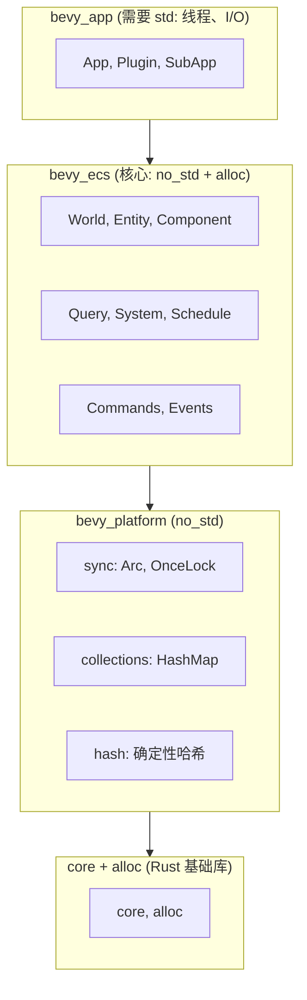

# 第 25 章：跨平台与 no_std

> **导读**：Bevy 引擎的跨平台能力不仅仅是"编译到不同目标"——它深入到
> ECS 核心的 `no_std` 支持、Web 平台的单线程适配、以及平台差异的抽象。
> 本章从 `bevy_platform` crate 出发，分析 Bevy 如何在保持核心 API 一致
> 的同时，适配从嵌入式到浏览器的多种运行环境。

## 25.1 bevy_platform：平台抽象层

`bevy_platform` 是 Bevy 的平台兼容层，本身是 `#![no_std]`：

```rust
// 源码: crates/bevy_platform/src/lib.rs
#![no_std]

//! Platform compatibility support for first-party Bevy engine crates.

cfg::std! { extern crate std; pub mod dirs; }
cfg::alloc! { extern crate alloc; pub mod collections; }

pub mod cell;       // SyncUnsafeCell 等
pub mod cfg;        // 条件编译宏
pub mod future;     // 平台无关的 Future 工具
pub mod hash;       // 确定性哈希
pub mod sync;       // Arc, OnceLock 等同步原语
pub mod thread;     // 线程抽象
pub mod time;       // 时间抽象 (Instant)
```

这个 crate 的设计理念：将所有平台差异封装在一处，上层 crate 通过 `bevy_platform` 的 API 而非直接依赖 `std`。

### cfg 宏系统

`bevy_platform::cfg` 提供了一组条件编译宏，统一各平台的 feature gate：

```rust
// 源码: crates/bevy_platform/src/cfg.rs (概念)
define_alias! {
    #[cfg(feature = "std")] => { std }         // 有标准库
    #[cfg(feature = "alloc")] => { alloc }     // 有堆分配
    #[cfg(target_arch = "wasm32")] => { web }  // Web 平台
}
```

上层 crate 使用这些宏而非裸 `#[cfg]`：

```rust
// 在 bevy_tasks 中
cfg::std! { extern crate std; }
cfg::web! {
    if {
        // WASM 特化代码
    } else {
        // 原生平台代码
    }
}
```

将平台差异集中在一个 crate 中而非分散在各个子系统中，是一个有代价的架构决策。集中式的好处显而易见：新增平台支持只需修改 bevy_platform，上层 crate 无需改动。但代价是 bevy_platform 必须预见所有上层 crate 可能需要的平台抽象——如果某个子系统需要的平台 API 尚未被 bevy_platform 封装，就需要先扩展 bevy_platform，再由子系统使用。这种"先抽象，再使用"的流程增加了开发的间接性。替代方案是让每个 crate 自行处理 `#[cfg]` 条件编译，这更直接但会导致平台逻辑分散在数十个 crate 中，维护成本随 crate 数量线性增长。Bevy 选择了集中式方案，因为游戏引擎的平台差异（时间 API、线程模型、同步原语）是有限且稳定的，一个精心设计的抽象层可以覆盖绝大多数需求。

**要点**：`bevy_platform` 是 `no_std` 的平台抽象层，通过 cfg 宏系统统一条件编译，避免上层 crate 分散处理平台差异。

## 25.2 ECS 核心的 no_std 支持

Bevy ECS 的核心数据结构（World、Entity、Component、Archetype、Query）不依赖标准库：



*图 25-1: ECS no_std 依赖层次*

### no_std 可用的 ECS 核心

在 `no_std` 环境下（只需要 `alloc`），以下 ECS 功能可用：

| 模块 | no_std 可用 | 依赖 |
|------|:-----------:|------|
| World | 是 | alloc |
| Entity | 是 | core |
| Component | 是 | alloc |
| Archetype | 是 | alloc |
| Query | 是 | alloc |
| System (基础) | 是 | alloc |
| Schedule (单线程) | 是 | alloc |
| Commands | 是 | alloc |
| Events | 是 | alloc |
| 多线程 Executor | 否 | std (thread) |
| TaskPool | 否 | std (thread) |
| Diagnostics | 否 | std (time) |

### 实际用例

Bevy 的 `no_std` 支持使 ECS 可以用在：
- **嵌入式系统**：单片机上的游戏逻辑
- **自定义运行时**：无操作系统的裸机环境
- **库集成**：将 ECS 作为纯数据管理层嵌入其他框架

```rust
// no_std 环境使用 ECS (概念示例)
#![no_std]
extern crate alloc;

use bevy_ecs::prelude::*;

#[derive(Component)]
struct Position(f32, f32);

fn main_loop(world: &mut World, schedule: &mut Schedule) {
    schedule.run(world);
}
```

在游戏引擎中支持 no_std 是一个不寻常的选择——大多数游戏引擎假设运行在完整的操作系统上。Bevy 追求 no_std 支持的动机不仅仅是"可以在单片机上运行 ECS"（虽然这确实有趣），更深层的原因是 no_std 约束迫使代码保持最小依赖。当 ECS 核心不依赖 std 时，它自然地避免了对文件系统、网络、线程等重量级 API 的隐式依赖。这使得 ECS 成为一个真正纯粹的数据管理层——它只做实体-组件-系统的管理，不做任何 I/O。这种纯粹性带来了可测试性和可嵌入性的好处：ECS 核心可以在没有操作系统的环境中运行测试，也可以作为库嵌入到其他框架（如将 Bevy ECS 用于服务端的游戏状态管理）。代价是所有需要 std 功能的代码（多线程调度、诊断、资源加载）必须放在上层 crate 中，增加了架构的层次复杂度。

**要点**：Bevy ECS 核心基于 `core + alloc` 构建，不依赖 `std`，可在嵌入式和裸机环境使用。

## 25.3 Web 平台：单线程 ECS

WASM 环境是 Bevy 跨平台的重要场景。浏览器的 JavaScript 主线程不支持传统的多线程模型（Web Workers 存在但有严格限制）。

### ConditionalSend 适配

第 23 章介绍了 `ConditionalSend`——在 WASM 平台移除 `Send` 约束：

```rust
// 源码: crates/bevy_tasks/src/lib.rs
cfg::conditional_send! {
    if {
        // WASM: 一切都在主线程，无需 Send
        pub trait ConditionalSend {}
        impl<T> ConditionalSend for T {}
    } else {
        pub trait ConditionalSend: Send {}
        impl<T: Send> ConditionalSend for T {}
    }
}
```

### SingleThreadedTaskPool

```rust
// 源码: crates/bevy_tasks/src/single_threaded_task_pool.rs (概念)
// WASM 使用单线程 TaskPool，所有任务顺序执行
pub struct TaskPool {}

impl TaskPool {
    pub fn scope<'env, F, T>(&self, f: F) -> Vec<T> {
        // 直接在当前线程执行
        // 没有线程创建开销
    }
}
```

### Web 环境的关键差异

```
  原生平台                          Web 平台 (WASM)
  ┌──────────────────────┐         ┌──────────────────────┐
  │ MultiThreadedExecutor│         │ SimpleExecutor       │
  │   ├─ Thread 1        │         │   └─ 主线程顺序执行   │
  │   ├─ Thread 2        │         │                      │
  │   └─ Thread N        │         │ SingleThreadedTaskPool│
  │                      │         │   └─ 同步执行         │
  │ T: Send + Sync 必须  │         │                      │
  │ NonSend = 主线程限制  │         │ T: 无 Send 要求      │
  │                      │         │ NonSend = 无意义      │
  │ Instant = std::time  │         │ Instant = web_time   │
  └──────────────────────┘         └──────────────────────┘
```

*图 25-2: 原生 vs Web 平台差异*

Web 平台使用 `web_time` crate 替代 `std::time::Instant`，因为浏览器的时间 API 与系统时间 API 不同。

### 渲染适配

Web 环境使用 WebGPU 或 WebGL2 作为渲染后端。`bevy_render` 通过 `wgpu` 的跨平台抽象自动选择后端，上层代码无需修改。

ConditionalSend 的设计是 Bevy 跨平台架构中最精妙的 trait 技巧之一。问题的根源在于：Bevy 的系统函数和异步任务在原生平台上需要满足 `Send` 约束（因为它们会被发送到其他线程执行），但在 WASM 上 `Send` 约束毫无意义（只有一个线程）。如果 API 统一要求 `Send`，WASM 用户就无法使用 `!Send` 的浏览器 API（如 DOM 操作）。如果 API 不要求 `Send`，原生平台的类型安全就被削弱。ConditionalSend 通过条件编译在两个平台上切换定义：原生平台上它等价于 `Send`，WASM 上它是一个对所有类型自动实现的空 trait。上层代码只需要约束 `T: ConditionalSend` 而非 `T: Send`，就能在两个平台上都正确工作。这种设计的代价是引入了一个额外的 trait，增加了概念复杂度；但它优雅地解决了"一套 API 同时服务多线程和单线程环境"这个本质难题。

**要点**：Web 平台通过 ConditionalSend 移除 Send 约束、SingleThreadedTaskPool 替代多线程池、SimpleExecutor 替代并行调度器，实现完整的单线程 ECS。

## 25.4 NonSend：平台差异的统一处理

不同平台的 `!Send` 资源有不同的来源：

| 平台 | 常见 NonSend 类型 | 原因 |
|------|-------------------|------|
| Windows | 窗口句柄 (HWND) | COM 线程亲和性 |
| macOS | NSWindow | 必须主线程操作 UI |
| Linux | X11 Display | 部分 X11 API 非线程安全 |
| iOS | UIWindow | UIKit 主线程限制 |
| Android | NativeActivity | JNI 线程限制 |
| Web | 全部 | 单线程环境 |

Bevy 通过 `NonSend<T>` 和 `NonSendMut<T>` 提供统一的 API。调度器自动处理线程约束——NonSend 系统被标记为 `is_send = false`，只会被调度到主线程执行器。

```rust
// 跨平台的 NonSend 使用（各平台代码一致）
fn window_system(window: NonSend<RawWindowHandle>) {
    // 编译器保证 RawWindowHandle: !Send
    // 调度器保证此系统在主线程运行
}
```

在单线程模式下（如 WASM），NonSend 约束变得无意义——所有代码都在主线程。但 API 保持一致，使得同一份代码可以在多线程和单线程环境下编译和运行。

NonSend 的跨平台统一性体现了 Bevy 的一个重要设计原则：平台差异应该在引擎层面被吸收，而非泄漏到用户代码中。用户写的 `NonSend<RawWindowHandle>` 系统在所有平台上都是合法的——在多线程平台上，调度器保证它在主线程运行；在单线程平台上，它本来就在主线程运行。用户不需要为不同平台编写不同的系统代码。这与第 23 章讨论的并发模型紧密相关：Send/Sync 约束和 NonSend 系统参数共同构成了一个类型安全的并发框架，调度器在运行时将类型约束转化为线程调度决策。这种"类型约束驱动调度"的模式是 Rust 类型系统在系统编程中的典型应用。

**要点**：NonSend 是跨平台 `!Send` 资源的统一 API。不同平台的线程约束通过调度器自动适配。

## 25.5 Android/iOS Plugin 差异

移动平台的主要差异集中在应用生命周期和窗口管理：

### Android

Android 应用通过 `NativeActivity` 与系统交互。Bevy 的 Android 支持需要：

- 使用 `android_logger` 替代标准日志
- 通过 `winit` 的 Android 后端管理窗口和事件循环
- 资产 (Asset) 通过 Android 的 `AssetManager` 加载，而非文件系统
- 应用暂停/恢复需要处理 EGL 上下文重建

### iOS

iOS 应用通过 `UIApplicationDelegate` 管理生命周期。关键差异：

- Metal 是唯一的渲染后端（不支持 Vulkan）
- 触摸事件格式与桌面平台不同
- 资产通过 Bundle 路径加载
- 应用进入后台时需要正确释放 GPU 资源

### 统一的 Plugin 接口

尽管平台细节不同，Plugin 接口保持统一：

```rust
// 所有平台使用相同的 Plugin API
impl Plugin for MyGamePlugin {
    fn build(&self, app: &mut App) {
        app.add_systems(Update, game_logic);
    }
}
```

平台差异被封装在 `DefaultPlugins` 内部——不同平台的 `WindowPlugin`、`RenderPlugin` 实现不同，但对用户透明。

**要点**：Android/iOS 的差异主要在应用生命周期、渲染后端和资产加载，通过 DefaultPlugins 封装，保持 Plugin API 统一。

## 本章小结

本章我们了解了 Bevy 的跨平台架构：

1. **bevy_platform**：`no_std` 平台抽象层，通过 cfg 宏统一条件编译
2. **ECS no_std**：核心数据结构基于 `core + alloc`，可在嵌入式/裸机环境使用
3. **Web 单线程**：通过 ConditionalSend + SimpleExecutor + SingleThreadedTaskPool 适配 WASM
4. **NonSend**：跨平台 `!Send` 资源的统一 API，调度器自动处理线程约束
5. **移动平台**：Android/iOS 差异封装在 DefaultPlugins 中，Plugin API 保持统一

下一章是全书的收束——我们将总结 Bevy 中 10 种重要的 Rust 设计模式。
