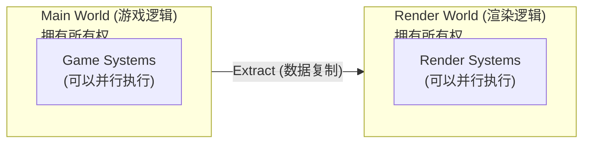
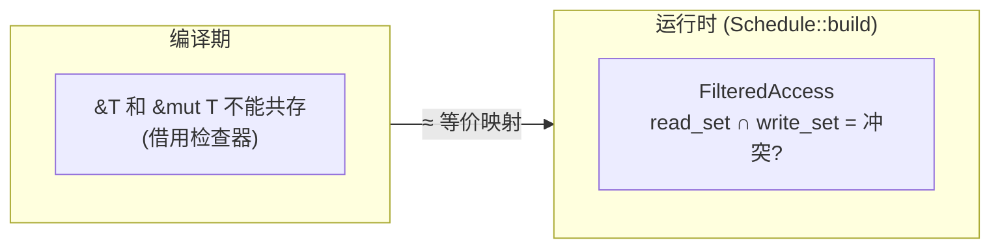

# 第 26 章：Bevy 中的 Rust 设计模式总结

> **导读**：本章是全书的收束。在前 25 章中，我们反复遇到 Bevy 对 Rust 语言
> 特性的精妙运用。本章将这些设计模式提炼为 10 个主题，每个主题用 Bevy 源码
> 中的真实案例说明，解释**为什么**这样设计而非仅仅**怎样**设计。
> 读完本章，你会理解为什么 Rust 特别适合构建游戏引擎。

## 26.1 unsafe 边界的艺术

**首次出现**：第 3 章 (World)、第 5 章 (BlobArray)

Bevy 大量使用 unsafe，但遵循一个严格原则：**unsafe 实现，safe 接口**。
内部的 unsafe 代码被精心封装在边界之内，用户永远不需要写 unsafe。

最典型的案例是 `UnsafeWorldCell`：

```rust
// 源码: crates/bevy_ecs/src/world/unsafe_world_cell.rs
pub struct UnsafeWorldCell<'w> {
    ptr: *mut World,
    #[cfg(debug_assertions)]
    allows_mutable_access: bool,
    _marker: PhantomData<(&'w World, &'w UnsafeCell<World>)>,
}
```

`UnsafeWorldCell` 将 `&mut World` 拆分为多个并发的、受限访问的视图。调度器可以同时给多个系统各自一个 `UnsafeWorldCell`——每个系统只能访问自己声明的组件。

另一个案例是 `BlobArray`（第 5 章）：

```rust
// 源码: crates/bevy_ecs/src/storage/blob_array.rs
pub struct BlobArray {
    item_layout: Layout,
    data: NonNull<u8>,    // 裸指针
    capacity: usize,
    drop: Option<unsafe fn(OwningPtr<Aligned>)>,
}
```

BlobArray 内部用指针算术管理类型擦除的内存，但对外只暴露 `Column` 和 `Table` 的安全 API。用户通过 `Query<&Position>` 读取数据时，完全不需要知道底层是裸指针操作。

**为什么这样设计**：Rust 的类型系统无法在编译期表达"这两个系统访问不同组件"这种约束。unsafe 在此处是必要的桥梁——它让运行时调度器承担编译器做不到的安全验证，同时保持外部 API 的完全安全。

**这对游戏引擎意味着什么**：游戏引擎是 unsafe 边界艺术的极端考验。引擎需要在每帧处理数万个实体的数据，性能要求排除了"安全但低效"的方案（如每次访问都加锁）。同时，引擎是被成百上千个游戏开发者使用的基础设施，用户 API 的安全性直接决定了整个生态的可靠性。Bevy 的策略是将 unsafe 集中在少数经过严格审计的底层模块（BlobArray、UnsafeWorldCell、Table），由引擎核心开发者维护，然后在这些模块之上构建完全安全的 Query、System、Commands API 供所有用户使用。这种分层策略让 unsafe 的审计范围保持可控——需要关注的 unsafe 代码量不随用户代码的增长而增加。

## 26.2 all_tuples! 宏元编程

**首次出现**：第 8 章 (System)

Bevy 需要让任意参数数量的函数成为 System。Rust 没有可变参数泛型 (variadic generics)，所以 Bevy 用 `all_tuples!` 宏为 0 到 16 个参数生成 trait 实现：

```rust
// 源码: crates/bevy_ecs/src/system/function_system.rs
all_tuples!(impl_system_function, 0, 16, F);

// 展开后相当于:
impl<F, R> SystemParamFunction<()> for F where F: Fn() -> R { ... }
impl<F, R, P0> SystemParamFunction<(P0,)> for F where F: Fn(P0) -> R, P0: SystemParam { ... }
impl<F, R, P0, P1> SystemParamFunction<(P0, P1)> for F where F: Fn(P0, P1) -> R { ... }
// ... 一直到 16 个参数
```

类似地，SystemParam 的元组实现也是宏生成的：

```rust
// 源码: crates/bevy_ecs/src/system/system_param.rs
all_tuples!(impl_system_param_tuple, 0, 16, P);
```

这使得 `(Query<&A>, Res<B>, EventWriter<C>)` 自动成为合法的 SystemParam。

**为什么这样设计**：Rust 的 trait 系统是单态化的——编译器需要为每种参数组合生成具体代码。宏是在语言不支持可变参数泛型之前的唯一解决方案。16 的上限是实践中的平衡——超过 16 个参数的系统几乎不存在，但编译时间随参数数量指数增长。

**这对游戏引擎意味着什么**：游戏引擎的核心 API 需要同时满足两个看似矛盾的需求——灵活性（支持任意参数组合的系统函数）和人体工程学（用户无需显式实现 trait 或注册类型）。all_tuples! 宏让普通的 Rust 函数直接成为 ECS 系统，用户不需要实现任何 trait，不需要装箱，不需要类型注册——只需要写一个参数类型正确的函数。这种"零仪式"的 API 风格对游戏开发者至关重要：游戏代码迭代速度极快，任何额外的样板代码都会显著降低开发效率。代价是每次增加 all_tuples! 的上限都会显著增加编译时间，因为需要为更多的参数组合生成代码。16 这个数字是 Bevy 社区在 API 灵活性和编译时间之间反复权衡的结果。

## 26.3 GAT 生命周期参数化

**首次出现**：第 8 章 (SystemParam)

`SystemParam` trait 使用 Generic Associated Types (GAT) 来处理生命周期的参数化：

```rust
// 源码: crates/bevy_ecs/src/system/system_param.rs
pub unsafe trait SystemParam: Sized {
    type State: Send + Sync + 'static;
    type Item<'world, 'state>: SystemParam<State = Self::State>;

    fn init_state(world: &mut World) -> Self::State;
    fn init_access(
        state: &Self::State,
        system_meta: &mut SystemMeta,
        component_access_set: &mut FilteredAccessSet,
        world: &mut World,
    );
    // ...
}
```

关键是 `type Item<'world, 'state>` —— 它是一个带生命周期参数的关联类型。这允许 `Query<'w, 's, &Position>` 在每次系统调用时获得新的生命周期，而 `State` 持久存活：

```
  System 第一次调用:
    State (长期存活) → Item<'w1, 's1> (本次调用的借用)

  System 第二次调用:
    State (同一个)  → Item<'w2, 's2> (新的借用)
```

**为什么这样设计**：没有 GAT，SystemParam 的 Item 类型无法拥有独立的生命周期参数。Bevy 需要将"持久状态"（如 QueryState）和"临时借用"（如对 World 数据的引用）分离。GAT 正是 Rust 类型系统中实现这种分离的机制。

**这对游戏引擎意味着什么**：游戏引擎的系统函数在生命周期管理上面临独特挑战。系统函数每帧被调用一次，每次调用借用 World 中的数据，但系统的"内部状态"（如 QueryState 中缓存的 Archetype 匹配信息）需要跨帧持久存活。没有 GAT，这两种生命周期（帧内借用 vs 跨帧状态）无法在类型系统中区分，只能退而使用 unsafe 或运行时检查。GAT 让 Bevy 在完全安全的 API 层面表达这种"短期借用 + 长期状态"的模式。这也是为什么 Bevy 等待 GAT 稳定后才重构 SystemParam 的原因——在此之前的实现需要更多的 unsafe 代码和更弱的类型保证。

## 26.4 PhantomData 幽灵类型

**首次出现**：第 3 章 (UnsafeWorldCell)、第 16 章 (Handle)

`PhantomData<T>` 在 Bevy 中有两种用途：

### 1. 生命周期标记

```rust
// 源码: crates/bevy_ecs/src/world/unsafe_world_cell.rs
pub struct UnsafeWorldCell<'w> {
    ptr: *mut World,
    _marker: PhantomData<(&'w World, &'w UnsafeCell<World>)>,
}
```

裸指针 `*mut World` 不携带生命周期信息。`PhantomData` 告诉编译器这个类型在语义上借用了 `'w` 生命周期的 World，从而启用借用检查器的保护。

### 2. 类型标签

```rust
// 源码: crates/bevy_asset/src/handle.rs
pub enum Handle<A: Asset> {
    Strong(Arc<StrongHandle>),
    Weak(AssetId<A>),  // AssetId<A> 内含 PhantomData<A>
}

// 源码: crates/bevy_time/src/time.rs
pub struct Time<T: Default = ()> {
    context: T,
    wrap_period: Duration,
    delta: Duration,
    // ...
}
```

`Handle<Mesh>` 和 `Handle<Image>` 在运行时的底层数据完全相同（都是一个 ID），但类型系统阻止你把 `Handle<Mesh>` 传给期望 `Handle<Image>` 的函数。`Time<Fixed>` 和 `Time<Virtual>` 同理——通过类型参数区分不同的时间语义。

**为什么这样设计**：PhantomData 实现了零成本的类型安全。编译后没有任何运行时开销，但在编译期提供了完整的类型检查。这是 Rust 零成本抽象的典范——你在编译期获得安全保证，运行时不付出任何代价。

**这对游戏引擎意味着什么**：游戏引擎管理着大量不同类型的资源——网格、纹理、音频、材质——它们在底层都是 ID + 引用计数，但在逻辑上绝对不能混用。PhantomData 让引擎可以用相同的底层实现服务所有资源类型，同时在编译期阻止类型混淆。在一个中等规模的游戏中，可能有数千个 Handle 在系统间传递——如果没有类型标签，把 `Handle<Mesh>` 误传给需要 `Handle<Image>` 的函数是一个极难追踪的 bug（它不会崩溃，只是渲染出错误的东西）。PhantomData 将这类错误从"运行时视觉 bug"提升为"编译期类型错误"，极大地提升了大型游戏项目的可维护性。

## 26.5 trait object vs 静态分发

**首次出现**：第 2 章 (Plugin)、第 8 章 (System)

Bevy 在 Plugin 和 System 上做了不同的分发选择：

| 概念 | 分发方式 | 原因 |
|------|---------|------|
| Plugin | 动态分发 (`Box<dyn Plugin>`) | 数量少，注册时调用一次 |
| System | 静态分发 (泛型 `impl IntoSystemConfigs`) | 数量多，每帧调用 |

```rust
// Plugin: 动态分发 — 数量少、调用频率低
pub trait Plugin: Downcast + Any + Send + Sync {
    fn build(&self, app: &mut App);
}
// App 存储 Box<dyn Plugin>

// System: 静态分发 — 数量多、调用频率高
pub trait IntoSystemConfigs<Marker> {
    fn into_configs(self) -> SystemConfigs;
}
// 编译器为每种系统函数签名单态化
```

Plugin 使用动态分发因为：
1. Plugin 数量通常在 10-50 个
2. `build()` 只在启动时调用一次
3. 需要存储在异构集合中

System 使用静态分发因为：
1. System 数量可能达数百个
2. 每帧调用，性能敏感
3. 单态化允许编译器内联和优化

**为什么这样设计**：这不是"动态好还是静态好"的问题，而是根据调用频率和性能需求做出的工程权衡。Bevy 在同一个引擎中混合使用两种分发方式，各取所长。

**这对游戏引擎意味着什么**：游戏引擎的性能瓶颈通常集中在"热路径"——每帧执行数百次的代码。System 的执行就是最核心的热路径，静态分发通过单态化让编译器可以内联系统函数体、消除虚表查找、优化缓存预取模式。对于每帧执行一次的系统，虚函数调用的开销（约 5-10ns）可能不显著；但对于包含 par_iter 的系统，内联允许编译器将循环体优化为 SIMD 指令，性能差异可达数倍。Plugin 是"冷路径"——只在启动时调用，使用动态分发换来的是异构集合的灵活性和更短的编译时间。这种"热路径静态分发、冷路径动态分发"的策略是高性能 Rust 软件的通用模式。

## 26.6 所有权驱动的架构：双 World

**首次出现**：第 14 章 (Render 架构)

Bevy 渲染架构使用两个独立的 World——Main World 和 Render World：

```rust
// 概念: Extract 阶段 (简化)
fn extract_phase(main_world: &mut World, render_world: &mut World) {
    // 从 main_world 提取数据到 render_world
    // 两个 World 各自拥有自己的数据
}
```



这是 Rust 所有权系统在架构层面的应用。两个 World 各自独立拥有数据，Extract 阶段通过值复制而非引用共享来传递数据。这消除了主线程和渲染线程之间的数据竞争——不需要锁，不需要原子操作。

**为什么这样设计**：传统引擎用共享内存 + 锁来实现主线程与渲染线程的通信。Bevy 选择数据复制是因为 Rust 的所有权模型让"复制比共享更安全"成为自然选择——而 ECS 的列式存储使得批量 memcpy 非常高效。

**这对游戏引擎意味着什么**：游戏渲染管线的核心挑战是主线程（游戏逻辑）和渲染线程需要访问同一份数据——但修改时机不同。传统引擎用双缓冲或三缓冲加锁来解决这个问题，但锁的引入会导致优先级反转、死锁风险、以及难以预测的帧时间抖动。Bevy 的双 World 架构从根本上消除了锁——Extract 阶段将需要渲染的数据从 Main World 复制到 Render World，之后两个 World 完全独立运行。在 ECS 的列式存储下，复制整列组件数据（如所有实体的 Transform）是一次连续的 memcpy，对现代 CPU 的内存带宽而言几乎是免费的。这种设计的代价是渲染数据总是比游戏逻辑落后一帧，但这个延迟在 60fps 下不可感知，且带来了确定性的帧时间——没有锁竞争导致的随机延迟。

## 26.7 编译期借用到运行时调度

**首次出现**：第 7 章 (Query)、第 9 章 (Schedule)、第 23 章 (并发)

Rust 编译器通过借用检查保证 `&T` 和 `&mut T` 不共存。但 ECS 系统是独立函数，编译器看不到系统间的数据关系。Bevy 将这个检查移到了运行时：

```rust
// 源码: crates/bevy_ecs/src/query/access.rs
pub struct FilteredAccess {
    pub(crate) access: Access,            // read_set + write_set
    pub(crate) required: ComponentIdSet,
    pub(crate) filter_sets: Vec<AccessFilters>,
}
```

每个 System 注册时声明 `FilteredAccess`，调度器在 build 阶段计算冲突矩阵：



这种"编译期规则的运行时映射"是 Bevy 最重要的设计模式之一。它让 Bevy 能在保持 Rust 安全性的同时，实现编译器无法独立推断的跨系统并行。

**为什么这样设计**：Rust 编译器是基于词法作用域的——它能检查一个函数内部的借用安全，但无法跨函数推断。ECS 的系统间数据访问模式是动态的，只能在运行时确定。FilteredAccess 是编译期安全规则到运行时的忠实翻译。

**这对游戏引擎意味着什么**：这个模式是 Bevy 能够安全并行执行数百个系统的基石。在没有 ECS 的传统引擎中，并行化游戏逻辑需要开发者手动标注线程安全性、手动管理锁、手动避免数据竞争——这是一个巨大的心智负担，也是 bug 的温床。Bevy 的 FilteredAccess 将这个负担转移给了框架：开发者只需要声明系统参数的类型（`Query<&mut Position>` vs `Query<&Position>`），框架自动推断并行安全性。当两个系统确实冲突时，调度器自动串行化它们——不需要开发者做任何额外工作。这种"声明式并行"的模式让游戏开发者可以专注于游戏逻辑，而非线程安全问题。

## 26.8 Deref/DerefMut 透明拦截

**首次出现**：第 10 章 (变更检测)

`Mut<T>` 通过实现 `DerefMut` 在用户无感知的情况下自动标记变更：

```rust
// 源码: crates/bevy_ecs/src/change_detection/params.rs
pub struct Mut<'w, T: ?Sized> {
    pub(crate) value: &'w mut T,
    pub(crate) ticks: ComponentTicksMut<'w>,
}

// 源码: crates/bevy_ecs/src/change_detection/traits.rs
impl<T: ?Sized> DerefMut for Mut<'_, T> {
    #[track_caller]
    fn deref_mut(&mut self) -> &mut Self::Target {
        self.set_changed();  // 自动标记变更！
        self.ticks.changed_by.assign(MaybeLocation::caller());
        self.value
    }
}
```

当你写 `*position = new_pos;` 时，编译器自动调用 `deref_mut()`，触发变更标记。这使得 `Changed<Position>` 过滤器能正确工作——而用户完全不需要手动调用任何变更通知方法。

`Deref` 的只读版本直接返回引用，不标记变更：

```rust
impl<T: ?Sized> Deref for Mut<'_, T> {
    type Target = T;
    fn deref(&self) -> &Self::Target {
        self.value  // 只读访问不标记变更
    }
}
```

**为什么这样设计**：手动变更通知（如 Unity 的 `SetDirty()`）容易遗忘。Bevy 利用 Rust 的 Deref trait 将变更检测嵌入到赋值操作本身。`#[track_caller]` 还记录了修改发生的源码位置，便于调试。

**这对游戏引擎意味着什么**：变更检测是游戏引擎性能优化的核心技术之一。渲染系统不需要每帧重新计算所有网格的变换矩阵——只需要更新 Transform 发生变化的实体。UI 系统不需要每帧重新布局——只需要重新布局 Node 属性变化的元素。如果变更通知依赖开发者手动调用（如 Unity 的 SetDirty），遗忘调用会导致渲染不更新（难以发现的 bug），冗余调用会导致不必要的重计算（性能问题）。Deref 拦截将变更检测变成了"不可绕过"的——只要通过 `&mut` 访问组件数据，变更就被自动记录。这消除了一整类由"忘记标记变更"导致的 bug，同时保证了变更信息的精确性。

## 26.9 derive macro 突破无反射限制

**首次出现**：第 22 章 (Reflect)

`#[derive(Reflect)]` 是 Bevy 反射系统的核心——它在编译期生成运行时需要的类型元数据：

```rust
// 用户代码
#[derive(Reflect)]
struct Player {
    name: String,
    health: f32,
}

// derive 宏生成 (概念)
impl PartialReflect for Player {
    fn reflect_ref(&self) -> ReflectRef {
        ReflectRef::Struct(self)
    }
    // ...
}

impl Struct for Player {
    fn field(&self, name: &str) -> Option<&dyn PartialReflect> {
        match name {
            "name" => Some(&self.name),
            "health" => Some(&self.health),
            _ => None,
        }
    }
    fn field_len(&self) -> usize { 2 }
    fn field_at(&self, index: usize) -> Option<&dyn PartialReflect> {
        match index {
            0 => Some(&self.name),
            1 => Some(&self.health),
            _ => None,
        }
    }
}

impl Typed for Player {
    fn type_info() -> &'static TypeInfo {
        static CELL: NonGenericTypeInfoCell = NonGenericTypeInfoCell::new();
        CELL.get_or_set(|| TypeInfo::Struct(StructInfo::new::<Self>(&[
            NamedField::new::<String>("name"),
            NamedField::new::<f32>("health"),
        ])))
    }
}
```

宏将字段名、字段类型、字段数量等信息编码为 Rust 代码。运行时通过 trait 方法访问这些信息——不依赖任何运行时元数据格式。

**为什么这样设计**：Java/C# 的反射依赖虚拟机在编译产物中保留元数据。Rust 编译后是原生二进制，没有虚拟机。derive 宏是 Rust 的编译期代码生成机制——它将"应该在运行时可用的信息"在编译期转化为"具体的 trait 实现代码"。

**这对游戏引擎意味着什么**：游戏编辑器和调试工具需要在运行时检查和修改任意组件的属性——显示 Transform 的 x/y/z 滑块、修改材质颜色、查看实体的组件列表。在 C# 引擎（Unity）中，这些功能依赖运行时反射，开发者无需额外工作。Rust 引擎必须显式选择哪些类型参与反射，这增加了一个"注册"步骤（`#[derive(Reflect)]`），但带来的好处是反射代码经过编译器优化，运行时性能与手写代码相当。更重要的是，derive 宏生成的反射代码在编译期就确定了字段布局，不需要运行时的哈希表查找——`field("health")` 被编译为一个 match 语句，与手写的字段访问代码一样高效。

## 26.10 Builder 模式

**首次出现**：第 2 章 (App)、第 9 章 (Schedule)

Bevy 的 `App` 和 `Schedule` 使用 Builder 模式组装复杂对象：

```rust
// App builder
App::new()
    .add_plugins(DefaultPlugins)
    .add_systems(Startup, setup)
    .add_systems(Update, (movement, collision).chain())
    .insert_resource(GameConfig::default())
    .run();

// Schedule builder
let mut schedule = Schedule::default();
schedule.add_systems((system_a, system_b).chain());
schedule.set_executor_kind(ExecutorKind::MultiThreaded);
```

Builder 模式的核心特征是 **方法链** 和 **延迟构建**：

```rust
// 源码概念: App 的 builder 方法返回 &mut Self
impl App {
    pub fn add_plugins(&mut self, plugins: impl Plugins) -> &mut Self {
        // ... 注册 plugin
        self
    }

    pub fn add_systems(&mut self, schedule: impl ScheduleLabel,
                       systems: impl IntoSystemConfigs) -> &mut Self {
        // ... 注册 system
        self
    }

    pub fn run(&mut self) {
        // 最终构建并启动
    }
}
```

Bevy 选择 `&mut Self` 返回而非 `Self`（不转移所有权），因为 `App` 是一个大型容器，每次方法调用都移动会产生不必要的开销。`run()` 是终结方法，消费 App 并启动主循环。

**为什么这样设计**：Builder 模式让初始化代码具有声明式风格——你描述"应用包含什么"，而不是命令式地"先做这个，再做那个"。方法链保持了代码的连贯性，类型系统保证了只有合法的配置组合才能编译通过。

**这对游戏引擎意味着什么**：游戏应用的初始化是一个复杂的组装过程——注册数十个 Plugin、配置数百个 System、插入初始 Resource、设置渲染参数。如果没有 Builder 模式，这些操作会分散在多个初始化函数中，依赖调用顺序，难以一目了然地理解应用的完整配置。Builder 的 `&mut Self` 链式调用将所有配置集中在一处，形成一个"应用的声明式描述"。延迟构建更是关键——App 在 `run()` 被调用之前不会真正初始化任何资源，这意味着 Plugin 可以在 build 阶段自由地添加或修改配置，而不用担心初始化顺序。这种"描述优先，执行延后"的模式让复杂的游戏配置变得可组合、可测试、可审查。

## 本章小结

| # | 模式 | 核心机制 | 首次出现 |
|---|------|---------|---------|
| 1 | unsafe 边界 | unsafe 实现, safe 接口 | 第 3, 5 章 |
| 2 | all_tuples! 宏 | 为 0-16 参数生成 trait 实现 | 第 8 章 |
| 3 | GAT 生命周期 | `type Item<'w, 's>` 分离状态与借用 | 第 8 章 |
| 4 | PhantomData | 零成本类型标签和生命周期标记 | 第 3, 16 章 |
| 5 | trait object vs 静态分发 | Plugin 用 dyn，System 用泛型 | 第 2, 8 章 |
| 6 | 所有权驱动架构 | 双 World 消除数据竞争 | 第 14 章 |
| 7 | 编译期借用→运行时调度 | FilteredAccess 映射借用规则 | 第 7, 9 章 |
| 8 | Deref/DerefMut 拦截 | 赋值自动标记变更 | 第 10 章 |
| 9 | derive macro 反射 | 编译期生成运行时元数据 | 第 22 章 |
| 10 | Builder 模式 | 方法链声明式配置 | 第 2, 9 章 |

这 10 种模式贯穿全书，展示了 Rust 语言特性与游戏引擎需求之间的深度契合。Bevy 不仅仅是"用 Rust 写的游戏引擎"，更是 Rust 类型系统、所有权模型和宏系统的集大成者。
