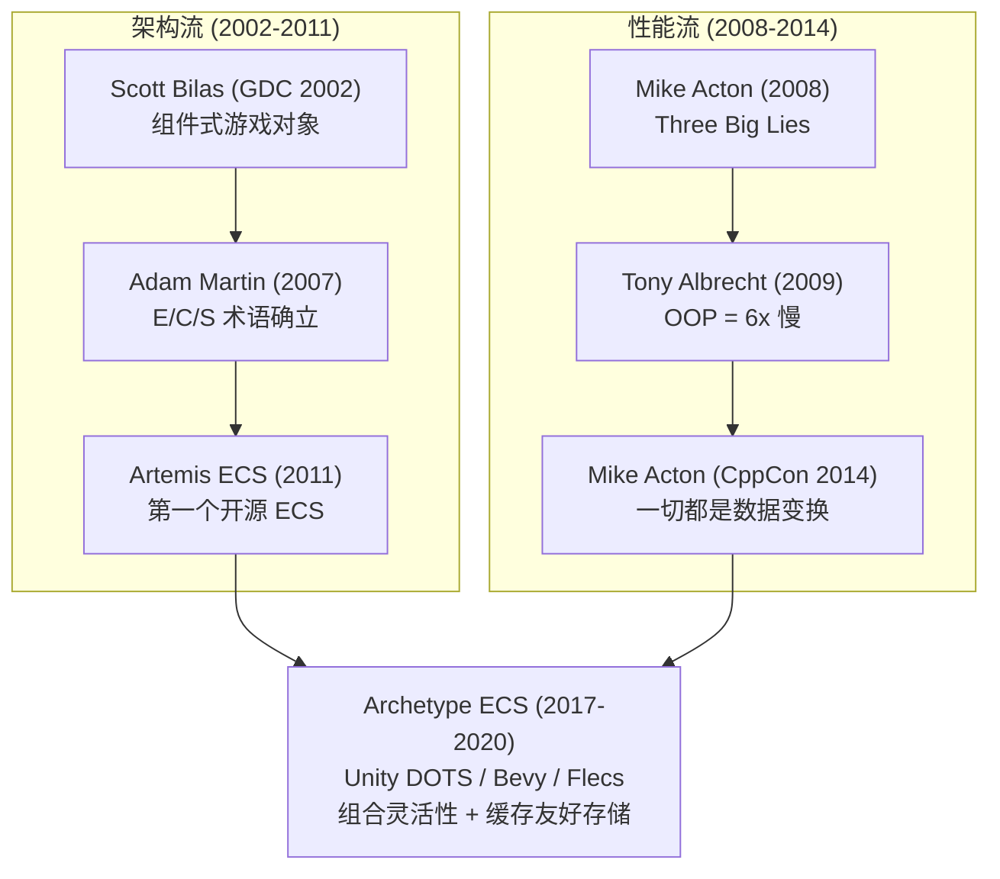
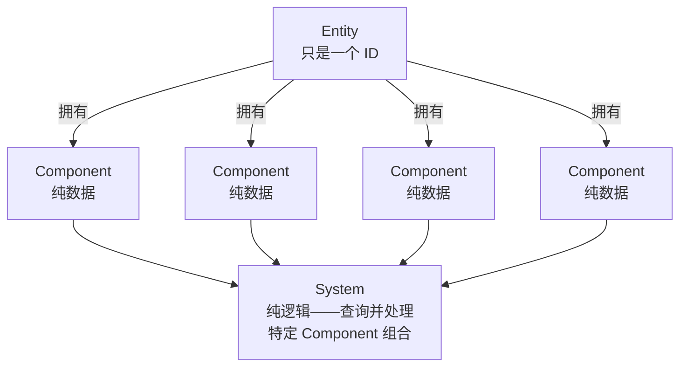

# ECS 架构概论 — 从 OOP 的性能灾难到数据驱动设计

> **导读**：在深入 Bevy 的具体 ECS 实现之前，本章建立通用的 ECS 心智模型。
> 我们不仅要理解 ECS 是什么，更要理解它为什么诞生——ECS 不是凭空发明的架构模式，
> 而是两条独立的思想流（架构灵活性 + 缓存性能）在 2014-2018 年间汇合的产物。
> 理解这段历史，你才能判断何时该用 ECS、何时不该用。
> 本章不涉及任何 Bevy 特定的 API。第 3 章起将进入 Bevy 的具体实现。

## 硬件催化：当 CPU 快到内存跟不上

理解 ECS 的诞生，必须先理解一个硬件事实：**CPU 和内存的速度差距在过去四十年间扩大了数百倍。**

1980 年，RAM 延迟大约是 1 个 CPU 周期——访问内存几乎是免费的。C++ 诞生于 1979 年，OOP 的核心设计——把数据和行为封装在对象里、对象在堆上分散分配、通过虚函数表间接调用——在内存访问成本可忽略的年代完全合理。

到 2009 年，RAM 延迟超过了 **400 个 CPU 周期**。每一次缓存未命中 (cache miss) 都意味着 CPU 空等数百个周期，而 OOP 的设计恰好是**制造缓存未命中的最佳方式**。

```
  CPU vs 内存速度差 (示意)

  CPU 速度 ─────────────────────────────────── ↗ 指数增长
  
  
  
  内存速度 ─────────────────────────────── → 缓慢增长
  
  1980        1990        2000        2010        2020
  
  延迟差:  1x          10x         100x        400x
```

*图 0-1: CPU 与内存速度差距的扩大*

2005-2006 年间，PS3 的 Cell 处理器（每个 SPE 只有 256KB 本地存储）和 Xbox 360 的 Xenon（有限缓存的顺序执行核心）让每一个游戏开发者**切身感受到**了内存布局的成本。这是数据导向设计 (DOD) 思想爆发的硬件催化剂。

**要点**：OOP 诞生于内存访问免费的年代。当 CPU-内存延迟差扩大到 400 倍，OOP 的内存布局从"无关紧要"变成了"致命瓶颈"。

## 6 倍加速：一组改变行业的实测数据

2009 年 12 月，索尼 SCEE 的技术顾问 Tony Albrecht 在澳大利亚墨尔本的 GCAP 大会上做了一场改变行业的演讲——"Pitfalls of Object Oriented Programming"。他在 PS3 上测试了 11,111 个节点的 5 层深场景树，量化了 OOP 布局的缓存惩罚：

| 优化阶段 | 耗时 | 关键变化 |
|---------|------|---------|
| 原始 OOP 实现 | ~19.2ms | 对象在内存中分散，虚函数分派 |
| 连续内存分配 | 12.9ms | "仅仅把东西在内存中挪了个位置"——快 35% |
| 线性遍历（扁平化，无虚函数） | 4.8ms | 最大的单项改进 |
| + 软件预取 (dcbt 指令) | 3.3ms | 可预测的访问模式让预取生效 |

**总计：约 6 倍加速，没有任何算法变化——只有数据布局变化。**

原始实现有 **36,345 次 L2 缓存未命中**（每次约 400 周期），浪费了 4.54ms 在空等内存。一个特别致命的发现：`if(!m_Dirty)` 这个"优化"标志导致了 23 周期的分支预测失败，而它试图避免的计算只需要 12 周期——"优化"反而更慢了。

这组数据之所以重要，不是因为它发现了什么新原理（缓存局部性早已被理解），而是因为它用**游戏引擎的真实场景**量化了 OOP 的代价。之前大家知道"OOP 可能慢"，Albrecht 告诉你"慢 6 倍，原因在这，解决方案在这"。

> Robert Nystrom 在《Game Programming Patterns》中称这篇演讲"可能是关于为缓存友好性设计游戏数据结构的最广泛阅读的入门资料"。

**要点**：OOP 的缓存惩罚不是理论推测，而是被实测验证的 6 倍性能差距。数据布局的改变比算法优化更有效。

## 两条汇流：架构流 + 性能流

ECS 的历史不是一条线，而是**两条平行的思想流**在 2014-2018 年间汇合。理解这个区别至关重要——它决定了你应该因为什么原因选择 ECS。

### 架构流："组合优于继承"

第一条流关心的是**架构灵活性**，不是性能。核心问题是：怎么让游戏设计师不写代码就能创造新类型的游戏对象？

**Scott Bilas (GDC 2002)：** Gas Powered Games 的工程师，Dungeon Siege 的架构师。Dungeon Siege 有超过 7,300 种独特对象类型和 100,000 个对象实例——用传统 OOP 继承树管理这些类型是不可能的。Bilas 提出用数据驱动的组件组合替代静态类层级。这是第一次公开的、正式的组件式游戏对象系统描述。

**Adam Martin (2007)：** 他的博客系列正式确立了 ECS 的术语定义：Entity = 只是一个唯一整数 ID，Component = 纯数据，System = 所有行为代码。这三个概念的严格分离——特别是 Component 中**不包含行为**——是 ECS 与早期组件系统（如 Unity 的 MonoBehaviour）的关键区别。

### 性能流："数据导向设计"

第二条流关心的是**缓存效率和 CPU-内存速度差**。核心问题是：怎么让数据在内存中的排列方式匹配 CPU 缓存行的物理特性？

**Mike Acton (CppCon 2014)：** Insomniac Games 的引擎总监，在第一届 CppCon 上做了 DOD 历史上影响力最大的演讲。他的核心论点：**"所有程序的目的，以及程序所有部分的目的，就是将数据从一种形式转换为另一种形式。"** 推论："如果你不理解数据，你就不理解问题。"

Acton 于 2017 年加入 Unity Technologies 担任 DOTS 架构与运行时副总裁——DOD 的倡导者领导了主流引擎的 ECS 重写。

### 汇合点：Archetype 存储

现代基于 Archetype 的 ECS（Unity DOTS、Bevy、Flecs）是两条流**精确交汇**的工程产物：

- 架构流提供了 **Entity + Component + System 的组合模型**
- 性能流提供了 **SoA 布局 + Archetype 分组的存储方案**



*图 0-2: 两条思想流的汇合*

当有人问"我应该用 ECS 吗？"，正确的回答取决于他面对的是哪条流的问题：

- **如果是"我的 OOP 继承树爆炸了"**——那是架构流问题，ECS 的组合模式可以解决，即使在 Python 中也有价值
- **如果是"我的程序太慢了，Profiler 显示大量缓存未命中"**——那是性能流问题，ECS 的 SoA 存储可以解决，但需要配合合适的语言（Rust、C、C++）

**要点**：ECS 是架构灵活性和缓存性能两条独立思想流的汇合产物。理解你面对的是哪条流的问题，决定了 ECS 是否值得引入。

## ECS 三要素：四张图理解全部

### 图一：三个核心概念

ECS 将 OOP 中"对象 = 数据 + 行为"的打包拆开，分为三个独立的概念：



*图 0-3: ECS 三要素的关系*

这种三要素分离的深层意义在于：数据的**所有权**从对象转移到了 World。在 OOP 中，`player.health` 属于 `player` 对象；在 ECS 中，`Health` 组件属于 World 中的 Health 数组，Entity 只是指向数组中某一行的索引。这种所有权转移使得多个 System 可以从不同维度处理同一个 Entity 的数据，而不需要"获取对象引用"——你只需要声明"我要读 Health 列"即可。

**Entity** 是一个空盒子——只有一个编号（ID + generation），没有数据、没有行为、没有类型。它就是一张"身份证"。Entity "是什么"完全由它身上挂了哪些 Component 决定——这意味着 Entity 的"类型"是**动态的**，可以在运行时通过增删 Component 改变。

**Component** 是贴在盒子上的标签——纯数据，没有逻辑。`Position(x, y)` 是一个 Component，`Health(100)` 是一个 Component，`CanFly` 也是一个 Component（标记组件，没有字段）。一个 Entity 可以有任意多个 Component，随时增减。

**System** 是一条流水线——它声明"我要处理所有同时拥有 Position 和 Velocity 的实体"，调度器自动把匹配的 Entity 送过来。System 不知道也不关心世界里还有多少不匹配的 Entity。System 本身不持有状态——它是一个纯粹的数据变换函数。

**要点**：Entity 是无类型的 ID，Component 是纯数据，System 是纯逻辑。三者分离使得数据所有权从对象转移到 World，为自动并行和缓存优化打开了大门。

### 图二："会飞的鱼"问题

OOP 继承的核心困境：

```
  OOP 继承                              ECS 组合
  "这个东西是什么类型？"                   "这个东西有哪些能力？"

     GameObject                     Eagle   = CanFly + HasWings
      ├── Bird                      Penguin = CanSwim + HasWings
      │   ├── Eagle                 Salmon  = CanSwim
      │   └── Penguin               FlyingFish = CanFly + CanSwim
      └── Fish
          ├── Salmon                ← FlyingFish 没有任何问题
          └── FlyingFish ← 该继承谁？    组合两个 Component 就行
```

*图 0-4: OOP 继承 vs ECS 组合——"会飞的鱼"问题*

OOP 迫使你将多维的能力空间压缩到一棵一维的继承树上——FlyingFish 同时需要 Bird 的飞行能力和 Fish 的游泳能力，但继承只允许单一父类（或引入多重继承的复杂性）。ECS 中，FlyingFish 只是一个同时拥有 `CanFly` 和 `CanSwim` 组件的 Entity，不需要任何继承关系。想给 Penguin 加上"会飞"？运行时附加 `CanFly` 组件，不改任何代码。

这不只是理论优雅——Dungeon Siege 有 7,300 种对象类型，用继承树管理是不可能的。ECS 的组合空间是 2^N（N 种组件类型），而继承树的分类空间受限于树的深度和宽度。

### 图三：AoS vs SoA 内存布局

这是 ECS 性能优势的核心机制：

```
AoS (Array of Structs) — OOP 布局:

  Object 0: [pos_x, pos_y | health | name   | sprite | ...]
  Object 1: [pos_x, pos_y | health | name   | sprite | ...]
  Object 2: [pos_x, pos_y | health | name   | sprite | ...]

  遍历所有 Position:
    → 加载 Object 0 的 cache line → 只用 pos 部分，其余浪费
    → 跳到 Object 1 → cache miss → 再加载 64 bytes
    → 缓存利用率: ~18%

──────────────────────────────────────────────────────

SoA (Structure of Arrays) — ECS 布局:

  pos_x 数组: [0.1 | 0.5 | 0.3 | 0.8 | 0.2 | ...]  ← 全是 pos_x
  pos_y 数组: [1.0 | 2.0 | 1.5 | 3.0 | 0.5 | ...]  ← 全是 pos_y
  health 数组: [100 | 80  | 95  | 60  | 100 | ...]  ← 单独存放

  遍历所有 Position:
    → 加载一个 cache line → 全是 pos_x，5 个值一次加载
    → 硬件预取器检测到线性模式 → 提前加载下一 cache line
    → 缓存利用率: ~100%
```

*图 0-5: AoS vs SoA 内存布局的缓存效率对比*

现代 CPU 的 L1 缓存行是 64 字节。当遍历一个 `Position` 数组时（假设 Position 是 `Vec3` = 12 字节），每次 cache line 加载可以预取约 5 个 Position 值。CPU 的硬件预取器检测到线性访问模式后，会在你实际读取之前就将后续 cache line 从 L2/L3 拉入 L1。这意味着 SoA 遍历几乎**零 cache miss**。

相比之下，AoS 布局中，每个对象可能占 64-256 字节，跨越多个 cache line。遍历时每个对象都可能 cache miss。Tony Albrecht 的测量证实：在 11,111 个节点的场景中，原始 OOP 布局有 36,345 次 L2 cache miss。

**同样是遍历 10 万个实体的 Position，SoA 比 AoS 快 5-10 倍——算法复杂度都是 O(n)，差异完全来自缓存行为。**

### 图四：System 查询与自动并行

```
World（所有 Entity 和 Component 的容器）
┌─────────────────────────────────────────────────┐
│ Entity 0: Position + Velocity + Health    ──┐   │
│ Entity 1: Position + Velocity             ──┤   │
│ Entity 2: Position + Sprite        ✕ 无Vel  │   │
│ Entity 3: Position + Velocity + CanFly    ──┤   │
│ Entity 4: Position                 ✕ 无Vel  │   │
└─────────────────────────────────────────────┤───┘
                                              ▼
                              ┌──────────────────────────┐
                              │      move_system         │
                              │  需要: Position + Velocity│
                              │  匹配: Entity 0, 1, 3    │
                              └──────────────────────────┘
```

System 不遍历全部对象、不做类型判断——它声明需要哪些 Component，调度器自动把匹配的 Entity 送过来。

```
调度器自动并行:

  move_system（读 Position, 写 Velocity）
  health_system（读写 Health）
  render_system（读 Position, 读 Sprite）

  → 三者读写不冲突 → 调度器自动并行执行

  核心 0: ┌──────────┐
          │  move    │
          └──────────┘
  核心 1: ┌──────────────┐
          │   health     │
          └──────────────┘
  核心 2: ┌──────────────┐
          │   render     │
          └──────────────┘
  ← 同一时刻，三条流水线在不同 CPU 核心上同时运行 →
```

*图 0-6: System 查询匹配与调度器自动并行*

调度器是 ECS 的"工头"——它查看每个 System 的读写声明，自动决定哪些可以并行（数据不冲突）、哪些必须串行（存在读写冲突）。如果 `move_system` 读 Position 而 `teleport_system` 写 Position，调度器会将它们排成串行。这种自动并行在 OOP 中几乎不可能——`player.update()` 可能修改对象上的任何字段，编译器无法判断两个 `update()` 是否冲突。

**要点**：System 的声明式数据需求使调度器能自动判断并行安全性，无需开发者手动加锁。

## Archetype：SoA + 按组件组合分组

纯粹的 SoA 布局有一个问题：不同实体拥有不同的组件集合。如果所有 Position 放在同一个数组，那些没有 Velocity 的实体在 Velocity 数组中会留下"空洞"——浪费内存且破坏线性扫描。

ECS 的解决方案是 **Archetype（原型）**——所有拥有**完全相同组件集合**的 Entity 被归入同一个 Archetype：

```
  Archetype A: {Position, Velocity, Health}
  ┌──────────┬──────────┬──────────┐
  │Position[]│Velocity[]│ Health[] │   ← 3 个实体，无空洞
  └──────────┴──────────┴──────────┘

  Archetype B: {Position, Sprite}
  ┌──────────┬──────────┐
  │Position[]│ Sprite[] │              ← 2 个实体，无空洞
  └──────────┴──────────┘

  查询 "所有有 Position + Velocity 的实体":
    → Archetype A 匹配（有 Position 和 Velocity）→ 线性扫描 3 行
    → Archetype B 不匹配（没有 Velocity）→ 跳过
    → 总共 3 个结果，全部来自连续内存
```

*图 0-7: Archetype 按组件组合分组*

Archetype 同时给了你 ECS 的**组合灵活性**（自由增删组件）和 DOD 的**缓存友好顺序访问**（同一 Archetype 内的数组无空洞、连续排列）。这就是两条思想流汇合的具体工程产物。

Archetype 的代价是**实体迁移**：当一个 Entity 获得或失去 Component 时，它必须从一个 Archetype 移动到另一个，涉及数据拷贝。这就是为什么有些 ECS 实现（如 EnTT）选择了替代方案——**稀疏集 (SparseSet) 存储**，牺牲遍历性能换取 O(1) 的组件增删。Bevy 同时支持 Table（Archetype-based）和 SparseSet 两种存储，让开发者按场景选择——这将在第 5 章详细讨论。

**要点**：Archetype = SoA + 按组件组合分组。消除数组空洞，保证连续遍历。代价是组件增删时需要迁移数据。

## ECS 与 OOP 的全维度对比

```
┌─────────────┬──────────────────────┬──────────────────────┐
│    维度      │       OOP            │       ECS            │
├─────────────┼──────────────────────┼──────────────────────┤
│ 核心单元     │ 对象 (数据+行为)      │ Entity+Component+    │
│             │                      │ System (三者分离)     │
├─────────────┼──────────────────────┼──────────────────────┤
│ 组合方式     │ 继承 (is-a)          │ 组合 (has-a)         │
│             │ 一维继承树            │ 多维组件空间 (2^N)    │
├─────────────┼──────────────────────┼──────────────────────┤
│ 内存布局     │ AoS (对象字段连续)    │ SoA (同类字段连续)   │
│             │ ~18% 缓存利用率       │ ~100% 缓存利用率     │
├─────────────┼──────────────────────┼──────────────────────┤
│ 并行方式     │ 手动加锁/Job System  │ 自动 (声明式依赖)     │
│             │ 开发者负责安全        │ 调度器保证安全        │
├─────────────┼──────────────────────┼──────────────────────┤
│ 运行时灵活性 │ 需要 Decorator 等模式 │ 增删 Component 即可  │
├─────────────┼──────────────────────┼──────────────────────┤
│ 序列化       │ 复杂 (虚函数表、引用图)│ 简单 (纯数据按列)    │
├─────────────┼──────────────────────┼──────────────────────┤
│ 典型性能     │ 10K-50K 实体         │ 100K-1M 实体         │
│ (10ms 预算)  │ (缓存瓶颈)           │ (接近内存带宽上限)    │
├─────────────┼──────────────────────┼──────────────────────┤
│ 代价         │ 继承层级复杂         │ 逻辑分散在多个 System │
│             │ God Object 膨胀      │ Archetype 迁移开销   │
│             │                      │ 学习曲线更陡         │
└─────────────┴──────────────────────┴──────────────────────┘
```

*图 0-8: ECS vs OOP 全维度对比*

ECS 不是 OOP 的"升级版"——它是一种不同的编程范式，有自己的代价。ECS 的优势在**高实体密度、高并行需求**的场景中最为显著。对于 UI 应用或低实体数的策略游戏，OOP 可能同样合适（事实上 ECS 框架中的 UI 子系统通常是最"别扭"的部分，因为 UI 天然是树形结构而非扁平的实体集合——第 19 章会讨论 Bevy 如何处理这个矛盾）。

## 更深的根源：ECS 与关系模型

SpacetimeDB 的 Tyler Cloutier 在 2023 年提出了一个挑衅性但准确的论点："ECS 是关系模型的婴儿版。"

映射关系是精确的：

| ECS 概念 | 关系模型等价物 |
|---------|--------------|
| Entity | 主键 (Primary Key) |
| Component 类型 | 表 (Table) |
| Component 实例 | 行 (Row) |
| System 的 Query | SQL 的 JOIN 查询 |
| SoA 列式存储 | 列式数据库 (ClickHouse, DuckDB) |

这不是巧合——ECS 和关系数据库面对的是同一个问题：如何高效地组织和查询大量异构实体的属性。只不过关系数据库优化的是磁盘 I/O，ECS 优化的是 CPU 缓存。Richard Fabian 在他的 DOD 著作中也写道："数据导向设计背后的思维方式与你思考关系数据库的方式非常相似。"

这个视角帮助已经理解数据库的读者快速建立 ECS 的心智模型——World 就是一个内存数据库，System 就是存储过程，Query 就是带谓词的 SELECT。

**要点**：ECS 本质上是关系模型在 CPU 缓存层面的特化实现。

## 完整的思想谱系

从关系模型到 Bevy ECS——半个世纪的思想演化：

| 时间 | 人物/组织 | 事件 | 意义 |
|------|---------|------|------|
| 1969 | Ted Codd | 关系模型论文 | ECS 数据组织的学术祖先 |
| 1979 | Stroustrup | C++ 前身 | OOP 诞生——内存延迟 ≈ 1 CPU 周期 |
| 2002 | Scott Bilas | "Data-Driven Game Object System" (GDC) | 第一次公开描述组件式游戏对象系统 |
| 2007 | Adam Martin | "Entity Systems are the future of MMOG" | 正式确立 E/C/S 术语 |
| 2009 | Tony Albrecht | "Pitfalls of OOP" (GCAP) | 量化 OOP 缓存惩罚——6 倍加速 |
| 2011 | Arent & Costa | Artemis ECS (Java) | 第一个流行的开源 ECS 框架 |
| **2014** | **Mike Acton** | **"Data-Oriented Design and C++" (CppCon)** | **DOD 最具影响力的演讲** |
| 2017 | Acton → Unity | DOTS 架构 VP | DOD 倡导者领导主流引擎 ECS 重写 |
| 2017 | Michele Caini | EnTT (C++, SparseSet) | 被 Minecraft 基岩版使用 |
| ~2019 | Sander Mertens | Flecs (C/C++) | Hytale 引擎的核心 |
| **2020** | **Carter Anderson** | **Bevy Engine 0.1 (Rust)** | **Rust 的 Archetype ECS，天然 DOD** |

Bevy 出现在这条时间线的末端——它站在半个世纪思想演化的肩膀上。理解这段历史，你就理解了为什么 Bevy 的每一个设计决策都不是"拍脑袋"的：Table + SparseSet 双存储来自 Archetype ECS 与 EnTT 的经验融合，函数即 System 来自 Rust 的 trait 系统对 DOD 原则的天然适配，FilteredAccess 自动并行来自调度器领域数十年的研究积累。

## 从通用概念到 Bevy 实现

本章描述的是 ECS 的通用概念和历史。Bevy 在此基础上做了两个独特的贡献：

1. **Rust 类型系统的双层安全保障**：编译期的 `Send + Sync` 保证 Component 线程安全，运行时的 `FilteredAccess` 保证并行 System 数据不冲突——零锁开销
2. **函数签名即数据依赖声明**：普通 Rust 函数的参数类型自动推导出 System 的读写需求，无需手动注册

| 概念 | 通用 ECS | Bevy 的实现 (后续章节) |
|------|---------|---------------------|
| Entity | 整数 ID | 32 位 index + 32 位 generation (第 4 章) |
| Component 存储 | SoA 数组 | Table + SparseSet 双存储 (第 5 章) |
| Archetype | 组件组合分组 | Archetype + Edges 迁移缓存 (第 6 章) |
| System | 数据变换函数 | 普通 Rust 函数 + SystemParam trait (第 8 章) |
| 数据需求声明 | 手动注册 | 函数签名自动推导 (第 8 章) |
| 调度器 | 依赖图执行 | Schedule + FilteredAccess 并行 (第 9 章) |
| World | 数据容器 | World struct + UnsafeWorldCell (第 3 章) |
| 并行安全 | 锁或无保证 | 编译期 Send/Sync + 运行时调度 (第 3, 9 章) |

从第 3 章开始，我们将看到 Bevy 如何将这些经过半个世纪验证的概念落实为具体的 Rust 数据结构和 API。

**要点**：ECS 的通用概念——Entity/Component/System/Archetype——将在后续章节中映射为 Bevy 的具体实现。Bevy 的独特价值在于利用 Rust 的类型系统实现编译期 + 运行时双层安全保障，零锁开销。
